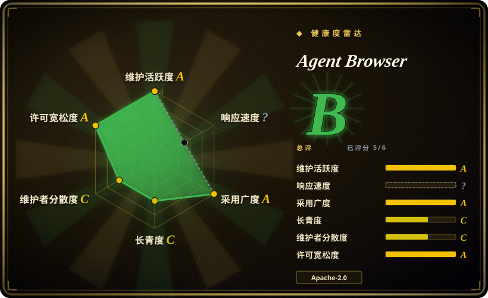
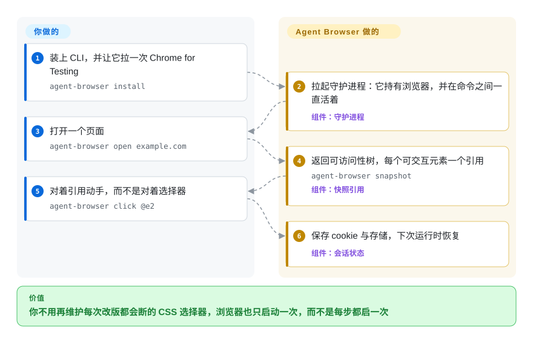

# Agent Browser

你的 agent 靠写 CSS 选择器去点真实网页，页面一改版选择器就断——按钮明明还在，任务却在这一步死了。Agent Browser 改成把可访问性树里的稳定引用（`@e1`、`@e2`）交给模型，并让同一个 Chrome 常驻在命令之间，于是每一步都只是一次便宜的 CLI 调用，而不是重新启动一次浏览器。

## 何时使用

你在写一个 coding agent 或者靠 shell 驱动的自动化，它得操作真实网站——登录后台、填多步表单、抓一张表格、确认部署预览真的渲染出来了。你不想把 Node.js 的 Playwright 库嵌进 agent，也不想让模型自己发明 CSS 选择器、下次发版就断。你要的是“一条 agent 能 shell 出去的命令”，外加一个能稳定指向每个元素、让模型能推理的句柄。

装上 `agent-browser`（npm、Homebrew 或 cargo 三选一），跑一次 `agent-browser install` 把 Chrome for Testing 拉下来，之后的循环是：`agent-browser snapshot` 返回带引用的可访问性树，模型挑 `@e2`，然后 `agent-browser click @e2` 或 `agent-browser fill @e3 "value"`。因为守护进程一直在，省掉了每次动作的启动成本；多步动作可以用 `batch` 在一个进程里跑完，连每条命令的启动都省掉。所有命令都支持 `--json`，`agent-browser mcp` 通过 MCP 暴露一套带类型的子集，而 `read` 根本不启动浏览器就能取回适合 agent 读的文本（markdown、`llms.txt`）。会话 cookie 与 localStorage 会自动保存和恢复，所以登录态的流程能跨多次运行。

相比 [Chrome DevTools MCP](chrome-devtools-mcp.zh.md)，当你既要一个 agent 能 shell 的 CLI 原语、又要同一个二进制直接提供 MCP 模式时选它；相比 [browser-use](browser-use.zh.md)，当你宁愿在自己的 harness 里掌握 agent 循环、而不是采用一个自带 LLM 循环的 Python agent 时选它。

## 快问快答

**它现在自带 `chat` 命令了，那还算“循环要我自己写”吗？**
大体上还是。`chat` 只是盖在同一个 CLI 上的便利 REPL，而且它需要 Vercel AI Gateway 的 key（`AI_GATEWAY_API_KEY`，模型默认 `anthropic/claude-sonnet-4.6`），也就是说页面内容会离开你的机器去那个网关。如果你是让自家 harness 通过 MCP 或 shell 驱动它，那循环和模型仍然在你手上。

**我接好了 MCP server，结果大部分工具都不在。**
默认的 MCP profile 是 `core`，刻意做得很小。把你需要的那部分加上：`agent-browser mcp --tools core,network,react`，或者 `--tools all` 拿到完整 CLI 对齐面。`webmcp` 那组工具同理，不在默认 profile 里。

## 怎么用起来

CLI 只是一层薄客户端，底下是一个长期存活的 Rust 守护进程，Chrome 连接由它持有——这个切分就是整套设计。你的命令跟守护进程说话，守护进程跟浏览器说话，浏览器在命令之间不关，于是启动成本只付一次而不是每步一次。`snapshot` 把页面的可访问性树压成带引用的文本，每个可交互元素一个引用；模型推理的就是这些引用，而守护进程会让它们在同文档变更中保持有效（被替换的元素或一次导航会让引用失效，而不是回收标识符，所以过期的引用会响亮地报错，而不是点到错的东西）。它接管的是：浏览器生命周期、元素句柄、标签页记账、磁盘上的会话状态，以及那个空闲退出机制——它保证一个崩掉的集成不会永远泄漏一个浏览器。留在你手里的是：模型、agent 循环、“它允许碰哪些页面”的决定，以及因为安全特性全是 opt-in——是否打开域名白名单、内容边界、动作确认或加密的凭据保险箱。两条入口在同一个地方汇合：同一个二进制既做 CLI 也做 `agent-browser mcp`，agent 想 shell 还是说 MCP 都不用改变底下跑的是什么。

<!-- flow-steps:begin (generated from flows/agent-browser.json by tools/flow_card.py — do not edit) -->

流程文字版

1. **你**：装上 CLI，并让它拉一次 Chrome for Testing — `agent-browser install`
2. **Agent Browser**：拉起守护进程：它持有浏览器，并在命令之间一直活着 — 组件：`守护进程`
3. **你**：打开一个页面 — `agent-browser open example.com`
4. **Agent Browser**：返回可访问性树，每个可交互元素一个引用 — `agent-browser snapshot` — 组件：`快照引用`
5. **你**：对着引用动手，而不是对着选择器 — `agent-browser click @e2`
6. **Agent Browser**：保存 cookie 与存储，下次运行时恢复 — 组件：`会话状态`

**价值**：你不用再维护每次改版都会断的 CSS 选择器，浏览器也只启动一次，而不是每步都启一次

<!-- flow-steps:end -->

## 何时不用

- **你要的是页面内、无后端的自然语言副驾。** Agent Browser 从 CLI 操作一个**外部** Chrome，它不会跑进你应用已经打开的那个标签页／会话里。要能嵌进页面内的 GUI agent，用 [page-agent](page-agent.zh.md)。
- **你在写一个普通的 Node.js 测试／自动化库。** 它是 CLI 加守护进程，不是可以 import 的 JS API。如果你的代码是 TypeScript、想要的是 `await page.click(...)`，那纯 Playwright／Puppeteer 更合。
- **你需要视觉优先／像素级精确的交互。** 它的选择锚在可访问性树上，不在截图上。Canvas／WebGL 界面、按像素坐标点击、以及不在 a11y 树里的内容都是弱项；无障碍审计和带标注的截图在 Safari／iOS WebDriver 会话上根本不可用。
- **页面内容不许离开你的机器，但你又想要自然语言控制。** `chat` 走 Vercel 的 AI Gateway，也就是说你正在操作的 DOM 会发给第三方。这时候该用 [browser-use](browser-use.zh.md) 配本地模型，或者从你自己的循环里驱动 Agent Browser 的 CLI，而不是用 `chat`。
- **你要开箱即用的托管云浏览器集群。** 它默认跑本地 Chrome；真的要大规模并发／无头集群，你得接一个云厂商插件（Browserbase、Browser Use、Kernel 等）并自己运维。
- **跨浏览器内核是硬需求。** 主路径是 Chrome over CDP；Safari／iOS 走 WebDriver 会话、覆盖是部分的，而且域名白名单和无障碍审计会直接拒绝这些路径。
- **成熟度／变动频率。** 还在 pre-1.0 而且发得快（大约每周，6 月的 v0.31 到 9 月的 v0.38），CLI 表面和配置都可能变——脚本化依赖时请钉版本。

## 横向对比

| 替代品 | 是否收录 | 我们的评价 | 取舍 |
|---|---|---|---|
| [Chrome DevTools MCP](chrome-devtools-mcp.zh.md) | 已收录 | 要 Google 官方的 MCP server、覆盖 DevTools 检查面时选 Chrome DevTools MCP；要让 agent 还能按引用**动手操作**、或者它是 shell 出去而不是说 MCP 时选 Agent Browser。 | DevTools MCP 是官方的检查面且只有 MCP；Agent Browser 是 CLI 优先的 Rust 守护进程，同时提供 MCP profile、快照引用、无障碍审计和 HAR 抓取。 |
| [browser-use](browser-use.zh.md) | 已收录 | 要一个自带 LLM 循环的 Python agent 时选 browser-use；循环归你自己、底下只要一个快原语时选 Agent Browser。 | browser-use 是你要编程面对的框架；Agent Browser 是你调用的一个二进制，这让它更容易嵌进现有体系，代价是循环、提示词和重试都归你。 |
| [page-agent](page-agent.zh.md) | 已收录 | agent 必须活在用户当前页面里、并复用那个会话时选 page-agent；浏览器应该是一个独立的、可脚本化的实例时选 Agent Browser。 | page-agent 在页面内跑、没有后端；Agent Browser 拥有一个外部 Chrome，所以能做服务端／CI 的活，但拿不到一个活标签页的 JS 上下文。 |
| [Cua](../../desktop-automation/cua.zh.md) | 已收录 | 任务会离开浏览器——原生桌面应用、系统弹窗、需要 VM 隔离时选 Cua；一切都在网页里、确定性比覆盖面更重要时选 Agent Browser。 | Cua 在系统层操作整台电脑（结构化状态或像素、沙箱可选）；Agent Browser 只管浏览器且基于 a11y 树，更便宜也更可复现，但页外就是盲区。 |
| [Playwright](../playwright-family/playwright.zh.md) / Puppeteer | 部分已收录 | 在 Node 里写长期维护的测试套件、要跨浏览器覆盖时选 Playwright 或 Puppeteer；调用方是模型、需要引用而不是选择器时选 Agent Browser。 | Playwright／Puppeteer 是 import 进测试运行器、由你维护的库；Agent Browser 是模型可驱动的进程，用生态广度换面向 LLM 的顺手程度。 |

## 技术栈

- **语言：** Rust（原生 CLI 二进制加常驻守护进程），Apache-2.0；pnpm workspace 加一层 Node 引导，用于 npm 安装路径。
- **浏览器控制：** 通过守护进程 socket 直连 Chrome DevTools Protocol——运行时路径里没有 Node.js，也没有 Playwright。
- **浏览器内核：** Chrome for Testing，由 `agent-browser install` 下载（Linux 上加 `--with-deps`）；已装的 Chrome、Brave、Playwright、Puppeteer 会被自动识别，也可以用 `--cdp`／`--auto-connect`／`--profile` 挂到现成的浏览器上。
- **模型集成：** MCP stdio server，带工具 profile（`core`、`network`、`state`、`debug`、`tabs`、`react`、`mobile`、`all`）；每条命令都有 `--json`；`agent-browser skills` 提供与已安装版本匹配的随包技能内容。
- **选择模型：** 可访问性树快照加稳定引用（`@e1`…），在同文档变更中保持有效；稳定的标签页 id（`t1`…）外加可自定义标签；带标注截图；`snapshot --delta` 输出紧凑的增量。
- **内置工具：** `read`（面向 agent 的文本、`llms.txt`）、`batch`、`diff`（快照／截图／URL）、`a11y`（内置 axe-core）、`network` 路由与 HAR、React DevTools 与 Web Vitals、`record`（webm／mp4，带指针与 contact sheet）、`trace`／`profiler`、`doctor`、`upgrade`。
- **安全，全部 opt-in：** 加密的凭据保险箱、插件系统（`agent-browser.plugin.v1` stdio 协议）、`--content-boundaries`、`--allowed-domains`（连带 WebRTC／worker 收容）、`--action-policy`、`--confirm-actions`、`--max-output`；静态加密用 `AGENT_BROWSER_ENCRYPTION_KEY`。
- **实验性：** WebMCP 目录发现（`webmcp list/invoke/result/cancel`），它把页面提供的工具元数据当作不可信数据，并对公示内容做了边界限制。

## 依赖

- **运行时：** 原生 `agent-browser` 二进制加一个 Chrome——`agent-browser install` 下载 Chrome for Testing，或者用 `--executable-path`／`--cdp` 指向已有的浏览器。跑命令本身不需要 Node.js。
- **安装：** `npm install -g agent-browser`、`brew install agent-browser`（macOS）或 `cargo install agent-browser`；`agent-browser upgrade` 会识别安装方式。从源码构建需要 Node.js 24+、pnpm 11+ 和 Rust。
- **可选，按功能取用：** `chat` 和 dashboard 的 AI 面板需要 `AI_GATEWAY_API_KEY`（可选 `AI_GATEWAY_MODEL`）；`record` 需要 `PATH` 上有 `ffmpeg`；`agent-browser mcp` 需要一个支持 MCP 的客户端；Safari-on-iOS 路径需要 Appium 加 iOS 模拟器；无头集群需要云厂商插件和账号。

## 运维难度

**低到中等。** 只驱动一个本地 Chrome 的话接近开箱即用：装一次、`agent-browser install` 一次，然后 shell 出去就行。守护进程意味着你要管一个长期存活的进程，但失效路径都被处理过了——守护进程缺失或过期会按需重启，`doctor` 负责诊断并清理残留的 socket／pid 文件，而空闲一小时后它会存状态、关浏览器、自己退出，所以崩掉的集成不会把浏览器泄漏下去。默认动作超时 25 秒，刻意压在 CLI 那条 30 秒 IPC 读超时之下，为的是拿到真正的错误而不是 `EAGAIN`。难度在几种情况下升到**中等**：大规模无头（要接并付费云厂商插件）、复用 Chrome profile（Windows 上必须先关掉 Chrome）、依赖 Safari／WebDriver／iOS 路径，或者打开那些安全特性——把工具指向不可信页面的之前，该读的正是这些约束。

## 健康度与可持续性

- **维护——非常活跃。** 评级 A：一天内还有推送，13 周里 11 周活跃，发布节奏稳定（6 月底的 v0.31 到 2026-09-16 的 v0.38.1，大约每周一发）。
- **响应——无法评分（`?`）。** 索引找不到可用于测量的有效 issue 集合；能看见的信号是发布节奏。
- **采用——评级 A。** 2026-09-23 时最近一个月 npm 下载 5,145,602 次、90 天内 Homebrew 安装 14,505 次，另有 4.31 万星、2,900 fork。
- **背书——评级 C。** Vercel Labs：组织拥有，12 个月里 96 位活跃维护者，但第一贡献者占 64.9%、前三占 73.4%，提交历史集中在一位作者身上。`-labs` 徽章也意味着这是孵化面而不是旗舰产品。
- **年龄与 Lindy——评级 C。** 255 天（建于 2026-01-11），仍在 pre-1.0；现在还没有 Lindy 先验可以靠。
- **风险与许可——评级 A。** Apache-2.0，36 个月内没有换许可。风险是变动和默认值而不是许可：CLI 与配置会在版本间变；跨内核覆盖落后；安全特性在你打开之前都是关的——一个朴素安装等于按你 Chrome 的权限运行。

## 存疑（未验证）

- [未验证] 功能清单（WebMCP、插件、无障碍审计、录制、dashboard、安全开关）读自 2026-09-23 的 README、CHANGELOG 与 docs 索引；绝大部分没有亲手跑过。
- [推断] 非 Chromium／Safari-WebDriver 的覆盖落后于 Chrome-over-CDP 主路径；限制是按功能声明的，但每条命令的实际对齐程度没有逐一枚举。
- [未验证] `chat` 是只把 DOM 发出去、还是连你的提示词一起发给 Vercel 的 AI Gateway，以及那个网关留存什么——README 只写了需要哪个 key 和默认模型，没写数据路径。
- [未验证] Homebrew／npm 下载量作为真实用户代理指标：两者都嘈杂，而且这个仓库也会被 CI 安装。
- [推断] 25 秒与 30 秒那对超时关系文档说是刻意设计，这里没有实测；慢页面仍然需要显式设置超时。
- [未验证] 安全特性被描述为 opt-in、既有工作流不受影响；域名白名单的实际收容效果没有做独立测试。
- [推断] 发布节奏是从 GitHub releases 推出来的；CHANGELOG 按版本写，不会汇总跨版本的破坏性变更。
- [未验证] 随包的 `skills` 内容和公开的 `agent-browser.dev/schema.json` 是否与已安装的二进制保持同步。
