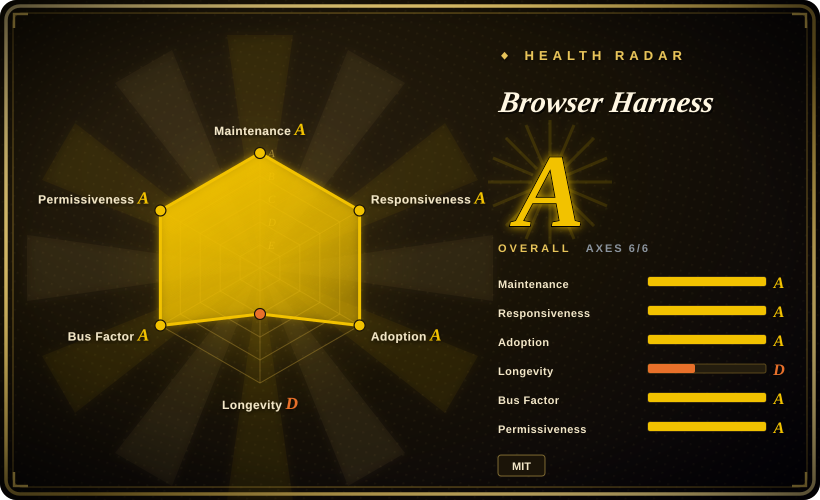
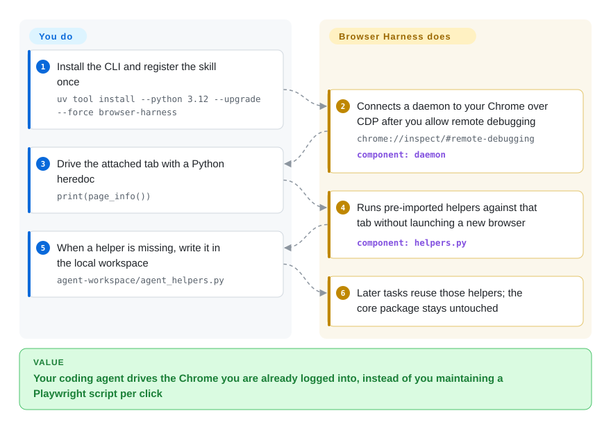

# Browser Harness

Your coding agent needs to click through a site you are already logged into, and you do not want a Playwright script for every click. Browser Harness attaches that agent to the Chrome on your machine over one CDP websocket, pre-imports helpers, and lets it write missing helpers into a local workspace as it works.

## When to use

You already live in Claude Code or Codex and the next step of the task is a real website — download the last twenty videos off your X profile, fill an admin form, scrape a page that only renders after login. The session that matters is the Chrome window you have been using all day. You paste the setup prompt, tick "Allow remote debugging for this browser instance" once on `chrome://inspect/#remote-debugging`, and from then on the agent drives that same profile with `browser-harness <<'PY' ... PY` heredocs. Helpers such as `page_info()`, `new_tab(url)`, and `click_at_xy` are already in scope; when one is missing, the agent adds it under `agent-workspace/agent_helpers.py` instead of forking the package.

Pick this over [browser-use](browser-use.md) when you do *not* want a second, inner LLM loop inside your product — your coding agent *is* the loop, and this repo is the hand. Pick it over [Agent Browser](agent-browser.md) when the cookies that matter live in the Chrome you already have, not in a Chrome-for-Testing the CLI downloaded. Pick it over [Playwright CLI](../playwright-family/playwright-cli.md) when Microsoft's isolated browser is the wrong session: you need *your* Gmail, not a blank profile.

## Q&A

**This is just a skill plus some scripts my coding agent can run, right?**
Yes. There is no `Agent(task=...).run()` here. The brain stays in Claude Code / Codex; this package is a CLI, a long-lived daemon, and a `SKILL.md` that tells the agent how to talk to them.

**Is the session recorder the same project as video-use?**
No. Recordings here are screenshots and action traces of the browser session, off by default. [video-use](../../video-production/video-use.md) is a separate skill that cuts camera footage into `edit/final.mp4`.

## How it works

The CLI is a thin client over a daemon that holds one Chrome DevTools Protocol connection — the websocket Chrome already speaks when remote debugging is on. You write short Python on stdin; `run.py` makes sure the daemon is up, then `exec`s your script with helpers from `helpers.py` already imported. What it takes over: attaching to the running Chrome (or launching one if none is up), keeping the current tab across separate CLI invocations, mapping accessibility-tree nodes to click coordinates, and optionally wrapping the same helpers as MCP tools via `browser-harness-mcp`. What stays yours: the model, every decision, and any extra helper the agent writes into `agent-workspace/`. The package tree under `src/browser_harness/` is meant to stay untouched. Local Chrome needs no Browser Use API key; a named remote daemon (`start_remote_daemon("r7k2")`) is the paid Cloud path for parallel or stealth sessions. Telemetry to PostHog EU is on until you run `browser-harness telemetry disable` or set `BH_TELEMETRY=0`.

<!-- flow-steps:begin (generated from flows/browser-harness.json by tools/flow_card.py — do not edit) -->

Text version of the flow

1. **You**: Install the CLI and register the skill once — `uv tool install --python 3.12 --upgrade --force browser-harness`
2. **Browser Harness**: Connects a daemon to your Chrome over CDP after you allow remote debugging — `chrome://inspect/#remote-debugging` — component: `daemon`
3. **You**: Drive the attached tab with a Python heredoc — `print(page_info())`
4. **Browser Harness**: Runs pre-imported helpers against that tab without launching a new browser — component: `helpers.py`
5. **You**: When a helper is missing, write it in the local workspace — `agent-workspace/agent_helpers.py`
6. **Browser Harness**: Later tasks reuse those helpers; the core package stays untouched

**Value**: Your coding agent drives the Chrome you are already logged into, instead of you maintaining a Playwright script per click

<!-- flow-steps:end -->

## When NOT to use

- **You are embedding a browser agent in your own backend.** This repo has no inner LLM loop. Use [browser-use](browser-use.md) (`Agent(task=..., llm=...).run()`) when the product — not Claude Code — has to finish the web task unattended.
- **You want a dedicated browser with snapshot refs, not your personal Chrome.** Use [Agent Browser](agent-browser.md). It fetches Chrome for Testing and hands the model `@e1`-style refs; Harness inherits whatever is already in your profile, including every cookie.
- **You need a confirm-before-borrow gate and to hand login or CAPTCHA back to a human.** Use [BrowserSkill](browserskill.md). Harness, once allowed, can act on the attached tab in the background without bringing Chrome forward (`activate_tab` is explicitly opt-in).
- **You want Microsoft's official coding-agent browser path.** Use [Playwright CLI](../playwright-family/playwright-cli.md). It is token-cheap and isolated; it will not open the Gmail tab you already have.
- **The page is public and a GET would do.** The skill itself says to use curl (or your fetch tool) and leave the browser alone until interaction, a login, JS rendering, or a bot wall actually requires it.
- **You cannot accept default-on telemetry on a logged-in browser.** `telemetry.py` ships a hardcoded PostHog EU key and is enabled until you opt out. If that is a blocker and you still need a CLI, prefer [Agent Browser](agent-browser.md) (security features are opt-in there, in the other direction).
- **Firefox or WebKit is a hard requirement.** The documented attach path is Chrome / Chromium CDP. For a matrix, use [Playwright](../playwright-family/playwright.md).
- **You need many isolated browsers at once without paying Cloud.** Local Chrome is one shared instance; two agents switching tabs race. Parallel isolation is the Browser Use Cloud upsell (`browser-harness auth login`), which is a hosted service, not this repo.

## Comparison

| Alternative | In index | Our verdict | Tradeoff |
|---|---|---|---|
| [Agent Browser](agent-browser.md) | ✅ | Choose Agent Browser when the agent should own a dedicated Chrome with snapshot refs; choose Browser Harness when the cookies that matter are already in the Chrome on your desk. | Agent Browser downloads Chrome for Testing and speaks CLI refs; Harness attaches to your live profile, so it inherits logins and also inherits the remote-debugging handshake plus default-on telemetry. |
| [BrowserSkill](browserskill.md) | ✅ | Choose BrowserSkill when borrowing a tab must wait for your confirm and login/CAPTCHA must bounce back to you; choose Harness when you will grant a standing CDP connection to the whole Chrome. | BrowserSkill is an extension plus daemon with a human-in-the-loop gate; Harness is a Python CLI that can keep working in a hidden tab. |
| [browser-use](browser-use.md) | ✅ | Choose browser-use when you are wiring an inner agent loop into a product; choose Harness when Claude Code or Codex is already the loop and you only need a hand on the browser. | browser-use is a Python `Agent` you call from your code; Harness has no inner model — your coding agent writes the Python. |
| [Playwright CLI](../playwright-family/playwright-cli.md) | ✅ | Choose Playwright CLI when you want Microsoft's isolated, token-cheap SKILL path; choose Harness when the session that matters is the one already open. | Playwright CLI will not see your logged-in Gmail; Harness will, and it will also see everything else in that profile. |
| [Chrome DevTools MCP](chrome-devtools-mcp.md) | ✅ | Choose DevTools MCP when the job is inspect (trace, network, heap) over MCP; choose Harness when the job is act (click, type, upload) from a coding agent that writes Python. | DevTools MCP is inspection-first and MCP-only; Harness is heredoc Python, with an optional MCP wrapper over the same helpers. |

## Tech stack

- **Language:** Python 3.11+ (install docs pin 3.12 via `uv tool install --python 3.12`). MIT. PyPI package `browser-harness` 0.1.13, classifier `Development Status :: 3 - Alpha`.
- **Browser control:** Chrome DevTools Protocol via `cdp-use==1.4.5` and `websockets==15.0.1`. No Playwright in the runtime path.
- **CLI / daemon:** `browser-harness` → `browser_harness.run:main`; long-lived middleman in `daemon.py`; CDP wrappers in `helpers.py`.
- **MCP (optional extra):** `browser-harness-mcp` re-exports helpers with a `browser_` prefix over stdio (`mcp==2.1.1`).
- **Agent surface:** root `SKILL.md`, `install.md`, `interaction-skills/*.md`, and agent-generated `agent-workspace/domain-skills/` (off unless `BH_DOMAIN_SKILLS=1`).
- **Other runtime deps:** `fetch-use==0.4.0`, `pillow==12.3.0`. Telemetry client talks to `https://eu.i.posthog.com`.
- **Cloud (optional):** `auth.py` OAuth against `https://api.browser-use.com`; remote daemons billed until stopped.

## Dependencies

- **Runtime:** a local Chrome/Chromium with remote debugging allowed; Python 3.11+ (3.12 recommended so uv does not pick an old wheel). First attach is a one-time checkbox on `chrome://inspect/#remote-debugging`. On macOS, `browser-harness mac-approve` needs Accessibility permission for the app that launched the CLI.
- **Install:** `uv tool install --python 3.12 --upgrade --force browser-harness`, then `browser-harness skill` copied into the agent's skills directory.
- **State:** `${XDG_CONFIG_HOME:-~/.config}/browser-harness` by default (`BH_HOME` / `BROWSER_HARNESS_HOME` override) — auth, telemetry id, workspace, sockets, logs, screenshots.
- **Optional:** `BROWSER_USE_API_KEY` or `browser-harness auth login` for Cloud browsers; `browser-harness[mcp]` for the MCP server; ffmpeg is not required for ordinary control (it is for the separate video-export helpers).

## Ops difficulty

**Medium.** A single local Chrome is close to drop-in after the one-time remote-debugging tick, and `--doctor` / `doctor --json` exist for the attach path. Difficulty jumps because (1) the daemon is a long-lived process on your real profile, (2) telemetry is on until you disable it, (3) two agents sharing the default daemon can race on the current tab, and (4) Cloud isolation is a billed account, not a flag. Treat a named local daemon as a last resort: it is another CDP connection in the *same* Chrome, and Chrome may show another Allow prompt.

## Health & viability

- **Maintenance — Grade A, still Alpha.** Last default-branch commit 20 days ago, 11 of 13 weeks active. Latest tag `v0.1.13` on 2026-09-04; `pyproject.toml` still declares `Development Status :: 3 - Alpha`. Created 2026-04-17.
- **Responsiveness — Grade A.** Median first response ~74.5 hours on 15 qualifying issues (relaxed-solo band).
- **Adoption — Grade A on the radar, noisy in practice.** ~18.1k GitHub stars and ~1.8k forks (2026-09-27). PyPI last-month downloads 5259198 which is what earned the A — [推断] most of that is transitive, because `browser-use` 0.13.10 depends on `browser-harness==0.1.13`. `dependent_repos_count` is 0. Open issues ~396.
- **Governance — Grade A.** 69 active maintainers in 12 months, top-1 share 33%, top-3 56%. Organization `browser-use`; the same company sells the Cloud the skill upsells.
- **Age & Lindy — Grade D.** 163 days old. High stars on a 0.1.x tree is a risk flag, not a Lindy prior. The overall A is an area aggregate; longevity is the axis that disagrees.
- **License / risk — Grade A (MIT).** Load-bearing product risks are not the license: default-on PostHog telemetry on a logged-in browser, an aggressive skill trigger ("Always use browser-harness for any web interaction"), and the Cloud funnel for anything parallel or stealth.

## Caveats (unverified)

- [推断] The PyPI download spike is largely `browser-use` pulling `browser-harness==0.1.13` as a library dependency, not 5 million people running this CLI.
- [未验证] Exact PostHog event bodies beyond the `FORBIDDEN_KEYS` filter in `telemetry.py` were not captured from a live install.
- [未验证] The 107 `agent-workspace/domain-skills/` notes are agent-generated examples; quality and freshness per site were not sampled.
- [未验证] `mac-approve` plus the Accessibility permission path was not exercised on this machine.
- [未验证] Attach to Brave / Edge / Chromium forks other than Google Chrome — docs talk about Chrome/Chromium CDP, not a compatibility matrix.
- [推断] 350+ open PRs (observed 2026-09-24 on the GitHub UI) plus Alpha versioning means the CLI surface can still move; pin `0.1.13` if you script against it.
