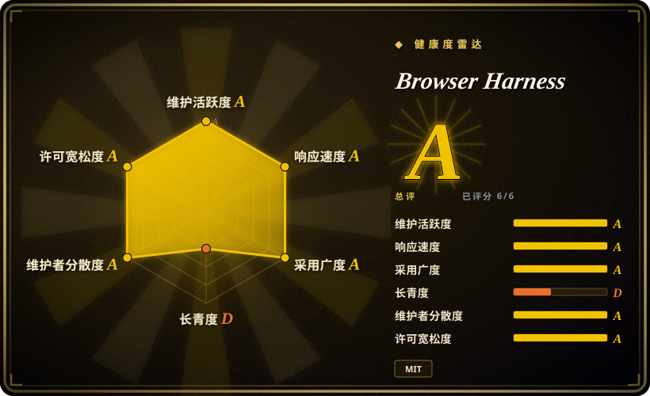
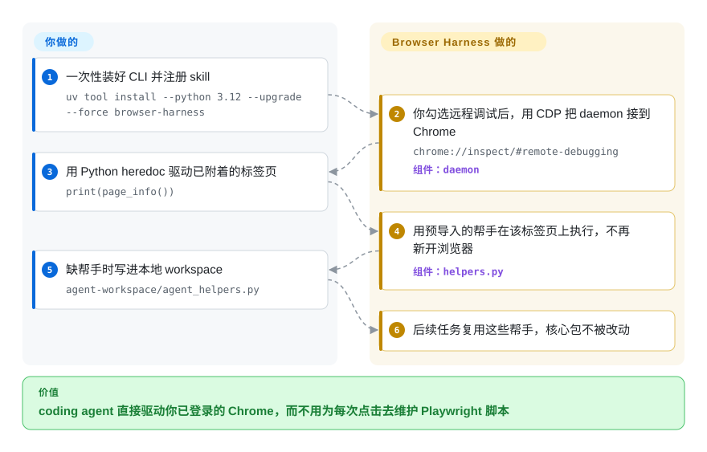

# Browser Harness

你已经登录了网站，coding agent 却没法点进去办事，你也不想为每一步去维护一套 Playwright 脚本。Browser Harness 把 agent 接到你正在用的 Chrome 上，预导入点击、输入、截图这些帮手，缺什么就让它写进本地 workspace。

## 何时使用

你已经泡在 Claude Code 或 Codex 里，下一步却是真实网站：把 X 主页最近二十个视频下下来、填后台表单、刮一张登录后才渲染的页。真正有用的会话，是你用了一整天的那个 Chrome 窗口。你把安装提示贴进去，在 `chrome://inspect/#remote-debugging` 上勾一次“允许此浏览器实例进行远程调试”，之后 agent 就用 `browser-harness <<'PY' ... PY` 这种 heredoc 驱动同一个配置。`page_info()`、`new_tab(url)`、`click_at_xy` 已经在作用域里；缺帮手时，agent 往 `agent-workspace/agent_helpers.py` 里加，而不是去改包装好的包。

不想在自己的产品里再套一层内层 LLM 循环时，选它而不是 [browser-use](browser-use.zh.md)——你的 coding agent 本身就是循环，这个仓库只是手。cookies 活在你桌上那只 Chrome 里、而不是 CLI 另下的 Chrome for Testing 里时，选它而不是 [Agent Browser](agent-browser.zh.md)。微软那条隔离浏览器路径拿不到你已经打开的 Gmail 时，选它而不是 [Playwright CLI](../playwright-family/playwright-cli.zh.md)。

## 快问快答

**这不就是给我的 coding agent 装的 skill 加一堆脚本吗？**
对。这里没有 `Agent(task=...).run()`。脑子留在 Claude Code / Codex；这个包是 CLI、长驻 daemon，以及一份告诉 agent 怎么说话的 `SKILL.md`。

**会话录像和 video-use 是一回事吗？**
不是。这里的录像是浏览器操作的截图和动作轨迹，默认关闭。[video-use](../../video-production/video-use.zh.md) 是另一份 skill，用来把摄像机素材剪成 `edit/final.mp4`。

## 怎么用起来

CLI 是薄客户端，后面是一只抓住一条 Chrome DevTools Protocol 连接的 daemon——就是你打开远程调试后 Chrome 本来就会说的那条 websocket。你往 stdin 写一小段 Python；`run.py` 先确保 daemon 活着，再 `exec` 这段脚本，`helpers.py` 里的帮手已经导入。它代劳的是：附着到正在跑的 Chrome（没有就帮你拉起）、跨多次 CLI 调用保住当前标签、把无障碍树节点映射成点击坐标，以及可选地把同一批帮手用 `browser-harness-mcp` 暴露成 MCP 工具。留给你的是：模型、每一个决定，以及 agent 写进 `agent-workspace/` 的额外帮手。`src/browser_harness/` 这棵包树按设计不该被改。本地 Chrome 不需要 Browser Use 的 API 密钥；名叫 `start_remote_daemon("r7k2")` 的远程 daemon 才是付费 Cloud 路径，用来做并行或隐身会话。发往 PostHog EU 的遥测默认开着，直到你跑 `browser-harness telemetry disable` 或设 `BH_TELEMETRY=0`。

<!-- flow-steps:begin (generated from flows/browser-harness.json by tools/flow_card.py — do not edit) -->

流程文字版

1. **你**：一次性装好 CLI 并注册 skill — `uv tool install --python 3.12 --upgrade --force browser-harness`
2. **Browser Harness**：你勾选远程调试后，用 CDP 把 daemon 接到 Chrome — `chrome://inspect/#remote-debugging` — 组件：`daemon`
3. **你**：用 Python heredoc 驱动已附着的标签页 — `print(page_info())`
4. **Browser Harness**：用预导入的帮手在该标签页上执行，不再新开浏览器 — 组件：`helpers.py`
5. **你**：缺帮手时写进本地 workspace — `agent-workspace/agent_helpers.py`
6. **Browser Harness**：后续任务复用这些帮手，核心包不被改动

**价值**：coding agent 直接驱动你已登录的 Chrome，而不用为每次点击去维护 Playwright 脚本

<!-- flow-steps:end -->

## 何时不用

- **你要把浏览器 agent 嵌进自己的后端。** 这个仓库没有内层 LLM 循环。产品（而不是 Claude Code）必须在无人值守下把网页任务做完时，用 [browser-use](browser-use.zh.md) 的 `Agent(task=..., llm=...).run()`。
- **你要的是一只专用浏览器加快照引用，不是你的个人 Chrome。** 用 [Agent Browser](agent-browser.zh.md)。它会拉 Chrome for Testing，给模型 `@e1` 这种引用；Harness 继承你配置里已经有的一切，包括每一块 cookie。
- **借标签页必须先经你确认，登录或验证码必须交还人来做。** 用 [BrowserSkill](browserskill.zh.md)。Harness 一旦被允许，就可以在后台对附着的标签动手，不必把 Chrome 拉到前台（`activate_tab` 是显式选择才用）。
- **你要微软官方给 coding agent 的浏览器路径。** 用 [Playwright CLI](../playwright-family/playwright-cli.zh.md)。它省 token、会话隔离；打不开你已经登录的 Gmail。
- **页面是公开的，一个 GET 就够。** skill 自己也说：能用 curl（或你的 fetch 工具）就别动浏览器，直到真的需要交互、登录、JS 渲染或过反爬墙。
- **不能接受在已登录浏览器上默认开启遥测。** `telemetry.py` 写死了 PostHog EU 的 key，不主动关掉就一直开。这是硬门槛、你仍要 CLI 时，优先 [Agent Browser](agent-browser.zh.md)（它的安全开关是反过来的：默认关，要你打开）。
- **Firefox 或 WebKit 是硬需求。** 文档里的附着路径是 Chrome / Chromium CDP。要矩阵用 [Playwright](../playwright-family/playwright.zh.md)。
- **要很多隔离浏览器，又不想付 Cloud。** 本地 Chrome 是一台共享实例；两个 agent 抢当前标签会打架。并行隔离是 Browser Use Cloud 的加售（`browser-harness auth login`），那是托管服务，不是这个仓库。

## 横向对比

| 替代品 | 是否收录 | 我们的评价 | 取舍 |
|---|---|---|---|
| [Agent Browser](agent-browser.zh.md) | ✅ | agent 该拥有一只带快照引用的专用 Chrome 时选 Agent Browser；真正有用的 cookie 已经在桌上那只 Chrome 里时选 Browser Harness。 | Agent Browser 会下载 Chrome for Testing，讲 CLI 引用；Harness 附着你的活配置，继承登录，也继承远程调试那一次勾选和默认开启的遥测。 |
| [BrowserSkill](browserskill.zh.md) | ✅ | 借标签必须等你点头、登录或验证码必须弹回给你时选 BrowserSkill；你愿意给整只 Chrome 一条常驻 CDP 连接时选 Harness。 | BrowserSkill 是扩展加 daemon，带人在环里的门；Harness 是 Python CLI，可以在隐藏标签里继续干活。 |
| [browser-use](browser-use.zh.md) | ✅ | 要把内层 agent 循环接进产品时选 browser-use；Claude Code 或 Codex 已经是循环、你只需要一只手去碰浏览器时选 Harness。 | browser-use 是你从代码里调用的 Python `Agent`；Harness 没有内层模型——Python 是你的 coding agent 写的。 |
| [Playwright CLI](../playwright-family/playwright-cli.zh.md) | ✅ | 要微软那条隔离、省 token 的 SKILL 路径时选 Playwright CLI；真正有用的会话已经打开时选 Harness。 | Playwright CLI 看不见你已登录的 Gmail；Harness 看得见，也看得见这个配置里的其他所有东西。 |
| [Chrome DevTools MCP](chrome-devtools-mcp.zh.md) | ✅ | 活是检查（trace、网络、堆）并且走 MCP 时选 DevTools MCP；活是操作（点、打字、上传）并且 coding agent 写 Python 时选 Harness。 | DevTools MCP 以检查为先，而且只有 MCP；Harness 是 heredoc Python，同一批帮手可再包一层 MCP。 |

## 技术栈

- **语言：** Python 3.11+（安装文档用 `uv tool install --python 3.12` 钉在 3.12）。MIT。PyPI 包 `browser-harness` 0.1.13，分类器写着 `Development Status :: 3 - Alpha`。
- **浏览器控制：** 经 `cdp-use==1.4.5` 和 `websockets==15.0.1` 走 Chrome DevTools Protocol。运行时路径里没有 Playwright。
- **CLI / daemon：** `browser-harness` → `browser_harness.run:main`；长驻中间人在 `daemon.py`；CDP 包装在 `helpers.py`。
- **MCP（可选 extra）：** `browser-harness-mcp` 把帮手加上 `browser_` 前缀，经 stdio 暴露（`mcp==2.1.1`）。
- **agent 面：** 根目录 `SKILL.md`、`install.md`、`interaction-skills/*.md`，以及 agent 生成的 `agent-workspace/domain-skills/`（除非 `BH_DOMAIN_SKILLS=1`，否则关掉）。
- **其他运行时依赖：** `fetch-use==0.4.0`、`pillow==12.3.0`。遥测客户端打到 `https://eu.i.posthog.com`。
- **Cloud（可选）：** `auth.py` 对 `https://api.browser-use.com` 做 OAuth；远程 daemon 停掉之前一直计费。

## 依赖

- **运行时：** 本地 Chrome/Chromium，并允许远程调试；Python 3.11+（建议 3.12，免得 uv 选到旧 wheel）。第一次附着要在 `chrome://inspect/#remote-debugging` 上勾一次。macOS 上 `browser-harness mac-approve` 需要给启动 CLI 的那个应用开辅助功能权限。
- **安装：** `uv tool install --python 3.12 --upgrade --force browser-harness`，再把 `browser-harness skill` 拷进 agent 的 skills 目录。
- **状态：** 默认 `${XDG_CONFIG_HOME:-~/.config}/browser-harness`（可用 `BH_HOME` / `BROWSER_HARNESS_HOME` 覆盖）——鉴权、遥测 id、workspace、socket、日志、截图。
- **可选：** Cloud 浏览器要 `BROWSER_USE_API_KEY` 或 `browser-harness auth login`；MCP server 要 `browser-harness[mcp]`；普通控制不需要 ffmpeg（那是另一套导出视频的帮手用的）。

## 运维难度

**中等。** 单只本地 Chrome 在勾过一次远程调试之后接近即插即用，`--doctor` / `doctor --json` 也能查附着路径。难度上来是因为：（1）daemon 是长驻在你真实配置上的进程；（2）遥测关掉之前一直开；（3）两个 agent 共享默认 daemon 时会抢当前标签；（4）Cloud 隔离是付费账户，不是一个开关。把具名的本地 daemon 当最后手段：它是同一只 Chrome 里的另一条 CDP 连接，Chrome 可能再弹一次允许。

## 健康度与可持续性

- **维护——A，仍是 Alpha。** 默认分支上次提交 20 天前，13 周里 11 周有活动。最新 tag `v0.1.13` 在 2026-09-04；`pyproject.toml` 仍写着 `Development Status :: 3 - Alpha`。建仓 2026-04-17。
- **响应——A。** 15 个合格 issue 的中位首次响应约 74.5 小时（relaxed-solo 档）。
- **采用——雷达上是 A，实际上噪声大。** 约 1.81 万 GitHub star、约 1800 fork（2026-09-27）。PyPI 近月下载 5259198。A 就是这么来的——[推断] 多半是连带装上的，因为 `browser-use` 0.13.10 依赖 `browser-harness==0.1.13`。`dependent_repos_count` 是 0。未关闭 issue 约 396。
- **治理——A。** 12 个月 69 个活跃维护者，第一名占比 33%，前三 56%。组织是 `browser-use`；同一家公司在卖 skill 会推销的那朵 Cloud。
- **年龄与 Lindy——D。** 163 天。0.1.x 树上的高 star 是风险旗，不是 Lindy 先验。总分 A 是面积聚合；长青度是不同意的那一轴。
- **许可 / 风险——A（MIT）。** 真正压在产品上的风险不在许可证：已登录浏览器上默认开启的 PostHog 遥测、侵略性的 skill 触发词（“任何网页交互都用 browser-harness”），以及并行或隐身时把你导向 Cloud。

## 存疑（未验证）

- [推断] PyPI 下载量暴涨，主要是 `browser-use` 把 `browser-harness==0.1.13` 当库依赖拉进来，不是五百万人在跑这个 CLI。
- [未验证] 除了 `telemetry.py` 里的 `FORBIDDEN_KEYS` 过滤，PostHog 事件正文没有从一次真实安装里抓过。
- [未验证] `agent-workspace/domain-skills/` 里那 107 份笔记是 agent 生成的示例；没有按站点抽查质量和时效。
- [未验证] 没有在这台机器上实跑 `mac-approve` 加辅助功能权限这条路径。
- [未验证] 附着到 Brave / Edge / 其他 Chromium 分支——文档说的是 Chrome/Chromium CDP，不是一张兼容矩阵。
- [推断] 2026-09-24 在 GitHub 页面上看到 350+ 未关闭 PR，再加上 Alpha 版本号，CLI 表面仍可能动；对着它写脚本就钉死 `0.1.13`。
