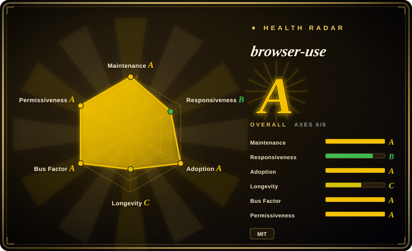
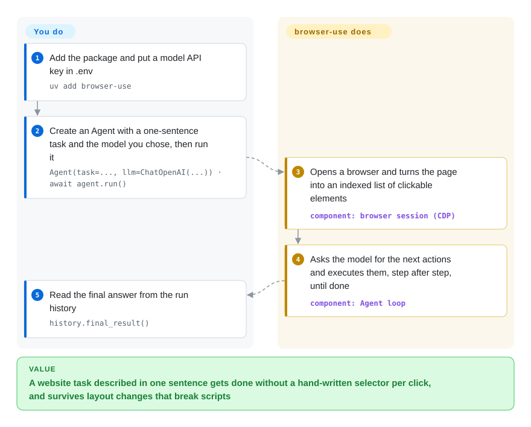

# browser-use

A scripted browser job — log in, find the right menu, fill a form, export a file — needs a hard-coded selector for every click, and it dies with `TimeoutError` the day the site moves a button. browser-use hands the browser to an LLM instead: you write the task as one sentence, and its agent loop reads the page, picks the next click or keystroke, and repeats until it can return an answer.

## When to use

You are a Python developer building a product or back-office job that has to do things on websites you do not control: pull invoices from a dozen supplier portals, each with a different layout; check availability and book a slot; copy data from one web app into another. You tried Playwright scripts, and the maintenance is the problem — `page.click("#export-btn-2")` works until a portal redesigns, then fails with `TimeoutError: locator.click: Timeout 30000ms exceeded`, and you have one such script per site.

You reach for browser-use when you want the agent loop *inside your own Python code*: `Agent(task="Download last month's invoice from …", llm=...)`, then `await agent.run()`. You pick it over Playwright MCP or Browser Harness because those give an external coding agent (Claude Code, Cursor) browser access, while browser-use is the agent — you embed it in your app, choose the model, add custom tools and get structured results back. You pick it over Stagehand when your stack is Python rather than TypeScript and you want the whole task delegated to the loop rather than mixing hand-written steps with AI calls. The deciding tradeoff: you trade the determinism, speed and near-zero per-run cost of a script for tolerance to layout changes, paying an LLM call per step.

## How it works

The `Agent` runs a loop. Each step it captures the browser state — current URL, open tabs, and a condensed tree of the page in which every clickable or typeable element gets a numeric index like `[35]<input placeholder=Enter name />`, optionally with a screenshot with those boxes drawn on it — and sends that plus your task and the step history to the model. The model answers with actions ("click 35", "type into 12", "scroll", "extract"), which browser-use executes over the Chrome DevTools Protocol (CDP, the debugging socket Chromium exposes; it uses its own `cdp-use` client rather than Playwright), and the loop repeats until the model calls `done`. What it does for you: launching or attaching to the browser, building the indexed page view, the system prompt, executing actions, retries and the run history. What stays yours: the task wording, the model and its API key, any custom tools you register with `@tools.action`, and the choice of browser — a fresh local Chromium, your own Chrome profile via `Browser.from_system_chrome()`, or a paid Browser Use Cloud browser with `Browser(use_cloud=True)`. Anonymous usage telemetry (PostHog) is on unless you set `ANONYMIZED_TELEMETRY=false`.

<!-- flow-steps:begin (generated from flows/browser-use.json by tools/flow_card.py — do not edit) -->

Text version of the flow

1. **You**: Add the package and put a model API key in .env — `uv add browser-use`
2. **You**: Create an Agent with a one-sentence task and the model you chose, then run it — `Agent(task=..., llm=ChatOpenAI(...)) · await agent.run()`
3. **browser-use**: Opens a browser and turns the page into an indexed list of clickable elements — component: `browser session (CDP)`
4. **browser-use**: Asks the model for the next actions and executes them, step after step, until done — component: `Agent loop`
5. **You**: Read the final answer from the run history — `history.final_result()`

**Value**: A website task described in one sentence gets done without a hand-written selector per click, and survives layout changes that break scripts

<!-- flow-steps:end -->

## When NOT to use

- **The flow is stable and runs thousands of times.** Write a Playwright script instead (see [Playwright](../playwright-family/playwright.md)), because every browser-use step is an LLM round-trip: slower, billed per token, and not guaranteed to take the same path twice, while a script is milliseconds and free per run.
- **You want your existing coding agent (Claude Code, Codex, Cursor) to drive a browser.** Use [Browser Harness](browser-harness.md), [Playwright MCP](../playwright-family/playwright-mcp.md) or [Agent Browser](agent-browser.md) instead, because those expose the browser as tools to an agent you already run; embedding browser-use would put a second agent loop inside the first.
- **Your stack is TypeScript/Node.** Use Stagehand or a Playwright-based agent tool instead, because browser-use is a Python ≥3.11 library; the vendor's TypeScript options live in separate repos (Browser Harness JS, Browser Use Pi).
- **You need bot-detection evasion or CAPTCHA handling on your own infrastructure.** Look at [Camoufox](../browser-driver-frameworks/camoufox.md)-based tools instead, because the README routes stealth, proxies and CAPTCHA handling to the paid Browser Use Cloud; the open-source library drives an ordinary Chromium.
- **You cannot send page content to a hosted model.** Either run a local model through the Ollama wrapper (and accept much weaker task success on hard sites) or use a scripted driver, because the loop sends the page's text and element tree — and screenshots when vision is on — to whichever LLM you configure.
- **You need a frozen API.** Pin an exact version or wrap it, because the library is still `0.x` (0.13.11 on 2026-10-07) with frequent releases, and the default-recommended model (`ChatBrowserUse` / BU2) is the vendor's own paid gateway, which pulls the defaults toward its cloud.

## Comparison

| Alternative | In index | Our verdict | Tradeoff |
|---|---|---|---|
| [Browser Harness](browser-harness.md) | ✅ | Choose Browser Harness when an external coding agent should drive the Chrome you are already logged into; choose browser-use when your own Python program needs to own the agent loop end to end. | Same vendor; Harness has no inner agent loop and costs no extra model calls, but it needs a coding agent to supply the decisions. |
| [Playwright MCP](../playwright-family/playwright-mcp.md) | ✅ | Choose Playwright MCP when an MCP client (Claude Desktop, VS Code, Cursor) is already your agent and only needs browser tools; choose browser-use when you are writing the agent into an application. | Vendor-official, cross-browser, deterministic tools, but no task loop, memory or custom-tool framework of its own. |
| [Agent Browser](agent-browser.md) | ✅ | Choose Agent Browser when an agent should shell-drive Chrome with stable element refs from the command line; choose browser-use when you want a Python library that plans and acts by itself. | CLI-first and agent-agnostic, but leaves planning and retries to the calling agent. |
| Stagehand | 未收录 | Choose Stagehand when you write TypeScript and want to mix deterministic Playwright steps with AI calls per step; choose browser-use when you are in Python and want to delegate the whole task. | Finer control over which steps are AI-driven, but a Node stack and a different vendor cloud (Browserbase). |
| Skyvern | 未收录 | Choose Skyvern when you want a self-hosted, workflow-oriented service with a UI for repeatable business-form automations; choose browser-use when you want a lightweight library inside your own code. | More product around the agent (workflows, UI, API server), but an AGPL service you deploy rather than a pip dependency. |

## Tech stack

- **Python ≥3.11**, async (`asyncio`), packaged as `browser-use` on PyPI (MIT).
- **Browser control over CDP** via the vendor's `cdp-use` client; the `browser-harness` package is a dependency for the CLI path.
- **LLM wrappers** for OpenAI, Anthropic, Google, Groq, Ollama and the vendor's own `ChatBrowserUse` gateway; `mcp` for exposing or consuming MCP tools.
- **Pydantic** for actions and structured output; **PostHog** for anonymous telemetry.

## Dependencies

- **A Chromium-based browser** on the machine (local), your installed Chrome profile, or a Browser Use Cloud browser.
- **An LLM endpoint and key** — OpenAI, Anthropic, Google, Groq, a local Ollama model, or `BROWSER_USE_API_KEY` for the vendor's BU2 model / gateway.
- **Python 3.11+** with a fairly heavy pinned dependency set (provider SDKs, Google API client, PDF/DOCX libraries).
- **Optional:** Browser Use Cloud for stealth browsers, proxies, CAPTCHA handling and profile sync.

## Ops difficulty

**Low to try, medium to high to run in production.** A local run is `uv add browser-use`, an API key and a short script. Production is where the cost lands: each task makes many model calls, so you budget tokens and latency per task; runs are non-deterministic, so you need step limits, result validation and retries; real-world sites bring bot detection, logins and CAPTCHAs that the open-source library does not solve; and you host and scale headful or headless Chromium yourself unless you pay for the vendor's cloud browsers. Also decide on telemetry (`ANONYMIZED_TELEMETRY=false`) before deploying in a regulated environment.

## Health & viability

- **Maintenance (as of 2026-10-08):** very active — commits every week of the last quarter and roughly monthly `0.13.x` releases (latest 0.13.11 on 2026-10-07).
- **Responsiveness:** median first response on issues is about 51.1 hours (roughly two days) — good for a project this size, a step down from the September 2026 scoring.
- **Governance & backing:** owned by Browser Use, a venture-backed company that monetizes the cloud browser, hosted agent API and BU2 model; well over 100 people contributed in the last year, though the top committer (co-founder Magnus Müller) holds roughly a third of recent commits, and the roadmap follows the company's cloud products.
- **Age / Lindy:** about two years old (created 2024-10-31) — young; adoption is huge (~117k stars, millions of monthly PyPI downloads), but the Lindy prior is weak and the API is still `0.x`.
- **Risk flags:** MIT and no relicense history; the main risk is open-core gravity — stealth, CAPTCHA handling and the recommended model are paid cloud features — plus default-on telemetry.

## Caveats (unverified)

- [推断] Per-task cost, latency and success rate on hard sites were not measured for this sync; the "many model calls per task" claim follows from the documented step loop.
- [未验证] Task success with small local Ollama models on real sites is not benchmarked here; the README only says local models are possible "subject to your hardware and model requirements".
- [未验证] Comparison facts about Stagehand (TypeScript, Browserbase) and Skyvern (AGPL, workflow UI) are from general knowledge, not re-read in this sync.
- [推断] Identifying the top committer `MagMueller` as co-founder Magnus Müller relies on the README citation block (authors Müller and Žunič), not on an account-ownership check.
- [未验证] Monthly PyPI downloads (~8M per the health scorer on 2026-10-08) swing a lot between scrapes and include CI installs.
