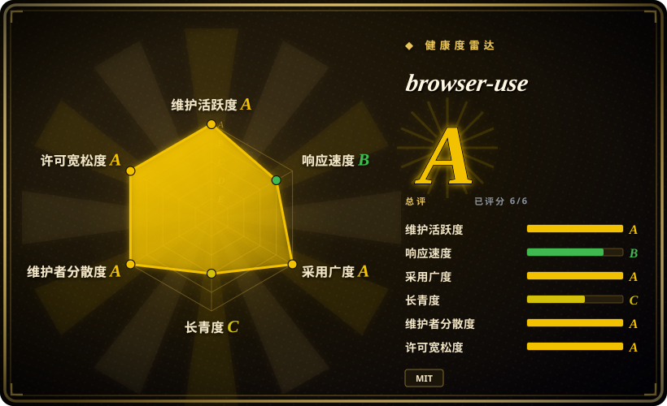
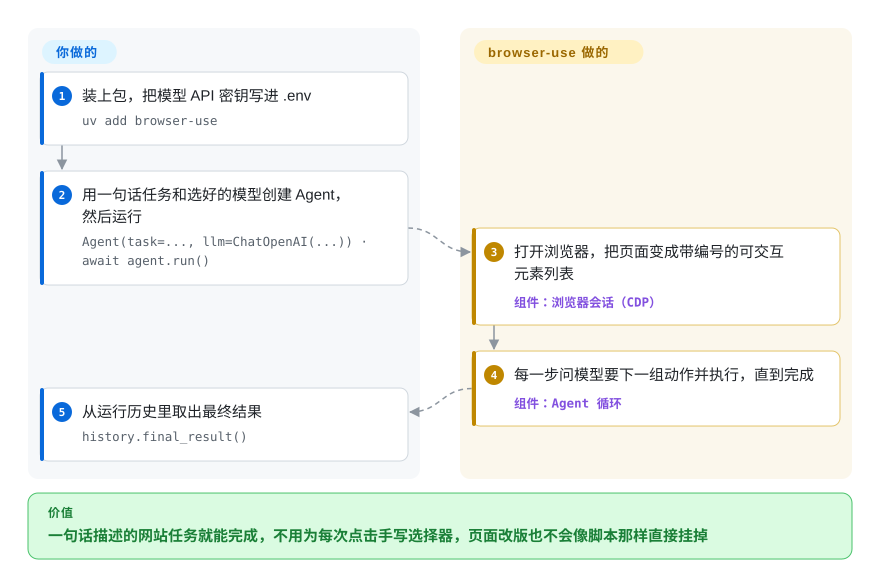

# browser-use

用脚本操作浏览器——登录、找菜单、填表、导出文件——每一次点击都要写死一个选择器，网站哪天挪了个按钮，脚本就报 `TimeoutError` 挂掉。browser-use 把浏览器交给大模型：你用一句话写下任务，它的 agent 循环读页面、决定下一次点击或输入，一直重复到能交出答案为止。

## 何时使用

你是一名 Python 开发者，在做一个产品或后台任务，要在你控制不了的网站上办事：从十几个供应商门户里下载发票，每家布局都不一样；查空位然后预约；把一个 Web 应用里的数据搬到另一个里。你试过 Playwright 脚本，问题在维护——`page.click("#export-btn-2")` 一直能跑，直到某个门户改版，然后报 `TimeoutError: locator.click: Timeout 30000ms exceeded`，而你每个网站都有一份这样的脚本。

当你想把 agent 循环放进*自己的 Python 代码里*时，就该想到 browser-use：`Agent(task="下载上个月的发票……", llm=...)`，然后 `await agent.run()`。你选它而不选 Playwright MCP 或 Browser Harness，是因为那两个是给外部编码 agent（Claude Code、Cursor）递浏览器工具，而 browser-use 本身就是 agent——你把它嵌进自己的应用，自选模型，注册自定义工具，拿回结构化结果。你选它而不选 Stagehand，是因为你的技术栈是 Python 而不是 TypeScript，并且想把整个任务交给循环，而不是手写步骤和 AI 调用混着来。真正的取舍是：你放弃脚本的确定性、速度和几乎为零的单次成本，换来对页面改版的容忍，代价是每一步都要付一次大模型调用。

## 怎么用起来

`Agent` 跑的是一个循环。每一步它先抓浏览器状态——当前 URL、打开的标签页，以及一棵精简过的页面树，其中每个可点击或可输入的元素都带一个数字编号，比如 `[35]<input placeholder=Enter name />`，需要时再附一张画好这些框的截图——连同你的任务和历史步骤一起发给模型。模型回一组动作（“点 35”“在 12 里输入”“滚动”“提取”），browser-use 通过 Chrome DevTools Protocol（CDP，Chromium 开放的调试通道；它用自家的 `cdp-use` 客户端，而不是 Playwright）执行这些动作，然后进入下一轮，直到模型调用 `done`。它替你做的：拉起或附着浏览器、生成带编号的页面视图、系统提示词、执行动作、重试和运行历史。留给你的：任务怎么写、用哪个模型和它的 API 密钥、你用 `@tools.action` 注册的自定义工具，以及用哪种浏览器——全新的本地 Chromium、通过 `Browser.from_system_chrome()` 复用你自己的 Chrome 配置，或者用 `Browser(use_cloud=True)` 付费租 Browser Use Cloud 的浏览器。匿名使用遥测（PostHog）默认开启，设 `ANONYMIZED_TELEMETRY=false` 才会关。

<!-- flow-steps:begin (generated from flows/browser-use.json by tools/flow_card.py — do not edit) -->

流程文字版

1. **你**：装上包，把模型 API 密钥写进 .env — `uv add browser-use`
2. **你**：用一句话任务和选好的模型创建 Agent，然后运行 — `Agent(task=..., llm=ChatOpenAI(...)) · await agent.run()`
3. **browser-use**：打开浏览器，把页面变成带编号的可交互元素列表 — 组件：`浏览器会话（CDP）`
4. **browser-use**：每一步问模型要下一组动作并执行，直到完成 — 组件：`Agent 循环`
5. **你**：从运行历史里取出最终结果 — `history.final_result()`

**价值**：一句话描述的网站任务就能完成，不用为每次点击手写选择器，页面改版也不会像脚本那样直接挂掉

<!-- flow-steps:end -->

## 何时不用

- **流程稳定、要跑成千上万次。** 改写 Playwright 脚本（见 [Playwright](../playwright-family/playwright.zh.md)），因为 browser-use 的每一步都是一次大模型往返：更慢、按 token 计费，而且不保证两次走同一条路；脚本则是毫秒级、单次零成本。
- **你想让手头的编码 agent（Claude Code、Codex、Cursor）去开浏览器。** 改用 [Browser Harness](browser-harness.zh.md)、[Playwright MCP](../playwright-family/playwright-mcp.zh.md) 或 [Agent Browser](agent-browser.zh.md)，因为它们把浏览器当工具递给你已经在跑的 agent；再嵌一个 browser-use 等于在 agent 循环里再套一层 agent 循环。
- **你的技术栈是 TypeScript/Node。** 改用 Stagehand 或基于 Playwright 的 agent 工具，因为 browser-use 是 Python ≥3.11 的库；厂商的 TypeScript 方案在别的仓库里（Browser Harness JS、Browser Use Pi）。
- **你要在自己的基础设施上绕过机器人检测或处理验证码。** 去看基于 [Camoufox](../browser-driver-frameworks/camoufox.zh.md) 的工具，因为 README 把隐身、代理和验证码处理都指向付费的 Browser Use Cloud；开源库驱动的只是普通 Chromium。
- **页面内容不能发给托管模型。** 要么通过 Ollama 封装跑本地模型（并接受在难网站上任务成功率明显更低），要么用脚本式驱动，因为这个循环会把页面文字和元素树——开了视觉还有截图——发给你配置的那个大模型。
- **你需要一个冻结的 API。** 锁死具体版本或自己包一层，因为这个库还在 `0.x`（2026-10-07 发布 0.13.11），发版频繁；而且默认推荐的模型（`ChatBrowserUse` / BU2）是厂商自家的付费网关，默认配置天然往它的云上引。

## 横向对比

| 替代品 | 是否收录 | 我们的评价 | 取舍 |
|---|---|---|---|
| [Browser Harness](browser-harness.zh.md) | ✅ | 要让外部编码 agent 驱动你已登录的 Chrome 时选 Browser Harness；要让你自己的 Python 程序从头到尾掌握 agent 循环时选 browser-use。 | 同一家厂商；Harness 没有内层 agent 循环、不额外花模型调用，但需要一个编码 agent 来做决定。 |
| [Playwright MCP](../playwright-family/playwright-mcp.zh.md) | ✅ | MCP 客户端（Claude Desktop、VS Code、Cursor）本身就是你的 agent、只缺浏览器工具时选 Playwright MCP；要把 agent 写进应用里时选 browser-use。 | 官方出品、跨浏览器、工具行为确定，但自己没有任务循环、记忆或自定义工具框架。 |
| [Agent Browser](agent-browser.zh.md) | ✅ | 要让 agent 在命令行里用稳定的元素引用驱动 Chrome 时选 Agent Browser；要一个自己会规划、会动手的 Python 库时选 browser-use。 | CLI 优先、不绑定 agent，但规划和重试都留给调用它的 agent。 |
| Stagehand | 未收录 | 写 TypeScript、想在每一步里混用确定的 Playwright 步骤和 AI 调用时选 Stagehand；用 Python、想把整个任务交出去时选 browser-use。 | 对哪些步骤交给 AI 控制得更细，但要 Node 技术栈，背后是另一家厂商的云（Browserbase）。 |
| Skyvern | 未收录 | 想要一个可自托管、面向工作流、带界面的服务来反复跑业务表单自动化时选 Skyvern；想在自己代码里放一个轻量库时选 browser-use。 | agent 外面包了更多产品（工作流、界面、API 服务），但它是一个要部署的 AGPL 服务，而不是一个 pip 依赖。 |

## 技术栈

- **Python ≥3.11**，异步（`asyncio`），以 `browser-use` 名义发布在 PyPI（MIT）。
- **通过 CDP 控制浏览器**，用厂商自家的 `cdp-use` 客户端；CLI 路径依赖 `browser-harness` 包。
- **大模型封装**覆盖 OpenAI、Anthropic、Google、Groq、Ollama 以及厂商自家的 `ChatBrowserUse` 网关；用 `mcp` 暴露或调用 MCP 工具。
- **Pydantic** 描述动作和结构化输出；**PostHog** 做匿名遥测。

## 依赖

- **一个基于 Chromium 的浏览器**：本机的、你已装好的 Chrome 配置，或 Browser Use Cloud 的浏览器。
- **一个大模型端点和密钥**：OpenAI、Anthropic、Google、Groq、本地 Ollama 模型，或用 `BROWSER_USE_API_KEY` 接厂商的 BU2 模型 / 网关。
- **Python 3.11+**，以及一套相当重、全部锁版本的依赖（各家模型 SDK、Google API 客户端、PDF/DOCX 库）。
- **可选：** Browser Use Cloud，提供隐身浏览器、代理、验证码处理和配置同步。

## 运维难度

**试用低，上生产中到高。** 本地跑一次只要 `uv add browser-use`、一个 API 密钥和一段短脚本。成本落在生产环境：每个任务要调很多次模型，所以要按任务预算 token 和时延；运行结果不确定，所以要设步数上限、校验结果、做重试；真实网站会遇到机器人检测、登录和验证码，开源库不负责解决；除非付费用厂商的云浏览器，否则有头或无头 Chromium 的托管和扩容都得你自己来。在受监管环境部署前，还要先定好遥测怎么处理（`ANONYMIZED_TELEMETRY=false`）。

## 健康度与可持续性

- **维护活跃度（截至 2026-10-08）：** 非常活跃——上个季度每周都有提交，`0.13.x` 大约每月一版（最新 0.13.11，2026-10-07）。
- **响应速度：** issue 首次响应的中位数约 51.1 小时（大约两天）——以这个体量算不错，但比 2026 年 9 月那次评分退了一档。
- **治理与背书：** 归属 Browser Use 这家风投支持的公司，靠云浏览器、托管 agent API 和 BU2 模型赚钱；过去一年有一百多人贡献过代码，不过头号提交者（联合创始人 Magnus Müller）约占近期提交的三分之一，路线图跟着公司的云产品走。
- **年龄 / Lindy：** 约两岁（2024-10-31 创建）——很年轻；采用量巨大（约 11.7 万 star、每月数百万次 PyPI 下载），但 Lindy 先验很弱，API 仍是 `0.x`。
- **风险信号：** MIT 许可，没有改许可证的历史；主要风险是开放核心的引力——隐身、验证码处理和推荐模型都是付费云功能——外加默认开启的遥测。

## 存疑（未验证）

- [推断] 本次同步没有实测单任务成本、时延和在难网站上的成功率；“每个任务要调很多次模型”是从文档描述的逐步循环推出来的。
- [未验证] 小型本地 Ollama 模型在真实网站上的任务成功率这里没有做基准；README 只说可以用本地模型，“取决于你的硬件和模型要求”。
- [未验证] 对 Stagehand（TypeScript、Browserbase）和 Skyvern（AGPL、工作流界面）的对比事实来自一般认知，本次同步没有重读。
- [推断] 把头号提交者 `MagMueller` 认作联合创始人 Magnus Müller，依据的是 README 的引用块（作者 Müller 和 Žunič），没有核对账号归属。
- [未验证] 每月 PyPI 下载量（健康度评分器 2026-10-08 取到约 800 万）在不同抓取之间波动很大，而且包含 CI 安装。
