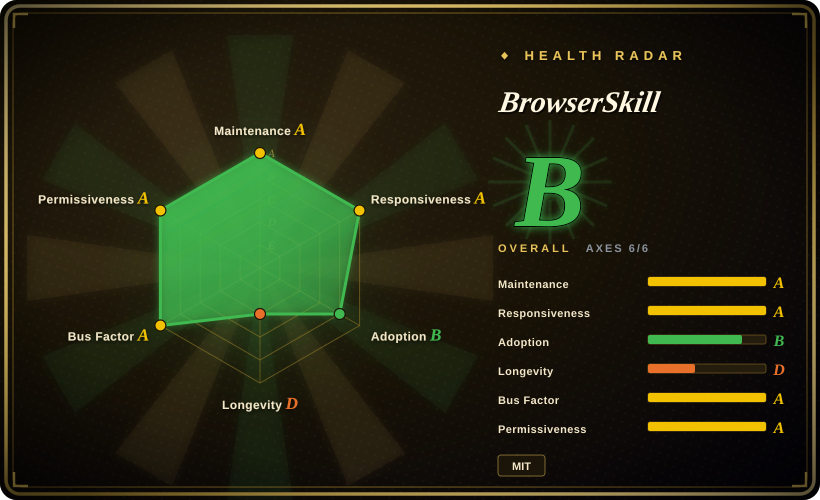
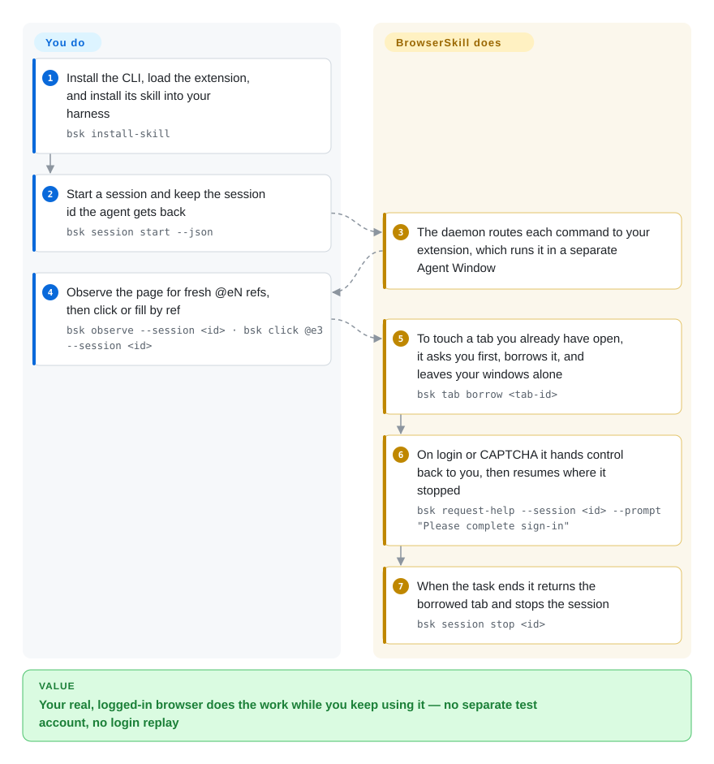

# BrowserSkill

A Tencent CLI + browser-extension bridge that lets any shell-capable coding agent operate **your already logged-in Chromium** — in a separate Agent Window, borrowing your open tabs only after you confirm, and handing control back to you when a step needs a human.

## When to use

You're driving Claude Code, Cursor, or Codex on a task whose answer is behind a login you already hold: check the dashboard you're signed into, reproduce a bug on an SSO-gated staging app, fill an internal form, pull a number out of a vendor portal that has no API. A fresh automation browser means replaying login, hitting 2FA, and arriving with a zero-reputation profile that risk control treats as a bot — and putting your password into a prompt is not an option.

BrowserSkill closes that gap without giving the agent a browser of its own: you install the `bsk` CLI, load the Chrome/Edge extension, run `bsk install-skill` so your harness learns the workflow, and the agent then drives a *separate* Agent Window that runs inside your real browser profile. Your own windows stay yours: touching a tab you already have open requires an explicit borrow that you approve by default, and when the flow reaches something only a human can pass (login, CAPTCHA, OTP, payment confirmation, consent) the agent calls `bsk request-help` and resumes after you're done. The deciding tradeoff against its closest substitute, [OpenCLI](opencli.md): both bridge your logged-in Chrome, but OpenCLI's payoff is deterministic site adapters you maintain, while BrowserSkill's payoff is that you are never locked out of your own browser and always reachable inside the loop. Choose it when the task is occasional and human-in-the-loop rather than a workflow you want to freeze into a replayable command.

## How it works

Three pieces ship to your machine: the `bsk` binary (CLI + daemon in one Rust executable), a Chromium MV3 extension, and a bundled `skill/SKILL.md` that teaches your harness the CLI convention. The CLI never touches the browser itself — it sends JSON Lines over local IPC (`$BSK_HOME/run/daemon.sock`, default `~/.bsk`) to the daemon, which forwards each `tool.*` call over loopback WebSocket to the extension; the extension drives a separate Agent Window through Chrome's debugger API plus WebExtension APIs, so every page the agent sees carries your real profile's cookies and logins. What you still own: naming the task, approving a borrow of one of your tabs, and performing the human-only step the agent hands to you. What it owns: session lifecycle and the per-session command queue, element refs (`@eN`) that replace brittle CSS selectors, borrow/return bookkeeping so borrowed tabs go back to your window, and — if you switch it on — a redacted local audit log of what it did for each task.

<!-- flow-steps:begin (generated from flows/browserskill.json by tools/flow_card.py — do not edit) -->

Text version of the flow

1. **You**: Install the CLI, load the extension, and install its skill into your harness — `bsk install-skill`
2. **You**: Start a session and keep the session id the agent gets back — `bsk session start --json`
3. **BrowserSkill**: The daemon routes each command to your extension, which runs it in a separate Agent Window
4. **You**: Observe the page for fresh @eN refs, then click or fill by ref — `bsk observe --session <id> · bsk click @e3 --session <id>`
5. **BrowserSkill**: To touch a tab you already have open, it asks you first, borrows it, and leaves your windows alone — `bsk tab borrow <tab-id>`
6. **BrowserSkill**: On login or CAPTCHA it hands control back to you, then resumes where it stopped — `bsk request-help --session <id> --prompt "Please complete sign-in"`
7. **BrowserSkill**: When the task ends it returns the borrowed tab and stops the session — `bsk session stop <id>`

**Value**: Your real, logged-in browser does the work while you keep using it — no separate test account, no login replay

<!-- flow-steps:end -->

## When NOT to use

- **Clean-session, CI, or cross-browser automation.** This project is defined by your foreground profile — Firefox is planned, not supported. For disposable or headless runs in CI use [Playwright CLI](../playwright-family/playwright-cli.md) / [Playwright MCP](../playwright-family/playwright-mcp.md), or [Agent Browser](agent-browser.md) if you want a shell-driven CLI over its own Chrome.
- **You want site workflows frozen into repeatable commands.** Recurring, deterministic operations are [OpenCLI](opencli.md)'s design center (site adapters + autofix); BrowserSkill has no documented adapter layer, so a repeated multi-step flow stays an agent task each time. [未验证]
- **Debugging performance, network, or console.** There is no DevTools tracing surface here — use [Chrome DevTools MCP](chrome-devtools-mcp.md) for traces, Core Web Vitals, heap snapshots, and request waterfalls.
- **You need an in-product copilot inside your own web app.** That is a library embedded in your page ([page-agent](page-agent.md)), not an external agent that drives your browser.
- **The task leaves the browser.** For native desktop apps or whole-VM isolation use [Cua](../../desktop-automation/cua.md); for bulk crawling rather than operating a page, use a scraping tool such as [Firecrawl](../../web-scraping/crawling-tools/firecrawl.md).
- **Untrusted page content with sensitive logins is in scope.** The agent reads arbitrary pages inside your logged-in profile, so prompt injection from page text is a live surface: the repo shipped no prompt-injection guidance in its skills as of 2026-09-19 (open issue #286), and the local daemon's handshake validates only the `chrome-extension://` origin scheme rather than its own extension ID (open issue #273). If that threat model is unacceptable, keep the agent in a clean profile ([Agent Browser](agent-browser.md), [Playwright MCP](../playwright-family/playwright-mcp.md)) and accept the login friction.
- **Managed/locked-down hosts.** Installing the extension and running a long-lived local daemon is a prerequisite; unsigned Windows builds have been blocked by Smart App Control (open issue #262), and sandboxes that reap child processes per command need the host-managed `BSK_HOME` setup instead of automatic startup.
- **You cannot accept an extension + daemon that inherits every session in the profile.** Approving borrows and keeping help enabled limit what the agent can do without you, but they do not shrink the trust surface the bridge creates.

## Comparison

| Alternative | In index | Our verdict | Tradeoff |
|---|---|---|---|
| [OpenCLI](opencli.md) | ✅ | Pick OpenCLI when you want the sites you use daily reduced to deterministic commands with adapter autofix; pick BrowserSkill when each task is one-off and you want your browser and your attention kept in the loop. | OpenCLI pays an adapter-churn treadmill for repeatability; BrowserSkill pays for "you are never interrupted" with no frozen-command layer and a per-task agent loop. |
| [Agent Browser](agent-browser.md) | ✅ | Pick Agent Browser when the run must be reproducible against a clean Chrome over CDP with a11y refs and a rich CLI (network interception, Web Vitals); pick BrowserSkill when the pages are behind your logins and login replay is the blocker. | Agent Browser keeps a smaller trust surface and adds observability; BrowserSkill inherits your sessions and needs an extension + daemon on your desktop. |
| [Chrome DevTools MCP](chrome-devtools-mcp.md) | ✅ | Pick Chrome DevTools MCP to diagnose a page (traces, CWV, network, heap); pick BrowserSkill to operate a logged-in page as a task. | Diagnostics versus operation — DevTools MCP has no borrow/handoff model, BrowserSkill has no profiling surface. |
| [page-agent](page-agent.md) | ✅ | Pick page-agent to give your own app's users a natural-language UI, since it is a snippet your frontend owns; pick BrowserSkill when the target site is not yours and cannot be modified. | page-agent needs no daemon or extension but only works where you can ship code; BrowserSkill works on any site at the cost of desktop-side installation. |
| [browser-use](browser-use.md) | ✅ | Pick browser-use if you want a Python framework that owns the agent loop and vision fallback; pick BrowserSkill when you already have an agent harness and only need the browser capability. | browser-use bundles its own loop and browser; BrowserSkill is a BYO-agent bridge that spends its complexity on identity and human handoff instead of autonomy. |

## Tech stack

- **CLI + daemon (Rust):** `crates/bsk-cli` (Clap verb-noun command tree, IPC client, WebSocket server, session routing) and `crates/bsk-protocol` (shared wire types). Cargo workspace with `rust-toolchain.toml`, `rustfmt.toml`, `clippy.toml`.
- **Extension (TypeScript, MV3):** `apps/extension`, driving Chromium through the debugger API (CDP) plus WebExtension APIs; shared `packages/ui` and `packages/i18n` (English, Simplified Chinese, Korean — a 7-locale expansion is in the open-PR queue).
- **Transports:** CLI↔daemon JSON Lines over a Unix domain socket or Windows named pipe; daemon↔extension WebSocket on loopback, default port `52800`, handshake checking the `chrome-extension://` origin.
- **State:** `~/.bsk` (override with `BSK_HOME`) holds `daemon.json`, `run/daemon.sock`, and opt-in audit JSONL under `audit/`.
- **Harness integration:** the bundled `skill/SKILL.md` is installed per harness by `bsk install-skill`; DeepSeek Harness gets a first-class npm plugin (`@wxg-prc-cpg/browser-skill-dsh-plugin`) exposing `browser_*` tools.
- **Repo shape:** Cargo + pnpm monorepo; GitHub language split ~3.8 MB TypeScript / ~1.8 MB Rust as of 2026-09-20.

## Dependencies

- **OS:** macOS (Apple Silicon and Intel), Linux (x64 and ARM64), Windows x64.
- **Browser:** Chrome or Microsoft Edge with the BrowserSkill extension from the Chrome Web Store / Edge Add-ons; other Chromium-based browsers are "expected to work" if they load unpacked Chromium MV3 extensions; Firefox is planned.
- **CLI install:** `install.sh` / `install.ps1` into `~/.local/bin` — no npm package and no Homebrew formula found as of 2026-09-20 (both checked). Node.js is only needed for the DeepSeek Harness plugin path.
- **A persistent daemon host:** ordinary local use auto-starts the daemon; agents whose command sandbox kills background children must run it in a persistent host context with a shared `BSK_HOME` and `BSK_AUTO_START=0`.
- **Remote mode (0.3.0+):** an agent on a server paired with your local browser needs the daemon there, plus authenticated WSS — you supply native TLS or a TLS reverse proxy and own that supervisor.

## Ops difficulty

**Low for a single local machine, medium once sandboxed, remote, or locked down.** The install path is one script plus one store extension plus `bsk install-skill`, and `bsk doctor` reports connection and skill problems. The recurring costs are structural: (a) three independently released artifacts (CLI, daemon, extension) that must stay in protocol step — 0.3.0 introduced settings enforcement that old daemons cannot honor, and a release gap left `cli-v0.3.0`/plugin tags missing for a day (#267); (b) the daemon is a long-lived process, so per-command sandboxes and Windows process trees are a known failure mode (#268, #265); (c) opt-in audit logging puts task metadata on the daemon host (`~/.bsk/audit`, redacted fields, 30-day retention, ~16 MiB per task) that you own; (d) remote pairing adds device credential lifecycle and TLS to your plate.

## Health & viability

- **Maintenance (2026-09-20):** very active — 19 releases, `ext-v0.3.0` on 2026-09-16 and `cli-v0.3.0` on 2026-09-17, 100 commits in the trailing 30 days, and at least one commit in each of the last 13 weeks (GitHub participation stats; weekly counts ranged 4–151).
- **Responsiveness (2026-09-20):** median first response 52.8 hours across 44 qualifying issues — the issue stream is triaged, not ignored.
- **Governance / bus factor:** owned by the Tencent GitHub organization (`owner.type=Organization`); GitHub's contributors endpoint lists 18 contributors with the top one at ~143 commits, and the atlas scorer counts 21 active contributors over 12 months with a top-1 share of 0.305 — a funded team rather than a solo maintainer, but the roadmap belongs to the vendor's internal priorities.
- **Backing, age & Lindy (2026-09-20):** created 2026-06-22 — roughly three months old. Real corporate backing is a positive signal, yet the Lindy prior discounts a project this young: there is no evidence yet that Tencent keeps it alive or that the CLI surface stabilizes, only that it is being developed fast right now. [推断]
- **Adoption:** ~5.9k stars / 416 forks in three months, 30 open issues plus 25 open PRs — attention is real, but it is attention, not production proof. The only package-registry signal is the DeepSeek Harness plugin on npm; the CLI itself ships as a script-installed binary, not a package.
- **Risk flags:** MIT, no relicense or CLA signal found in the repo root. The load-bearing risks are security and reliability rather than licensing: open issue #286 (no prompt-injection guidance while the agent reads arbitrary pages with your logins) and #273 (local daemon accepts commands from any browser extension, not just its own), plus platform breakage reports on managed Windows (#262) and background Agent Window input silently no-op'ing under `--no-focus` (#242).

## Caveats (unverified)

- [未验证] No adapter / deterministic-replay layer appears anywhere in the README, `skill/SKILL.md`, or `docs/architecture.md`; absence of documentation is not proof of absence, since I did not read the full source. An open feature request asks for exactly that ("local site memory with agent-recorded reusable workflows").
- [未验证] "Your work is not interrupted" and the separate-Agent-Window behavior come from the README and the bundled skill; I did not run `bsk` locally.
- [未验证] The `bsk install-skill` / `session` / `observe` / `tab borrow` / `request-help` commands in the flow card are quoted from `skill/SKILL.md` and the README quick start; their runtime behavior was not exercised.
- [未验证] Open issues #286, #273, #267, #268, #265, #262 and #242 are third-party reports as of 2026-09-20; I did not reproduce them, and open does not mean unfixed.
- [未验证] Remote-mode pairing, renewal, revocation, and TLS details are summarized from `docs/architecture.md` and the 0.3.0 changelog, not from the remote guide itself.
- [未验证] Audit-log fields, file permissions, retention, and the "default off" state come from `docs/operation-audit.md` only.
- [未验证] Extension store presence is taken from the README's Chrome Web Store / Edge Add-ons links; I did not inspect the listings for user counts or ratings.
- [未验证] npm download counts disagree by measurement window: the registry API's `last-month` window (2026-08-21 → 2026-09-19) read 12,479 on 2026-09-20, while the atlas health scorer recorded 9,475 the same day; I did not reconcile the two window definitions. Both are for the DeepSeek Harness plugin, not the CLI (which has no npm/Homebrew distribution — 404s checked).
- [推断] Support for non-Chrome Chromium browsers (e.g. the reported 360/Yandex breakage) is inferred to be partial from open issues, not from a documented support matrix.
