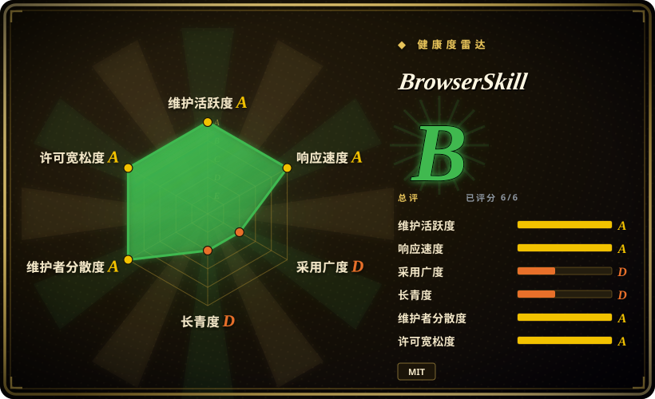
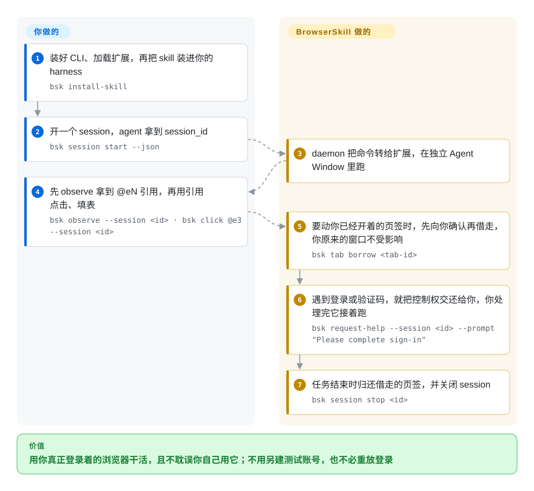

# BrowserSkill

腾讯出的 CLI + 浏览器扩展桥：让任何能调 shell 的编码 agent 操作**你已登录的 Chromium**——任务跑在独立 Agent Window，动你已开的页签要先经你确认，遇到只能人做的步骤把控制权交还给你。

## 何时使用

你正用 Claude Code、Cursor 或 Codex 干活，而这个任务的答案锁在你已有的登录态后面：查你登录着的后台仪表盘、在 SSO 保护的分级环境复现 bug、填内部表单、从没有 API 的供应商门户里取一个数字。换成全新自动化浏览器意味着重放登录、撞 2FA、带着零信誉的 profile 被风控当机器人拦下；把密码贴进 prompt 更不是选项。

BrowserSkill 不用给 agent 一个它自己的浏览器就能补上这段：你装 `bsk` CLI、加载 Chrome/Edge 扩展、跑 `bsk install-skill` 让你的 harness 学会这套工作流，之后 agent 驱动的是一个**独立** Agent Window，它跑在你真实浏览器 profile 里。你自己的窗口始终是你的：要动你已经开着的页签，必须显式借走且默认由你确认；流程走到只有人才能过的步骤（登录、验证码、OTP、支付确认、授权同意）时，agent 调 `bsk request-help` 交还控制权，你处理完它接着跑。与最近邻替代品 [OpenCLI](opencli.zh.md) 的决定性取舍：两者都桥接你已登录的 Chrome，但 OpenCLI 的回报是值得维护的站点 adapter 换来的确定性命令，BrowserSkill 的回报是**你永远不会被踢出自己的浏览器、且始终能被拉进回路**。任务是一次性、需要人在回路时选它；想把流程冻成可重放命令时选 OpenCLI。

## 怎么用起来

装到本机的是三样东西：`bsk` 二进制（Rust 单文件里同时是 CLI 和 daemon）、一个 Chromium MV3 扩展，以及一份把你的 harness 教会 CLI 约定的 `skill/SKILL.md`。CLI 本身不碰浏览器——它经本地 IPC（`$BSK_HOME/run/daemon.sock`，默认 `~/.bsk`）把 JSON Lines 发给 daemon，daemon 再把每次 `tool.*` 调用经回环 WebSocket 转给扩展，扩展用 Chrome 调试协议加 WebExtension API 驱动一个独立 Agent Window，所以 agent 看到的每个页面都带着你真实 profile 的 cookie 和登录态。你仍然负责的部分：说清任务、批准借走你的某个页签、完成它交还给你的那步人工操作。它负责的部分：session 生命周期与按 session 串行的命令队列、替代脆弱 CSS selector 的元素引用（`@eN`）、借还记账（借走的页签会还回你的窗口），以及（如果你打开）按任务记录、做了脱敏的本地操作审计。

<!-- flow-steps:begin (generated from flows/browserskill.json by tools/flow_card.py — do not edit) -->

流程文字版

1. **你**：装好 CLI、加载扩展，再把 skill 装进你的 harness — `bsk install-skill`
2. **你**：开一个 session，agent 拿到 session_id — `bsk session start --json`
3. **BrowserSkill**：daemon 把命令转给扩展，在独立 Agent Window 里跑
4. **你**：先 observe 拿到 @eN 引用，再用引用点击、填表 — `bsk observe --session <id> · bsk click @e3 --session <id>`
5. **BrowserSkill**：要动你已经开着的页签时，先向你确认再借走，你原来的窗口不受影响 — `bsk tab borrow <tab-id>`
6. **BrowserSkill**：遇到登录或验证码，就把控制权交还给你，你处理完它接着跑 — `bsk request-help --session <id> --prompt "Please complete sign-in"`
7. **BrowserSkill**：任务结束时归还借走的页签，并关闭 session — `bsk session stop <id>`

**价值**：用你真正登录着的浏览器干活，且不耽误你自己用它；不用另建测试账号，也不必重放登录

<!-- flow-steps:end -->

## 何时不用

- **要干净会话、CI 或跨浏览器。** 这个项目就是围绕你前台那个 profile 设计的——Firefox 只在计划里。CI 里的无头/一次性运行请用 [Playwright CLI](../playwright-family/playwright-cli.zh.md) 或 [Playwright MCP](../playwright-family/playwright-mcp.zh.md)；想要 shell 驱动、自带 Chrome 的 CLI 就用 [Agent Browser](agent-browser.zh.md)。
- **想把站点流程冻成可反复执行的命令。** 高频、确定性的操作是 [OpenCLI](opencli.zh.md) 的主场（站点 adapter 加 autofix）；BrowserSkill 没有任何成文 adapter 层，同一套多步流程每次都还是 agent 任务。[未验证]
- **要排查性能、网络或 console。** 这里没有 DevTools 追踪面——trace、Core Web Vitals、堆快照、请求瀑布流请用 [Chrome DevTools MCP](chrome-devtools-mcp.zh.md)。
- **要在自己的 web 应用里嵌一个产品内 copilot。** 那是嵌进你自己页面的库（[page-agent](page-agent.zh.md)），不是从外部驱动你浏览器的 agent。
- **任务离开了浏览器。** 驱动原生桌面应用或要整机隔离用 [Cua](cua.zh.md)；批量抓取而不是操作页面，用 [Firecrawl](../../web-scraping/crawling-tools/firecrawl.zh.md) 这类抓取工具。
- **范围内包含不可信页面内容与你敏感的登录态。** agent 会在你已登录的 profile 里读任意页面，页面文本的 prompt injection 就是真实攻击面：截至 2026-09-19，仓库的 skills 没有任何 prompt injection 防护指引（未修 issue #286），而本地 daemon 握手只校验 `chrome-extension://` 这个 origin 协议、不校验是不是自家扩展 ID（未修 issue #273）。这个威胁模型你接受不了的话，就让 agent 待在干净 profile 里（[Agent Browser](agent-browser.zh.md)、[Playwright MCP](../playwright-family/playwright-mcp.zh.md)），代价是认下登录摩擦。
- **受管控或封闭的机器。** 装扩展并常驻一个本地 daemon 是前提；Windows 未签名构建被 Smart App Control 拦过（未修 issue #262），而每条命令都会回收子进程的沙箱必须改用 host 托管的 `BSK_HOME` 方案，不能靠自动启动。
- **不能接受“扩展加 daemon 继承 profile 里全部会话”这个信任面。** 借页签需你批准、help 保持开启，能限制 agent 背着你做什么，但缩小不了这座桥造出来的信任面。

## 横向对比

| 替代品 | 是否收录 | 我们的评价 | 取舍 |
|---|---|---|---|
| [OpenCLI](opencli.zh.md) | ✅ | 想把每天要用的站点压成确定性命令、还有 adapter autofix 兜底，选 OpenCLI；任务是零散一次性、且你要保住自己的浏览器与注意力，选 BrowserSkill。 | OpenCLI 用 adapter 维护税换可重复性；BrowserSkill 用“你从不被打断”换掉冻结命令层，代价是每次都跑一遍 agent 回路。 |
| [Agent Browser](agent-browser.zh.md) | ✅ | 需要在干净 Chrome 上跑可复现的 CDP 自动化、要 a11y refs 与网络拦截/Web Vitals 这类能力，选 Agent Browser；目标页面锁在你的登录态后面、重放登录才是卡点，选 BrowserSkill。 | Agent Browser 信任面更小且自带可观测性；BrowserSkill 继承你的全部会话，代价是桌面侧要装扩展和 daemon。 |
| [Chrome DevTools MCP](chrome-devtools-mcp.zh.md) | ✅ | 要诊断页面（trace、CWV、网络、堆）选 Chrome DevTools MCP；要把已登录页面当任务操作选 BrowserSkill。 | 诊断与操作是两件事——DevTools MCP 没有借还与人机交接模型，BrowserSkill 没有 profiling 面。 |
| [page-agent](page-agent.zh.md) | ✅ | 要给自家应用的用户一个自然语言界面、且这个片段由你前端自己掌控，选 page-agent；目标站点不是你的、你也改不动它，选 BrowserSkill。 | page-agent 不需要 daemon 与扩展，但只能用在你能发代码的站点；BrowserSkill 对任意站点可用，代价是桌面侧安装。 |
| [browser-use](browser-use.zh.md) | ✅ | 想要一个自己掌管 agent 回路、带视觉兜底的 Python 框架，选 browser-use；你已经有自己的 agent harness、只缺浏览器能力，选 BrowserSkill。 | browser-use 自带回路与浏览器；BrowserSkill 是 BYO-agent 的桥，把复杂度花在身份与人机交接上而不是自主性上。 |

## 技术栈

- **CLI 与 daemon（Rust）：** `crates/bsk-cli`（Clap 动词-名词命令树、IPC 客户端、WebSocket 服务端、session 路由）与 `crates/bsk-protocol`（共享线上类型）。Cargo workspace，配 `rust-toolchain.toml`、`rustfmt.toml`、`clippy.toml`。
- **扩展（TypeScript，MV3）：** `apps/extension`，经调试协议（CDP）加 WebExtension API 驱动 Chromium；共享 `packages/ui` 与 `packages/i18n`（英文、简中、韩文，另有 7 个语种在开放 PR 队列里）。
- **传输：** CLI 与 daemon 之间是 UDS（Windows 为命名管道）上的 JSON Lines；daemon 与扩展之间是回环 WebSocket，默认端口 `52800`，握手校验 `chrome-extension://` origin。
- **状态：** `~/.bsk`（可用 `BSK_HOME` 覆盖）存 `daemon.json`、`run/daemon.sock`，以及 `audit/` 下可选开启的审计 JSONL。
- **Harness 集成：** 内置 `skill/SKILL.md` 由 `bsk install-skill` 按 harness 安装；DeepSeek Harness 有官方 npm 插件（`@wxg-prc-cpg/browser-skill-dsh-plugin`）暴露 `browser_*` 工具。
- **仓库形态：** Cargo 加 pnpm 的 monorepo；截至 2026-09-20，GitHub 语言占比约为 TypeScript 3.8 MB、Rust 1.8 MB。

## 依赖

- **操作系统：** macOS（Apple Silicon 与 Intel）、Linux（x64 与 ARM64）、Windows x64。
- **浏览器：** Chrome 或 Microsoft Edge，扩展从 Chrome Web Store / Edge Add-ons 安装；其他 Chromium 系浏览器在支持 MV3 未打包扩展的前提下“预期可用”；Firefox 仅在计划中。
- **CLI 安装：** `install.sh` / `install.ps1` 装到 `~/.local/bin`——截至 2026-09-20 没有 npm 包也没有 Homebrew formula（两处都查过）。Node.js 只在 DeepSeek Harness 插件路径上需要。
- **一个常驻 daemon 的宿主：** 普通本地使用会自动拉起 daemon；若你的 agent 沙箱会杀掉后台子进程，必须在持久宿主环境里带同一份 `BSK_HOME` 与 `BSK_AUTO_START=0` 运行。
- **远程模式（0.3.0 起）：** 让服务器上的 agent 配对本地浏览器，需要在服务器跑 daemon 并走认证 WSS——原生 TLS 或 TLS 反向代理由你提供，重启与守护也归你。

## 运维难度

**单机本地低，进沙箱、走远程或受管控环境升到中。** 安装路径是一条脚本加一个商店扩展加 `bsk install-skill`，`bsk doctor` 会报连接与 skill 的问题。持续性成本是结构性的：(a) 三个各自发版的产物（CLI、daemon、扩展）必须协议同步——0.3.0 的设置有旧 daemon 认不了的强制语义，且发版空档曾让 `cli-v0.3.0` 与插件 tag 缺了一天（#267）；(b) daemon 是常驻进程，按命令回收子进程的沙箱与 Windows 进程树是已知故障模式（#268、#265）；(c) 可选审计会把任务元数据落在 daemon 主机上的审计目录（字段脱敏、保留 30 天、单任务约 16 MiB，详见上游 `docs/operation-audit.md`），这些数据归你管；(d) 远程模式把设备配对、续期、吊销与 TLS 全加到你头上。

## 健康度与可持续性

- **维护（2026-09-20）：** 非常活跃——19 个 release，`ext-v0.3.0` 于 2026-09-16、`cli-v0.3.0` 于 2026-09-17，近 30 天 100 次 commit，最近 13 周每周都有提交（周 commit 数在 4 到 151 之间，GitHub participation 统计）。
- **响应性（2026-09-20）：** 40 条合格 issue 的首次响应中位数 52.8 小时——issue 流有人分诊，不是没人管。
- **治理与 bus factor：** 属腾讯 GitHub 组织（`owner.type=Organization`）；GitHub 贡献者端点列出 18 位贡献者、头部约 143 次 commit，atlas 打分器统计 12 个月活跃贡献者 21 人、头部占比 0.28——是有经费的团队而非个人项目，但路线图归厂商内部优先级。
- **背书、年龄与 Lindy（2026-09-20）：** 创建于 2026-06-22，约三个月大。有真实企业背书是加分项，但 Lindy 先验会折价这么年轻的项目：目前只能证明它当下开发得快，还没有证据表明腾讯会长期养它、或它的 CLI 面会稳定下来。[推断]
- **采用度：** 三个月约 5.9k stars / 416 forks，30 个未修 issue 加 25 个未合并 PR——关注度是真的，但关注度不等于生产验证。唯一的包管理信号是 npm 上的 DeepSeek Harness 插件；CLI 本身以脚本安装的二进制分发，不在任何包管理器里。
- **风险旗标：** MIT，仓库根未发现重新授权或 CLA 信号。真正吃重的是安全与可靠性而非许可：未修 issue #286（skills 无 prompt injection 指引，而 agent 正拿你的登录态读任意页面）与 #273（本地 daemon 接受任意浏览器扩展下发的命令），另有受管控 Windows 上的拦截报告（#262）与 `--no-focus` 下后台 Agent Window 点击静默无效（#242）。

## 存疑（未验证）

- [未验证] README、`skill/SKILL.md` 与 `docs/architecture.md` 里都没有 adapter / 确定性重放层；文档缺失不等于实现缺失，我没有读完整源码。有一条开放 feature request 正好在要这个能力（“站点记忆与 agent 自驱录制的可复用流程”）。
- [未验证] “你自己的事不被打断”与独立 Agent Window 的行为取自 README 与内置 skill，我没有在本机跑过 `bsk`。
- [未验证] 流程图里的 `bsk install-skill` / `session` / `observe` / `tab borrow` / `request-help` 命令引自 `skill/SKILL.md` 与 README 快速开始，未实测其运行时行为。
- [未验证] issue #286、#273、#267、#268、#265、#262、#242 截至 2026-09-20 均为第三方报告，我未复现；未修不等于没在修。
- [未验证] 远程配对的配对、续期、吊销与 TLS 细节来自 `docs/architecture.md` 与 0.3.0 changelog，不是远程指南原文。
- [未验证] 审计日志的字段、文件权限、保留策略与“默认关闭”仅来自 `docs/operation-audit.md`。
- [未验证] 扩展上架情况取自 README 的 Chrome Web Store / Edge Add-ons 链接，我没有查看商店页面的用户数与评分。
- [未验证] npm 下载数两个口径不一致：registry API 的 `last-month` 窗口（2026-08-21 → 2026-09-19）在 2026-09-20 读到 12,479，同一天 atlas 健康度打分器记录为 9,475；我没有核对两者窗口算法的差异。两个数字都只对应 DeepSeek Harness 插件，不是 CLI（CLI 没有 npm/Homebrew 分发，已查均为 404）。
- [推断] 对非 Chrome 的 Chromium 系浏览器只能算部分支持，这是从开放 issue（360、Yandex 的故障报告）推断的，仓库没有成文支持矩阵。
