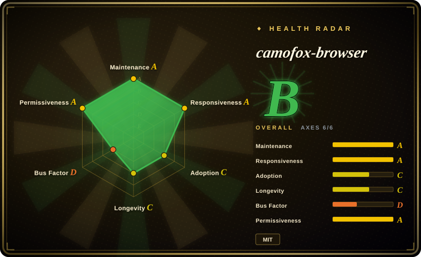
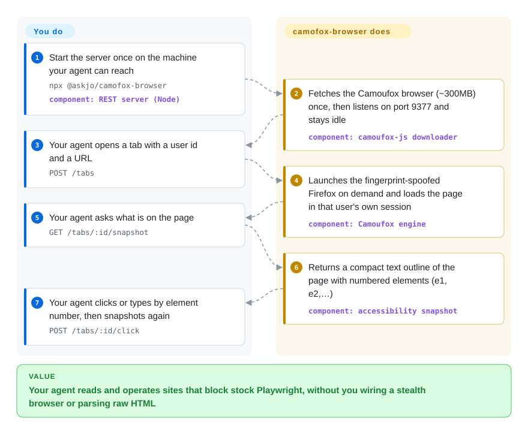

# camofox-browser

Your agent opens Google or a shop behind Cloudflare through an ordinary automated browser and gets a "verify you are human" page instead of the content, so the task ends before it starts. camofox-browser is a small server you run next to the agent that keeps a disguised Firefox (Camoufox) behind a handful of HTTP calls: open a tab, get a short text outline of the page with numbered elements, click by number.

## When to use

You run an always-on agent — an OpenClaw assistant, a chat bot that serves several people, a research agent on a small VPS — and it must read and operate the public web on their behalf. With a stock headless browser the first Google query comes back as `Our systems have detected unusual traffic from your computer network`, and a Cloudflare-fronted site answers `Just a moment...` forever. You reach for camofox-browser when you want that problem solved as **a long-running service with an HTTP API**, not as a library you script: one Node process holds one Camoufox instance, gives each `userId` its own cookie jar, hands the model a compact accessibility outline instead of raw HTML, and shuts the browser down when nobody is using it.

The deciding tradeoff against its neighbours: [invisible_playwright_mcp](invisible-playwright-mcp.md) is the same idea (a C++-patched Firefox for an assistant) but is an MCP process spawned per assistant session with one page per browser and no macOS build; camofox-browser is a shared server with multi-user sessions, tab groups, cookie import, session persistence and proxy rotation, reachable over REST, an OpenClaw plugin, or a thin MCP adapter. [PinchTab](pinchtab.md) is the comparable resident server on real Chrome, with default-deny capability gates but no fingerprint spoofing in the engine. [Camoufox](../browser-driver-frameworks/camoufox.md) itself is the engine underneath — choose it directly when your own code, not an agent, drives the browser. In the same anti-detection space, `greekr4/playwright-bot-bypass` takes the opposite route: a real headed Chrome tuned through an agent skill rather than a patched Firefox behind a server.

## How it works

Think of it as a hotel front desk for one browser: the agent never touches the browser itself, it asks the desk for a room (a tab), a description of what is in the room, and for a specific numbered switch to be pressed. The server is an Express app (Express is a common Node web framework) that drives Camoufox — a Firefox build whose fingerprint, meaning the hardware and software details a site reads to tell browsers apart, is altered inside the browser's own C++ code rather than by injected JavaScript. Each `userId` gets a separate browser context (an isolated set of cookies and storage inside the same browser process), and each `sessionKey` groups that user's tabs by conversation. A snapshot is the page's accessibility tree — the outline browsers build for screen readers — flattened to text, with every clickable element tagged `e1`, `e2`, and so on; the agent acts by sending those refs back. What the project does for you: downloading and launching the engine, fingerprint and proxy-matched locale/timezone, session isolation and on-disk persistence of logins, tab recycling, and snapshot truncation for huge pages. What stays yours: the model and the loop that decides what to click, a proxy if your server's IP is the tell, setting the access keys before the port is reachable by anyone else, and the judgement about whether a site's terms allow this. The same REST routes are also wrapped as 11 tools for OpenClaw (`openclaw plugins install @askjo/camofox-browser`) and for MCP hosts through a stdio adapter (`camofox-browser-mcp`) that only translates tool calls into HTTP — the REST server still has to be running.

<!-- flow-steps:begin (generated from flows/camofox-browser.json by tools/flow_card.py — do not edit) -->

Text version of the flow

1. **You**: Start the server once on the machine your agent can reach — `npx @askjo/camofox-browser` — component: `REST server (Node)`
2. **camofox-browser**: Fetches the Camoufox browser (~300MB) once, then listens on port 9377 and stays idle — component: `camoufox-js downloader`
3. **You**: Your agent opens a tab with a user id and a URL — `POST /tabs`
4. **camofox-browser**: Launches the fingerprint-spoofed Firefox on demand and loads the page in that user's own session — component: `Camoufox engine`
5. **You**: Your agent asks what is on the page — `GET /tabs/:id/snapshot`
6. **camofox-browser**: Returns a compact text outline of the page with numbered elements (e1, e2, …) — component: `accessibility snapshot`
7. **You**: Your agent clicks or types by element number, then snapshots again — `POST /tabs/:id/click`

**Value**: Your agent reads and operates sites that block stock Playwright, without you wiring a stealth browser or parsing raw HTML

<!-- flow-steps:end -->

## When NOT to use

- **The site does not fight bots.** For your own app, an intranet or ordinary pages, a 300 MB custom Firefox plus a resident server buys nothing. Use [Playwright MCP](../playwright-family/playwright-mcp.md) (Microsoft-backed, three engines) or [Agent Browser](agent-browser.md) instead.
- **You want to write Playwright or Puppeteer code.** The repository description says "drop-in Puppeteer/Playwright replacement", but the documented surfaces are REST routes, OpenClaw tools and MCP tools — there is no Playwright-compatible client API to import. For scripted scraping use [Camoufox](../browser-driver-frameworks/camoufox.md) directly (it exposes Playwright's API), or [nodriver](../browser-driver-frameworks/nodriver.md) for an undetected Chromium.
- **You need Chrome, CDP, or DevTools data.** The engine is Firefox only; video recording is unavailable (the README offers Playwright traces instead because `recordVideo` is Chromium-only). For traces, network and heap inspection use [Chrome DevTools MCP](chrome-devtools-mcp.md).
- **The port will be reachable by anything you do not trust and you have not set keys.** With `CAMOFOX_BIND_HOST` unset the server listens on all interfaces, and with `CAMOFOX_ACCESS_KEY` unset the global gate is a pass-through — tab, navigate and `evaluate` (run JavaScript in the page) routes are then open to any caller, in sessions that may hold imported login cookies. If you want capability gates that are closed by default, use [PinchTab](pinchtab.md); otherwise set `CAMOFOX_ACCESS_KEY` and bind to `127.0.0.1` before anything else.
- **Zero unsolicited egress is a hard rule.** Crash, hang and repeated-failure telemetry is on by default and posts to a vendor-run Cloudflare Worker that files **public** GitHub issues; well-known domains (about 120, including Google, Amazon, Reddit) are reported verbatim, others as a hash. It is documented and one env var turns it off (`CAMOFOX_CRASH_REPORT_ENABLED=false`), but if opt-out is not acceptable, use [Playwright MCP](../playwright-family/playwright-mcp.md) or Camoufox as a library.
- **You need memory to stay flat for days.** The project's own telemetry files near-daily `leak:native-memory` issues reporting growth of roughly 200 MB to 1.3 GB per process (dozens open on 2026-10-08). The "~40 MB when idle" figure applies after idle shutdown has killed the browser, not while it runs. Plan a memory limit and restarts, or pick a per-task browser such as [Agent Browser](agent-browser.md).
- **You want the agent to use your own logged-in browser.** camofox-browser runs a separate browser and you copy logins in (Netscape cookie files, or a noVNC login). To borrow the Chrome you already use, pick [BrowserSkill](browserskill.md), [OpenCLI](opencli.md) or [Browser Harness](browser-harness.md).
- **Hardened container policy (non-root, read-only).** The Dockerfile sets no non-root user, and an open issue reports that switching user makes it re-download the browser and fail to start (#10989, 2026-09-20, unanswered as of 2026-10-08). No in-index stealth alternative solves this either; run the engine yourself via [Camoufox](../browser-driver-frameworks/camoufox.md) in an image you control.
- **Windows is your production host.** An open report describes Camoufox exiting immediately under Playwright's pipe transport on Windows (#9547, 2026-08-25). Use Docker/WSL2, or [invisible_playwright_mcp](invisible-playwright-mcp.md), which ships a Windows build.
- **Evasion is something you must defend legally.** Bypassing bot protection can breach a site's terms; the README does not address this. That exposure is yours whichever tool you choose.

## Comparison

| Alternative | In index | Our verdict | Tradeoff |
|---|---|---|---|
| [invisible_playwright_mcp](invisible-playwright-mcp.md) | ✅ | For one person's coding assistant on Windows/Linux that needs a stealth browser as plain MCP tools, pick invisible_playwright_mcp; for a shared, always-on server with per-user sessions, tabs, cookie import and macOS support, pick camofox-browser. | Both drive a C++-patched Firefox. invisible_playwright_mcp needs no resident server and builds its own engine but is one page per browser and single-maintainer; camofox-browser adds multi-tenancy and a REST surface, and inherits its stealth entirely from upstream Camoufox. |
| [PinchTab](pinchtab.md) | ✅ | When the blocker is safety of an agent-reachable browser service (capability gates, injection scanning) on real Chrome, pick PinchTab; when the blocker is being served a captcha, pick camofox-browser. | PinchTab is a Go binary with default-deny gates and multi-instance Chrome but relies on Chrome-level stealth; camofox-browser spoofs fingerprints in the engine but ships open-by-default routes and default-on telemetry. |
| [Playwright MCP](../playwright-family/playwright-mcp.md) | ✅ | For any site that does not block automation, pick Playwright MCP; reach for camofox-browser only when detection is the failure. | Microsoft backing, Chromium/Firefox/WebKit and no resident server, but a stock browser that anti-bot services flag; camofox-browser trades that backing for a patched engine it does not itself maintain. |
| [Agent Browser](agent-browser.md) | ✅ | When an agent with a shell should drive real Chrome per task with the same snapshot-and-ref interaction model, pick Agent Browser; pick camofox-browser when requests arrive over HTTP from a multi-user agent and must pass bot checks. | Agent Browser is a CLI over CDP with no server to secure and no fingerprint spoofing; camofox-browser is a long-lived service with session isolation and proxy/GeoIP handling, at the cost of memory growth and an exposed port to manage. |
| [Camoufox](../browser-driver-frameworks/camoufox.md) | ✅ | When your own Python or Node code scripts the browser through Playwright's API, use Camoufox directly; use camofox-browser when the caller is an agent that needs HTTP/MCP tools and token-cheap snapshots. | Camoufox is the engine (MPL-2.0, created 2024-07, ~12.4k stars) and the only place fingerprint fixes land; camofox-browser is a wrapper pinned several engine releases behind it. |

## Tech stack

- **Language/runtime:** JavaScript (ES modules) on Node.js ≥22; the OpenClaw plugin source is TypeScript; `server.js` is a single ~7,300-line file with helpers in `lib/`.
- **HTTP:** Express 5; OpenAPI spec generated from JSDoc by `swagger-jsdoc` and served at `/openapi.json` and `/docs`; optional Prometheus metrics via `prom-client`.
- **Browser:** `camoufox-js` 0.11.5 (launcher/downloader) driving Camoufox through `playwright-core` ^1.58; the bundled engine is pinned to Camoufox `152.0.4-beta.30` in `lib/camoufox-download.js` (the Dockerfile pins `beta.28`).
- **Storage:** `better-sqlite3` (native module) plus per-user JSON `storage_state` files written by the persistence plugin.
- **Agent surfaces:** REST; OpenClaw plugin (`plugin.ts`); a standalone MCP stdio adapter (`@askjo/camofox-browser-mcp`) built on `@modelcontextprotocol/sdk`, sharing one tool-contract module with the plugin.
- **Plugins:** `youtube` (transcripts through yt-dlp), `persistence`, `vnc` (noVNC login), loaded per `camofox.config.json`.
- **Telemetry endpoint:** a Cloudflare Worker whose source is in `workers/crash-reporter/`.

## Dependencies

- **Node.js ≥22** and npm; a C/C++ toolchain if `better-sqlite3` has no prebuilt binary for your platform (the Dockerfile installs `build-essential` for exactly this).
- **The Camoufox binary, ~300 MB**, fetched from GitHub releases by the postinstall script (or supplied through `CAMOUFOX_EXECUTABLE`), plus a GeoIP database and the default uBlock Origin add-on download.
- **On Linux servers:** GTK/X11/Mesa libraries and Xvfb (listed in the Dockerfile); the image is based on `node:22-trixie-slim` because the arm64 SQLite prebuild needs glibc 2.38.
- **An agent or client** that speaks HTTP, OpenClaw or MCP — no model is included.
- **Optional:** a residential or backconnect proxy (the README names Decodo, Bright Data, Oxylabs) — in practice the usual requirement for datacenter IPs; `yt-dlp` for the transcript endpoint; x11vnc/noVNC for interactive login.
- **Outbound network:** target sites, GitHub (engine download), addons.mozilla.org (add-on), and the telemetry Worker unless disabled.

## Ops difficulty

**Low to start, medium to run for other people.** `npx @askjo/camofox-browser` or `make up` gets a working server, and a Railway config plus a build-time-download `Dockerfile.ci` are included. The work begins when it is shared: you must set `CAMOFOX_ACCESS_KEY` (all routes), `CAMOFOX_API_KEY` (cookie import) and `CAMOFOX_ADMIN_KEY` (`/stop`) and decide the bind address, because the defaults are open; cap memory and expect restarts given the leak reports; and source and pay for proxies. `docker build` on its own fails by design — binaries are bind-mounted from `dist/`, so you go through `make` or `Dockerfile.ci`. Releases land roughly weekly (v1.14.0 on 2026-08-19 to v1.18.1 on 2026-10-05), and the engine pin file records builds that broke a property check or viewport tests, so upgrades are frequent and not purely mechanical. Detection is an arms race: a site that passes today can challenge tomorrow, and the fix then has to come from Camoufox first. Imported cookie files and persisted sessions sit in a local directory on the server host and are as good as logged-in credentials: keep that directory off shared volumes and out of images, and restrict who can read it.

## Health & viability

- **Maintenance — very active.** 24 tagged releases from v1.1.0 (2026-02-12) to v1.18.1 (2026-10-05); last default-branch commit 2026-10-05; a nightly workflow mirrors each upstream Camoufox release into this repo's releases as an availability backup (GitHub API, 2026-10-08).
- **Governance / bus factor — a company in name, one engineer in practice.** Owned by the `jo-inc` organization (Jo, a personal-agent startup; org created 2025-08), but `skyfallsin` — the co-founder — authored 490 of the ~544 commits GitHub attributes to the top 15 contributors and 83 of the last 100 (the radar's 12-month top-1 commit share is 0.813 across 54 authors); CODEOWNERS and FUNDING name only him. The roadmap follows Jo's own product needs. `[推断]`
- **Age & Lindy — young.** Created 2026-01-26, so about eight months old; the star count grew faster than the project has had time to prove itself, and the README carries a warning about unrelated crypto tokens using its name. Lindy gives little prior; treat the stars as attention, not track record.
- **Adoption — real installs, concentrated in one ecosystem.** ~11.5k stars and ~1.1k forks; `@askjo/camofox-browser` had 125,236 npm downloads in the last month (registry figure read by the health scorer, 2026-10-08). Much of that is plausibly OpenClaw plugin installs rather than independent deployments. `[推断]`
- **Structural dependency.** All anti-detection value comes from Camoufox, a separate project whose releases are still labelled beta (v156.0.1-beta.36 on 2026-10-06) while this wrapper ships 152.0.4-beta.30; a comment in the pin file records that newer builds broke a property check and an older one broke viewport tests. If Camoufox stalls, this project has no engine of its own.
- **Risk flags.** Default-on telemetry that publishes issues to a public tracker; open-by-default routes on all interfaces; a tracker past issue #12,800 that is almost entirely bot-filed, where the 14 open human-written issues mostly have no maintainer reply; recurring native-memory-leak reports; and documentation drift (see Caveats). No relicensing was found: `LICENSE` is MIT (copyright 2025 Jo, Inc).

## Caveats (unverified)

- [未验证] "Bypasses Google, Cloudflare, and most bot detection" is the README's claim; not reproduced here — it needs live runs against protected targets, and the result varies by site, IP reputation and date.
- [未验证] "Accessibility snapshots are ~90% smaller than raw HTML" and "~40MB when idle" are author-reported figures; no benchmark or measurement script was found in the repo, and none was run here.
- [未验证] The README's Security Model says the engine is downloaded from `github.com/nicedayzhu/camoufox/releases`; that repository returned 404 from the GitHub API on 2026-10-08, while the Dockerfile and Makefile download from `daijro/camoufox`. Which host `camoufox-js` 0.11.5 actually contacts was not traced (its package source was not read).
- [未验证] Session lifetime is documented two ways: the README's Architecture section says sessions expire after 30 minutes, its environment table and `lib/config.js` say 10 minutes (`SESSION_TIMEOUT_MS` default 600000). The code value is the one confirmed.
- [推断] The bus-factor judgement rests on GitHub contributor counts (490 commits by `skyfallsin`, next contributors at 10) and the last 100 commits; who else at Jo Inc could take over was not established.
- [推断] That npm downloads are dominated by OpenClaw plugin installs is inferred from the package's `openclaw` manifest and install instructions; npm does not break downloads down by consumer.
- [推断] The memory-leak concern is drawn from the titles of auto-filed `leak:native-memory` issues (growth of ~200 MB–1.3 GB); the reports were not correlated with versions or workloads, some show negative baselines that suggest measurement noise, and no leak was reproduced here.
- [未验证] The Windows crash (#9547) and the non-root container failure (#10989) are single user reports without maintainer confirmation; neither was reproduced.
- [未验证] Telemetry anonymization (HMAC-hashed private domains, stripped paths) is described in the README and implemented in `lib/reporter.js`; the code was skimmed, not audited, and the deployed Worker was not compared against the repo with the documented `/source` check.
- [未验证] Star, fork and download counts (11,475 stars, 1,146 forks, 125,236 npm downloads in the last month) are as of 2026-10-08 and move quickly; a direct npm API query for 2026-09-05 to 2026-10-04 returned 121,006, so the figure depends on the window.
- [推断] Positioning against invisible_playwright_mcp, PinchTab, Agent Browser and Camoufox is based on each project's documentation and index page, not a head-to-head detection benchmark.
