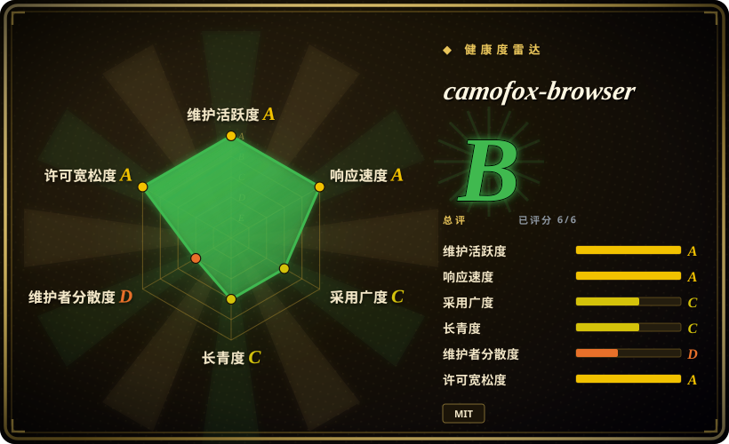
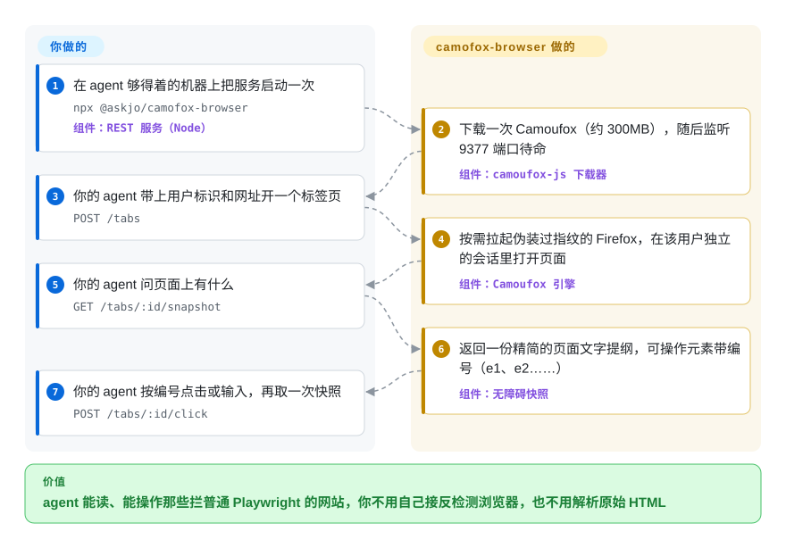

# camofox-browser

你的 agent 用普通的自动化浏览器去开 Google 或者挂着 Cloudflare 的店铺，拿回来的不是内容，而是一页“请证明你是人类”，任务还没开始就结束了。camofox-browser 是一个跑在 agent 旁边的小服务，把一只伪装过的 Firefox（Camoufox）藏在几个 HTTP 接口后面：开一个标签页，拿到一份带编号元素的页面文字提纲，按编号点击。

## 何时使用

你在跑一个常驻的 agent——OpenClaw 助手、同时服务好几个人的聊天机器人、放在小 VPS 上的调研 agent——它要替这些人读网页、操作网页。换成普通无头浏览器，第一条 Google 查询就返回 `Our systems have detected unusual traffic from your computer network`，挂着 Cloudflare 的站点则永远停在 `Just a moment...`。当你希望把这个问题交给**一个带 HTTP API 的长驻服务**、而不是自己写脚本去调一个库时，就该想到 camofox-browser：一个 Node 进程管一只 Camoufox，每个 `userId` 有自己的 cookie 罐，给模型的是精简的无障碍提纲而不是原始 HTML，没人用的时候自己把浏览器关掉。

和邻居相比，决定性的取舍是这样的：[invisible_playwright_mcp](invisible-playwright-mcp.zh.md) 思路相同（给助手一只 C++ 层打过补丁的 Firefox），但它是每个助手会话各起一个的 MCP 进程，一个浏览器只有一个页面，也没有 macOS 版本；camofox-browser 是共享服务，有多用户会话、标签分组、cookie 导入、会话持久化和代理轮换，可以走 REST、OpenClaw 插件或一个很薄的 MCP 适配器。[PinchTab](pinchtab.zh.md) 是同类的常驻服务，跑在真实 Chrome 上，能力闸门默认全关，但引擎层不做指纹伪装。[Camoufox](../browser-driver-frameworks/camoufox.zh.md) 本身是底下的引擎——如果驱动浏览器的是你自己的代码而不是 agent，直接用它。同在反检测这块，`greekr4/playwright-bot-bypass` 走的是相反路线：用一个调校过的真实有头 Chrome 加 agent skill，而不是把打过补丁的 Firefox 放在服务后面。

## 怎么用起来

可以把它想成一只浏览器的酒店前台：agent 从不直接碰浏览器，只向前台要一个房间（标签页）、要一份房间里有什么的描述、再请前台按下某个编了号的开关。这个服务是一个 Express 应用（Express 是常见的 Node 网页框架），驱动的是 Camoufox——一个 Firefox 构建版，它的指纹（网站用来区分不同浏览器的那些软硬件细节）是在浏览器自己的 C++ 代码里改掉的，而不是靠注入 JavaScript。每个 `userId` 对应一个独立的浏览器上下文（同一浏览器进程里一套隔离的 cookie 和存储），每个 `sessionKey` 再把这个用户的标签页按对话分组。快照是页面的无障碍树——浏览器为读屏软件准备的那份提纲——压平成文字，每个可点击元素标上 `e1`、`e2` 这样的编号，agent 把编号传回来就能操作。项目替你做的：下载并拉起引擎、指纹以及跟代理出口一致的语言和时区、会话隔离、把登录态落盘、标签页回收、超大页面的快照截断分页。仍然归你的：模型和决定点哪里的循环、当服务器 IP 本身就是破绽时的代理、在端口对别人可达之前先把访问密钥设好，以及目标站点的条款到底允不允许这样做的判断。同一套 REST 路由还包成了 11 个工具，分别给 OpenClaw（`openclaw plugins install @askjo/camofox-browser`）和各种 MCP 宿主用；MCP 那边是一个 stdio 适配器（`camofox-browser-mcp`），只负责把工具调用翻译成 HTTP——REST 服务仍然得先跑着。

<!-- flow-steps:begin (generated from flows/camofox-browser.json by tools/flow_card.py — do not edit) -->

流程文字版

1. **你**：在 agent 够得着的机器上把服务启动一次 — `npx @askjo/camofox-browser` — 组件：`REST 服务（Node）`
2. **camofox-browser**：下载一次 Camoufox（约 300MB），随后监听 9377 端口待命 — 组件：`camoufox-js 下载器`
3. **你**：你的 agent 带上用户标识和网址开一个标签页 — `POST /tabs`
4. **camofox-browser**：按需拉起伪装过指纹的 Firefox，在该用户独立的会话里打开页面 — 组件：`Camoufox 引擎`
5. **你**：你的 agent 问页面上有什么 — `GET /tabs/:id/snapshot`
6. **camofox-browser**：返回一份精简的页面文字提纲，可操作元素带编号（e1、e2……） — 组件：`无障碍快照`
7. **你**：你的 agent 按编号点击或输入，再取一次快照 — `POST /tabs/:id/click`

**价值**：agent 能读、能操作那些拦普通 Playwright 的网站，你不用自己接反检测浏览器，也不用解析原始 HTML

<!-- flow-steps:end -->

## 何时不用

- **目标站点并不拦机器人。** 自己的应用、内网或普通页面，为它背一个 300 MB 的定制 Firefox 再加一个常驻服务毫无收益。改用 [Playwright MCP](../playwright-family/playwright-mcp.zh.md)（微软背书、三种引擎）或 [Agent Browser](agent-browser.zh.md)。
- **你想写的是 Playwright 或 Puppeteer 代码。** 仓库简介写着“drop-in Puppeteer/Playwright replacement”，但文档里的接口只有 REST 路由、OpenClaw 工具和 MCP 工具——没有可以 import 的 Playwright 兼容客户端。写脚本抓取请直接用 [Camoufox](../browser-driver-frameworks/camoufox.zh.md)（它暴露 Playwright 的 API），要不被检测的 Chromium 则用 [nodriver](../browser-driver-frameworks/nodriver.zh.md)。
- **你需要 Chrome、CDP 或 DevTools 数据。** 引擎只有 Firefox；录屏不可用（README 说 `recordVideo` 只支持 Chromium，所以改提供 Playwright trace）。要 trace、网络和堆内存检查，用 [Chrome DevTools MCP](chrome-devtools-mcp.zh.md)。
- **端口会被你不信任的东西访问到，而你还没设密钥。** 不设 `CAMOFOX_BIND_HOST` 时服务监听所有网卡，不设 `CAMOFOX_ACCESS_KEY` 时全局闸门直接放行——开标签、导航、`evaluate`（在页面里执行 JavaScript）这些路由对任何调用方敞开，而会话里可能正带着导入的登录态。想要默认全关的能力闸门，用 [PinchTab](pinchtab.zh.md)；否则第一件事就是设好 `CAMOFOX_ACCESS_KEY` 并绑定到 `127.0.0.1`。
- **“不许有任何未经请求的外发流量”是硬规定。** 崩溃、卡死和连续失败的遥测默认开启，发往厂商运营的 Cloudflare Worker，由它在 GitHub 上建**公开** issue；约 120 个知名域名（Google、Amazon、Reddit 等）原样上报，其余域名上报哈希。这些都写在文档里，一个环境变量就能关（`CAMOFOX_CRASH_REPORT_ENABLED=false`），但如果“默认开、自己去关”不可接受，改用 [Playwright MCP](../playwright-family/playwright-mcp.zh.md)，或把 Camoufox 当库用。
- **你需要内存连续多天保持平稳。** 项目自己的遥测几乎每天都在建 `leak:native-memory` issue，报告单进程内存增长约 200 MB 到 1.3 GB（2026-10-08 时有几十条未关闭）。“空闲约 40 MB”说的是空闲关停把浏览器杀掉之后，不是浏览器运行期间。请预设内存上限和重启策略，或者选按任务起停的浏览器，比如 [Agent Browser](agent-browser.zh.md)。
- **你想让 agent 用你本人已登录的浏览器。** camofox-browser 跑的是另一只浏览器，登录态要你搬进去（导入 Netscape 格式的 cookie 文件，或通过 noVNC 登录）。要借用你正在用的 Chrome，选 [BrowserSkill](browserskill.zh.md)、[OpenCLI](opencli.zh.md) 或 [Browser Harness](browser-harness.zh.md)。
- **容器策略要求加固（非 root、只读）。** Dockerfile 没有设置非 root 用户，并且有一条未关闭的 issue 报告：换用户后它会重新下载浏览器并启动失败（#10989，2026-09-20，截至 2026-10-08 无人回复）。索引内的反检测替代品也没解决这一点；请在自己掌控的镜像里直接跑 [Camoufox](../browser-driver-frameworks/camoufox.zh.md) 引擎。
- **生产主机是 Windows。** 有一条未关闭的报告称 Camoufox 在 Windows 上经 Playwright 的管道传输启动后立即退出（#9547，2026-08-25）。改走 Docker/WSL2，或用提供 Windows 构建的 [invisible_playwright_mcp](invisible-playwright-mcp.zh.md)。
- **“绕过检测”这件事本身需要你在法律上站得住。** 绕过机器人防护可能违反站点条款；README 没有谈这一点。无论选哪个工具，这份风险都在你身上。

## 横向对比

| 替代品 | 是否收录 | 我们的评价 | 取舍 |
|---|---|---|---|
| [invisible_playwright_mcp](invisible-playwright-mcp.zh.md) | ✅ | 如果是一个人在 Windows/Linux 上给编码助手配一只反检测浏览器、只要普通的 MCP 工具，选 invisible_playwright_mcp；如果要一个共享、常驻、带按用户隔离的会话、多标签、cookie 导入并且支持 macOS 的服务，选 camofox-browser。 | 两者都驱动 C++ 层打过补丁的 Firefox。invisible_playwright_mcp 不需要常驻服务、引擎自己构建，但一个浏览器只有一个页面、单人维护；camofox-browser 多了多租户和 REST 接口，反检测能力则完全继承自上游 Camoufox。 |
| [PinchTab](pinchtab.zh.md) | ✅ | 卡点是“agent 够得着的浏览器服务是否安全”（能力闸门、注入扫描）且用真实 Chrome 即可时，选 PinchTab；卡点是“被弹验证码”时，选 camofox-browser。 | PinchTab 是一个 Go 二进制，闸门默认全关、可管多个 Chrome 实例，但反检测只停在 Chrome 层面；camofox-browser 在引擎里伪装指纹，代价是路由默认敞开、遥测默认开启。 |
| [Playwright MCP](../playwright-family/playwright-mcp.zh.md) | ✅ | 只要目标站点不拦自动化，就选 Playwright MCP；只有当“被检测出来”才是失败原因时才用 camofox-browser。 | 微软背书、Chromium/Firefox/WebKit 三引擎、没有常驻服务，但浏览器是原装的，会被反爬服务标记；camofox-browser 放弃这份背书，换来一个它自己并不维护的补丁引擎。 |
| [Agent Browser](agent-browser.zh.md) | ✅ | 如果 agent 有 shell，按任务驱动真实 Chrome，并且同样用“快照加元素编号”的交互方式，选 Agent Browser；如果请求来自多用户 agent、走 HTTP，而且必须过机器人检测，选 camofox-browser。 | Agent Browser 是 CDP 之上的 CLI，没有需要设防的服务，也不伪装指纹；camofox-browser 是长驻服务，带会话隔离和代理/GeoIP 处理，代价是内存增长和一个需要管好的对外端口。 |
| [Camoufox](../browser-driver-frameworks/camoufox.zh.md) | ✅ | 如果是你自己的 Python 或 Node 代码通过 Playwright API 写脚本驱动浏览器，直接用 Camoufox；如果调用方是需要 HTTP/MCP 工具和省 token 快照的 agent，用 camofox-browser。 | Camoufox 是引擎本体（MPL-2.0，2024-07 创建，约 12.4k stars），指纹修复只会落在那里；camofox-browser 是包装层，钉住的引擎版本比上游落后好几个发布。 |

## 技术栈

- **语言/运行时：** JavaScript（ES modules），Node.js ≥22；OpenClaw 插件源码是 TypeScript；`server.js` 是一个约 7,300 行的单文件，辅助模块在 `lib/`。
- **HTTP：** Express 5；OpenAPI 规范由 `swagger-jsdoc` 从 JSDoc 生成，在 `/openapi.json` 和 `/docs` 提供；可选的 Prometheus 指标走 `prom-client`。
- **浏览器：** `camoufox-js` 0.11.5（启动器/下载器）经 `playwright-core` ^1.58 驱动 Camoufox；随包引擎在 `lib/camoufox-download.js` 里钉在 Camoufox `152.0.4-beta.30`（Dockerfile 钉的是 `beta.28`）。
- **存储：** `better-sqlite3`（原生模块），以及持久化插件按用户写出的 JSON `storage_state` 文件。
- **面向 agent 的接口：** REST；OpenClaw 插件（`plugin.ts`）；独立的 MCP stdio 适配器（`@askjo/camofox-browser-mcp`），基于 `@modelcontextprotocol/sdk`，与插件共用同一个工具契约模块。
- **插件：** `youtube`（经 yt-dlp 取字幕）、`persistence`、`vnc`（noVNC 登录），按 `camofox.config.json` 加载。
- **遥测端点：** 一个 Cloudflare Worker，源码在 `workers/crash-reporter/`。

## 依赖

- **Node.js ≥22** 和 npm；如果 `better-sqlite3` 没有适配你平台的预编译包，还需要 C/C++ 工具链（Dockerfile 正是为此安装 `build-essential`）。
- **Camoufox 二进制，约 300 MB**，由 postinstall 脚本从 GitHub releases 下载（或通过 `CAMOUFOX_EXECUTABLE` 自行提供），另外还会下载 GeoIP 数据库和默认的 uBlock Origin 扩展。
- **Linux 服务器上：** GTK/X11/Mesa 库和 Xvfb（列在 Dockerfile 里）；镜像基于 `node:22-trixie-slim`，因为 arm64 的 SQLite 预编译包需要 glibc 2.38。
- **一个 agent 或客户端**，会说 HTTP、OpenClaw 或 MCP——项目不带模型。
- **可选：** 住宅代理或 backconnect 代理（README 点名 Decodo、Bright Data、Oxylabs）——对机房 IP 来说实际上往往是必需的；字幕接口用的 `yt-dlp`；交互式登录用的 x11vnc/noVNC。
- **外发网络：** 目标站点、GitHub（下载引擎）、addons.mozilla.org（扩展），以及未关闭时的遥测 Worker。

## 运维难度

**起步低，给别人用时中等。** `npx @askjo/camofox-browser` 或 `make up` 就能得到一个可用的服务，仓库还带了 Railway 配置和一个在构建时下载二进制的 `Dockerfile.ci`。真正的工作从“共享”开始：因为默认是敞开的，你得设好 `CAMOFOX_ACCESS_KEY`（所有路由）、`CAMOFOX_API_KEY`（cookie 导入）和 `CAMOFOX_ADMIN_KEY`（`/stop`），并决定绑定地址；考虑到那些内存泄漏报告，要限制内存并预期重启；代理要自己找、自己付费。单独执行 `docker build` 按设计就会失败——二进制是从 `dist/` 绑定挂载进去的，所以要走 `make` 或 `Dockerfile.ci`。发布大约每周一次（2026-08-19 的 v1.14.0 到 2026-10-05 的 v1.18.1），引擎钉版文件里还记着哪些构建弄坏了属性检查或视口测试，所以升级频繁，而且不是纯机械操作。检测是军备竞赛：今天能过的站点明天可能就开始拦，而修复得先等 Camoufox。

## 健康度与可持续性

- **维护——非常活跃。** 从 v1.1.0（2026-02-12）到 v1.18.1（2026-10-05）共 24 个带标签的发布；默认分支最近一次提交在 2026-10-05；有一个夜间工作流把上游 Camoufox 的每个发布镜像到本仓库的 releases 里，作为可用性备份（GitHub API，2026-10-08）。
- **治理与 bus factor——名义上是公司，实际上是一位工程师。** 仓库归 `jo-inc` 组织所有（Jo 是一家做个人 agent 的创业公司，组织创建于 2025-08），但联合创始人 `skyfallsin` 一人写了 GitHub 归给前 15 位贡献者的约 544 次提交中的 490 次、最近 100 次提交中的 83 次（雷达算出的 12 个月头号提交者占比为 0.813，作者共 54 人）；CODEOWNERS 和 FUNDING 里也只有他。路线图跟着 Jo 自家产品的需要走。`[推断]`
- **年龄与 Lindy——年轻。** 2026-01-26 创建，到现在约八个月；星数涨得比项目证明自己的时间快，README 里还挂着一条警告，说有无关的加密货币在冒用它的名字。Lindy 给不了多少先验；把星数看作关注度，而不是履历。
- **采用——安装量是真的，但集中在一个生态里。** 约 11.5k stars、约 1.1k forks；`@askjo/camofox-browser` 最近一个月有 125,236 次 npm 下载（健康度评分器读到的 registry 数字，2026-10-08）。其中很大一部分可能是 OpenClaw 插件安装，而不是独立部署。`[推断]`
- **结构性依赖。** 全部反检测价值来自 Camoufox，那是另一个项目，发布至今仍标着 beta（2026-10-06 的 v156.0.1-beta.36），而这个包装层带的是 152.0.4-beta.30；钉版文件里的注释写明，更新的构建弄坏了一项属性检查，更旧的一个弄坏了视口测试。Camoufox 一旦停摆，本项目没有自己的引擎。
- **风险信号。** 遥测默认开启并把 issue 发到公开的跟踪器；路由默认敞开、监听所有网卡；issue 编号已过 #12,800，几乎全是机器人建的，其中 14 条未关闭的人工 issue 大多没有维护者回复；反复出现的原生内存泄漏报告；以及文档漂移（见存疑）。没有发现改过许可证：`LICENSE` 是 MIT（版权 2025 Jo, Inc）。

## 存疑（未验证）

- [未验证] “能绕过 Google、Cloudflare 和大多数机器人检测”是 README 的说法；这里没有复现——需要对受保护的目标做实测，而且结果随站点、IP 信誉和日期变化。
- [未验证] “无障碍快照比原始 HTML 小约 90%”和“空闲约 40MB”是作者自报的数字；仓库里没找到基准或测量脚本，这里也没有实测。
- [未验证] README 的 Security Model 一节说引擎从 `github.com/nicedayzhu/camoufox/releases` 下载；2026-10-08 用 GitHub API 查这个仓库返回 404，而 Dockerfile 和 Makefile 是从 `daijro/camoufox` 下载。`camoufox-js` 0.11.5 实际连的是哪个主机没有追到底（没有读它的包源码）。
- [未验证] 会话存活时间在文档里有两种说法：README 的 Architecture 一节说 30 分钟不活动后过期，环境变量表和 `lib/config.js` 则是 10 分钟（`SESSION_TIMEOUT_MS` 默认 600000）。得到确认的是代码里的值。
- [推断] bus factor 的判断依据是 GitHub 的贡献者计数（`skyfallsin` 490 次提交，其后的贡献者为 10 次）和最近 100 次提交；Jo Inc 内部还有谁能接手并未查明。
- [推断] “npm 下载量主要来自 OpenClaw 插件安装”是根据包里的 `openclaw` 清单和安装说明推断的；npm 不按使用方拆分下载量。
- [推断] 内存泄漏方面的顾虑来自自动建立的 `leak:native-memory` issue 的标题（增长约 200 MB 到 1.3 GB）；没有把这些报告与版本或负载对应起来，其中一些的基线为负数，说明可能有测量噪声，这里也没有复现出泄漏。
- [未验证] Windows 崩溃（#9547）和非 root 容器启动失败（#10989）都只是单个用户的报告，没有维护者确认；两者都没有复现。
- [未验证] 遥测匿名化（私有域名做 HMAC 哈希、路径剥离）在 README 里有说明、在 `lib/reporter.js` 里有实现；代码只是略读，没有审计，也没有用文档里的 `/source` 校验去比对线上 Worker 与仓库代码。
- [未验证] 星数、fork 数和下载量（11,475 stars、1,146 forks、最近一个月 125,236 次 npm 下载）是 2026-10-08 的数字，变化很快；直接查 npm API 的 2026-09-05 到 2026-10-04 区间得到的是 121,006，所以这个数取决于统计窗口。
- [推断] 与 invisible_playwright_mcp、PinchTab、Agent Browser 和 Camoufox 的定位对比，依据的是各项目的文档和索引页，不是面对面的检测基准测试。
