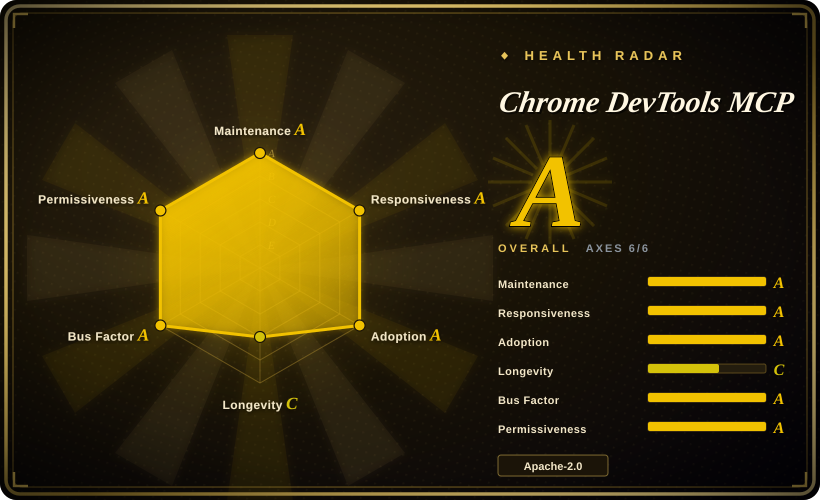
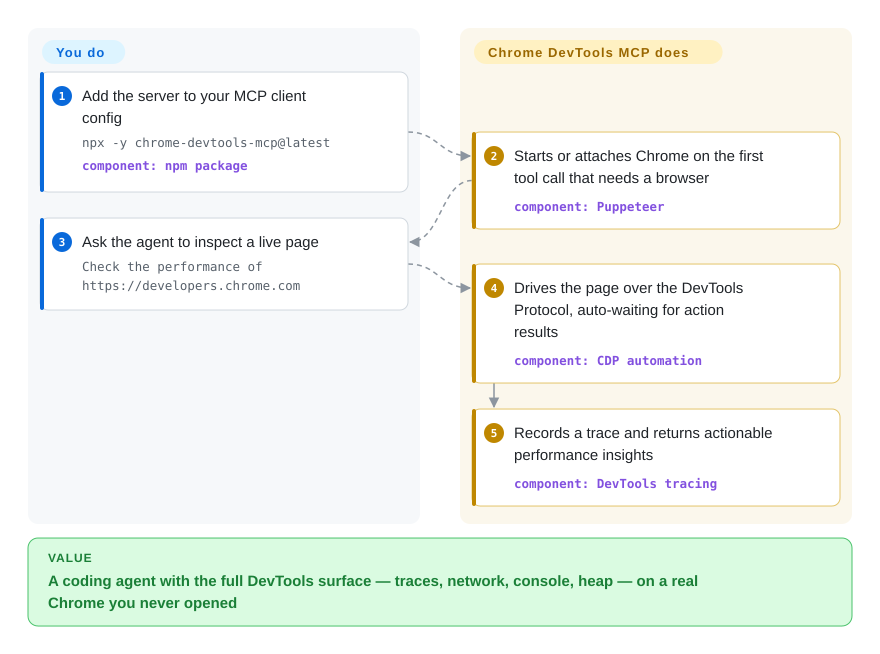

# Chrome DevTools MCP

Your coding agent can read the source but can't *see* the running page — no performance trace, no idea which request blocked render, no console error with a source-mapped stack. Chrome DevTools MCP hands that agent a real Chrome to drive and inspect through one MCP server, built on Puppeteer over the DevTools Protocol (CDP).

## When to use

You're a coding agent (or the engineer wiring one up) tasked with fixing a "the page feels slow and something's leaking memory" bug. Reading the source only gets you so far: you need to actually load the page in Chrome, record a performance trace, see the Core Web Vitals (LCP/INP/CLS), inspect which network requests blocked render, and read console errors with source-mapped stacks — the things a human would open DevTools for. Pure DOM-text automation can't measure any of that.

You add `chrome-devtools-mcp` to your MCP client config (`npx chrome-devtools-mcp@latest`), and now the agent can launch or attach to Chrome, navigate, click and fill forms, take a screenshot, run a Lighthouse audit, record a trace and get back actionable performance insights, and even take a heap snapshot to chase a leak — all through one MCP server that the major coding clients (Antigravity, Claude Code, Cursor, VS Code/Copilot, Gemini CLI, and more, each with a documented setup) already speak. Because it rides Puppeteer + CDP against real Chrome, it's a strong fit when your task is **debugging and measuring** a web app, not just clicking through it: front-end performance work, network/console triage, automated reproduction of UI bugs, and verifying a fix in an actual browser. If you only need basic browsing actions, the `--slim` flag exposes a reduced tool set.

## How it works

The server is a Node process your MCP client spawns over stdio. Inside it, Puppeteer drives a real Chrome over the Chrome DevTools Protocol (CDP — the debug protocol Chrome's own DevTools frontend speaks), and each DevTools capability becomes a named MCP tool: `navigate_page`, `click`, `evaluate_script`, `performance_start_trace`, `list_network_requests`, `get_console_message`, heap-snapshot analysis, and more (59 listed in the tool reference as of 2026-09, growing release-to-release). The browser is lazy — the server starts or attaches Chrome only when the client first calls a tool that needs it — and Puppeteer auto-waits for action results, so the agent doesn't poll for state. What the project does for you: the whole measure-and-act surface of DevTools, as tool calls. What stays yours: getting a Chrome reachable (locally, in a container, or via a remote debugging port / WebSocket), picking flags (`--headless`, `--isolated`, `--slim`), and setting the security/telemetry posture. Recent versions also ship an experimental CLI (`chrome-devtools`) that talks to a background daemon, so scripts and subagents can use the same engine without an MCP client.

<!-- flow-steps:begin (generated from flows/chrome-devtools-mcp.json by tools/flow_card.py — do not edit) -->

Text version of the flow

1. **You**: Add the server to your MCP client config — `npx -y chrome-devtools-mcp@latest` — component: `npm package`
2. **Chrome DevTools MCP**: Starts or attaches Chrome on the first tool call that needs a browser — component: `Puppeteer`
3. **You**: Ask the agent to inspect a live page — `Check the performance of https://developers.chrome.com`
4. **Chrome DevTools MCP**: Drives the page over the DevTools Protocol, auto-waiting for action results — component: `CDP automation`
5. **Chrome DevTools MCP**: Records a trace and returns actionable performance insights — component: `DevTools tracing`

**Value**: A coding agent with the full DevTools surface — traces, network, console, heap — on a real Chrome you never opened

<!-- flow-steps:end -->

## When NOT to use

- **You only need to fill forms / click through a UI in natural language.** A full DevTools/CDP server is heavy for that; an in-page DOM agent like [page-agent](page-agent.md) drops into the user's existing browser session with no separate Chrome process or backend.
- **You're not on Chrome.** It officially supports only Google Chrome and Chrome for Testing; other Chromium browsers "may have unexpected behaviour", and Firefox/WebKit are out of scope. For cross-browser automation use Playwright instead.
- **You can't run a real browser.** It needs a local (or remotely-debuggable) Chrome plus Node.js — not viable in a locked-down sandbox, a pure-serverless function, or anywhere you can't launch/attach to Chrome.
- **OS-level / multi-app desktop control.** It drives a browser, not the whole machine. For "operate a full computer/VM" use a computer-use agent or a sandbox like [Cua](../../desktop-automation/cua.md).
- **Untrusted pages with sensitive data.** The README warns it exposes all browser content (cookies, logged-in sessions, page contents) to the MCP client — and to the model. Don't point it at sites holding secrets you wouldn't paste into the agent.
- **You want zero telemetry by default.** Usage statistics are collected by Google unless you pass `--no-usage-statistics`, and performance flows may call the CrUX API unless disabled (`--no-performance-crux`).
- **Maturity.** v1.x but young and moving fast — v1.4.0 (2026-06-23) → v1.10.1 (2026-09-23), i.e. six minor releases in three months, with a large flag/tool surface that still shifts release-to-release; pin a version for reproducibility.

## Comparison

| Alternative | In index | Our verdict | Tradeoff |
|---|---|---|---|
| [page-agent](page-agent.md) | ✅ | Choose page-agent when you need an in-page JS GUI agent rather than DevTools access. | In-page JS GUI agent (DOM-as-text, no headless browser, no backend); great for NL form/workflow automation but **can't** record traces, inspect network at the CDP level, or take heap snapshots. |
| [Agent Browser](agent-browser.md) | ✅ | Choose Agent Browser when you need Vercel-labs browser automation for agents with CLI ergonomics. | Vercel-labs browser-automation for agents; overlapping "drive a browser for an agent" goal — different stack/ergonomics, less of a full DevTools-protocol surface. |
| [Cua](../../desktop-automation/cua.md) | ✅ | Choose Cua when the agent must also drive non-browser apps on a whole desktop. | Whole-desktop computer-use layer — drives any app and OS dialogs, structured state or pixels, with VM/cloud isolation optional; broader but heavier, and not DevTools-grade for web perf/network. |
| [Playwright](../playwright-family/playwright.md) (+ MCP) | ✅ | Choose Playwright when you need cross-browser deterministic automation for portable CI. | Cross-browser (Chromium/Firefox/WebKit), deterministic, code-or-MCP driven, headless-capable; the go-to for portable automation/CI. Chrome DevTools MCP trades breadth for Chrome-native DevTools depth (traces, Lighthouse, heap, CrUX). |
| [Puppeteer](../browser-driver-frameworks/puppeteer.md) | ✅ | Choose Puppeteer when you need the lower-level Chrome/CDP library this server builds on. | The lower-level Chrome/CDP automation library this server is built on; you write the script, no MCP/agent layer or curated performance-insight tools. |
| [browser-use](browser-use.md) | ✅ | Choose browser-use when you need a Python vision-capable autonomous browser agent. | Python, vision-capable autonomous browser agent; more "agent decides what to do" than "give the agent precise DevTools tools", and not DevTools-protocol-grade for perf/network inspection. |

## Tech stack

- **Language:** TypeScript; distributed as an npm package run via `npx chrome-devtools-mcp@latest`, with an experimental CLI (`chrome-devtools`) fronting a background daemon (Unix sockets / named pipes).
- **Browser control:** Puppeteer driving Google Chrome over the Chrome DevTools Protocol (CDP).
- **Protocol:** Model Context Protocol (MCP) server — stdio transport into MCP-capable clients.
- **Tool surface (59 in the tool reference, 2026-09; `--slim` exposes a reduced set):** input automation, navigation, emulation (device/viewport/network/color-scheme), performance tracing + insights, network inspection, debugging (screenshots, console, `evaluate_script`, Lighthouse), memory/heap-snapshot analysis (dominators/retainers/paths), Chrome-extension management, experimental third-party/WebMCP tool execution (WebMCP needs Chrome 150+ behind a feature flag), and Progressive Web App automation.
- **Connection modes:** auto-launch, auto-connect to a locally running Chrome (Chrome 144+), manual WebSocket with custom headers, or remote debugging-port forwarding.

## Dependencies

- **Node.js** (current LTS) + npm.
- **Google Chrome** (current stable or newer) or **Chrome for Testing** — must be installable/launchable, or a Chrome reachable on a remote debugging port.
- **An MCP client** to host it (Claude Code, Cursor, VS Code/Copilot, Gemini CLI, Cline, Windsurf, etc.).
- No database/service backend; state is the browser session it manages.

## Ops difficulty

**Low-to-medium.** The happy path is one JSON block in your MCP client config and `npx chrome-devtools-mcp@latest` pulling the package on first run — no infra to host. Cost rises with: getting a real Chrome available in headless/CI/container environments (the classic "Chrome won't launch in Docker" sandbox/`--no-sandbox` friction), the 30+ config flags and connection modes, and the security/telemetry posture you must consciously set (sandboxing untrusted pages, `--no-usage-statistics`, `--no-performance-crux`). Because each MCP client launches its own server process, there's no shared service to operate — but also no central place to govern access.

## Health & viability

- **Responsiveness**: Grade A — median first-response time 6.1 hours across 44 qualifying issues/PRs (scorer, 2026-09-28).
- **Maintenance — active, official, accelerating.** Latest default-branch commit 2026-09-25, repo pushed 2026-09-28, not archived; latest release v1.10.1 (2026-09-23), and the pace has increased — v1.4.0 → v1.10.1 is six minor releases in roughly three months (GitHub releases API, 2026-09-28). Released under the **ChromeDevTools (Google)** org, so maintenance is institutional rather than hobbyist — the strongest backing signal among the web-automation peers here.
- **Governance / backing — Google / Chrome DevTools team.** **Organization**-owned (`ChromeDevTools/chrome-devtools-mcp`), ~52.7k stars (GitHub API, 2026-09-28). Bus factor is low (a team inside Google, not one maintainer) — but note Google's mixed track record of sunsetting side projects, so "official" reduces, not eliminates, abandonment risk. `[推断]`
- **Age & Lindy — ~1 year old (created 2025-09-11).** Still too new for a strong Lindy prior on its own; the flag/tool surface moves release-to-release, so pin a version for reproducibility. The Lindy strength comes less from this repo's age than from the durability of its foundation (Chrome + CDP + Puppeteer).
- **Risk flags — telemetry-on-by-default + browser-content exposure.** Apache-2.0, no relicense observed. Google collects usage stats unless `--no-usage-statistics` (or `CHROME_DEVTOOLS_MCP_NO_USAGE_STATISTICS`/`CI` env); performance flows may call the CrUX API unless `--no-performance-crux`; the README warns it exposes all browser content (cookies/sessions/page contents) to the client and model — set the security/telemetry posture consciously.

## Caveats (unverified)

- [未验证] Star count ~52.7k as of 2026-09-28 (gh API); GitHub stars are unreliable and date-sensitive — treat as indicative only.
- [未验证] The "59 tools" count is a `grep` of `docs/tool-reference.md` on 2026-09-28 and the "many clients" claim reflects the current README's examples (Antigravity, Claude, Cursor, Copilot) — the tool/flag surface shifts release-to-release; verify a specific tool against the current docs before relying on it.
- [未验证] Exact runtime version floors (Node LTS, "Chrome current stable or newer", Chrome 144+ for auto-connect, Chrome 149+ for network blocking, Chrome 150+ for WebMCP) are as stated in the README/configuration docs on 2026-09-28 and may change.
- [推断] Positioning vs Agent Browser / Cua / browser-use is inferred from each project's framing, not a head-to-head benchmark; the relative tradeoffs (DevTools depth vs breadth) are judgment, not measured.
- [推断] The security warning ("exposes all browser content") is the README's own caution; the concrete blast radius depends on which client and model you connect and what session Chrome holds.
- [推断] "Institutional maintenance is the strongest backing signal among web-automation peers" compares org ownership qualitatively; no governance audit of the peers was performed.
