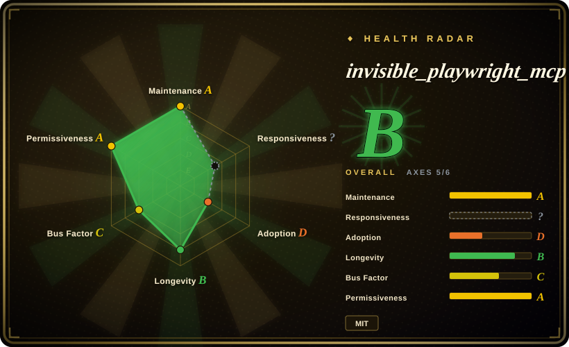
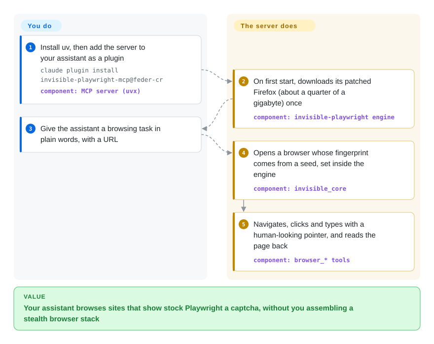

# invisible_playwright_mcp

You give Claude Code or Codex a browser through Playwright MCP, and the first real site answers with a Cloudflare "verify you are human" page or a captcha, so the task dies on step one. invisible_playwright_mcp swaps the browser underneath for a Firefox that was patched in its C++ source to look like an ordinary person's browser, and exposes it to your assistant through the same kind of MCP tools.

## When to use

You run a coding assistant (Claude Code, Codex, Gemini CLI, Cursor) and you want it to do browsing chores for you: check fares across five dates on an airline site, read prices off a shop, fill a form on a site that has no API. With the stock [Playwright MCP](../playwright-family/playwright-mcp.md) the agent lands on `Just a moment...` or a reCAPTCHA grid and reports that it could not continue. You reach for invisible_playwright_mcp when **being detected as a bot is the failure**, not a lack of browser tools: its engine is a Firefox whose fingerprint (navigator, screen, WebGL, canvas, fonts, audio, WebRTC, timezone) is decided inside the browser from one integer seed, and whose clicks travel a curved, human-timed pointer path — so there is no injected JavaScript shim for a detector to find.

The deciding tradeoff against its neighbours: [Playwright MCP](../playwright-family/playwright-mcp.md) and [Chrome DevTools MCP](chrome-devtools-mcp.md) are well-backed and cross-browser or DevTools-deep but make no attempt to hide automation; [Camoufox](../browser-driver-frameworks/camoufox.md) is the older, larger anti-detect Firefox but is a library you script, not an MCP server your assistant plugs into. This project packages the stealth engine *as* an MCP server and an optional chat UI, with tool names mirroring Playwright MCP so existing prompts carry over — at the price of a young, single-maintainer stack that runs only on Windows and Linux.

## How it works

It is three pieces from one author: this repo (the MCP server, a two-pane web UI and its agent loop), the `invisible-playwright` wrapper (Playwright's Python API pointed at the patched engine), and `invisible_core` (turns a seed into a coherent fingerprint and derives timezone/locale from the proxy's exit IP). Your assistant spawns the server with `uvx invisible-playwright-mcp`; on first start the server downloads the pinned engine build (about a quarter of a gigabyte, checksum-verified) from a GitHub release. The model then calls tools named like Playwright MCP's — `browser_open`, `browser_navigate`, `browser_snapshot`, `browser_click`, `browser_type`, `browser_read_text` — against **one** page per browser: there are no tab tools, and a second, cookie-isolated `support` browser exists for side tasks such as a throwaway mailbox. Think of it as swapping the car, not the driver: your assistant still decides where to go, but the vehicle no longer has "test vehicle" painted on its doors. What it does for you: the fingerprint, the human-looking input, proxy-consistent geography, and saving "who you were" (seed, exit, profile) between sessions. What stays yours: the model and its cost, a proxy if your own IP is the tell, a `--profile-dir` if logins must survive, and the judgement about whether the target site's terms allow automation at all. The standalone path (`uvx invisible-playwright-mcp ui --openrouter-key …`) runs the same server behind a local chat page, with OpenRouter as the only model provider.

<!-- flow-steps:begin (generated from flows/invisible-playwright-mcp.json by tools/flow_card.py — do not edit) -->

Text version of the flow

1. **You**: Install uv, then add the server to your assistant as a plugin — `claude plugin install invisible-playwright-mcp@feder-cr` — component: `MCP server (uvx)`
2. **invisible_playwright_mcp**: On first start, downloads its patched Firefox (about a quarter of a gigabyte) once — component: `invisible-playwright engine`
3. **You**: Give the assistant a browsing task in plain words, with a URL
4. **invisible_playwright_mcp**: Opens a browser whose fingerprint comes from a seed, set inside the engine — component: `invisible_core`
5. **invisible_playwright_mcp**: Navigates, clicks and types with a human-looking pointer, and reads the page back — component: `browser_* tools`

**Value**: Your assistant browses sites that show stock Playwright a captcha, without you assembling a stealth browser stack

<!-- flow-steps:end -->

## When NOT to use

- **You are on macOS.** The engine ships only Windows x86_64 and Linux x86_64/arm64 builds (package classifiers and the MCPB manifest list `win32`/`linux`); a Mac user finds out at the first browser call. Use [Playwright MCP](../playwright-family/playwright-mcp.md) or [Chrome DevTools MCP](chrome-devtools-mcp.md), or run this inside a Linux VM/container.
- **The site does not fight bots.** For your own app, an intranet, or ordinary public pages, stealth buys nothing and costs a 250 MB custom engine plus a single-maintainer dependency chain. Use [Playwright MCP](../playwright-family/playwright-mcp.md) (Microsoft-backed, Chromium/Firefox/WebKit) instead.
- **You need Chrome, tabs, tracing, HAR or CDP.** It is Firefox only, drives one page per browser by design, and the wrapper refuses tracing, HAR, CDP and the API request context. For DevTools-grade inspection use [Chrome DevTools MCP](chrome-devtools-mcp.md); for a stealthy *Chromium* driven from code, [nodriver](../browser-driver-frameworks/nodriver.md) or Patchright.
- **You want to write code, not prompts.** The MCP server is a prompt surface. For scripted scraping pipelines use the sibling library `invisible-playwright` directly, or the more established [Camoufox](../browser-driver-frameworks/camoufox.md), both of which expose Playwright's API.
- **You need a stable install identity.** Within one week (2026-09-22/23) the repo was renamed, the PyPI name `aihawk` deleted and `invisible-playwright-mcp` re-registered, the env vars and data directory renamed, and a *second* MCP-registry entry published. Pin the version, and prefer [Playwright MCP](../playwright-family/playwright-mcp.md) if churn in coordinates would break your fleet.
- **You cannot accept an outbound launch ping.** Every browser launch fetches a small release asset from the engine repo on GitHub so the author can count launches (documented in the README; the address is set by `invisible_core`). No identifier is sent, but GitHub sees your IP. If zero egress beyond the target site is a hard rule, use [Playwright MCP](../playwright-family/playwright-mcp.md) or [Chrome DevTools MCP](chrome-devtools-mcp.md) with telemetry flags off.
- **You want a hosted, scaled browser fleet.** It is a local process with no auth on its HTTP transport or UI. For many concurrent remote sessions look at cloud browser services (not repositories) or a self-hosted orchestrator like [PinchTab](pinchtab.md).
- **Evasion itself is the product you must defend legally.** The README only asks you to respect site terms and rate limits; bypassing bot protection can breach a site's terms. That risk is yours regardless of which tool you pick.

## Comparison

| Alternative | In index | Our verdict | Tradeoff |
|---|---|---|---|
| [Playwright MCP](../playwright-family/playwright-mcp.md) | ✅ | Pick Playwright MCP for any site that does not block automation, or on macOS; pick invisible_playwright_mcp only when captchas and bot walls are what stop the agent. | Microsoft backing, three engines, all OSes and a large user base, but a stock browser that anti-bot services flag; this project mirrors its tool names on a stealth Firefox and gives up tabs, macOS and institutional backing. |
| [Chrome DevTools MCP](chrome-devtools-mcp.md) | ✅ | Pick Chrome DevTools MCP when the agent must measure and debug a page (traces, network, heap); pick invisible_playwright_mcp when it must get past a site's bot detection. | Google-backed, DevTools-deep, Chrome-only and not built to hide; this project has none of the inspection surface but a patched fingerprint and humanized input. |
| [browser-use](browser-use.md) | ✅ | Pick browser-use when you want a mature Python agent framework you code against with many LLM providers; pick invisible_playwright_mcp when you want your existing MCP assistant to drive a stealth browser without writing an agent. | Larger community and framework surface on Chromium, but anti-bot handling is not its core; this project is a narrower plug-in whose value is the engine, with an OpenRouter-only standalone UI. |
| [Camoufox](../browser-driver-frameworks/camoufox.md) | ✅ | Pick Camoufox for scripted anti-detect scraping where a longer track record and a fingerprint database matter; pick invisible_playwright_mcp when the consumer is an MCP assistant rather than your code. | Both patch Firefox in C++; Camoufox ships a fingerprint database and a Playwright-API library (MPL-2.0, ~12k stars), while this derives fingerprints from a seed and wraps them as MCP tools. |
| [nodriver](../browser-driver-frameworks/nodriver.md) | ✅ | Pick nodriver when you need an undetected *Chromium* driven from Python code; pick invisible_playwright_mcp when you need Firefox-based stealth delivered as MCP tools. | nodriver avoids the WebDriver/CDP tells in Chrome and is a code library (AGPL-3.0); this project is Firefox-only and prompt-driven, MIT-licensed from 2026-09-02. |

## Tech stack

- **Language:** Python ≥3.11 (3.11–3.13 classifiers), packaged with hatchling, run via `uvx invisible-playwright-mcp`; the web UI is plain HTML/CSS/JS served by Starlette + Uvicorn.
- **MCP:** the official `mcp` SDK (`>=1.8,<2`, FastMCP) over stdio by default, streamable HTTP optional (`STEALTHFOX_MCP_TRANSPORT=http`, port 8766).
- **Browser:** `invisible-playwright` (Playwright's API over a Juggler-protocol Firefox) driving a Firefox 151 build patched at the C++ level; patches published in `feder-cr/firefox_antidetect_patch` (a mozilla-central fork, MPL-2.0 for the binary).
- **Fingerprint/geo:** `invisible_core` — seed → ~200-field profile → Firefox prefs, proxy → timezone/locale via an offline GeoIP database.
- **Page reading:** `selectolax` (lexbor HTML5 parser) for `browser_read_html`; `openai` client pointed at OpenRouter for the standalone agent loop.
- **Distribution:** PyPI, Claude Code/Codex plugin marketplace manifests, a Gemini CLI extension, an MCPB bundle, and the official MCP registry (`io.github.feder-cr/invisible-playwright-mcp`).

## Dependencies

- **uv** (the README installs it first) and Python ≥3.11.
- **Windows x86_64 or Linux x86_64/arm64** — no macOS engine build.
- **The engine download:** ~240–262 MB compressed (~550 MB unpacked) from GitHub releases on first start; plus a GeoIP database when a proxy is set.
- **Network egress to GitHub** at each browser launch (the launch counter) and on first run (engine).
- **An MCP client** (Claude Code, Codex, Gemini CLI, Claude Desktop, Cursor, VS Code, Zed…) for the MCP path — the model is the client's; **or an OpenRouter API key** for the standalone UI (default model `z-ai/glm-5.3-flash`).
- **Optional:** your own HTTP/SOCKS5 proxy (strongly recommended by its docs, since without it the exit IP, timezone and locale are your machine's), a profile directory for persistent logins.

## Ops difficulty

**Low to install, medium to keep working.** Installation is two plugin commands after `uv`; the engine fetches itself. The burden is in what surrounds it: a 250 MB binary that must match the pinned "seal" exactly (a custom `STEALTHFOX_BINARY` of a different build is refused), a dependency floor that the author moves when engine bugs are fixed (a cached `uvx` environment keeps old versions until the floor forces a re-resolve), proxies you source and pay for yourself, and a fast-moving release train (v0.68.0 → v0.70.2 in ten days, 2026-09-15 → 09-25). The HTTP transport and UI have no authentication, so binding them beyond `127.0.0.1` is your security problem. Detection is an arms race: a site that passes today can start challenging tomorrow, and the fix lands in the engine repo, not here.

## Health & viability

- **Maintenance — very active, but in a fresh incarnation.** about 40 GitHub releases between 2026-09-12 and 2026-09-25 (v0.43.0 → v0.70.2); 100+ commits in September 2026 (GitHub API, 2026-09-29). The code under this name only arrived on 2026-09-02 — before that the repository held documentation, and before that it was the AIHawk LinkedIn job-application bot.
- **Governance / bus factor — one person.** User-owned; `feder-cr` authored 341 of the 353 commits GitHub attributes to contributors, and the engine, wrapper and core repos are all theirs. If the author stops, the patched Firefox stops tracking upstream Firefox, and that is the part that decays fastest. `[推断]`
- **Age & Lindy — do not read the 2024 creation date as age.** The repo was created 2024-08-04, but the product is about four weeks old under this name and a few months old as an engine (`invisible_playwright` created 2026-05-13). Lindy gives essentially no prior here.
- **Adoption — stars are inherited, downloads are modest.** ~31.7k stars and ~4.7k forks were earned by the job-applier (the rename PR states the stars were kept and removes the press strip "covering the job-application bot this product no longer is"). PyPI: ~4.5k downloads/month for this package and ~30.8k/month for the `invisible-playwright` engine wrapper (pypistats, 2026-09-29).
- **Read the radar with that history in mind.** Its longevity grade B counts the repository's 786 days since 2024-08-04, and its license axis sees today's MIT without the 2026-09-02 change; both describe the repository shell more than this product. The adoption grade D rests on GitHub release-asset downloads because the scorer found no registry package, so the PyPI numbers above are the better adoption signal.
- **Risk flags.** Relicensed AGPL-3.0 → MIT on 2026-09-02 (earlier distributions remain AGPL); identity churn (repo, PyPI and MCP-registry names all changed 2026-09-22/23); a launch-counting ping on every browser start; an anti-bot evasion tool whose effectiveness depends on staying ahead of detectors; and a large search-targeted wiki (136 guide pages in `docs/`) that is marketing, not evidence.

## Caveats (unverified)

- [未验证] "Invisible to anti-bots" / "5/5 detection suites passed" are the author's own claims (README and engine README hero); not reproduced here — needs a live test against Cloudflare/reCAPTCHA/hCaptcha targets, which varies by site and over time.
- [未验证] Whether the launch ping can be disabled (e.g. by overriding the `invisible_firefox.usage_ping.url` pref) — no documented opt-out found in the README or `invisible_core` tests on 2026-09-29; not tested.
- [推断] The single-maintainer bus-factor judgement rests on contributor counts from the GitHub API (341 commits by `feder-cr`, the next contributors at 1–2) across this repo; the engine/core repos were not contributor-audited.
- [推断] The adoption split (stars inherited from AIHawk vs. current users) is inferred from the rename history in PRs #1382/#1386 and the repo's 2024 creation date; GitHub does not attribute stars to a product version.
- [未验证] Star, fork and download counts (~31.7k stars, ~4.7k forks, ~4.5k/month PyPI downloads) are as of 2026-09-29 and move quickly; pypistats covers only the new package name, since the old `aihawk` name was deleted.
- [推断] That the engine's anti-detect quality would decay fastest without the maintainer is judgement from how it is built (a patched Firefox 151 that must be rebased onto each upstream release), not an observed event.
- [推断] Positioning against Camoufox, nodriver and browser-use is based on each project's documentation, not a head-to-head detection benchmark.
