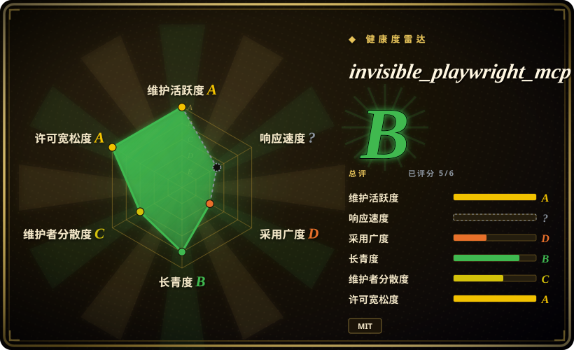
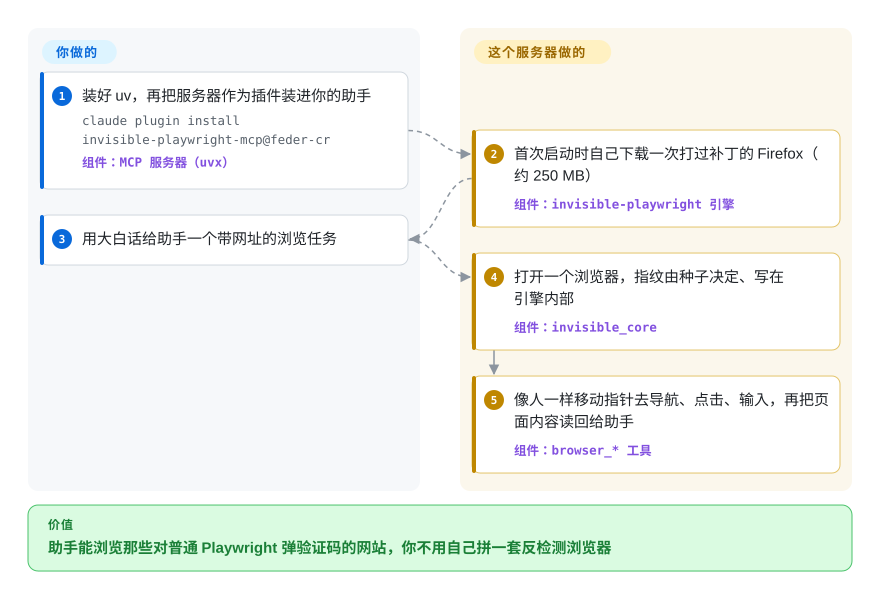

# invisible_playwright_mcp

你用 Playwright MCP 给 Claude Code 或 Codex 接上浏览器，结果第一个真实网站就甩出 Cloudflare 的“请验证你是真人”页面或一格一格的验证码，任务在第一步就断了。invisible_playwright_mcp 把底下的浏览器换成一个在 C++ 源码层打过补丁、看上去像普通人在用的 Firefox，再用同一类 MCP 工具交给你的助手。

## 何时使用

你在用一个编程助手（Claude Code、Codex、Gemini CLI、Cursor），想让它替你干些浏览器上的杂活：在航司网站上逐日比五个日期的票价、从网店读价格、在没有 API 的网站上填表。用原版 [Playwright MCP](../playwright-family/playwright-mcp.zh.md) 时，agent 落在 `Just a moment...` 或 reCAPTCHA 九宫格上，然后回报“无法继续”。当**被识别成机器人才是失败原因**、而不是缺浏览器工具时，就该想到它：它的引擎是一个 Firefox，指纹（navigator、屏幕、WebGL、canvas、字体、音频、WebRTC、时区）由一个整数种子在浏览器内部决定，点击沿着有弧度、有人类节奏的指针轨迹移动——页面里没有注入的 JavaScript 补丁可供检测器发现。

和邻居相比的决定性取舍：[Playwright MCP](../playwright-family/playwright-mcp.zh.md) 与 [Chrome DevTools MCP](chrome-devtools-mcp.zh.md) 背后有大厂、跨浏览器或 DevTools 能力深，但完全不试图隐藏自动化；[Camoufox](https://github.com/daijro/camoufox) 是更老、更大的反检测 Firefox，但它是你写代码调用的库，不是助手能直接插上的 MCP 服务器。本项目把隐身引擎直接包装**成** MCP 服务器外加一个可选的聊天界面，工具名照搬 Playwright MCP，原有提示词可以沿用——代价是一个年轻的、单人维护的技术栈，而且只支持 Windows 和 Linux。

## 怎么用起来

它是同一作者的三件套：本仓库（MCP 服务器、双栏网页界面及其 agent 循环）、`invisible-playwright` 封装层（把 Playwright 的 Python API 指向打过补丁的引擎），以及 `invisible_core`（把种子变成一套自洽的指纹，并按代理出口 IP 推出时区和语言）。你的助手用 `uvx invisible-playwright-mcp` 拉起服务器；首次启动时，服务器从 GitHub release 下载钉死版本的引擎（约 250 MB，校验哈希）。之后模型调用和 Playwright MCP 同名的工具——`browser_open`、`browser_navigate`、`browser_snapshot`、`browser_click`、`browser_type`、`browser_read_text`——每个浏览器只操作**一个**页面：没有标签页工具，另有一个与主身份不共享 cookie 的 `support` 浏览器，用来办临时邮箱这类旁支任务。打个比方，它换的是车而不是司机：去哪儿仍由你的助手决定，只是车门上不再喷着“测试车辆”。它替你做的：指纹、像人的输入、与代理一致的地理信息，以及在会话之间记住“你是谁”（种子、出口、配置目录）。留给你的：模型和它的费用；如果你自己的 IP 就是破绽，还得自备代理；想保留登录态要给 `--profile-dir`；以及判断目标网站的条款到底允不允许自动化。独立使用路径（`uvx invisible-playwright-mcp ui --openrouter-key …`）在本地聊天页面后面跑同一个服务器，模型提供方只有 OpenRouter 一家。

<!-- flow-steps:begin (generated from flows/invisible-playwright-mcp.json by tools/flow_card.py — do not edit) -->

流程文字版

1. **你**：装好 uv，再把服务器作为插件装进你的助手 — `claude plugin install invisible-playwright-mcp@feder-cr` — 组件：`MCP 服务器（uvx）`
2. **invisible_playwright_mcp**：首次启动时自己下载一次打过补丁的 Firefox（约 250 MB） — 组件：`invisible-playwright 引擎`
3. **你**：用大白话给助手一个带网址的浏览任务
4. **invisible_playwright_mcp**：打开一个浏览器，指纹由种子决定、写在引擎内部 — 组件：`invisible_core`
5. **invisible_playwright_mcp**：像人一样移动指针去导航、点击、输入，再把页面内容读回给助手 — 组件：`browser_* 工具`

**价值**：助手能浏览那些对普通 Playwright 弹验证码的网站，你不用自己拼一套反检测浏览器

<!-- flow-steps:end -->

## 何时不用

- **你用的是 macOS。** 引擎只发布 Windows x86_64 与 Linux x86_64/arm64 版本（包的 classifiers 和 MCPB 清单只列 `win32`/`linux`），Mac 用户要到第一次调用浏览器才发现。改用 [Playwright MCP](../playwright-family/playwright-mcp.zh.md) 或 [Chrome DevTools MCP](chrome-devtools-mcp.zh.md)，或者把它放进 Linux 虚拟机 / 容器里跑。
- **目标站点根本不防机器人。** 自家应用、内网或普通公开页面上，隐身毫无收益，却要付出一个 250 MB 的定制引擎和一条单人维护的依赖链。改用 [Playwright MCP](../playwright-family/playwright-mcp.zh.md)（微软维护，支持 Chromium/Firefox/WebKit）。
- **你需要 Chrome、多标签页、tracing、HAR 或 CDP。** 它只有 Firefox，按设计每个浏览器只驱动一个页面，封装层对 tracing、HAR、CDP 和 API request context 直接拒绝。要 DevTools 级别的检查用 [Chrome DevTools MCP](chrome-devtools-mcp.zh.md)；要用代码驱动一个隐身的 **Chromium**，用 [nodriver](../browser-driver-frameworks/nodriver.zh.md) 或 Patchright。
- **你想写代码而不是写提示词。** MCP 服务器是提示词入口。脚本化的抓取流水线请直接用同门库 `invisible-playwright`，或更成熟的 [Camoufox](https://github.com/daijro/camoufox)，两者都提供 Playwright 的 API。
- **你需要稳定的安装坐标。** 一周之内（2026-09-22/23），仓库改名，PyPI 上的 `aihawk` 被删、`invisible-playwright-mcp` 重新注册，环境变量和数据目录改名，还在 MCP 注册表上发布了**第二个**条目。锁定版本；如果坐标变动会弄坏你的整批机器，优先 [Playwright MCP](../playwright-family/playwright-mcp.zh.md)。
- **你不能接受启动时的外发计数请求。** 每次启动浏览器都会从引擎仓库的 GitHub release 拉一个小文件，作者以此统计启动次数（README 有写，地址由 `invisible_core` 设定）。不带任何标识，但 GitHub 能看到你的 IP。如果“除目标站点外零外联”是硬规定，用 [Playwright MCP](../playwright-family/playwright-mcp.zh.md) 或关掉遥测的 [Chrome DevTools MCP](chrome-devtools-mcp.zh.md)。
- **你要的是托管的、可扩容的浏览器集群。** 它是本地进程，HTTP 传输和界面都没有鉴权。要很多并发的远程会话，看云浏览器服务（非仓库）或自托管编排器 [PinchTab](pinchtab.zh.md)。
- **规避检测本身就是你要在法律上担责的行为。** README 只要求你遵守站点条款和频率限制；绕过机器人防护可能违反站点条款。不管选哪个工具，这份风险都在你身上。

## 横向对比

| 替代品 | 是否收录 | 我们的评价 | 取舍 |
|---|---|---|---|
| [Playwright MCP](../playwright-family/playwright-mcp.zh.md) | ✅ | 站点不拦自动化、或者你在 macOS 上，选 Playwright MCP；只有当验证码和机器人墙才是卡住 agent 的原因时，才选 invisible_playwright_mcp。 | 微软背书、三种引擎、全平台、用户基数大，但原版浏览器会被反机器人服务标记；本项目在隐身 Firefox 上照搬它的工具名，放弃了标签页、macOS 和机构背书。 |
| [Chrome DevTools MCP](chrome-devtools-mcp.zh.md) | ✅ | agent 要测量和调试页面（trace、网络、堆）时选 Chrome DevTools MCP；agent 要越过站点的机器人检测时选 invisible_playwright_mcp。 | 谷歌背书、DevTools 能力深、只支持 Chrome、不为隐藏而设计；本项目没有任何检查能力，但有补丁指纹和拟人输入。 |
| [browser-use](browser-use.zh.md) | ✅ | 想要一个成熟的、面向代码的 Python agent 框架并接多家模型时选 browser-use；想让现有 MCP 助手直接驱动隐身浏览器、不自己写 agent 时选 invisible_playwright_mcp。 | 社区和框架面更大、基于 Chromium，但反机器人不是它的核心；本项目是更窄的插件，价值全在引擎，独立界面只接 OpenRouter。 |
| [Camoufox](https://github.com/daijro/camoufox) | 未收录 | 做脚本化反检测抓取、看重更长的历史和指纹数据库时选 Camoufox；消费方是 MCP 助手而不是你的代码时选 invisible_playwright_mcp。 | 两者都在 C++ 层改 Firefox；Camoufox 带指纹数据库，提供 Playwright API 的库（MPL-2.0，约 1.2 万星），本项目从种子推导指纹并包装成 MCP 工具。本批 tab-intake 未新增其页面。 |
| [nodriver](../browser-driver-frameworks/nodriver.zh.md) | ✅ | 需要用 Python 代码驱动一个不被识别的 **Chromium** 时选 nodriver；需要以 MCP 工具形式交付、基于 Firefox 的隐身时选 invisible_playwright_mcp。 | nodriver 在 Chrome 里避开 WebDriver/CDP 的破绽，是代码库（AGPL-3.0）；本项目只有 Firefox、靠提示词驱动，自 2026-09-02 起为 MIT。 |

## 技术栈

- **语言：** Python ≥3.11（classifiers 列 3.11–3.13），用 hatchling 打包，经 `uvx invisible-playwright-mcp` 运行；网页界面是纯 HTML/CSS/JS，由 Starlette + Uvicorn 提供。
- **MCP：** 官方 `mcp` SDK（`>=1.8,<2`，FastMCP），默认 stdio，可选 streamable HTTP（`STEALTHFOX_MCP_TRANSPORT=http`，端口 8766）。
- **浏览器：** `invisible-playwright`（Playwright API，走 Juggler 协议控制 Firefox），驱动一个在 C++ 层打过补丁的 Firefox 151；补丁公开在 `feder-cr/firefox_antidetect_patch`（mozilla-central 的分支，二进制按 MPL-2.0 分发）。
- **指纹 / 地理：** `invisible_core`——种子 → 约 200 个字段的画像 → Firefox 偏好设置；代理 → 用离线 GeoIP 库推出时区和语言。
- **读页面：** `browser_read_html` 用 `selectolax`（lexbor HTML5 解析器）；独立 agent 循环用指向 OpenRouter 的 `openai` 客户端。
- **分发：** PyPI、Claude Code / Codex 插件市场清单、Gemini CLI 扩展、MCPB 包，以及官方 MCP 注册表（`io.github.feder-cr/invisible-playwright-mcp`）。

## 依赖

- **uv**（README 第一步就装它）和 Python ≥3.11。
- **Windows x86_64 或 Linux x86_64/arm64**——没有 macOS 引擎。
- **引擎下载：** 首次启动从 GitHub releases 下载约 240–262 MB（解压后约 550 MB）；设置代理时还要下 GeoIP 数据库。
- **对 GitHub 的外联：** 每次启动浏览器（启动计数）以及首次运行（下载引擎）。
- **一个 MCP 客户端**（Claude Code、Codex、Gemini CLI、Claude Desktop、Cursor、VS Code、Zed……）走 MCP 路径，模型用客户端自己的；**或一个 OpenRouter API key** 走独立界面（默认模型 `z-ai/glm-5.3-flash`）。
- **可选：** 你自己的 HTTP/SOCKS5 代理（文档强烈建议，否则出口 IP、时区、语言都是你本机的），以及用来保留登录态的配置目录。

## 运维难度

**安装低，维持可用中等。** 装好 `uv` 后两条插件命令就完事，引擎自己下载。负担在外围：一个 250 MB 的二进制必须与钉死的 “seal” 完全一致（自定义 `STEALTHFOX_BINARY` 若版本不同会被拒绝）；作者修完引擎 bug 就上调依赖下限（缓存的 `uvx` 环境会一直用旧版本，直到下限逼它重新解析）；代理要你自己找、自己付钱；发布节奏很快（2026-09-15 → 09-25 十天内从 v0.68.0 到 v0.70.2）。HTTP 传输和界面没有鉴权，绑定到 `127.0.0.1` 以外就是你的安全问题。检测是军备竞赛：今天能过的站点明天可能开始出挑战，修复落在引擎仓库，而不是这里。

## 健康度与可持续性

- **维护——非常活跃，但是全新的一世。** 2026-09-12 到 09-25 间约 40 个 GitHub release（v0.43.0 → v0.70.2），2026 年 9 月提交超过 100 次（GitHub API，2026-09-29）。这个名字下的代码 2026-09-02 才搬进来——在那之前仓库只放文档，再往前它是 AIHawk 领英自动投简历机器人。
- **治理 / 巴士因子——一个人。** 个人账号所有；GitHub 归到贡献者名下的 353 次提交里，`feder-cr` 占 341 次，引擎、封装层、core 三个仓库也都在这一个账号名下。作者一停，补丁版 Firefox 就不再跟进上游 Firefox，而这正是衰减最快的部分。`[推断]`
- **年龄与 Lindy——别把 2024 年的创建日期当年龄。** 仓库创建于 2024-08-04，但以现在这个名字存在的产品只有约四周，引擎本身也只有几个月（`invisible_playwright` 创建于 2026-05-13）。Lindy 在这里几乎给不出先验。
- **采用度——星是继承的，下载量不高。** 约 3.17 万星、约 4.7 千 fork 是投简历机器人时期攒下的（改名 PR 写明星、fork、watcher 保留，并删掉了“报道的都是本产品已不再是的那个投简历机器人”的媒体条）。PyPI：本包每月约 4.5 千次下载，`invisible-playwright` 引擎封装层每月约 3.08 万次（pypistats，2026-09-29）。
- **读雷达图时带上这段历史。** 寿命轴的 B 按仓库自 2024-08-04 起的 786 天计算，许可证轴只看到今天的 MIT，看不到 2026-09-02 的变更；两者描述的更多是仓库这个壳，而不是这个产品。采用度的 D 基于 GitHub release 附件下载量，因为评分器没找到注册表上的包，上面的 PyPI 数字才是更好的采用度信号。
- **风险信号。** 2026-09-02 从 AGPL-3.0 改为 MIT（此前发布的版本仍是 AGPL）；身份频繁变动（仓库、PyPI、MCP 注册表名字都在 2026-09-22/23 变过）；每次启动浏览器都有一次启动计数请求；这是一个反机器人规避工具，效果取决于能否持续领先检测方；另有一个面向搜索引擎的大型 wiki（`docs/` 下 136 篇指南），那是营销，不是证据。

## 存疑（未验证）

- [未验证] “对反机器人隐形”“5/5 检测套件通过”是作者自述（README 与引擎 README 头图）；此处未复现——需要在 Cloudflare / reCAPTCHA / hCaptcha 目标上实测，结果因站点和时间而异。
- [未验证] 启动计数请求能否关闭（例如覆盖 `invisible_firefox.usage_ping.url` 这个偏好项）——2026-09-29 在 README 和 `invisible_core` 测试里没找到文档化的关闭方式；未实测。
- [推断] 单人巴士因子的判断依据是本仓库 GitHub API 的贡献者计数（`feder-cr` 341 次，其余贡献者各 1–2 次）；引擎与 core 仓库未做贡献者审计。
- [推断] “星来自 AIHawk、而非当前用户”的拆分，是从 PR #1382/#1386 的改名历史和仓库 2024 年创建日期推出来的；GitHub 不会把星归到某个产品版本。
- [未验证] 星数、fork 数和下载量（约 3.17 万星、约 4.7 千 fork、PyPI 每月约 4.5 千次）为 2026-09-29 数据，变化很快；pypistats 只统计新包名，旧名 `aihawk` 已被删除。
- [推断] “没有维护者后引擎的反检测质量衰减最快”是从构建方式（一个必须随每次上游发布重新变基的 Firefox 151 补丁）得出的判断，并非已观察到的事件。
- [推断] 相对 Camoufox、nodriver、browser-use 的定位依据各项目文档，没有做正面的检测对比测试。
