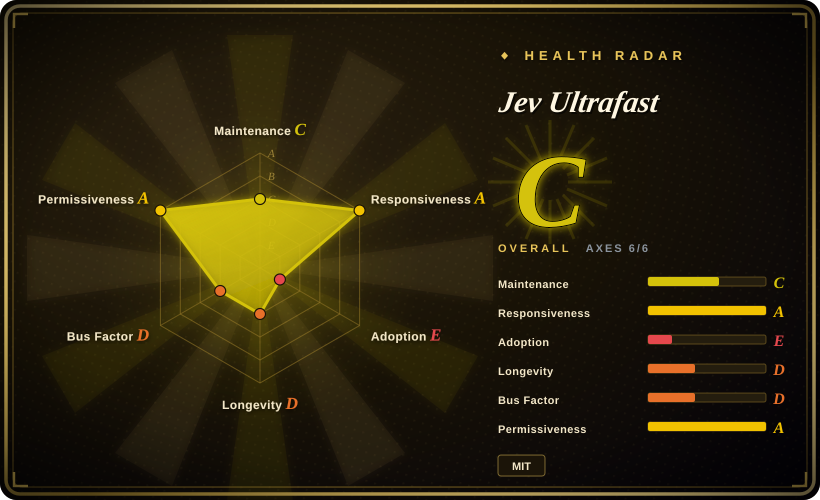
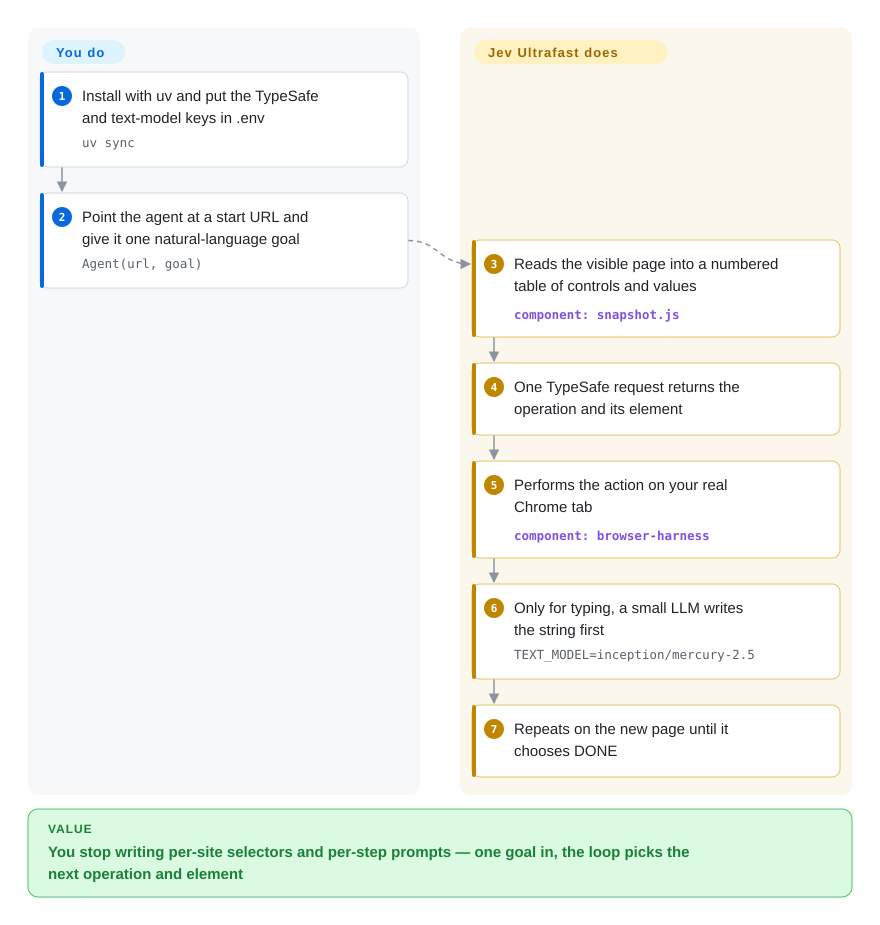

# Jev Ultrafast

A browser agent that decides with a model call on every step is slow and expensive: a screenshot loop pays a vision call each turn, and a chat planner serializes "what do I do" into "which element". Jev Ultrafast asks a hosted decision model one question per step — which operation, and which observed element — and lets a real Chrome tab carry it out.

## When to use

You are building a web-agent feature where per-step latency and cost are the binding constraint, not feature completeness. A screenshot-driven agent burns a vision-model call on every turn; a chat-planning agent spends two round trips (decide the action, then pick the target) before it can touch the page. You want a small, readable loop — a handful of files — where one decision request returns both halves and no image ever enters the model context, and you can accept the decision model sitting behind a hosted API and the typed text behind a second key.

Reach for Jev Ultrafast in that case. Prefer [browser-use](browser-use.md), the same organization's general framework, when you need the agent logic to run inside your own model calls and want a bigger, self-hostable surface rather than a thin loop on a hosted decision API. Prefer [page-agent](page-agent.md) when the agent can live inside the page and needs no backend at all. The deciding tradeoff: you buy per-step speed and a tiny auditable loop by putting two external paid services in the hot path.

## Q&A

- **Is the intelligence in the repository?** No. The repository is the loop, the DOM snapshot and the execution guards. The operation/target decision comes from TypeSafe's hosted Jev model (`TYPESAFE_API_KEY`), and text generation for `TYPE_TEXT` comes from a separate OpenAI-compatible key (`TEXT_MODEL_API_KEY`, OpenRouter in the example).
- **Can it run fully self-hosted?** Not as shipped — both keys point at external services. If the goal is a Jev-style decision contract without a hosted dependency, look at [Simple Jev](../../decision-models/simple-jev.md) or [Kev](../../decision-models/kev.md); this repo is not wired to them.
- **Is it a drop-in replacement for browser-use?** No — it is an experimental sibling by the same org. browser-use is the general framework; this is a smaller, faster loop that trades breadth (and self-hosting) for speed.
- **Does it drive its own browser?** It connects to your existing Chrome over CDP through `browser-harness` and shares that profile, so the tabs it owns live in your real session.

## How it works

On every turn the project reads the visible page into a numbered table of controls — buttons, text boxes, comboboxes — with their current values, then sends that table plus your goal to TypeSafe's Jev model in a single request. That one request returns both halves of the decision: an operation (one of `CLICK`, `TYPE_TEXT`, `SELECT`, `SCROLL_UP`, `SCROLL_DOWN`, `WAIT`, `DONE`, `BLOCKED`) and, for each operation it could have chosen, the element that operation would target — so the loop never asks a second time, and a target that does not fit the chosen operation is never offered. Only `TYPE_TEXT` calls a second, small language model to generate the string to type; every other operation is decided and executed with no text generation. The project then acts on your real Chrome tab, re-reads the element's geometry and checks it is still visible and unobstructed before input, and repeats on the new state until the model chooses `DONE`. What you supply is a start URL and one natural-language goal; what the project supplies is the DOM snapshot, the decision request, the freshness and occlusion guards, and the execution. A local inspector at `127.0.0.1:8766` shows the numbered elements, the operation/target probabilities, and each executed action if you want to watch the loop.

<!-- flow-steps:begin (generated from flows/jev-ultrafast.json by tools/flow_card.py — do not edit) -->

Text version of the flow

1. **You**: Install with uv and put the TypeSafe and text-model keys in .env — `uv sync`
2. **You**: Point the agent at a start URL and give it one natural-language goal — `Agent(url, goal)`
3. **Jev Ultrafast**: Reads the visible page into a numbered table of controls and values — component: `snapshot.js`
4. **Jev Ultrafast**: One TypeSafe request returns the operation and its element
5. **Jev Ultrafast**: Performs the action on your real Chrome tab — component: `browser-harness`
6. **Jev Ultrafast**: Only for typing, a small LLM writes the string first — `TEXT_MODEL=inception/mercury-2.5`
7. **Jev Ultrafast**: Repeats on the new page until it chooses DONE

**Value**: You stop writing per-site selectors and per-step prompts — one goal in, the loop picks the next operation and element

<!-- flow-steps:end -->

## When NOT to use

- **You need the agent to run without outbound calls to a hosted decision API.** The core decision is not in the repo. Use [browser-use](browser-use.md) (self-hostable framework, your own model calls), or, if you specifically want the Jev-style operation/target contract without TypeSafe, [Simple Jev](../../decision-models/simple-jev.md).
- **You need production stability and a support horizon today.** As of 2026-09-27 the repo is 11 days old, has 3 commits, one author, and no release. Choose [browser-use](browser-use.md) (~2 years, many contributors) or [Agent Browser](agent-browser.md) for anything you must operate for years; treat this as a pattern source, not a dependency.
- **You must drive a site behind a login without taking over the user's browser.** It attaches to your real Chrome profile. Use [OpenCLI](opencli.md) or [BrowserSkill](browserskill.md), which bridge an already-logged-in session with an explicit hand-back for login.
- **You need deterministic, repeatable automation for CI.** This is a probabilistic agent, not a test runner. Use [Playwright](../playwright-family/playwright.md) when the steps are known and must not vary.
- **Your target UI lives in shadow DOM, iframes, canvas, uploads, pop-up tabs, nested scroll areas, or custom keyboard widgets.** The README lists all of these as outside the MVP; the DOM reader covers common HTML and ARIA controls only.
- **You only need to inspect a live page (network, console, heap, traces).** Use [Chrome DevTools MCP](chrome-devtools-mcp.md) instead of a task-running agent.

## Comparison

| Alternative | In index | Our verdict | Tradeoff |
|---|---|---|---|
| [browser-use](browser-use.md) | ✅ | Pick Jev Ultrafast when per-step latency is the constraint and you accept a hosted decision API; pick browser-use when you want the same org's self-hostable framework and a much broader surface. | Jev Ultrafast is faster and smaller per step; browser-use keeps the agent logic in your own model calls and ships a larger ecosystem, at higher per-step cost. |
| [Agent Browser](agent-browser.md) | ✅ | Pick Jev Ultrafast when the agent must decide for itself each turn; pick Agent Browser when a script or an agent drives Chrome from the shell over CDP with stable element refs. | Agent Browser is a CLI+daemon with no decision API and no hosted dependency; Jev Ultrafast is a Python loop that borrows the deciding from a hosted model. |
| [Simple Jev](../../decision-models/simple-jev.md) | ✅ | Pick Simple Jev when you want the Jev-style typed-decision contract self-hosted; pick Jev Ultrafast when you want a working browser loop and are fine paying TypeSafe for the decision. | Simple Jev removes the hosted decision API and the per-call bill but gives up the ready-made browser loop and inherits its base model's judgement. |
| [page-agent](page-agent.md) | ✅ | Pick Jev Ultrafast when you need a backend-driven agent with a real Chrome tab; pick page-agent when the control can live inside the page with no backend. | page-agent needs no server and no DOM snapshot service; Jev Ultrafast reaches pages page-agent cannot, but adds two external services. |
| TypeSafe Jev | 非仓库 | This is the hosted decision API the loop calls, not a piece of software you install; if you cannot depend on a hosted service, decide locally with a self-hostable decision model instead. | Using TypeSafe directly keeps the same decision quality without the demo shell, but the model, its pricing and its availability are outside your control and it is not a repository. |

## Tech stack

- **Language:** Python ≥ 3.12 for the agent and demo; a small browser-side JavaScript file (`snapshot.js`) for the atomic DOM read.
- **Runtime shape:** a library (`from jev_ultrafast import Agent`) plus a loopback-only inspector built on the standard-library HTTP server (`http.server`), no web framework.
- **Core modules:** `agent.py` (the loop), `model.py` (operation/target heads and the text helper), `browser.py` (CDP connection, geometry, execution), `snapshot.js` (element table), `questions.py` (model instructions), `demo.py` (inspector).

## Dependencies

- **Python packages:** `browser-harness==0.1.13` (the pinned CDP bridge to Chrome) and `httpx[http2]`; dev extras are `pytest`, `ruff`, `pillow`.
- **External services (both required):** TypeSafe's hosted decision model (`TYPESAFE_API_KEY`, `TYPESAFE_MODEL=jev-latest`) and an OpenAI-compatible text model (`TEXT_MODEL_API_KEY`, default base `https://openrouter.ai/api/v1`, example model `inception/mercury-2.5`).
- **Local runtime:** an existing Chrome with remote debugging allowed; the agent owns tabs inside that profile.
- **Not published to PyPI** as of 2026-09-27 — install from the git checkout with `uv sync`.

## Ops difficulty

**Medium.** Installing and running the demo is one command once keys are in place, and there is no database or server fleet. The real burden is external: two API keys with their own billing and rate limits, a pinned `browser-harness` version that must keep matching your Chrome, and a decision service whose latency and availability sit inside every step. Budget for secret handling and for per-run API cost, and expect the loop to change as the project is pre-release.

## Health & viability

- **Maintenance:** 3 commits between 2026-09-16 and 2026-09-18, then quiet; no tags and no releases as of 2026-09-27. It is an early, move-fast artifact, not a maintained release line.
- **Governance / bus factor:** a single contributor, inside the Browser Use organization that also maintains browser-use; the roadmap is the vendor's, and the README carries a Browser Use Cloud waitlist, so the open repo shares its direction with a commercial product.
- **Age / Lindy:** 11 days old at 2026-09-27 — no track record to bet on yet. The ~19.5k stars accumulated in that window are a hype signal, not social proof.
- **Adoption:** no PyPI package, no release downloads; adoption is GitHub stars and forks only, with no third-party ecosystem or documented production users.
- **Risk flags:** the decisive capability (the operation/target decision) is a closed hosted service, so cost, latency and terms are outside your control; the license itself is MIT and unremarkable.

## Caveats (unverified)

- [未验证] The headline numbers (a 7.073 s Google Flights run; median 9.450 s → 7.092 s across six alternating runs) are author-reported artifacts in `docs/performance.md` — three pairs, one task, one browser profile — and were not independently reproduced.
- [未验证] TypeSafe's pricing, rate limits and data handling are not stated in the repository; total task cost is unknown (the repo reports only the text-helper charge, $0.00006272 for two calls).
- [推断] `gregpr07` is a Browser Use core maintainer, inferred from the shared GitHub account being a top contributor to browser-use; the repository does not state this.
- [未验证] The long-term maintenance plan, release cadence, and whether the loop will be kept in sync with `browser-harness` are unknown for an 11-day-old, single-author repo.
- [未验证] Per-site coverage is untested here: the DOM reader's handling of your specific controls is not guaranteed, and shadow DOM, iframes, canvas, uploads, pop-up tabs and nested scrolling are declared out of scope.
