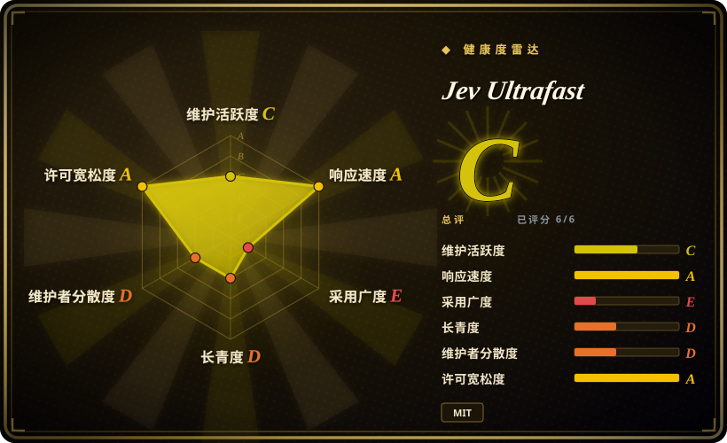
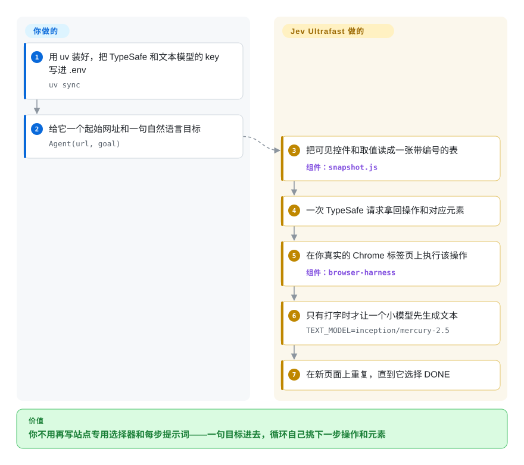

# Jev Ultrafast

浏览器 agent 每走一步都问一次模型，又慢又贵：截图方案每步都要付一次视觉模型的调用费，聊天规划方案则要先决定动作、再单独挑元素，两步才能碰页面。Jev Ultrafast 把这一步压成一次请求——一个托管判定模型同时返回「做哪个操作」和「对哪个已观测元素」——剩下交给真实 Chrome 标签页执行。

## 何时使用

你在做一个浏览器 agent 功能，瓶颈是每步的延迟和成本，而不是功能覆盖度。截图驱动的 agent 每一轮都要多付一次视觉模型调用；聊天规划式的 agent 在真正操作页面前要花两次往返（先定动作，再选目标）。你想要一个小而可读的循环——几个文件就能读完——让一次判定请求同时给出这两半，而且没有任何图像进入模型上下文；同时你能接受判定模型放在托管 API 后面、生成文本要另配一个 key。

这种情况选 Jev Ultrafast。需要 agent 逻辑跑在你自己的模型调用里、且想要更大更可自托管的面时，选同组织的通用框架 [browser-use](browser-use.zh.md)。agent 能直接住在页面里、完全不需要后端时，选 [page-agent](page-agent.zh.md)。决定性取舍：你用「热路径上多两个外部付费服务」换来每步速度和一个小到可审计的循环。

## 快问快答

- **智能在仓库里吗？** 不在。仓库是循环、DOM 快照和执行护栏。操作与目标的判定来自 TypeSafe 托管的 Jev 模型（`TYPESAFE_API_KEY`），`TYPE_TEXT` 要生成的文本来自另一个 OpenAI 兼容的 key（`TEXT_MODEL_API_KEY`，示例用 OpenRouter）。
- **能完全自托管吗？** 按现状不能——两个 key 都指向外部服务。想要「Jev 形状」的判定契约又不想依赖托管服务，看 [Simple Jev](../../decision-models/simple-jev.zh.md) 或 [Kev](../../decision-models/kev.zh.md)；本仓库没有接它们。
- **能直接替代 browser-use 吗？** 不能——它是同组织的实验品。browser-use 是通用框架；这个是为了速度而牺牲广度（和自托管能力）的更小循环。
- **它自己开浏览器吗？** 通过 `browser-harness` 用 CDP 连你现有的 Chrome，共用同一个 profile；它拥有的标签页就在你真实的会话里。

## 怎么用起来

每一轮，项目先把可见页面读成一张带编号的控件表——按钮、输入框、下拉框——连同它们当前的值，然后把这张表和你的目标在一次请求里发给 TypeSafe 的 Jev 模型。这一次请求同时返回判定的两半：一个操作（`CLICK`、`TYPE_TEXT`、`SELECT`、`SCROLL_UP`、`SCROLL_DOWN`、`WAIT`、`DONE`、`BLOCKED` 之一），以及它对每个可选操作会指向的元素——所以循环从不问第二遍，也不会拿到与所选操作不匹配的目标。只有 `TYPE_TEXT` 会再调一个小的语言模型来生成要输入的字符串；其它操作都不生成任何文本，直接判定、直接执行。接着项目在你真实的 Chrome 标签页上执行该操作，重新读取元素几何、确认它仍可见且未被遮挡再输入，然后在新状态上重复，直到模型选择 `DONE`。你提供的是一个起始网址和一句自然语言目标；项目提供的是 DOM 快照、判定请求、新鲜度与遮挡护栏，以及执行本身。`127.0.0.1:8766` 上的本地 inspector 会显示编号元素、操作与目标的概率和每一次已执行动作，方便你盯循环。

<!-- flow-steps:begin (generated from flows/jev-ultrafast.json by tools/flow_card.py — do not edit) -->

流程文字版

1. **你**：用 uv 装好，把 TypeSafe 和文本模型的 key 写进 .env — `uv sync`
2. **你**：给它一个起始网址和一句自然语言目标 — `Agent(url, goal)`
3. **Jev Ultrafast**：把可见控件和取值读成一张带编号的表 — 组件：`snapshot.js`
4. **Jev Ultrafast**：一次 TypeSafe 请求拿回操作和对应元素
5. **Jev Ultrafast**：在你真实的 Chrome 标签页上执行该操作 — 组件：`browser-harness`
6. **Jev Ultrafast**：只有打字时才让一个小模型先生成文本 — `TEXT_MODEL=inception/mercury-2.5`
7. **Jev Ultrafast**：在新页面上重复，直到它选择 DONE

**价值**：你不用再写站点专用选择器和每步提示词——一句目标进去，循环自己挑下一步操作和元素

<!-- flow-steps:end -->

## 何时不用

- **要求 agent 运行时不向托管的判定 API 发出站请求。** 核心判定不在仓库里。改用 [browser-use](browser-use.zh.md)（可自托管框架，用你自己的模型调用）；如果你要的正是 Jev 式的「操作加目标」契约但不想要 TypeSafe，用 [Simple Jev](../../decision-models/simple-jev.zh.md)。
- **今天就需要生产级稳定性和支持周期。** 截至 2026-09-27，仓库只有 11 天、3 个 commit、单一作者、没有任何 release。要长期运维就选 [browser-use](browser-use.zh.md)（约两年、贡献者众多）或 [Agent Browser](agent-browser.zh.md)；把它当模式参考，别当依赖。
- **必须操作登录态背后的站点、又不想接管用户浏览器。** 它会挂到你真实的 Chrome profile。用 [OpenCLI](opencli.zh.md) 或 [BrowserSkill](browserskill.zh.md)，它们桥接已登录会话，并把登录步骤明确交还给人。
- **需要确定、可重复的 CI 自动化。** 这是概率型 agent，不是测试运行器。步骤已知且必须稳定时用 [Playwright](../playwright-family/playwright.zh.md)。
- **目标界面在 shadow DOM、iframe、canvas、上传、弹窗标签页、嵌套滚动或自定义键盘控件里。** README 把这些全部列为 MVP 之外；DOM 读取只覆盖常见 HTML 和 ARIA 控件。
- **你只想检查一个活动页面（网络、控制台、堆、trace）。** 用 [Chrome DevTools MCP](chrome-devtools-mcp.zh.md)，而不是一个会执行任务的 agent。

## 横向对比

| 替代品 | 是否收录 | 我们的评价 | 取舍 |
|---|---|---|---|
| [browser-use](browser-use.zh.md) | ✅ | 每步延迟是硬约束、又能接受托管判定 API 时选 Jev Ultrafast；想要同组织的可自托管框架和更大覆盖面时选 browser-use。 | Jev Ultrafast 每步更快更小；browser-use 把 agent 逻辑留在你自己的模型调用里、生态更大，代价是每步成本更高。 |
| [Agent Browser](agent-browser.zh.md) | ✅ | agent 需要每一轮自己判断时选 Jev Ultrafast；由脚本或 agent 从 shell 通过 CDP 驱动 Chrome、用稳定元素引用时选 Agent Browser。 | Agent Browser 是 CLI+daemon，没有判定 API、没有托管依赖；Jev Ultrafast 是 Python 循环，判定外包给托管模型。 |
| [Simple Jev](../../decision-models/simple-jev.zh.md) | ✅ | 想要自托管的 Jev 式判定契约时选 Simple Jev；想要一个能跑的浏览器循环、且愿意为判定付 TypeSafe 费用时选 Jev Ultrafast。 | Simple Jev 去掉托管判定 API 和按次账单，但放弃现成的浏览器循环，并继承底座模型的判断力。 |
| [page-agent](page-agent.zh.md) | ✅ | 需要后端驱动、操作真实 Chrome 标签页的 agent 时选 Jev Ultrafast；控制逻辑能住在页面里、无需后端时选 page-agent。 | page-agent 不需要服务端和 DOM 快照服务；Jev Ultrafast 能触达 page-agent 够不到的页面，但多了两个外部服务。 |
| TypeSafe Jev | 非仓库 | 它是这个循环调用的托管判定 API，不是可安装的软件；不能依赖托管服务时，改用可自托管的判定模型在本地判定。 | 直接用 TypeSafe 能在没有演示外壳的情况下拿到同样的判定质量，但模型、定价和可用性都不由你控制，而且它不是仓库。 |

## 技术栈

- **语言：** agent 与 demo 用 Python（≥ 3.12）；浏览器侧一个小型 JavaScript 文件（`snapshot.js`）负责原子读取 DOM。
- **运行形态：** 一个库（`from jev_ultrafast import Agent`），加一个只监听回环地址的 inspector，基于标准库 HTTP server（`http.server`），没有 web 框架。
- **核心模块：** `agent.py`（循环）、`model.py`（操作与目标的判定头及文本助手）、`browser.py`（CDP 连接、几何、执行）、`snapshot.js`（元素表）、`questions.py`（模型指令）、`demo.py`（inspector）。

## 依赖

- **Python 包：** `browser-harness==0.1.13`（钉住版本的 Chrome CDP 桥）和 `httpx[http2]`；开发依赖是 `pytest`、`ruff`、`pillow`。
- **外部服务（两个都必需）：** TypeSafe 的托管判定模型（`TYPESAFE_API_KEY`、`TYPESAFE_MODEL=jev-latest`）和一个 OpenAI 兼容的文本模型（`TEXT_MODEL_API_KEY`，默认 base 为 `https://openrouter.ai/api/v1`，示例模型 `inception/mercury-2.5`）。
- **本地运行时：** 一个允许远程调试的现有 Chrome；agent 在这个 profile 里拥有自己的标签页。
- **截至 2026-09-27 未发布到 PyPI** —— 用 `uv sync` 从 git checkout 安装。

## 运维难度

**中等。** key 就位后，装好并跑起 demo 只要一条命令，没有数据库、没有服务器集群。真正的负担在外部：两个各带计费和限流的 API key、一个必须持续匹配你 Chrome 的钉版 `browser-harness`，以及一个其延迟和可用性都夹在每一步里的判定服务。要预留密钥管理成本和每次运行的 API 费用，并预期这个循环会随 pre-release 阶段继续变化。

## 健康度与可持续性

- **维护：** 2026-09-16 到 2026-09-18 有 3 个 commit，之后安静；截至 2026-09-27 没有 tag、没有 release。它是早期快跑产物，不是一条有维护的发布线。
- **治理与 bus factor：** 单一贡献者，隶属于同时维护 browser-use 的 Browser Use 组织；路线图由厂商掌握，README 上挂着 Browser Use Cloud 候补名单，所以这个开源仓库与一个商业产品共享方向。
- **年龄与 Lindy：** 2026-09-27 时只有 11 天——还没有可下注的履历。这段时间攒下的约 1.95 万 star 是热度信号，不是社会证明。
- **采用：** 没有 PyPI 包、没有 release 下载；采用只有 GitHub star 和 fork，没有第三方生态或可考的线上用户。
- **风险信号：** 决定性能力（操作与目标的判定）是闭源托管服务，成本、延迟和条款都不由你控制；license 本身是 MIT，无异常。

## 存疑（未验证）

- [未验证] 头条数字（一次 7.073 秒的 Google Flights 运行；六次交替运行中位数 9.450 秒降至 7.092 秒）来自 `docs/performance.md` 的作者自报材料——三对、单任务、单浏览器 profile——未经独立复现。
- [未验证] TypeSafe 的定价、限流和数据处理在仓库里没有说明；总任务成本未知（仓库只报了文本助手的费用：两次调用 0.00006272 美元）。
- [推断] `gregpr07` 是 Browser Use 的核心维护者，依据是同一个 GitHub 账号是 browser-use 的头部贡献者；仓库本身没有说明。
- [未验证] 长期维护计划、发布节奏，以及这个循环会不会与 `browser-harness` 保持同步，对一个 11 天、单作者的仓库都是未知数。
- [未验证] 站点覆盖度在这里未测：DOM 读取对你具体控件的处理没有保证，且 shadow DOM、iframe、canvas、上传、弹窗标签页和嵌套滚动都声明为范围之外。
