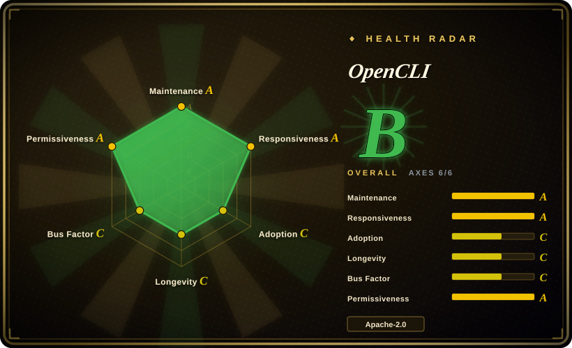

# OpenCLI

Turns websites into deterministic CLI commands and lets an AI agent operate **your already-logged-in Chrome** through a browser-extension bridge — no credentials handed over, because the agent inherits your real session instead of logging in itself.

## When to use

You're a developer who wants an agent (Claude Code, Cursor, etc.) to act on sites where *you* are logged in — check your Xiaohongshu notifications, pull Bilibili hot lists, fill a form on a web app you use daily — without pasting passwords into a prompt or fighting login walls, captchas, and risk-control in a fresh automation browser. You install the CLI plus a Chrome Web Store extension; a local daemon bridges them, and the agent drives the visible browser you actually use. For sites you hit repeatedly, built-in or self-written **adapters** freeze a workflow into a deterministic command (`opencli bilibili hot --limit 5`), with skills (`opencli-adapter-author`, `opencli-autofix`) that author new adapters and repair ones broken by site DOM changes. It also aggregates local binaries (`gh`, `docker`, …) and some Electron apps into the same command surface.

The deciding tradeoff vs. the agent-browser field: OpenCLI's edge is **your real logged-in session plus reusable site adapters**, not clean-room automation. If the task lives behind *your* login on a third-party site, this is the only entry in the category that never touches the login flow at all — you log in manually once (2FA, SSO, whatever), and the agent inherits that state, including its accumulated risk-control reputation.

## When NOT to use

- **Debugging a web app (perf, console, network).** It has no DevTools surface — no traces, CWV, or network waterfalls. For diagnosis use [Chrome DevTools MCP](chrome-devtools-mcp.md); OpenCLI is operation, not observability.
- **Clean-session, CI, or cross-browser automation.** The whole design is your foreground logged-in Chrome; for disposable/headless/cross-browser runs use [Playwright MCP](../playwright-family/playwright-mcp.md), [Playwright CLI](../playwright-family/playwright-cli.md), or the [Playwright](../playwright-family/playwright.md) framework.
- **Anti-bot-sensitive platforms at volume.** Automating logged-in third-party accounts invites risk-control response — the repo's own umbrella issue (#2470) tracks hardening against Xiaohongshu risk control; account restriction is a real cost the README won't pay for you. For bulk scraping, use dedicated `web-scraping` tooling instead.
- **You can't accept the trust surface.** An agent bridged into your logged-in browser inherits every session you have, via a local daemon + extension. If your threat model forbids that, use a clean automation browser ([Agent Browser](agent-browser.md), [Playwright MCP](../playwright-family/playwright-mcp.md)) and accept the login friction.
- **You dislike maintenance treadmills.** Site adapters break when sites change their DOM: of ~269 open issues (2026-09-16), roughly a third are site-adapter breakage reports (the single largest cluster, ahead of core/browser bugs) across YouTube, Xiaohongshu, LinkedIn, ChatGPT, Taobao and others. The `autofix` skill exists precisely because of this churn; budget for it.
- **Zero-install or locked-down environments.** Requires Node ≥ 20.18.1 (npm path), a Chrome extension, and a local daemon; on managed machines where extensions are blocked, this stack won't load — use [Playwright CLI](../playwright-family/playwright-cli.md) with its own bundled browsers instead.

## Comparison

| Alternative | In index | Our verdict | Tradeoff |
|---|---|---|---|
| [Agent Browser](agent-browser.md) | ✅ | Pick Agent Browser when you want CLI-first clean-browser automation with refs and a persistent daemon; pick OpenCLI when the target requires your real logged-in session or you want site workflows frozen into reusable commands. | Agent Browser runs its own Chrome (no login inheritance, smaller trust surface); OpenCLI inherits your sessions at the price of extension+daemon trust. |
| [Chrome DevTools MCP](chrome-devtools-mcp.md) | ✅ | Pick Chrome DevTools MCP for diagnosing pages (traces, CWV, console, network); pick OpenCLI for operating logged-in sites as commands. | Diagnostics vs. logged-in operation — different jobs; OpenCLI has no perf surface, DevTools MCP has no adapters or your-profile bridging by default. |
| [Playwright MCP](../playwright-family/playwright-mcp.md) / [Playwright CLI](../playwright-family/playwright-cli.md) | ✅ | Pick the Playwright pair for vendor-official, deterministic automation of disposable browsers; pick OpenCLI when "the browser is the one I already use" is the requirement. | Playwright is cleaner and cross-browser but starts every flow from an unauthenticated automation profile; OpenCLI is Chromium/desktop-only but identity comes free. |
| [browser-use](browser-use.md) | ✅ | Pick browser-use when you want a batteries-included Python agent loop with vision fallback over a fresh browser; pick OpenCLI when you already have a coding agent and need logged-in-site operation plus deterministic site commands. | browser-use bundles its own LLM loop; OpenCLI is BYO-agent and adds an adapter ecosystem instead of a vision path. |
| Kimi / Qoder browser extensions (未收录) | ❌ | These vendor extensions serve their own cloud agents and don't expose a local interface to third-party clients; pick OpenCLI when your agent of choice (Claude Code, Cursor) must be the driver. | Vendor extensions are zero-setup inside their own ecosystems but closed to outside agents [未验证]; OpenCLI is client-neutral. |

## Tech stack

JavaScript/Node.js (≥ 20.18.1 via npm) CLI (`@jackwener/opencli`), Chrome Web Store extension + local daemon as the browser bridge, Playwright-based adapters, CDP/DOM-snapshot interaction (pruned DOM text with `data-opencli-ref` indices — not screenshots), agent skills installed via `npx skills add jackwener/opencli`, plus an optional desktop app (OpenCLIApp) bundling runtime and tray UI.

## Dependencies

- Chrome/Chromium with the OpenCLI extension (store or sideload) and your manual logins.
- Node.js ≥ 20.18.1 for the npm install path; local daemon auto-starts on demand.
- Optional: OpenCLIApp (macOS/Windows) as the managed desktop install; agent skills for Claude Code/Cursor-class clients.

## Ops difficulty

**Medium.** Install is easy (npm + one-click store extension, `opencli doctor` for diagnosis), but the operational reality is adapter upkeep: sites change, adapters break, and you either run `autofix` or patch them yourself. Multi-profile setups add a small management layer (`opencli profile use`). Releases are frequent; one npm publish failure (#2458) left `latest` briefly stale, so pin versions in scripted setups.

## Health & viability

- **Maintenance (2026-09):** active — v1.8.8 released 2026-08-30, extension 1.0.24 updated 2026-09-01; 30 releases to date. A same-day npm publish failure (#2458) left `latest` on 1.8.7 briefly — minor release-engineering roughness.
- **Governance / bus factor:** `User`-owned (jackwener), 30 contributors — healthy contributor count for a personal-namespace project, but roadmap remains owner-centric. [推断]
- **Age & Lindy (2026-09):** created 2026-03-14 — ~6 months old with ~29k stars: fast adoption, short track record. The adapter-churn treadmill is structural to "websites as CLI," so long-term value depends on the maintainer community keeping pace with site changes. [推断]
- **Adoption:** ~29.3k stars / 2.9k forks, strong npm-side usage (exact figure in Caveats), and a Chrome Web Store extension with 90k users (5.0 rating on only 11 reviews) — usage metrics strong, review depth thin; HN presence negligible. [未验证]
- **Risk flags:** Apache-2.0, clean license. Operational flags: platform risk-control exposure when automating logged-in third-party accounts, the trust surface of extension+daemon over all your sessions, and the structural adapter-churn issue stream. No relicense or CLA issues found.

## Caveats (unverified)

- [未验证] Stars (~29.3k) / forks (~2.9k) / contributors (30) per GitHub API on 2026-09-16; npm downloads (~84k/last month) per npm API; Chrome store users (90k) and rating (5.0/11 reviews) per the store listing — all date-sensitive.
- Verified in-repo (2026-09-17): the `clis/` tree contains **182 adapter directories** (from bilibili/xiaohongshu to bloomberg, cnki, boss, coupang) — broader than the README's short list implies.
- [未验证] Built-in adapter health changes daily with site DOMs; issue-stream composition (~one third of ~269 open issues are adapter breakage) is estimated from title classification of all open issues, not a full triage.
- [未验证] Vendor-extension comparison (Kimi/Qoder closed to third-party agents) is inferred from store descriptions; no public API documented.
- [未验证] Desktop OpenCLIApp behavior (tray, keepalive) is from the README; not independently tested.
- [推断] "Logged-in session inheritance" is the design center, but risk-control outcomes vary per platform and per account history.
