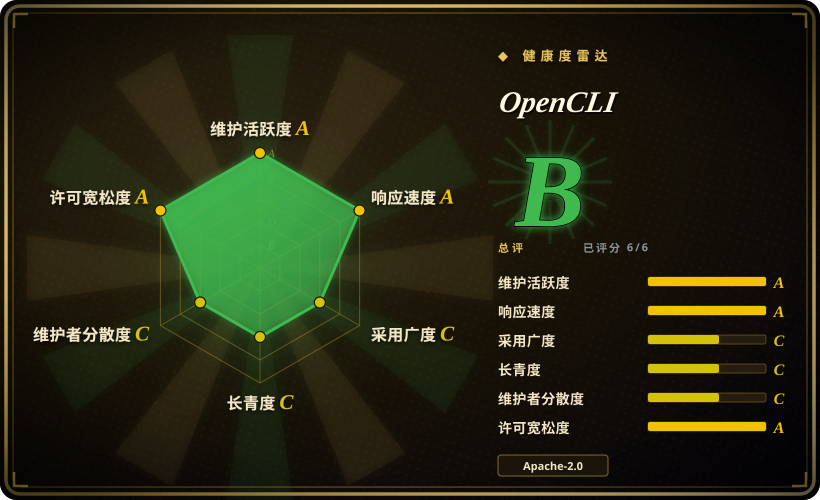

# OpenCLI

把网站变成确定性的 CLI 命令，并让 AI agent 通过浏览器扩展桥接操作**你已登录的 Chrome**——不用交出账密，因为 agent 继承的是你的真实会话，而不是自己去登录。

## 何时使用

你是开发者，想让 agent（Claude Code、Cursor 等）在你**已登录**的站点上干活——查小红书通知、拉 B 站热榜、在你日常用的 web 应用里填表单——又不愿把密码贴进 prompt，也不想让 agent 在干净的自动化浏览器里撞登录墙、验证码和风控。装上 CLI 加 Chrome 商店扩展，本地 daemon 把两者桥接起来，agent 驱动的就是你日常在用的那个可见浏览器。对高频站点，内置或自写的**适配器**把工作流固化成确定性命令（`opencli bilibili hot --limit 5`），配套 skill（`opencli-adapter-author`、`opencli-autofix`）负责写新适配器和修被站点 DOM 变动弄坏的旧适配器。它还能把本地二进制（`gh`、`docker`……）和部分 Electron 应用聚合进同一个命令面。

与 agent 浏览器赛道的决定性取舍：OpenCLI 的锋刃是**你的真实登录会话加可复用站点适配器**，不是干净室自动化。任务如果藏在你在第三方站点的登录态后面，这是本分类里唯一完全不碰登录流程的条目——你手动登录一次（2FA、SSO 都行），agent 继承该状态，包括它积累的风控信誉。

## 何时不用

- **调试 web 应用（性能、console、网络）。** 它没有 DevTools 面——没有 trace、CWV、网络瀑布。诊断用 [Chrome DevTools MCP](chrome-devtools-mcp.zh.md)；OpenCLI 是操作不是观测。
- **干净会话、CI 或跨浏览器自动化。** 整个设计就是你前台的已登录 Chrome；一次性/无头/跨浏览器需求用 [Playwright MCP](../playwright-family/playwright-mcp.zh.md)、[Playwright CLI](../playwright-family/playwright-cli.zh.md) 或 [Playwright](../playwright-family/playwright.zh.md) 框架。
- **在风控敏感平台上批量操作。** 用登录态自动化第三方账号会招来风控——仓库自己的 umbrella issue（#2470）就在跟踪针对小红书风控的加固；账号被限制的代价 README 不会替你付。批量抓取请用专门的 `web-scraping` 工具。
- **不能接受这个信任面。** 桥进你已登录浏览器的 agent 继承你所有会话，经由本地 daemon+扩展。如果你的威胁模型不允许，用干净自动化浏览器（[Agent Browser](agent-browser.zh.md)、[Playwright MCP](../playwright-family/playwright-mcp.zh.md)）并接受登录摩擦。
- **讨厌维护跑步机。** 站点改 DOM，适配器就坏：约 269 个 open issue（2026-09-16）中约三分之一是站点适配器损坏报告（单一最大聚类，超过核心/浏览器 bug），涉及 YouTube、小红书、LinkedIn、ChatGPT、淘宝等。`autofix` skill 的存在本身就说明这个 churn；把它计入成本。
- **零安装或受管环境。** 需要 Node ≥ 20.18.1（npm 路径）、一个 Chrome 扩展和一个本地 daemon；在扩展被禁的受管机器上这套装不上——改用自带浏览器的 [Playwright CLI](../playwright-family/playwright-cli.zh.md)。

## 横向对比

| 替代品 | 是否收录 | 我们的评价 | 取舍 |
|---|---|---|---|
| [Agent Browser](agent-browser.zh.md) | ✅ | 要 CLI-first 的干净浏览器自动化（refs+常驻 daemon）时选 Agent Browser；目标需要你的真实登录会话、或要把站点流程冻成可复用命令时选 OpenCLI。 | Agent Browser 跑自己的 Chrome（不继承登录态、信任面更小）；OpenCLI 继承你的会话，代价是扩展+daemon 的信任面。 |
| [Chrome DevTools MCP](chrome-devtools-mcp.zh.md) | ✅ | 诊断页面（trace、CWV、console、网络）选 Chrome DevTools MCP；把登录态站点当命令操作选 OpenCLI。 | 诊断对登录态操作——不同工种；OpenCLI 没有性能面，DevTools MCP 默认没有适配器也不桥你的日常 profile。 |
| [Playwright MCP](../playwright-family/playwright-mcp.zh.md) / [Playwright CLI](../playwright-family/playwright-cli.zh.md) | ✅ | 要厂商官方、对一次性浏览器的确定性自动化时选 Playwright 两兄弟；当「浏览器就是我日常在用的那个」是硬需求时选 OpenCLI。 | Playwright 更干净且跨浏览器，但每个流程都从未认证的自动化 profile 起步；OpenCLI 只支持 Chromium 桌面但身份零成本。 |
| [browser-use](browser-use.zh.md) | ✅ | 要开箱即用、带 vision 兜底、驱动全新浏览器的 Python agent 回路时选 browser-use；已有 coding agent、需要登录态站点操作加确定性站点命令时选 OpenCLI。 | browser-use 自带 LLM 回路；OpenCLI 是自带 agent 前提，用适配器生态替代视觉路径。 |
| Kimi / Qoder 浏览器扩展（未收录） | ❌ | 这些厂商扩展服务自家云端 agent，不向第三方客户端暴露本地接口；当你选定的 agent（Claude Code、Cursor）必须做驾驶者时选 OpenCLI。 | 厂商扩展在自家生态内零配置但对局外 agent 封闭 [未验证]；OpenCLI 客户端中立。 |

## 技术栈

JavaScript/Node.js（npm 路径需 ≥ 20.18.1）CLI（`@jackwener/opencli`），Chrome 商店扩展+本地 daemon 作浏览器桥，基于 Playwright 的适配器，CDP/DOM 快照交互（剪枝后的 DOM 文本配 `data-opencli-ref` 索引——非截图），经 `npx skills add jackwener/opencli` 安装 agent 技能，另有打包运行时与托盘 UI 的桌面应用 OpenCLIApp。

## 依赖

- 装好 OpenCLI 扩展（商店或侧载）的 Chrome/Chromium，以及你的手动登录。
- npm 安装路径需 Node.js ≥ 20.18.1；本地 daemon 按需自启。
- 可选：OpenCLIApp（macOS/Windows）托管桌面安装；面向 Claude Code/Cursor 类客户端的 agent 技能。

## 运维难度

**中。** 安装很轻（npm+商店扩展一键，`opencli doctor` 诊断），但运维现实是适配器维护：站点一变适配器就坏，你要么跑 `autofix` 要么自己修。多 profile 多一层小管理（`opencli profile use`）。发版频繁；有一次 npm 发布事故（#2458）让 `latest` 短暂停在旧版——脚本化场景 pin 版本。

## 健康度与可持续性

- **维护（2026-09）：** 活跃——v1.8.8 发布于 2026-08-30，扩展 1.0.24 更新于 2026-09-01；迄今 30 个 release。有一次当日 npm 发布事故（#2458）让 `latest` 短暂停在 1.8.7——发布工程略毛糙。
- **治理 / 巴士因子：** `User` 所有（jackwener），30 个 contributor——对个人命名空间项目来说是健康的贡献者数，但路线图仍以 owner 为中心。[推断]
- **年龄与 Lindy（2026-09）：** 创建于 2026-03-14——约 6 个月龄、约 29k star：采用很快，履历很短。「网站即 CLI」的适配器 churn 跑步机是结构性的，长期价值取决于维护者社区跟不跟得上站点变动。[推断]
- **采用：** 约 29.3k star / 2.9k fork，npm 侧使用量可观（精确数字见存疑区），Chrome 商店扩展 9 万用户（5.0 分但仅 11 个评分）——使用指标强、评价深度薄；HN 存在感可忽略。[未验证]
- **风险标记：** Apache-2.0，许可证干净。运营层标记：用登录态自动化第三方账号的风控暴露、扩展+daemon 覆盖你全部会话的信任面、以及结构性的适配器 churn issue 流。无再许可或 CLA 问题。

## 存疑（未验证）

- [未验证] star（约 29.3k）/ fork（约 2.9k）/ contributor（30）来自 2026-09-16 的 GitHub API；npm 下载（上月约 8.4 万）来自 npm API；商店用户（9 万）与评分（5.0/11 条）来自商店页面——全部对日期敏感。
- 已在仓内核实（2026-09-17）：`clis/` 树下有 **182 个适配器目录**（从 bilibili/小红书到 bloomberg、cnki、boss、coupang）——比 README 的简短列表暗示的宽得多。
- [未验证] 单个适配器健康度随站点 DOM 天天变；issue 构成（约 269 个 open 中约三分之一为适配器损坏）是对全部 open issue 标题分类的估计，非全量分诊。
- [未验证] 厂商扩展对比（Kimi/Qoder 对第三方 agent 封闭）是从商店描述推断；未见公开 API 文档。
- [未验证] 桌面 OpenCLIApp 的行为（托盘、登录保活）来自 README；未独立测试。
- [推断] 「登录态继承」是设计中心，但风控结果因平台、因账号历史而异。
