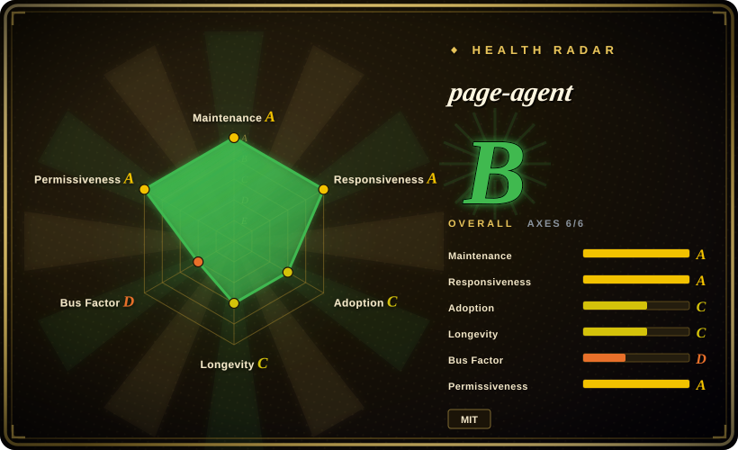
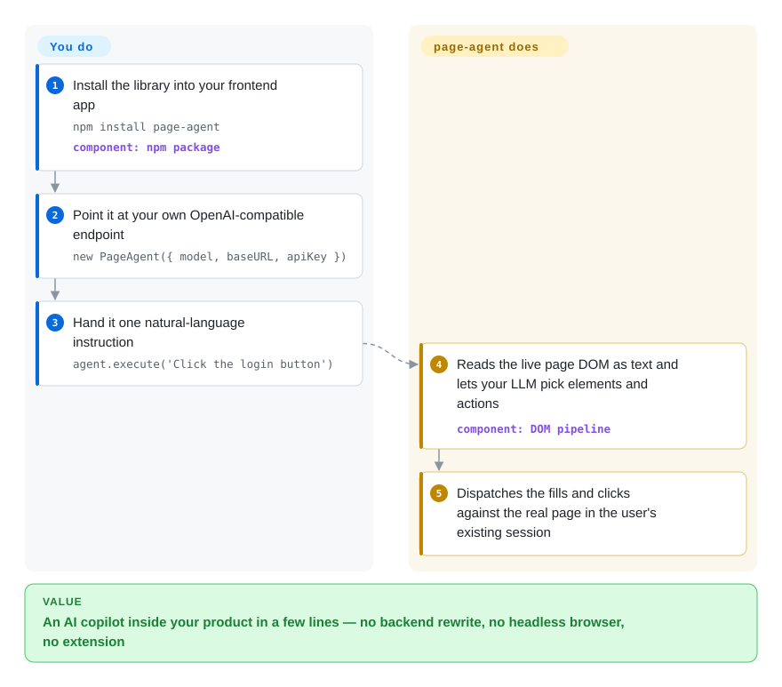

# page-agent

Giving your web app an AI assistant normally means a headless browser, a backend rewrite, or a screenshot-driven vision model. page-agent is a line of in-page JavaScript that reads the live DOM and carries out natural-language instructions in the user's own session — no extension, no Python, no headless browser needed.

## When to use

You're a frontend engineer maintaining a sprawling internal order-management ERP at a logistics company. Warehouse staff hate it: creating a single shipment means clicking through five tabs, filling a dozen fields, and remembering which dropdown comes first — and your team gets a steady trickle of "where do I click?" tickets. Your manager wants an assistant where someone can just type "create a shipment for order 88231 to the Shenzhen depot" and have the form filled and submitted, but the backend is a legacy monolith nobody wants to touch, and rebuilding the UI is off the table.

You drop in **page-agent** — a few lines of JavaScript via npm or CDN, no backend changes. It runs inside the same page the warehouse worker is already logged into, so it reuses their session and operates the real UI: reading the DOM as text, filling the fields, and clicking through the multi-step flow exactly as a person would. Because it works from the visible page rather than hardcoded selectors, an instruction like "click the submit-order button" is meant to keep working after your team refactors the markup. You point it at your own OpenAI-compatible model (it's LLM-agnostic), and the same snippet doubles as a natural-language / voice accessibility layer over the app — a fit for in-product copilots and complex form/workflow automation.

## How it works

page-agent is a browser-side library. You `npm install page-agent` (or load a single versioned `<script>` tag from a CDN for a quick try) and instantiate `PageAgent` against your own OpenAI-compatible endpoint — the README's example is Qwen via Dashscope's compatible-mode URL, but any model works, including locally deployed ones. When you call `agent.execute('...')`, the library serializes the live DOM into the text form its prompts feed to the LLM — the DOM-processing components and prompts are derived from browser-use, credited in the README — and then dispatches the model's chosen actions (fill, click, select) against the real elements in the page the user is already logged into. What it does for you: the perceive-decide-act loop over the page, reusing the user's session. What stays yours: the LLM endpoint (quality, cost, latency are inherited), and everything about the page itself — the agent lives and dies with the tab and never needs server access. Current releases also ship an optional Chrome extension for multi-tab tasks and a beta MCP server so external agent clients can drive the browser from outside.

<!-- flow-steps:begin (generated from flows/page-agent.json by tools/flow_card.py — do not edit) -->

Text version of the flow

1. **You**: Install the library into your frontend app — `npm install page-agent` — component: `npm package`
2. **You**: Point it at your own OpenAI-compatible endpoint — `new PageAgent({ model, baseURL, apiKey })`
3. **You**: Hand it one natural-language instruction — `agent.execute('Click the login button')`
4. **page-agent**: Reads the live page DOM as text and lets your LLM pick elements and actions — component: `DOM pipeline`
5. **page-agent**: Dispatches the fills and clicks against the real page in the user's existing session

**Value**: An AI copilot inside your product in a few lines — no backend rewrite, no headless browser, no extension

<!-- flow-steps:end -->

## When NOT to use

- **No vision / multimodal** — it reads the DOM as text only. Canvas/WebGL/image-heavy UIs, pixel-precise interactions, or anything not expressed in the DOM won't work. `[推断]` shadow DOM and cross-origin iframes are likely weak spots.
- **Not server-side automation** — it lives in the browser. For headless/batch crawling, scraping, or CI automation use Playwright or browser-use instead.
- **Not for high concurrency** — client-side and bound by browser limits; it is not a fleet-of-agents backend.
- **No closed-loop visual verification** — it cannot "see" whether an action visually succeeded; verification must come from the DOM.
- **External-LLM dependency & data egress** — you bring your own LLM, so quality/cost/latency are inherited, and page DOM text is sent to that model — a privacy/compliance review is warranted for sensitive apps.
- **Maturity** — active and at v1.x, but long-term API stability and real-world coverage across arbitrary sites are unproven; the "survives HTML changes" robustness is the project's own claim, not independently benchmarked.

## Comparison

| Alternative | In index | Our verdict | Tradeoff |
|---|---|---|---|
| [browser-use](browser-use.md) | ✅ | Choose browser-use when you need a Python server-side browser agent with vision support. | Python, server-side, vision-capable (screenshots) browser agent — heavier infra (a real/headless browser), but works beyond DOM text and off the client; page-agent's README states its DOM processing and prompts are derived from browser-use. |
| [Playwright](../playwright-family/playwright.md) / [Puppeteer](../browser-driver-frameworks/puppeteer.md) | ✅ | Choose Playwright or Puppeteer when you need lower-level code-driven headless automation. | Lower-level, code-driven, headless-capable automation — deterministic and powerful, but you write selectors/scripts (not natural language), and it breaks when the DOM changes. |
| [Selenium](../browser-driver-frameworks/selenium.md) | ✅ | Choose Selenium when you need mature, ubiquitous cross-browser automation. | Mature, ubiquitous cross-browser automation — but DIY, verbose, selector-based, no NL layer. |
| UiPath / Automation Anywhere (RPA) | 未收录 | Choose enterprise RPA tools when you need governed desktop-plus-web automation. | Enterprise desktop+web RPA with governance — but proprietary, costly, vendor lock-in, heavyweight vs a JS snippet. |
| Computer-use agents (Anthropic computer use / OpenAI Operator) | 未收录 | Choose computer-use agents when you need vision-based control of a real screen/browser. | Vision-based agents that drive a real screen/browser — handle any pixel UI, but slower, costlier, and need a controlled browser/VM, not an in-page snippet. |

## Tech stack

- TypeScript / browser JavaScript — runs in-page; no Node.js / Python / headless browser required
- LLM-agnostic — bring your own model via an OpenAI-compatible API (README example: Qwen via Dashscope compatible-mode; locally deployed models are supported)
- Optional Chrome extension — multi-tab / cross-page tasks
- Optional MCP server (beta) — external control / orchestration from agent clients
- Distribution — npm package `page-agent` + versioned CDN script (jsDelivr, npmmirror mirror)

## Dependencies

- A modern **browser** (it runs client-side, inside the page)
- An **LLM endpoint you provide** (OpenAI-compatible API + key)
- **Optional** — the Chrome extension (multi-tab); an MCP server (external orchestration)

## Ops difficulty

**Low.** Drop-in browser library (npm/CDN, a few lines), no backend, no headless browser, no separate infra to operate. The real operational cost is the **BYO LLM endpoint** — API-key management, per-call cost and latency — plus the **data-governance** question of sending page DOM text to that model. `[推断]` token cost scales with DOM size, so large/complex pages can get expensive per action.

## Health & viability

- **Responsiveness**: Grade A — median first-response time 60 hours across 20 qualifying issues/PRs (scorer, 2026-09-28).
- **Maintenance (2026-09)** — last pushed 2026-09-21, not archived; 39 releases through v1.12.4 (2026-09-06, GitHub releases API) with a continued commit flow: a maintained, fast-iterating project, not a coasting one. `[推断]`
- **Governance & backing** — an Alibaba-owned (`Organization`) repo, so it's **vendor-backed** rather than a single hobbyist: that's a bus-factor cushion, but the radar's governance axis grades D because one contributor carries ~93% of commits — in practice a small core team inside a vendor, with the roadmap following Alibaba's interest in it. A big vendor can deprioritize a side project. `[推断]`
- **Age & Lindy** — created 2025-09-23, ~1 year old (2026-09): **young and unproven** on the Lindy axis. Vendor backing offsets some of the abandonment risk, but it has no long track record and the "survives HTML changes" robustness claim is unbenchmarked. `[推断]`
- **Risk flags** — MIT-licensed (no relicense/open-core flag seen). The structural risk is **external-LLM dependency + DOM-text egress**, not licensing — treat sensitive-app use as a compliance question. The README's one-line CDN demo routes to Alibaba's free testing LLM API (terms apply) — don't ship that path to production.

## Caveats (unverified)

- [未验证] Real-world robustness across arbitrary sites ("survives HTML structure changes", selector-free operation) is the project's own framing; no independent benchmark was run.
- [推断] Shadow DOM and cross-origin iframes being weak spots is inferred from the DOM-text-only architecture; not tested.
- [推断] Token cost scaling with DOM size (page-agent README reports a minzipped bundle but no per-action token figures) is reasoning about the text-DOM-to-LLM design, not measured.
- [推断] Governance reading ("small core team inside a vendor; top1 ~93% of commits") comes from the health scorer's contributor window, not from reading org charts.
- [推断] The Qwen/Dashscope endpoint in the README is treated as an example rather than a recommended default, based on the README's "bring your own LLMs" framing.
- [未验证] The UiPath/Automation Anywhere and computer-use-agent comparison rows characterize proprietary products and vendor APIs from their public positioning, not from hands-on use.
