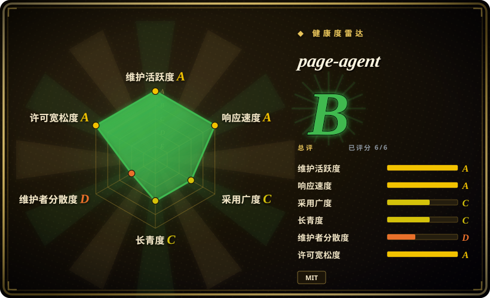
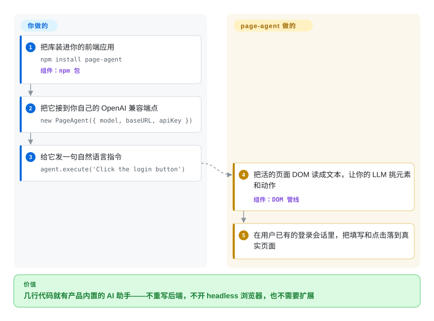

# page-agent

给 Web 应用加 AI 助手，直觉方案是 headless 浏览器、后端重构或截图驱动的视觉模型，一个比一个重。page-agent 是一段住进页面里的 JavaScript：直接读活的 DOM，在用户自己的登录会话里执行自然语言指令——不需要扩展、不需要 Python、不需要 headless 浏览器。

## 何时使用

你是一家物流公司里维护那套庞大内部订单管理 ERP 的前端工程师。仓库同事很讨厌它：新建一张运单要点过五个标签页、填十几个字段，还得记住哪个下拉框要先选——于是你们团队隔三岔五就收到「这个该点哪里」的工单。你的主管想要一个助手，让人直接打一句「给订单 88231 建一张发往深圳仓的运单」，就把表单填好并提交；可后端是没人敢碰的祖传单体应用，重做 UI 也不在选项里。

你引入了 **page-agent**——通过 npm 或 CDN 加几行 JavaScript，后端零改动。它就跑在仓库同事已经登录的那个页面里，复用他们的会话、操作真实 UI：把 DOM 当文本读取、填好字段、像人一样点击走完多步流程。因为它是从可见页面出发、而不是依赖写死的选择器，所以像「点击提交订单按钮」这样的指令意图是在你们团队重构标记后依然有效。你把它接到自己的 OpenAI 兼容模型上（它 LLM 无关），同一段片段还顺带成了这个应用之上的一层自然语言 / 语音无障碍能力——很适合做产品内置 copilot 和复杂表单/工作流自动化。

## 怎么用起来

page-agent 是一个浏览器端库。你 `npm install page-agent`（或先用 CDN 上带版本号的单个 `<script>` 标签快速试一把），然后用你自己的 OpenAI 兼容端点实例化 `PageAgent`——README 的示例是 Qwen 走 Dashscope 的 compatible-mode 地址，但任何模型都行，包括本地部署的。你调用 `agent.execute('...')` 时，它把活的 DOM 序列化成提示词喂给 LLM 的文本形式——这套 DOM 处理组件与提示词派生自 browser-use，README 里有署名致谢——再把模型选定的动作（填写、点击、选择）派发到用户已登录的那个页面的真实元素上。它替你做的：围绕页面的“感知—决策—执行”回路，复用用户会话。留给你的：LLM 端点（质量、成本、延迟都是继承来的），以及页面本身的一切——agent 与标签页同生共死，从不需要服务器权限。当前版本还附带可选的 Chrome 扩展（多标签页任务）和 beta 版 MCP server，让外部 agent 客户端从页面之外驱动浏览器。

<!-- flow-steps:begin (generated from flows/page-agent.json by tools/flow_card.py — do not edit) -->

流程文字版

1. **你**：把库装进你的前端应用 — `npm install page-agent` — 组件：`npm 包`
2. **你**：把它接到你自己的 OpenAI 兼容端点 — `new PageAgent({ model, baseURL, apiKey })`
3. **你**：给它发一句自然语言指令 — `agent.execute('Click the login button')`
4. **page-agent**：把活的页面 DOM 读成文本，让你的 LLM 挑元素和动作 — 组件：`DOM 管线`
5. **page-agent**：在用户已有的登录会话里，把填写和点击落到真实页面

**价值**：几行代码就有产品内置的 AI 助手——不重写后端，不开 headless 浏览器，也不需要扩展

<!-- flow-steps:end -->

## 何时不用

- **没有视觉 / 多模态** —— 它只把 DOM 当作文本读取。canvas/WebGL/图像密集型 UI、像素级精确交互，或任何不在 DOM 里表达的内容都无法工作。`[推断]` shadow DOM 和跨域 iframe 很可能是薄弱环节。
- **不是服务端自动化** —— 它活在浏览器里。headless/批量爬取、抓取或 CI 自动化请改用 Playwright 或 browser-use。
- **不适合高并发** —— 客户端运行，受浏览器限制；它不是「一群 agent」式的后端。
- **没有闭环视觉验证** —— 它无法「看到」某个操作在视觉上是否成功；验证必须来自 DOM。
- **外部 LLM 依赖与数据外发** —— 你自带 LLM，所以质量/成本/延迟都继承自该模型，并且页面 DOM 文本会被发送给该模型——对敏感应用来说有必要做一次隐私/合规评审。
- **成熟度** —— 活跃且处于 v1.x，但其长期 API 稳定性以及在各类网站上的真实覆盖情况尚未得到验证；「能在 HTML 变化后依然有效」这一健壮性是项目自己的说法，未经独立基准验证。

## 横向对比

| 替代品 | 是否收录 | 我们的评价 | 取舍 |
|---|---|---|---|
| [browser-use](browser-use.zh.md) | ✅ | 需要 Python 服务端且具备视觉能力的浏览器 agent 时，选 browser-use。 | Python、服务端、具备视觉能力（截图）的浏览器 agent —— 基础设施更重（需要真实/headless 浏览器），但能超越 DOM 文本工作、且不依赖客户端；page-agent 的 README 明确说它的 DOM 处理与提示词派生自 browser-use。 |
| [Playwright](../playwright-family/playwright.zh.md) / [Puppeteer](../browser-driver-frameworks/puppeteer.zh.md) | ✅ | 需要更底层、代码驱动、支持 headless 的自动化时，选 Playwright 或 Puppeteer。 | 更底层、代码驱动、支持 headless 的自动化 —— 确定性强且强大，但你要自己写选择器/脚本（不是自然语言），且在 DOM 变化时会失效。 |
| [Selenium](../browser-driver-frameworks/selenium.zh.md) | ✅ | 需要成熟、普及的跨浏览器自动化时，选 Selenium。 | 成熟、普及的跨浏览器自动化 —— 但纯手工、冗长、基于选择器，没有自然语言层。 |
| UiPath / Automation Anywhere (RPA) | 未收录 | 需要带治理能力的企业级桌面+Web RPA 时，选 UiPath 或 Automation Anywhere。 | 带治理能力的企业级桌面+Web RPA —— 但闭源、昂贵、有厂商锁定，相比一段 JS 片段过于笨重。 |
| Computer-use agents (Anthropic computer use / OpenAI Operator) | 未收录 | 需要基于视觉驱动真实屏幕/浏览器的 agent 时，选 computer-use agents。 | 基于视觉、驱动真实屏幕/浏览器的 agent —— 能处理任意像素 UI，但更慢、更贵，且需要一个受控的浏览器/VM，而非页内片段。 |

## 技术栈

- TypeScript / 浏览器 JavaScript —— 在页内运行；无需 Node.js / Python / headless 浏览器
- LLM 无关 —— 通过 OpenAI 兼容 API 自带模型（README 示例：Qwen 走 Dashscope compatible-mode；支持本地部署模型）
- 可选的 Chrome 扩展 —— 多标签页 / 跨页面任务
- 可选的 MCP server（beta）—— 让外部 agent 客户端从页面之外控制浏览器
- 分发方式 —— npm 包 `page-agent` + 带版本号的 CDN 脚本（jsDelivr，另有 npmmirror 国内镜像）

## 依赖

- 一个现代**浏览器**（它在客户端、页面内部运行）
- 一个**你自己提供的 LLM 端点**（OpenAI 兼容 API + key）
- **可选** —— Chrome 扩展（多标签页）；MCP server（外部编排）

## 运维难度

**低。** 即插即用的浏览器库（npm/CDN，几行代码），无后端、无 headless 浏览器、无需单独运维的基础设施。真正的运维成本在于**自带的 LLM 端点** —— API-key 管理、每次调用的成本与延迟 —— 以及把页面 DOM 文本发送给该模型的**数据治理**问题。`[推断]` token 成本随 DOM 大小增长，所以大型/复杂页面在单次操作上可能变得昂贵。

## 健康度与可持续性

- **响应速度**：Grade A——中位首次响应时间 60 小时，基于 20 个 qualifying issues/PRs（评分器，2026-09-28）。
- **维护（2026-09）** —— 最近推送在 2026-09-21，未归档；到 v1.12.4（2026-09-06）共 39 个 release（GitHub releases API），提交流持续：这是一个在快速迭代、有人维护的项目，不是停滞滑行。`[推断]`
- **治理与背书** —— 阿里所有的（`Organization`）仓库，因此是**厂商背书**而非单个业余爱好者：这给了 bus-factor 一层缓冲，但雷达的治理轴只给 D，因为单个贡献者扛了约 93% 的提交——实际效果是大厂内的一支小队，路线图随阿里对它的兴趣走，大厂可能给边缘项目降优先级。`[推断]`
- **年龄与 Lindy** —— 创建于 2025-09-23，到 2026-09 约 1 岁：在 Lindy 维度上**年轻且未经验证**。厂商背书抵消了一部分弃坑风险，但它没有长期记录，「HTML 变化后仍有效」的健壮性说法也未经基准验证。`[推断]`
- **风险标记** —— MIT 许可（未见到 relicense / open-core 信号）。结构性风险在于**外部 LLM 依赖 + DOM 文本外发**，而非许可证——敏感应用请按合规问题对待。README 的一行式 CDN demo 走的是阿里免费测试 LLM API（受其条款约束）——别把这条路径带上生产。

## 存疑（未验证）

- [未验证] 在各类网站上的真实健壮性（「能在 HTML 结构变化后依然有效」、免选择器运行）是项目自己的表述；未做独立 benchmark。
- [推断] shadow DOM 与跨域 iframe 是薄弱环节，是从「纯 DOM 文本」架构推断的，未实测。
- [推断] token 成本随 DOM 大小增长（README 只报 minzipped 体积，不报单次动作的 token 数），是对「文本 DOM 喂 LLM」设计的推理，非实测。
- [推断] 治理判读（「大厂内一支小队、top1 约占 93% 提交」）来自健康度评分器的贡献者窗口，未读组织信息。
- [推断] README 里的 Qwen/Dashscope 端点按示例而非推荐默认项对待，依据是其「自带 LLM」的表述。
- [未验证] UiPath/Automation Anywhere 与 computer-use agents 两行对闭源产品和厂商 API 的刻画来自公开定位，未亲手使用。
