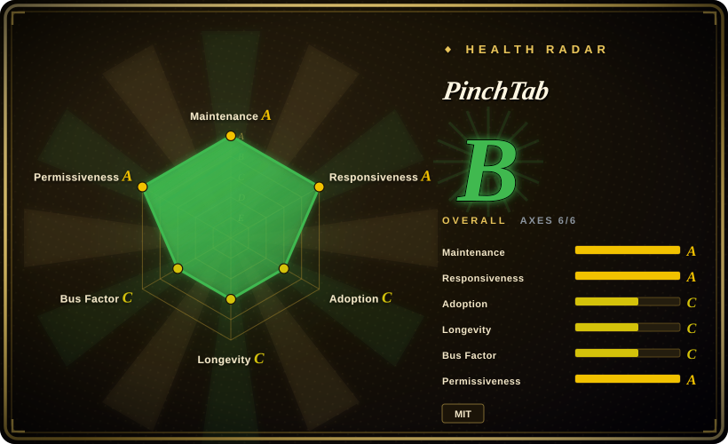
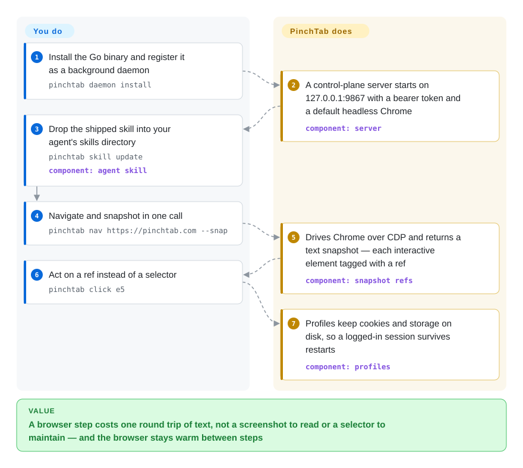

# PinchTab

Your agent reads pages as screenshots, so a 24-step browser task burns dollars of tokens on pixels it barely uses, and the selectors your older scripts lean on snap on every redesign. PinchTab is a small Go server that keeps Chrome resident on your machine and hands the model filtered text snapshots with stable element refs (`e5`) over a CLI, HTTP API, or MCP — one cheap round trip per browser step.

## When to use

You run a coding agent — or build the harness around one — and part of its job is operating real websites: open the deploy preview and check it rendered, log into a vendor portal and pull the weekly report, fill a ten-field form, diff two site versions before a release. The pain is structural: vision-driven browsing costs ~10k tokens per page of screenshot, raw HTML drowns the model in markup, and a CSS selector is a promise the next deploy breaks. You want the browser to be a *service the agent calls*, not a library it embeds.

You install one ~30 MB Go binary, run `pinchtab daemon install`, and point the agent at `http://localhost:9867` — the CLI, the HTTP API, and `pinchtab mcp` all hit the same control plane. The loop the agent runs: `pinchtab nav <url> --snap` returns a text snapshot in the same call as the navigation, every interactive element tagged with a ref like `e5` that survives same-document reshuffles; `pinchtab click e5` / `pinchtab fill e3 "…"` act on refs. The server also owns what you'd otherwise reinvent: named *profiles* that persist logins across restarts, parallel isolated Chrome instances, site audits (`pinchtab audit`, `pinchtab compare --fail-on-diff` as a CI gate), and a default-deny security posture — JavaScript evaluation, cookies, downloads, clipboard, network interception and other hot endpoint families return `403` until you enable them, and an Indirect Prompt Injection defense (IDPI) scans and wraps page text as untrusted before it reaches your agent.

Pick it over [Agent Browser](agent-browser.md) when one server must juggle multiple isolated browser instances under named profiles (a logged-in "work" profile beside an anonymous scratch one) and when you want capability gates and content scanning enforced server-side rather than as per-client flags — the project's own benchmark claims 9.5–20.3% cheaper end-to-end agent loops than agent-browser, which is self-reported with a small sample size (see Caveats). Pick [browser-use](browser-use.md) if you want the LLM loop included rather than owning it; pick [Playwright MCP](../playwright-family/playwright-mcp.md) if MCP is your only integration surface and you are already on the Playwright engine.

## How it works

PinchTab splits browser control into a control plane and runtimes, and **the server, the runtimes, and the security gates all ship in one binary**. `pinchtab daemon install` registers a background control-plane server bound to `127.0.0.1:9867` with a bearer token; the server manages *profiles* (saved browser state — cookies, storage — so a login survives restarts), spawns *instances* (each a Chrome process behind a lightweight `pinchtab bridge` runtime), and tracks *tabs* inside each instance. A command — CLI, HTTP request, or MCP over stdio, all the same API — is routed to the right instance, drives Chrome over the Chrome DevTools Protocol (CDP, the remote-control channel Chrome exposes for automation), and answers with a filtered snapshot: a text rendering where each interactive element carries a ref like `e5`. Refs are what the model reasons about: the same `e5` survives a change of filter or selector on the same document and expires only on navigation, so a stale ref fails loudly instead of clicking whatever now sits at that position. What it takes over: browser lifecycle, per-instance isolation via separate user-data directories, session persistence, a web dashboard, and the security layer — every high-risk endpoint family (`evaluate`, `cookies`, `download`, `clipboard`, `networkIntercept`…) is off by default and refuses with a `403` naming the gate, while IDPI scans page-controlled text and wraps it so downstream systems treat it as untrusted content. What stays yours: the model, the agent loop, the allowlist of domains the browser may visit, and the decision to raise `stealthLevel` beyond the default `light` fingerprint normalization.

<!-- flow-steps:begin (generated from flows/pinchtab.json by tools/flow_card.py — do not edit) -->

Text version of the flow

1. **You**: Install the Go binary and register it as a background daemon — `pinchtab daemon install`
2. **PinchTab**: A control-plane server starts on 127.0.0.1:9867 with a bearer token and a default headless Chrome — component: `server`
3. **You**: Drop the shipped skill into your agent's skills directory — `pinchtab skill update` — component: `agent skill`
4. **You**: Navigate and snapshot in one call — `pinchtab nav https://pinchtab.com --snap`
5. **PinchTab**: Drives Chrome over CDP and returns a text snapshot — each interactive element tagged with a ref — component: `snapshot refs`
6. **You**: Act on a ref instead of a selector — `pinchtab click e5`
7. **PinchTab**: Profiles keep cookies and storage on disk, so a logged-in session survives restarts — component: `profiles`

**Value**: A browser step costs one round trip of text, not a screenshot to read or a selector to maintain — and the browser stays warm between steps

<!-- flow-steps:end -->

## When NOT to use

- **You are writing long-lived test suites or cross-browser automation code.** This is an agent-facing control service, not a test framework: no Firefox/WebKit lane, no test runner, no retry/reporting machinery. Use [Playwright](../playwright-family/playwright.md) (or [Puppeteer](../browser-driver-frameworks/puppeteer.md)) — their locators and reporters are built for committed code that must survive years.
- **Beating bot-detection *is* the job.** Stealth defaults to `light` (minimal fingerprint normalization); `medium`/`full` anti-bot modes are explicit opt-ins, and the CloakBrowser provider (a user-supplied patched Chromium, never bundled) requires you to supply the binary. For Python scraping where anti-bot is the primary constraint, [nodriver](../browser-driver-frameworks/nodriver.md) is purpose-built.
- **Windows is your primary platform.** Binaries are published, but the project itself describes Windows support as "limited and best-effort", with the daemon workflow degraded — prefer [Agent Browser](agent-browser.md) or a Playwright-based stack there.
- **DevTools-grade diagnostics is the main surface.** Traces, heap snapshots, and network inspection sit behind PinchTab's security gates by design; [Chrome DevTools MCP](chrome-devtools-mcp.md) is the official inspection surface for that job.
- **Multi-tenant or internet-facing browser serving.** Single-user local-first by design: the session-management API has no per-agent authorization, and the docs are blunt that dashboard, HTTP API, MCP, and remote CLI are one privileged control plane. For hosted fleets, use a cloud browser provider instead.
- **You need a boring, proven dependency.** Seven months old, pre-1.0, effectively one maintainer, and the headline benchmark is self-reported — pin versions and keep a retry layer of your own.

## Comparison

| Alternative | In index | Our verdict | Tradeoff |
|---|---|---|---|
| [Agent Browser](agent-browser.md) | ✅ | Choose PinchTab when one resident server must orchestrate multiple isolated Chrome instances under named profiles with server-side capability gates; choose Agent Browser when a single-browser daemon with Vercel Labs momentum and a broader cross-platform install base is enough. | PinchTab folds action and snapshot into one round trip and adds profiles/audit/IDPI; Agent Browser counters with batch commands, an a11y audit, cloud-fleet plugins, and heavier npm/Homebrew adoption. |
| [Playwright MCP](../playwright-family/playwright-mcp.md) | ✅ | Choose Playwright MCP when you are already on the Playwright engine and want a vendor-maintained MCP surface; choose PinchTab when the agent should also shell out or hit a plain HTTP API, and multi-instance/profile management matters. | Playwright MCP inherits Microsoft's engine maturity and cross-browser reach but speaks MCP only; PinchTab is one Go binary exposing CLI+HTTP+MCP, at the cost of a much younger project. |
| [Chrome DevTools MCP](chrome-devtools-mcp.md) | ✅ | Choose Chrome DevTools MCP when the task is *inspecting* real Chrome — traces, network, console, heap; choose PinchTab when the task is *acting* on pages and token cost per step decides. | DevTools MCP is Google's official diagnostic surface, MCP-only; PinchTab's memory/network diagnostics sit behind security gates by default and are supporting features, not the product. |
| [browser-use](browser-use.md) | ✅ | Choose browser-use when you want a Python agent with its own LLM loop out of the box; choose PinchTab when you own the loop (in any language) and want a fast, token-shaped browser primitive underneath. | browser-use ships the reasoning layer with the browser; PinchTab ships only the control plane, which keeps it language-agnostic but leaves prompting, retries, and task logic to you. |
| [nodriver](../browser-driver-frameworks/nodriver.md) | ✅ | Choose nodriver when Python scraping must survive anti-bot detection as the primary constraint; choose PinchTab when the customer is an agent and stealth is a secondary, opt-in concern. | nodriver is a CDP driver built around evasion (AGPL-3.0, Chromium-only, no agent ergonomics); PinchTab defaults its stealth to `light` and spends its complexity budget on orchestration and security gates instead. |

## Tech stack

- **Language/runtime:** Go 1.26, a single ~30 MB binary (spf13/cobra CLI); the npm package and Homebrew tap are distribution wrappers — no Node.js at runtime.
- **Browser control:** Chrome DevTools Protocol via chromedp/chromedp + cdproto; drives a locally installed Chrome/Chromium, preferring a dedicated automation browser (Chrome for Testing) over your daily Chrome on macOS.
- **Protocol surface:** HTTP API on `:9867` (OpenAPI at `/openapi.json`), CLI subcommands, native MCP server over stdio (mark3labs/mcp-go), and a bundled web dashboard — all fronts to the same control plane.
- **Agent integration:** a shipped agent skill with version/hash frontmatter, `pinchtab skill status`/`update` syncing it into `~/.claude/skills` and peer directories; plugins for Grok Build and OpenClaw.
- **First-party libraries:** `pinchtab/idpishield` (prompt-injection scanning), `pinchtab/seaportal`, `pinchtab/semantic` — standalone modules, single-digit stars each.
- **Text extraction:** go-readability + html-to-markdown in the module graph power the token-shaped `/text` and snapshot output.
- **Engineering process:** CI workflows, a `dev` toolkit script, and unusually complete TESTING.md / RELEASE.md / DEFINITION_OF_DONE.md / SECURITY.md for a repo this age.

## Dependencies

- **Runtime:** the Go binary plus a local Chrome/Chromium — no Node.js, no database, no external service.
- **Install:** `curl -fsSL https://pinchtab.com/install.sh | bash`, `brew install pinchtab/tap/pinchtab`, `npm install -g pinchtab`, or the `pinchtab/pinchtab` Docker image (headless-only, `--shm-size=2g`).
- **Optional, per feature:** a user-supplied CloakBrowser binary for native fingerprint patches (never bundled); an MCP client for `pinchtab mcp`; Docker for container isolation; ARM64/Raspberry Pi is a first-class target with automatic Chromium detection.

## Ops difficulty

**Low locally, medium once you leave loopback.** Local single-user is near drop-in: install, `pinchtab daemon install`, a token is generated at setup, defaults are safe (loopback bind, hot endpoint families off, IDPI on), and `pinchtab doctor` diagnoses config and browser problems. Day-2 costs: the daemon is KeepAlive/`Restart=always`, so it runs until you `pinchtab daemon stop` — decide if you want that resident; on macOS, driving your primary Chrome headless blocks its window, so you run a dedicated browser. Remote and multi-instance topologies are explicitly advanced-operator territory: you own tokens, TLS, network boundaries, per-instance `securityPolicy` overrides, and which endpoint families are enabled.

## Health & viability

- **Maintenance — active.** Commits within two days of verification (2026-09-26); a roughly monthly release train from v0.14.0 (2026-06-28) to v0.15.2 (2026-08-26).
- **Responsiveness — good on a small sample.** 162 closed vs 3 open issues at verification; July–August 2026 bug reports were closed in 1–5 days.
- **Governance / bus factor — the weak axis.** Organization-owned on paper, single-maintainer in practice: top-1 commit share 0.79 (top-3: 0.93) over 12 months, luigi-agosti holds ~84% of top-10 contributor commits, `luigiagent` (151 more) reads like the same person's second account [推断], and the MIT copyright names him alone. The roadmap is one person's attention span.
- **Age / Lindy — nothing to lean on yet.** Created 2026-02-15 (~7.5 months at verification), still pre-1.0. 10.3k stars in that window is fast attention — on a young repo that is a risk flag, not durability proof.
- **Adoption — channels exist, volume is modest.** 6,768 npm downloads last month and ~134k release-asset downloads against 10.3k stars and 777 forks (2026-09-28) — attention is running ahead of install traffic; curl/Homebrew installs are unmeasured, and no notable production dependents were identified [未验证].
- **Risk flags.** MIT with no relicense history found; no CVE/advisory audit was performed [未验证]. Pre-1.0 CLI churn; the vs-agent-browser benchmark is self-reported with acknowledged task-suite bias; the repo description's "advanced stealth injection" oversells a default (`light`) that is deliberately minimal.

## Caveats (unverified)

- [未验证] "~800 tokens/page with text extraction, 5–13x cheaper than screenshots" — README claim, not measured here.
- [未验证] The vs-agent-browser benchmark (9.5–20.3% cheaper end-to-end): self-reported, n=5/3/2 runs, ~25–30% per-run variance, and a task suite co-designed with PinchTab — their own caveats section admits the bias; not independently reproduced.
- [推断] `luigiagent` is the same person as luigi-agosti — inferred from name adjacency and contribution pattern, not confirmed.
- [推断] Bus factor ≈ 1 derives from top-10 contributor shares; contributors beyond the top 10 were not enumerated.
- [未验证] "No telemetry, no analytics, no required outbound service dependency" — README claim; the binary's outbound behavior was not audited.
- [未验证] IDPI's prompt-injection detection effectiveness — mechanism and defaults are documented, but it was never tested against a live injection payload here.
- [未验证] Star-growth authenticity (10.3k in ~7.5 months on a 2026-02 repo) — not audited for inorganic patterns.
- [推断] CloakBrowser is an external, separately distributed (closed or independently licensed) browser product; only PinchTab's integration doc was read, not the product itself.
- [未验证] No CVE / GitHub security-advisory search was performed.
