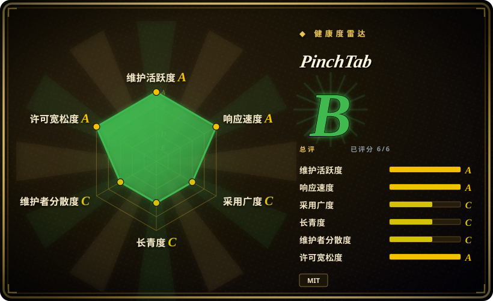
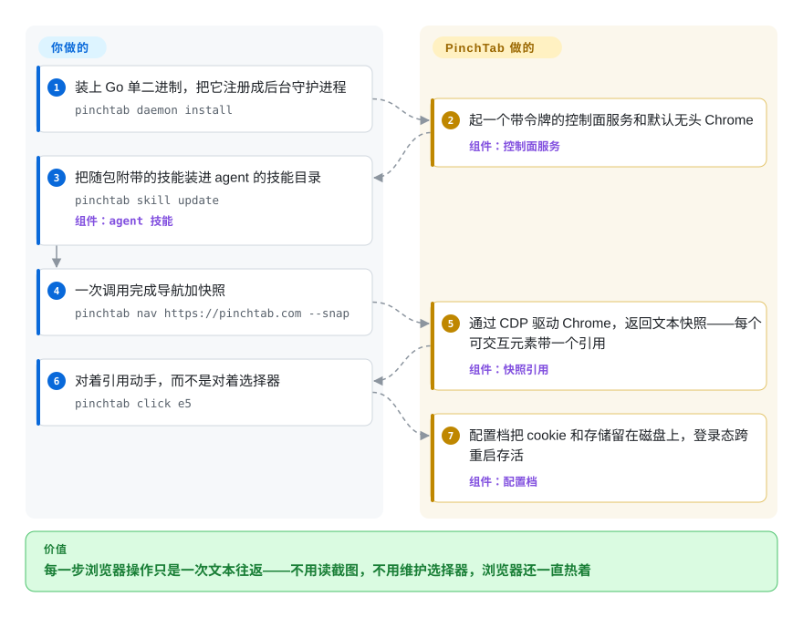

# PinchTab

让 agent 用截图看页面，一次二十几步的浏览器任务就把几十块美元烧在它基本没用的像素上；换读 HTML，模型又被上万行标记淹没，页面一改版选择器还全断。PinchTab 是一个很小的 Go 服务：它让 Chrome 常驻在你机器上，把页面压成带稳定元素引用（`e5`）的文本快照，通过命令行、HTTP 接口或 MCP 交给模型——每走一步浏览器只花一次便宜的往返。

## 何时使用

你在养一个编码 agent（或在给它搭 harness），它的工作有一部分必须操作真实网站：打开预发布环境确认渲染没坏、登录供应商门户拉周报、填一张十个字段的表单、发布前对比两个版本的站点。痛点是结构性的：靠视觉的浏览每页截图约一万 token，读原始 HTML 会被标记淹没，而 CSS 选择器本质上是下一个版本就会撕毁的承诺。你想要的是让浏览器成为 agent *调用的服务*，而不是它内嵌的库。

装一个约 30 MB 的 Go 二进制，跑 `pinchtab daemon install`，把 agent 指向 `http://localhost:9867`——命令行、HTTP API、`pinchtab mcp` 打到的是同一个控制面。agent 跑的循环是：`pinchtab nav <url> --snap` 在导航的同一次调用里返回文本快照，每个可交互元素带一个 `e5` 这样的引用，同文档内改版不失效；`pinchtab click e5`、`pinchtab fill e3 "…"` 对引用操作。服务器还替你管住了那些你本来要自己造的东西：跨重启保住登录态的具名*配置档*（profile）、并行且相互隔离的多个 Chrome 实例、站点审计（`pinchtab audit`，`pinchtab compare --fail-on-diff` 可以当 CI 门禁），以及一套默认全关的安全姿态——JavaScript 执行、cookie、下载、剪贴板、网络拦截这些高危端点族在启用前一律返回 `403`，还有一层间接提示注入防御（IDPI）先扫描页面文本、再把它包成“不可信内容”才交给下游 agent。

和 [Agent Browser](agent-browser.zh.md) 相比，选 PinchTab 的情形是：一个常驻服务器要管多个相互隔离、各挂具名配置档的 Chrome 实例（一个登录着的工作档配一个匿名的草稿档），并且你希望能力闸门和内容扫描在服务端统一强制，而不是各客户端自己的开关——它自家的基准测试宣称端到端 agent 循环比 agent-browser 便宜 9.5%–20.3%，这是自报数字、样本也小（见存疑）。如果你想要连 LLM 循环一起打包的方案，选 [browser-use](browser-use.zh.md)；如果你只有 MCP 一个集成面、且已经在 Playwright 引擎上，选 [Playwright MCP](../playwright-family/playwright-mcp.zh.md)。

## 怎么用起来

PinchTab 把浏览器控制拆成控制面和运行时，而**服务器、运行时和安全闸门全在一个二进制里**。`pinchtab daemon install` 注册一个绑在 `127.0.0.1:9867`、带令牌的后台控制面服务；服务器管理*配置档*（保存的浏览器状态——cookie、存储——让登录态跨重启存活）、拉起*实例*（每个是一个 Chrome 进程，背后套一个轻量 `pinchtab bridge` 运行时）、并在每个实例里追踪*标签页*。一条命令——CLI、HTTP 请求或 stdio 上的 MCP，都是同一个 API——被路由到对应实例，通过 Chrome DevTools Protocol（CDP，Chrome 为自动化暴露的远程控制通道）驱动浏览器，然后返回一份过滤后的快照：一段文本渲染，每个可交互元素带一个 `e5` 这样的引用。引用就是模型用来思考的把手：同一个 `e5` 在同文档内改过滤器、改选择器都存活，只在导航到新文档时过期，所以过期引用会响亮地失败，而不是点到后来落在那个位置上的随便什么东西。它接管的部分：浏览器生命周期、靠独立用户数据目录做到的实例隔离、会话持久化、网页控制台，以及安全层——每个高危端点族（`evaluate`、`cookies`、`download`、`clipboard`、`networkIntercept`……）默认关闭，拒绝时返回的 `403` 会点名是哪道闸门；IDPI 则扫描页面可控文本并包上不可信标记，让下游系统把它当数据而非指令。留给你的部分：模型、agent 循环、允许浏览器访问哪些域名，以及要不要把 `stealthLevel` 从默认的 `light` 指纹规范化往上调。

<!-- flow-steps:begin (generated from flows/pinchtab.json by tools/flow_card.py — do not edit) -->

流程文字版

1. **你**：装上 Go 单二进制，把它注册成后台守护进程 — `pinchtab daemon install`
2. **PinchTab**：起一个带令牌的控制面服务和默认无头 Chrome — 组件：`控制面服务`
3. **你**：把随包附带的技能装进 agent 的技能目录 — `pinchtab skill update` — 组件：`agent 技能`
4. **你**：一次调用完成导航加快照 — `pinchtab nav https://pinchtab.com --snap`
5. **PinchTab**：通过 CDP 驱动 Chrome，返回文本快照——每个可交互元素带一个引用 — 组件：`快照引用`
6. **你**：对着引用动手，而不是对着选择器 — `pinchtab click e5`
7. **PinchTab**：配置档把 cookie 和存储留在磁盘上，登录态跨重启存活 — 组件：`配置档`

**价值**：每一步浏览器操作只是一次文本往返——不用读截图，不用维护选择器，浏览器还一直热着

<!-- flow-steps:end -->

## 何时不用

- **你在写要长期维护的测试套件或跨浏览器自动化代码。** 它是面向 agent 的控制服务，不是测试框架：没有 Firefox/WebKit 通道，没有测试运行器，没有重试和报告机制。用 [Playwright](../playwright-family/playwright.zh.md)（或 [Puppeteer](../browser-driver-frameworks/puppeteer.zh.md)）——它们的定位器和报告器是为要活多年的已提交代码造的。
- **过反爬检测本身就是任务。** 隐身默认是 `light`（只做最小指纹规范化）；`medium`/`full` 反机器人模式要显式开启，CloakBrowser 供应商（用户自备的补丁版 Chromium，从不随包分发）还得你自己拿二进制。Python 爬虫里反爬是第一约束时，[nodriver](../browser-driver-frameworks/nodriver.zh.md) 是为此而生的。
- **Windows 是你的主平台。** 二进制有发布，但项目自己说 Windows 支持“有限、尽力而为”，守护进程工作流也降级——在那里优先 [Agent Browser](agent-browser.zh.md) 或 Playwright 系。
- **DevTools 级诊断是主诉求。** trace、堆快照、网络检查在 PinchTab 里按设计锁在安全闸门后面；这个活儿请用官方检查面 [Chrome DevTools MCP](chrome-devtools-mcp.zh.md)。
- **多租户或对公网提供浏览器服务。** 设计上是单用户、本地优先：会话管理 API 没有按 agent 的授权隔离，文档也直说控制台、HTTP API、MCP、远程 CLI 是同一个特权控制面。要托管机群，改用云浏览器供应商。
- **你要一个无聊、被证明过的依赖。** 七个月大、pre-1.0、实际上一个维护者、招牌基准是自报的——锁版本，外面自己包一层重试。

## 横向对比

| 替代品 | 是否收录 | 我们的评价 | 取舍 |
|---|---|---|---|
| [Agent Browser](agent-browser.zh.md) | ✅ | 一个常驻服务器要编排多个隔离 Chrome 实例、配具名配置档、在服务端强制能力闸门时，选 PinchTab；单浏览器守护进程就够、且看重 Vercel Labs 势头和更广的跨平台装机面时，选 Agent Browser。 | PinchTab 把动作和快照折进一次往返，外加配置档/审计/IDPI；Agent Browser 反手是 batch 命令、a11y 审计、云机群插件和更重的 npm/Homebrew 装机量。 |
| [Playwright MCP](../playwright-family/playwright-mcp.zh.md) | ✅ | 已经在 Playwright 引擎上、只想要厂商维护的 MCP 面时，选 Playwright MCP；agent 还要能 shell 调用或打裸 HTTP API、且多实例/配置档管理重要时，选 PinchTab。 | Playwright MCP 继承微软的引擎成熟度和跨浏览器覆盖，但只说 MCP；PinchTab 是一个 Go 二进制同时给 CLI+HTTP+MCP，代价是项目年轻得多。 |
| [Chrome DevTools MCP](chrome-devtools-mcp.zh.md) | ✅ | 任务是*检查*真实 Chrome——trace、网络、控制台、堆——时选 Chrome DevTools MCP；任务是*操作*页面、且每步 token 成本决定成败时选 PinchTab。 | DevTools MCP 是谷歌官方诊断面、仅 MCP；PinchTab 的内存/网络诊断默认锁在安全闸门后，是配角而不是产品本身。 |
| [browser-use](browser-use.zh.md) | ✅ | 想要开箱即带 LLM 循环的 Python agent 时选 browser-use；自己持有循环（任意语言）、只想要底下快而省 token 的浏览器原语时选 PinchTab。 | browser-use 把推理层和浏览器一起发货；PinchTab 只发控制面，语言无关，但提示词、重试和任务逻辑都归你。 |
| [nodriver](../browser-driver-frameworks/nodriver.zh.md) | ✅ | Python 爬虫必须以反爬存活为第一约束时选 nodriver；客户是 agent、隐身只是次要的选配关切时选 PinchTab。 | nodriver 是围绕规避构建的 CDP 驱动（AGPL-3.0、仅 Chromium、没有 agent 人机工学）；PinchTab 的隐身默认 `light`，复杂度预算花在编排和安全闸门上。 |

## 技术栈

- **语言/运行时：** Go 1.26，单个约 30 MB 二进制（spf13/cobra CLI）；npm 包和 Homebrew tap 只是分发壳——运行时不需要 Node.js。
- **浏览器控制：** 通过 chromedp/chromedp + cdproto 走 Chrome DevTools Protocol；驱动本地已装的 Chrome/Chromium，macOS 上优先专用自动化浏览器（Chrome for Testing）而不是你日常的 Chrome。
- **协议面：** `:9867` 上的 HTTP API（`/openapi.json` 提供 OpenAPI）、CLI 子命令、stdio 上的原生 MCP 服务器（mark3labs/mcp-go）、内置网页控制台——全是同一个控制面的门面。
- **agent 集成：** 随包附带带版本/哈希 frontmatter 的 agent 技能，`pinchtab skill status`/`update` 把它同步进 `~/.claude/skills` 及同类目录；另有 Grok Build 和 OpenClaw 插件。
- **第一方库：** `pinchtab/idpishield`（提示注入扫描）、`pinchtab/seaportal`、`pinchtab/semantic`——独立小模块，各自只有个位数 star。
- **文本抽取：** 模块图里的 go-readability + html-to-markdown 支撑了省 token 形态的 `/text` 和快照输出。
- **工程流程：** CI 工作流、`dev` 工具箱脚本，以及对这个年纪的仓库来说异常完整的 TESTING.md / RELEASE.md / DEFINITION_OF_DONE.md / SECURITY.md。

## 依赖

- **运行时：** Go 二进制加一个本地 Chrome/Chromium——不需要 Node.js、不需要数据库、不需要外部服务。
- **安装：** `curl -fsSL https://pinchtab.com/install.sh | bash`、`brew install pinchtab/tap/pinchtab`、`npm install -g pinchtab`，或 `pinchtab/pinchtab` Docker 镜像（仅无头，`--shm-size=2g`）。
- **按功能选配：** 用户自备的 CloakBrowser 二进制用于原生指纹补丁（从不随包分发）；MCP 客户端用于 `pinchtab mcp`；Docker 用于容器隔离；ARM64/树莓派是一等公民，自动探测 Chromium。

## 运维难度

**本地低，一离开回环就中等。** 本地单用户接近即装即用：安装、`pinchtab daemon install`、设置时生成令牌、默认即安全（回环绑定、高危端点族全关、IDPI 开启），`pinchtab doctor` 诊断配置和浏览器问题。第二天起的成本：守护进程是 KeepAlive/`Restart=always`，会一直跑到你 `pinchtab daemon stop`——要不要它常驻得自己决定；macOS 上无头驱动日常 Chrome 会占住它的窗口，所以要跑专用浏览器。远程和多实例拓扑被明确划为高级运维领域：令牌、TLS、网络边界、按实例的 `securityPolicy` 覆盖、启用哪些端点族，全是你的责任。

## 健康度与可持续性

- **维护——活跃。** 验证前两天内仍有提交（2026-09-26）；从 v0.14.0（2026-06-28）到 v0.15.2（2026-08-26）大约每月一版。
- **响应度——小样本下良好。** 验证时 162 个已关闭 issue 对 3 个开放；2026 年 7–8 月的 bug 报告在 1–5 天内关闭。
- **治理/巴士因子——最弱的轴。** 名义上是组织所有，实际是单维护者：12 个月里 top-1 提交份额 0.79（top-3 达 0.93），luigi-agosti 占前十贡献者提交的约 84%，`luigiagent`（再计 151）读起来像同一个人的二号账号 [推断]，MIT 版权也只署他一人。路线图等于一个人的注意力。
- **年龄/Lindy——还靠不上。** 创建于 2026-02-15（验证时约 7.5 个月），仍处于 pre-1.0。这个窗口里涨到 10.3k star 是快速获得关注——对年轻仓库这是风险信号，不是耐久性证明。
- **采用——渠道存在，量级温和。** npm 上月下载 6,768 次、release 资产下载约 13.4 万次，对着的是 10.3k star 和 777 个 fork（2026-09-28）——关注度跑在安装量前面；curl/Homebrew 安装量未测得，也没有识别出知名生产依赖方 [未验证]。
- **风险旗标。** MIT、未发现改许可史；未做 CVE/安全通告检索 [未验证]。pre-1.0 的 CLI 抖动；对 agent-browser 的基准是自报且自认任务集有偏；仓库描述里的“高级隐身注入”言过其实——默认档（`light`）是刻意保持最小的。

## 存疑（未验证）

- [未验证] “文本抽取约 800 token 一页、比截图便宜 5–13 倍”——README 声明，此处未实测。
- [未验证] 对 agent-browser 的基准（端到端便宜 9.5%–20.3%）：自报，n=5/3/2 次运行，单次方差约 25–30%，任务集与 PinchTab 共同设计——他们自己的 caveat 一节承认了偏置；未独立复现。
- [推断] `luigiagent` 与 luigi-agosti 是同一人——由名字相邻性和贡献模式推断，未证实。
- [推断] 巴士因子 ≈ 1 来自前十贡献者份额；前十之外的贡献者未枚举。
- [未验证] “无遥测、无分析、无必需外发服务依赖”——README 声明；二进制的外发行为未审计。
- [未验证] IDPI 的提示注入检测有效性——机制和默认值有文档，但此处未用真实注入载荷测过。
- [未验证] star 增长的真实性（2026-02 的仓库约 7.5 个月涨到 10.3k）——未做非自然模式审计。
- [推断] CloakBrowser 是外部、独立分发（闭源或独立授权）的浏览器产品；只读了 PinchTab 的集成文档，没看产品本身。
- [未验证] 未执行 CVE / GitHub 安全通告检索。
