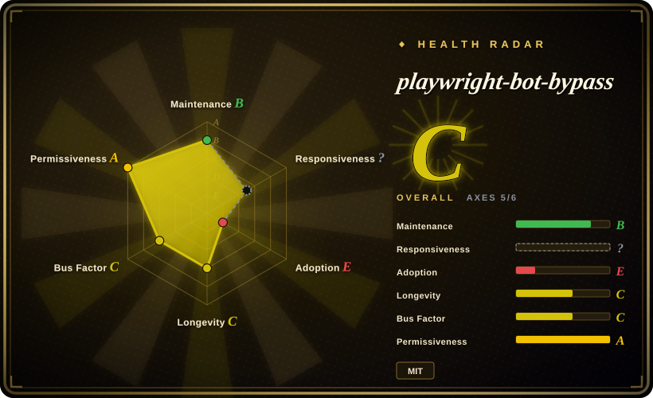
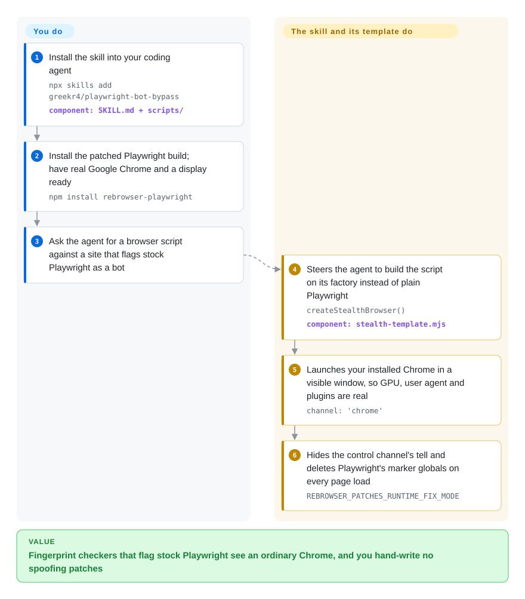

# playwright-bot-bypass

Your Playwright script opens a site and gets "You are a bot!" or a Google `/sorry` captcha page, because the bundled headless browser announces itself: a `HeadlessChrome` user agent, a software-rendered graphics card, `navigator.webdriver = true`. playwright-bot-bypass is a small recipe — a coding-agent skill plus one importable file — that instead drives the real Chrome already installed on your machine, in a visible window, through a patched Playwright build, so those tells are absent rather than faked.

## When to use

You are working on your own laptop with a coding agent (Claude Code, Codex, Cursor) and ask it for a one-off script: pull the first page of search results, read a public profile, run a QA check against a site you are allowed to test. The agent writes ordinary `playwright` code, and the run comes back with `isBot: true` on deviceandbrowserinfo.com, a red `WebDriver` row on bot.sannysoft.com, or Google redirecting to `/sorry`. You reach for this when **the browser's fingerprint is what gives you away** and you have a desktop with Google Chrome and a screen: install the skill, and the agent builds the script on `createStealthBrowser()` instead — the same Playwright `page` API, so nothing else in the script changes.

The deciding tradeoffs against its neighbours. [invisible_playwright_mcp](invisible-playwright-mcp.md) hides automation with a custom-patched Firefox delivered as MCP tools, but has no macOS build and is a prompt surface; this one is a script you keep, on Chrome, and its author's measurements were taken on macOS. [nodriver](../browser-driver-frameworks/nodriver.md) avoids the automation protocol tells structurally but is Python and AGPL-3.0; this stays in JavaScript, the Playwright API and MIT. And compared with hand-collecting stealth snippets, its most useful content is negative: the notes record which popular fakes (spoofed plugins, canvas noise, deleting `navigator.webdriver`, a `navigator.languages` getter) were removed because each one produced an inconsistency a detector could see. The price is that it is roughly 180 lines of glue over a dependency that has not been released since May 2025.

## How it works

Websites tell robots from people partly by asking the browser about itself — its fingerprint: which graphics card draws the page, what the user-agent string (the browser's self-description) says, whether the `navigator.webdriver` flag that automation sets is on. A headless browser (one with no window) answers most of those wrongly. Rather than patching each answer with JavaScript, this recipe changes who is answering: it launches the Google Chrome you already have, with a window, so the answers are simply true. Like sending a real employee through the staff door instead of forging a badge. Two leaks remain that a real Chrome does not fix, and those are the only active measures: `rebrowser-playwright` (a patched Playwright build) hides the trace left when Playwright switches on CDP — the remote-control channel into Chrome — and one init script (code run before each page's own scripts) deletes the marker variables Playwright leaves on `window`.

What it does for you is that assembly, plus three small helpers (random pauses, key-by-key typing, random mouse moves) and a `SKILL.md` that tells a coding agent when and how to use it. What stays yours: Chrome, a display and a real GPU, the script's actual logic, your IP's reputation, any login, and the question of whether the target site's terms allow automation at all. You can also skip the agent entirely and import `scripts/stealth-template.mjs` by relative path from the installed skill folder; it is not an npm package. The "Python support" is two documentation snippets pointing at `undetected-chromedriver` — the repository contains no Python code.

<!-- flow-steps:begin (generated from flows/playwright-bot-bypass.json by tools/flow_card.py — do not edit) -->

Text version of the flow

1. **You**: Install the skill into your coding agent — `npx skills add greekr4/playwright-bot-bypass` — component: `SKILL.md + scripts/`
2. **You**: Install the patched Playwright build; have real Google Chrome and a display ready — `npm install rebrowser-playwright`
3. **You**: Ask the agent for a browser script against a site that flags stock Playwright as a bot
4. **playwright-bot-bypass**: Steers the agent to build the script on its factory instead of plain Playwright — `createStealthBrowser()` — component: `stealth-template.mjs`
5. **playwright-bot-bypass**: Launches your installed Chrome in a visible window, so GPU, user agent and plugins are real — `channel: 'chrome'`
6. **playwright-bot-bypass**: Hides the control channel's tell and deletes Playwright's marker globals on every page load — `REBROWSER_PATCHES_RUNTIME_FIX_MODE`

**Value**: Fingerprint checkers that flag stock Playwright see an ordinary Chrome, and you hand-write no spoofing patches

<!-- flow-steps:end -->

## When NOT to use

- **There is no screen: a server, a container, CI.** Headed mode with real Chrome and a real GPU is a stated requirement ("no display = no stealth"), and on Linux as root you need `--no-sandbox`, which the template itself calls an automation signal. For unattended, headless collection use a browser built to be stealthy without a window — [Obscura](../browser-driver-frameworks/obscura.md) — or the Camoufox family (jo-inc/camofox-browser, an anti-detection browser server for agents, is being added in this same intake batch).
- **What blocks you is your IP, your behaviour, or an interactive challenge.** The project's own table lists Cloudflare Turnstile as "interactive challenge shown", and names DataDome, Kasada, rate limits and login walls as out of scope. No fingerprint fix helps there; the README points to residential IPs plus real interaction, or switching engine to Patchright or [nodriver](../browser-driver-frameworks/nodriver.md).
- **You need the stealth layer to keep up with detectors.** Everything rests on `rebrowser-playwright`, last published as 1.52.0 on 2025-05-09 with no upstream commits since; the marker `window.__playwright_builtins__` cannot be removed and its upstream issue has been open since 2025-06-10. Prefer Patchright — a Playwright fork pushed as recently as 2026-10-07 that the README itself calls a drop-in — when this must work next quarter.
- **You do not need a browser at all.** If the page's data is in the HTML or a JSON endpoint and you are refused at connection time, a real Chrome window is the expensive answer; use [curl_cffi](../../python-tooling/curl-cffi.md), which imitates a browser's TLS handshake from a plain HTTP client.
- **An agent should drive the browser step by step, not write a script.** This gives the agent a code template, not tools for looking at a page. Use [invisible_playwright_mcp](invisible-playwright-mcp.md) for a stealth browser behind MCP tools, or [Playwright MCP](../playwright-family/playwright-mcp.md) when the site does not fight automation.
- **You want Python.** Nothing here is Python; the docs only forward you to `undetected-chromedriver` (GPL-3.0, last pushed 2025-07). Go straight to its stated successor, [nodriver](../browser-driver-frameworks/nodriver.md).
- **You will let the agent copy the skill's Quick Start verbatim.** `SKILL.md` — the file the agent reads — still shows `locale: 'ko-KR'` as the default, while the v2.2.2 release notes say exactly that setting made deviceandbrowserinfo.com report `isBot: true`, and the code default is now no locale. If you use it, call the factory without `locale`; if you cannot review what the agent writes, use plain [Playwright](../playwright-family/playwright.md) against sites that do not block, where none of this matters.
- **You need many parallel sessions.** Each one is a full visible Chrome window on your desktop. For a fleet of isolated instances look at [PinchTab](pinchtab.md), where stealth is a secondary, opt-in mode rather than the point.
- **Evasion is something you would have to defend.** The README restricts itself to "authorized use only"; getting past a site's bot check can breach its terms regardless of the tool.

## Comparison

| Alternative | In index | Our verdict | Tradeoff |
|---|---|---|---|
| [invisible_playwright_mcp](invisible-playwright-mcp.md) | ✅ | Pick invisible_playwright_mcp when an MCP assistant should browse hostile sites itself on Windows or Linux; pick playwright-bot-bypass when you are on a Mac or want a Chrome script you keep in a repo. | A patched Firefox with seed-derived fingerprints and humanized input, far more machinery and release activity; no macOS build, one page per browser, and a launch ping. This recipe is ~180 lines over stock Chrome with nothing to download beyond an npm package. |
| [nodriver](../browser-driver-frameworks/nodriver.md) | ✅ | Pick nodriver when Python is fine and you want the automation-protocol tells avoided by design; pick playwright-bot-bypass when the script must stay on the Playwright API in JavaScript under a permissive license. | nodriver drops WebDriver and Playwright entirely, so there are no Playwright globals to strip, but it is AGPL-3.0, alpha, and its own API. This keeps Playwright's API and MIT, and inherits one marker it cannot delete. |
| [Patchright](https://github.com/Kaliiiiiiiiii-Vinyzu/patchright) | not indexed | Pick Patchright when the stealth layer has to stay maintained; pick playwright-bot-bypass only if you also want its agent-facing skill text and its notes on which fakes to remove. | Patchright is an actively pushed Playwright fork (Apache-2.0, ~4.8k stars, ~1.46M npm downloads in the month to 2026-10-04) against `rebrowser-playwright`'s ~83k and a last release in 2025-05. Not added in this tab batch. |
| [rebrowser-patches](https://github.com/rebrowser/rebrowser-patches) | not indexed | Use `rebrowser-playwright` directly when you already know to pair it with headed real Chrome; add playwright-bot-bypass when you want that pairing, the artifact strip and the env var pre-wired for an agent. | The dependency itself: it fixes the `Runtime.enable` leak and nothing else. This project adds the launch settings, one init script and documentation on top, and cannot outlive it. Not added in this tab batch. |
| [Obscura](../browser-driver-frameworks/obscura.md) | ✅ | Pick Obscura for headless, unattended extraction where no desktop exists; pick playwright-bot-bypass for attended runs where a genuine Chrome is the most convincing fingerprint. | Obscura is a self-contained Rust engine with stealth builds and no window, so it scales on servers but has an independent engine's compatibility tail. This needs a screen and a GPU and gets Chrome's exact behaviour for free. |

## Tech stack

- **Language:** JavaScript, ES modules (`.mjs`), Node.js 18+.
- **Core dependency:** `rebrowser-playwright` `^1.52.0` — Playwright 1.52 with the rebrowser Runtime-fix patches; `playwright` is an optional dependency used only by the A/B example.
- **Browser:** the user's installed Google Chrome via `channel: 'chrome'`, headed, launched with `--disable-blink-features=AutomationControlled`.
- **Shipped code:** one factory module (`scripts/stealth-template.mjs`, about 180 lines: `createStealthBrowser`, `saveSession`, `humanDelay`, `humanType`, `simulateMouseMovement`), one sannysoft smoke test, three examples (Google search, X profile, A/B against plain Playwright).
- **Distribution:** a Claude Code plugin marketplace manifest (`.claude-plugin/`) and a skills.sh-installable skill directory; not published to npm (registry lookup returned 404 on 2026-10-08).

## Dependencies

- **Google Chrome** installed (Chromium alone is not enough for the real user agent and plugin list).
- **A display and a real GPU** — headed mode is mandatory; without a GPU, WebGL reports SwiftShader, the software renderer the recipe exists to avoid.
- **Node.js 18+** and `npm install rebrowser-playwright` in the directory of your script.
- **A coding agent that loads skills** (Claude Code, Codex, Cursor via skills.sh) if you use the skill path; none if you import the template yourself.
- **Not included and often decisive:** a clean residential IP (the author's real-site results were measured from one), proxies if you need them, and any logged-in session state (`storageState` is supported, sourcing it is yours).

## Ops difficulty

**Low to start, and the upkeep is not in your hands.** Installation is one skill command and one `npm install`; there is no service, no database, no binary to download. What you actually operate is an arms race you do not control: the measurements are the author's, from one macOS machine on 2026-06-10 and 2026-08-27, and a detector update or a Chrome release can change the result without any change in this repository. The patched Playwright underneath is pinned at 1.52 (May 2025) while Chrome keeps updating itself, so a future Chrome that Playwright 1.52 cannot drive would break it until the upstream ships again. Every run opens a visible window, which rules out quiet background or scheduled use on a shared machine, and the repository has no CI, so regressions are found by users (the one external issue was exactly that: a red sannysoft row the bundled test reported as a pass).

## Health & viability

- **Maintenance — bursts, then quiet.** 18 commits between 2026-01-29 and 2026-08-27, three tagged releases (v2.2.0 on 2026-07-09, v2.2.1 and v2.2.2 both on 2026-08-27), nothing since (GitHub API, 2026-10-08). Six weeks of silence is not abandonment for a project this small, but there is no cadence to rely on.
- **Governance / bus factor — one person.** User-owned; the owner authored 17 of the 18 commits and the single outside contribution (a one-line plugin-prototype fix) waited 14 days to merge. No CI, no tests beyond a manual smoke script, and `SECURITY.md` is GitHub's unedited placeholder listing versions "5.1.x" that do not exist.
- **Age & Lindy — no prior.** About eight months old. More important, its durability is capped by `rebrowser-playwright`, which is older but has been still since 2025-05-09: age without activity does not earn the Lindy benefit, and the layer that decays fastest here is the one nobody is updating.
- **Adoption — small.** 200 stars, 14 forks, one external issue and one external pull request in its lifetime; no registry package, so no download signal. The stars measure interest in the topic more than use.
- **Risk flags.** Documentation trails the code (the skill file still describes v2.2.0 and a default the next release removed as harmful); the headline "8/8 detectors" is self-measured and explicitly excludes the systems most production sites deploy; one Playwright marker cannot be stripped; and it is an evasion tool, so effectiveness is perishable by nature. `[推断：依据仓库提交与发布记录，未做实测]`

## Caveats (unverified)

- [未验证] The detection results ("8/8 detectors", 9/9 repeat runs, "You are human!", real-site loads for Reddit/YouTube/TikTok/X and the Instagram/Facebook/LinkedIn login-modal outcome) are the author's own measurements on macOS with headed Chrome from a residential IP (2026-06-10, re-verified 2026-08-27 per the template header); not reproduced here — that needs a desktop with Chrome and a live run, and results vary by site, IP and date.
- [未验证] Whether `rebrowser-playwright` 1.52.0 still drives the current stable Chrome on 2026-10-08. The latest evidence in the repo is an outside user running it on Chrome 147 (issue #1, 2026-05) and the author's 2026-08-27 re-verification; not tested here for the same reason.
- [推断] That `rebrowser-patches` is dormant rather than finished is read from its last commit and npm publish (both 2025-05-09) and 37 open issues; the maintainers have not announced an end of life that I found.
- [推断] That an agent following `SKILL.md` would reproduce the `locale` leak is inferred from the text (Quick Start and options table still show `locale: 'ko-KR'`) against the v2.2.2 release notes and code default; how a given agent weighs the Quick Start against the "Using the Template" section was not tested.
- [未验证] Whether the three helpers change any detector's verdict. `simulateMouseMovement` makes uniformly random straight-segment moves and its comment says it "helps avoid" Cloudflare Turnstile, while the project's own table shows Turnstile still presenting a challenge; no measurement isolates the helpers' effect.
- [推断] The comparison with Patchright, nodriver, Obscura and invisible_playwright_mcp is based on each project's documentation and repository metadata (stars, push dates, npm downloads as of 2026-10-08), not on a head-to-head detection benchmark.
- [推断] The risk-flag summary in Health & viability is judgement from commit, release and issue history; no maintainer statement about future plans exists in the repository.
