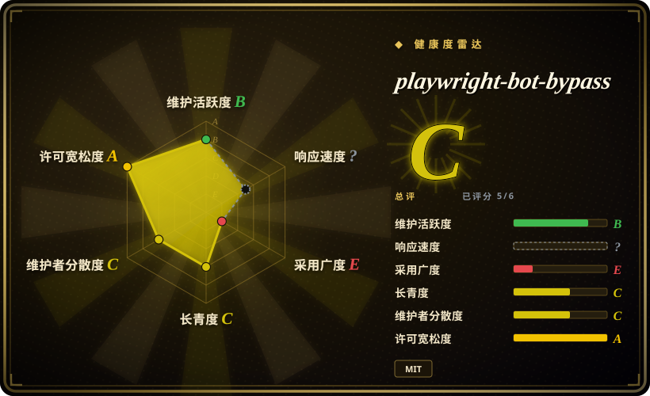
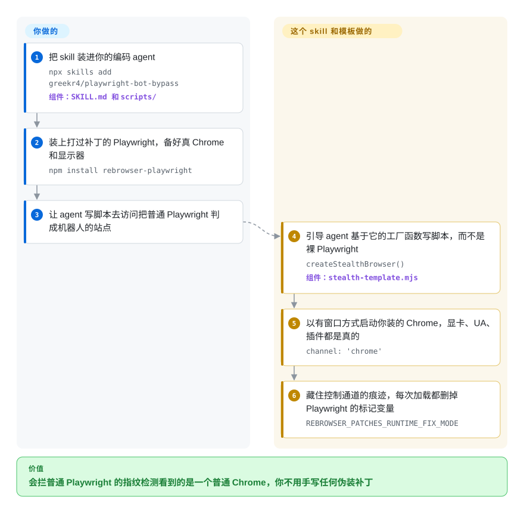

# playwright-bot-bypass

你的 Playwright 脚本一打开网站就被判成机器人，或者被 Google 跳到 `/sorry` 验证码页——因为自带的无头浏览器会自报家门：UA 里写着 `HeadlessChrome`，显卡是软件模拟的，`navigator.webdriver` 为 `true`。playwright-bot-bypass 是一份很小的配方（一个编码 agent 的 skill 加一个可直接 import 的文件）：改用你机器上已经装好的真 Chrome，开着窗口跑，底下换成打过补丁的 Playwright，这些破绽就不是被伪造掉，而是根本不存在。

## 何时使用

你在自己的笔记本上用编码 agent（Claude Code、Codex、Cursor），让它写个一次性脚本：抓搜索结果第一页、读一个公开主页、对你有权测试的站点跑个 QA 检查。agent 写出来的是普通 `playwright` 代码，跑完的结果是 deviceandbrowserinfo.com 报 `isBot: true`、bot.sannysoft.com 上 `WebDriver` 一行是红的，或者 Google 把你重定向到 `/sorry`。当**暴露你的正是浏览器指纹**，而你手边有一台装了 Google Chrome、带屏幕的桌面机时，就该想到它：装上 skill，agent 会改用 `createStealthBrowser()` 来搭脚本，拿到的仍是 Playwright 的 `page` 接口，脚本其余部分不用动。

和相邻项目的决定性取舍如下。[invisible_playwright_mcp](invisible-playwright-mcp.zh.md) 靠一个定制补丁的 Firefox 藏住自动化痕迹，以 MCP 工具形式交付，但没有 macOS 版本，而且是提示词入口；本项目给你的是一份能留在仓库里的 Chrome 脚本，作者的实测就是在 macOS 上做的。[nodriver](../browser-driver-frameworks/nodriver.zh.md) 从结构上避开自动化协议的破绽，但它是 Python、AGPL-3.0；本项目留在 JavaScript、Playwright 接口和 MIT 许可之内。和自己到处抄反检测代码片段相比，它最有用的内容反而是“不要做什么”：文档记下了哪些流行的伪装（伪造插件列表、canvas 加噪、删掉 `navigator.webdriver`、给 `navigator.languages` 加 getter）被移除，因为每一个都制造了检测方能看到的不一致。代价是：它只是大约 180 行胶水代码，底下那个依赖自 2025 年 5 月起就没再发版。

## 怎么用起来

网站分辨机器人和真人，一部分靠盘问浏览器自己的情况，也就是指纹：页面是哪块显卡画的、UA 字符串（浏览器的自我介绍）怎么写、自动化工具会打开的 `navigator.webdriver` 标志是不是开着。无头浏览器（没有窗口的浏览器）对这些问题大多答错。这份配方不去用 JavaScript 逐个修答案，而是换一个答题的人：直接启动你已经装好的 Google Chrome，并且带窗口，于是答案本来就是真的。好比让一个真员工走员工通道，而不是伪造一张工牌。真 Chrome 解决不了的破绽还剩两处，这也是它仅有的两项主动措施：`rebrowser-playwright`（打过补丁的 Playwright）藏住 Playwright 打开 CDP（通往 Chrome 的远程控制通道）时留下的痕迹；一段初始化脚本（抢在页面自身脚本之前执行的代码）删掉 Playwright 留在 `window` 上的标记变量。

它替你做的就是这套组装，外加三个小辅助函数（随机停顿、逐字输入、随机移动鼠标）和一份告诉编码 agent 何时用、怎么用的 `SKILL.md`。仍然归你负责的有：Chrome、显示器和真显卡、脚本的实际逻辑、你出口 IP 的信誉、登录态，以及目标站点的条款到底允不允许自动化。你也可以完全不经过 agent，从装好的 skill 目录里按相对路径 import `scripts/stealth-template.mjs`；它没有发布成 npm 包。所谓“Python 支持”只是文档里两段指向 `undetected-chromedriver` 的示例，仓库里没有任何 Python 代码。

<!-- flow-steps:begin (generated from flows/playwright-bot-bypass.json by tools/flow_card.py — do not edit) -->

流程文字版

1. **你**：把 skill 装进你的编码 agent — `npx skills add greekr4/playwright-bot-bypass` — 组件：`SKILL.md 和 scripts/`
2. **你**：装上打过补丁的 Playwright，备好真 Chrome 和显示器 — `npm install rebrowser-playwright`
3. **你**：让 agent 写脚本去访问把普通 Playwright 判成机器人的站点
4. **playwright-bot-bypass**：引导 agent 基于它的工厂函数写脚本，而不是裸 Playwright — `createStealthBrowser()` — 组件：`stealth-template.mjs`
5. **playwright-bot-bypass**：以有窗口方式启动你装的 Chrome，显卡、UA、插件都是真的 — `channel: 'chrome'`
6. **playwright-bot-bypass**：藏住控制通道的痕迹，每次加载都删掉 Playwright 的标记变量 — `REBROWSER_PATCHES_RUNTIME_FIX_MODE`

**价值**：会拦普通 Playwright 的指纹检测看到的是一个普通 Chrome，你不用手写任何伪装补丁

<!-- flow-steps:end -->

## 何时不用

- **没有屏幕：服务器、容器、CI。** 带窗口运行、真 Chrome、真显卡是写明的前提（“no display = no stealth”）；在 Linux 上以 root 运行还得加 `--no-sandbox`，而模板自己就说这是一个自动化信号。无人值守的无头采集，应该用不靠窗口也能隐身的浏览器——[Obscura](../browser-driver-frameworks/obscura.zh.md)，或者 Camoufox 一系（面向 agent 的反检测浏览器服务 jo-inc/camofox-browser 正在同一批次收录）。
- **拦你的是 IP、行为或交互式挑战。** 项目自己的表格把 Cloudflare Turnstile 记为“仍出现交互挑战”，并把 DataDome、Kasada、限流和登录墙列为不处理的范围。这类问题修指纹没有用；README 给的方向是住宅 IP 加真实交互，或者换引擎用 Patchright、[nodriver](../browser-driver-frameworks/nodriver.zh.md)。
- **你需要反检测这一层持续跟上检测方。** 一切都压在 `rebrowser-playwright` 上，它最后一次发布是 2025-05-09 的 1.52.0，上游此后没有提交；标记变量 `window.__playwright_builtins__` 删不掉，对应的上游 issue 从 2025-06-10 开到现在。如果下个季度还得能用，优先选 Patchright——一个到 2026-10-07 仍有推送的 Playwright 分支，README 自己也说它可以直接替换。
- **你其实不需要浏览器。** 如果数据就在 HTML 或某个 JSON 接口里，而你在建立连接时就被拒，开一个真 Chrome 窗口是最贵的解法；用 [curl_cffi](../../python-tooling/curl-cffi.zh.md)，它让普通 HTTP 客户端模仿浏览器的 TLS 握手。
- **要的是 agent 一步步操作浏览器，而不是写脚本。** 本项目给 agent 的是代码模板，不是查看页面的工具。要 MCP 工具背后的隐身浏览器，用 [invisible_playwright_mcp](invisible-playwright-mcp.zh.md)；站点不反自动化时，用 [Playwright MCP](../playwright-family/playwright-mcp.zh.md)。
- **你要用 Python。** 这里没有任何 Python 代码，文档只是把你转给 `undetected-chromedriver`（GPL-3.0，最后推送于 2025-07）。直接用它声明的继任者 [nodriver](../browser-driver-frameworks/nodriver.zh.md)。
- **你会让 agent 原样照抄 skill 的 Quick Start。** agent 读的那份 `SKILL.md` 仍把 `locale: 'ko-KR'` 写成默认值，而 v2.2.2 的发布说明讲的正是这个设置让 deviceandbrowserinfo.com 报出 `isBot: true`，代码里的默认值已经改成不设 locale。要用的话，调用工厂函数时别传 `locale`；如果你没法审 agent 写的东西，那就只对不拦自动化的站点用普通 [Playwright](../playwright-family/playwright.zh.md)，那种场景下这些都无关紧要。
- **你要很多并行会话。** 每个会话都是桌面上一个完整可见的 Chrome 窗口。要一批相互隔离的实例，看 [PinchTab](pinchtab.zh.md)，不过隐身在它那里只是次要的可选模式。
- **绕过检测这件事本身需要你来辩护。** README 把自己限定在“仅限授权使用”；不管用哪个工具，绕过站点的机器人检测都可能违反对方条款。

## 横向对比

| 替代品 | 是否收录 | 我们的评价 | 取舍 |
|---|---|---|---|
| [invisible_playwright_mcp](invisible-playwright-mcp.zh.md) | ✅ | 要让 MCP 助手自己在 Windows 或 Linux 上浏览有防护的站点，选 invisible_playwright_mcp；你用 Mac，或者想要一份留在仓库里的 Chrome 脚本，选 playwright-bot-bypass。 | 对方是打过补丁的 Firefox，指纹由种子推导，输入拟人化，机制和发版活跃度都高得多；但没有 macOS 版本，每个浏览器只有一个页面，启动时还会发一次统计请求。本项目是架在原版 Chrome 上的约 180 行代码，除了一个 npm 包不用下载别的。 |
| [nodriver](../browser-driver-frameworks/nodriver.zh.md) | ✅ | 能接受 Python，并且希望从设计上避开自动化协议的破绽，选 nodriver；脚本必须留在 JavaScript 的 Playwright 接口上、并且要宽松许可时，选 playwright-bot-bypass。 | nodriver 完全不用 WebDriver 和 Playwright，所以没有 Playwright 全局变量要清理，但它是 AGPL-3.0、alpha 阶段、接口自成一套。本项目保住了 Playwright 接口和 MIT，同时继承了一个删不掉的标记。 |
| [Patchright](https://github.com/Kaliiiiiiiiii-Vinyzu/patchright) | 未收录 | 反检测层必须有人持续维护时选 Patchright；只有当你还想要它那份面向 agent 的 skill 文本和“哪些伪装该删”的记录时，才选 playwright-bot-bypass。 | Patchright 是仍在活跃推送的 Playwright 分支（Apache-2.0，约 4.8k star，截至 2026-10-04 的一个月里 npm 下载约 146 万），而 `rebrowser-playwright` 同期约 8.3 万、最后一次发布在 2025-05。本次标签批次未收录（not added in this tab batch）。 |
| [rebrowser-patches](https://github.com/rebrowser/rebrowser-patches) | 未收录 | 如果你已经知道要把它和带窗口的真 Chrome 配在一起，直接用 `rebrowser-playwright`；想让这套搭配、标记清理和环境变量都替 agent 预先接好线，再加上 playwright-bot-bypass。 | 它就是那个依赖本身：只修 `Runtime.enable` 泄露，别的不管。本项目在上面加了启动参数、一段初始化脚本和文档，寿命不可能长过它。本次标签批次未收录（not added in this tab batch）。 |
| [Obscura](../browser-driver-frameworks/obscura.zh.md) | ✅ | 没有桌面、要无人值守地无头抽取时选 Obscura；有人在场、并且真 Chrome 才是最可信的指纹时，选 playwright-bot-bypass。 | Obscura 是自带隐身构建、不需要窗口的独立 Rust 引擎，能在服务器上铺开，但要承担独立引擎的兼容性长尾。本项目需要屏幕和显卡，换来的是和 Chrome 完全一致的行为。 |

## 技术栈

- **语言：** JavaScript，ES 模块（`.mjs`），Node.js 18+。
- **核心依赖：** `rebrowser-playwright` `^1.52.0`——带 rebrowser Runtime-fix 补丁的 Playwright 1.52；`playwright` 是可选依赖，只有 A/B 示例用到。
- **浏览器：** 通过 `channel: 'chrome'` 使用用户已安装的 Google Chrome，带窗口运行，启动参数为 `--disable-blink-features=AutomationControlled`。
- **随仓库提供的代码：** 一个工厂模块（`scripts/stealth-template.mjs`，约 180 行，导出 `createStealthBrowser`、`saveSession`、`humanDelay`、`humanType`、`simulateMouseMovement`）、一个 sannysoft 冒烟测试、三个示例（Google 搜索、X 主页、与普通 Playwright 的 A/B 对照）。
- **分发方式：** Claude Code 插件市场清单（`.claude-plugin/`）和可用 skills.sh 安装的 skill 目录；没有发布到 npm（2026-10-08 查询注册表返回 404）。

## 依赖

- **已安装的 Google Chrome**（只有 Chromium 不够，拿不到真实的 UA 和插件列表）。
- **显示器和真显卡**——必须带窗口运行；没有 GPU 时 WebGL 会报出 SwiftShader，也就是这份配方要避开的软件渲染器。
- **Node.js 18+**，并在脚本所在目录执行 `npm install rebrowser-playwright`。
- **能加载 skill 的编码 agent**（Claude Code、Codex、通过 skills.sh 的 Cursor），如果走 skill 这条路；自己 import 模板则不需要。
- **不包含但常常起决定作用的：** 干净的住宅 IP（作者的真实站点结果就是在住宅 IP 上测的）、需要时的代理，以及登录后的会话状态（支持 `storageState`，但状态从哪来由你解决）。

## 运维难度

**上手低，后续维护不在你手里。** 安装只是一条 skill 命令加一次 `npm install`，没有服务、没有数据库、没有要下载的二进制。你真正在运维的是一场你控制不了的攻防：实测数据是作者自己在一台 macOS 机器上于 2026-06-10 和 2026-08-27 得到的，检测方更新或 Chrome 升级都可能改变结果，而这个仓库一行都不用变。底下那个打补丁的 Playwright 固定在 1.52（2025 年 5 月），Chrome 却一直在自动升级，哪天出了 Playwright 1.52 驱动不了的 Chrome，就只能等上游再发版。每次运行都会弹出可见窗口，所以不适合在共用机器上安静地后台跑或定时跑；仓库没有 CI，回归靠用户发现（唯一一个外部 issue 正是如此：sannysoft 上有一行变红，自带的测试却报告通过）。

## 健康度与可持续性

- **维护——一阵一阵，然后安静。** 2026-01-29 到 2026-08-27 之间共 18 次提交，三个带标签的发布（v2.2.0 于 2026-07-09，v2.2.1 和 v2.2.2 都在 2026-08-27），此后没有动静（GitHub API，2026-10-08）。对这么小的项目，六周没动不算弃坑，但也没有可以依赖的节奏。
- **治理与巴士系数——一个人。** 仓库归个人所有；18 次提交里有 17 次出自仓库主人，唯一一次外部贡献（一行修复插件原型的改动）等了 14 天才合并。没有 CI，除了手动冒烟脚本没有别的测试，`SECURITY.md` 是 GitHub 模板原样未改，里面列的 “5.1.x” 版本根本不存在。
- **年龄与 Lindy——没有先验。** 项目大约八个月大。更要紧的是，它的寿命上限由 `rebrowser-playwright` 决定，那个依赖年头更长，却从 2025-05-09 起就停着：只有年龄没有活跃度，拿不到 Lindy 的加分，而这里衰减最快的恰恰是没人在更新的那一层。
- **采用度——小。** 200 个 star、14 个 fork，整个生命周期里只有一个外部 issue 和一个外部 PR；没有注册表包，也就没有下载量信号。这些 star 反映的更多是对这个话题的兴趣，而不是实际使用。
- **风险信号。** 文档落后于代码（skill 文件描述的还是 v2.2.0，并保留着下一个版本因有害而移除的默认值）；主打的“8/8 检测器通过”是自测结果，而且明确排除了多数生产站点实际部署的那些系统；有一个 Playwright 标记删不掉；它本身是规避工具，效果天然会过期。`[推断：依据仓库提交与发布记录，未做实测]`

## 存疑（未验证）

- [未验证] 检测结果（“8/8 检测器”、9/9 次重复运行、“You are human!”、Reddit/YouTube/TikTok/X 的真实站点加载，以及 Instagram/Facebook/LinkedIn 出现登录弹窗的结论）都是作者自己在 macOS、带窗口的 Chrome、住宅 IP 上的测量（2026-06-10，模板文件头注明 2026-08-27 复测）；这里没有复现——需要一台装了 Chrome 的桌面机实际运行，而且结果随站点、IP 和日期变化。
- [未验证] `rebrowser-playwright` 1.52.0 在 2026-10-08 是否还能驱动当前稳定版 Chrome。仓库里最新的证据是一位外部用户在 Chrome 147 上跑通（issue #1，2026-05）和作者 2026-08-27 的复测；出于同样的原因，这里没有测试。
- [推断] 说 `rebrowser-patches` 是停滞而不是“已完成”，依据是它最后一次提交和 npm 发布都在 2025-05-09，并且有 37 个未关闭的 issue；没有找到维护者宣布停止维护的声明。
- [推断] 说 agent 照着 `SKILL.md` 做会重现 `locale` 泄露，是把文本（Quick Start 和选项表仍写着 `locale: 'ko-KR'`）与 v2.2.2 发布说明、代码默认值对照后的推断；某个具体 agent 在 Quick Start 和 “Using the Template” 两节之间怎么取舍，没有测试。
- [未验证] 三个辅助函数能不能改变任何检测器的结论。`simulateMouseMovement` 做的是均匀随机的直线段移动，注释说它“有助于避开” Cloudflare Turnstile，而项目自己的表格显示 Turnstile 照样弹出挑战；没有任何测量单独分离出这些辅助函数的效果。
- [推断] 与 Patchright、nodriver、Obscura、invisible_playwright_mcp 的对比依据的是各项目的文档和仓库元数据（star、推送日期、npm 下载量，截至 2026-10-08），不是同场的检测对比测试。
- [推断] “健康度与可持续性”里的风险信号总结，是根据提交、发布和 issue 历史做的判断；仓库里没有维护者关于未来计划的任何说明。
