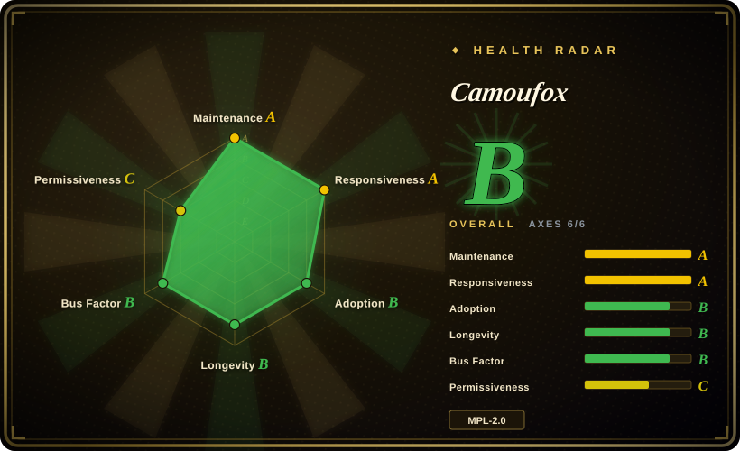
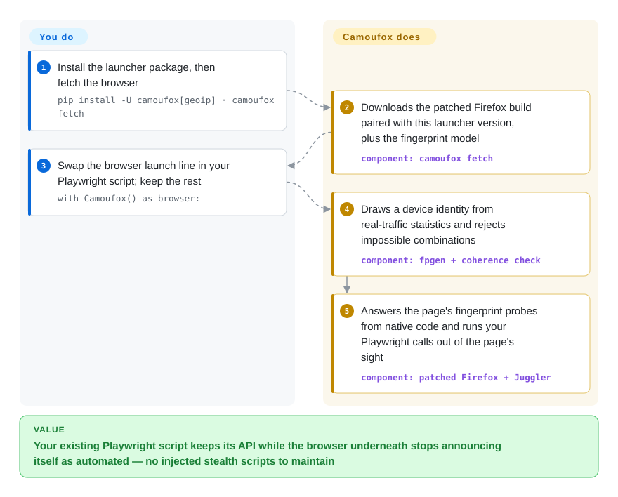

# Camoufox

Your Playwright scraper passes on test pages, then the real target answers with a "verify you are human" wall, because the site can read that an automation tool is steering the browser. Camoufox is a rebuilt Firefox that changes what the browser reports about itself from inside its own engine code, so your existing Playwright script drives something that looks like an ordinary visitor's machine.

## When to use

You maintain a scraping or monitoring pipeline in Python or Node, written against Playwright. It ran for months, and then the target put a bot wall in front of itself: `page.goto()` now lands on `Just a moment...`, or the page loads and the data quietly comes back empty. You already tried a "stealth" plugin that overwrites `navigator.webdriver` with injected JavaScript, and the site caught that too — a patched property no longer says `[native code]` when the detector asks. You reach for Camoufox when **the browser itself is the tell**: it is a Firefox fork whose reported device, screen, WebGL, fonts, audio, WebRTC address, timezone and locale are set inside the C++ implementation, and whose Playwright control code runs in a copy of the page that site scripts cannot see. Your script changes one line — the browser launch — and keeps the Playwright API.

The deciding tradeoff against its neighbours: [Playwright](../playwright-family/playwright.md) is stable and institutionally backed but makes no attempt to hide; [nodriver](nodriver.md) and Patchright hide automation in *Chromium*, which is what you need when a site expects Chrome; [Obscura](obscura.md) is a far lighter self-contained browser with a stealth mode but its own engine, not a real Firefox. Camoufox is the choice when you want a full, real browser engine with engine-level fingerprint control and are willing to pay for it in a gigabyte-class download, a Firefox-only identity, and a project that its own README labels as not suitable for stable production use.

## How it works

Camoufox is two things you install together: a patched Firefox binary, and a small launcher library (Python `camoufox`, or the npm package `camoufox`) that starts it through Playwright. When you launch, the launcher draws a device identity — operating system, GPU, screen, fonts, voices — from `fpgen`, a statistical model of which devices actually appear in web traffic, and rejects combinations that cannot exist (a Windows user agent with an Apple GPU). It hands that identity to the browser, where the patches answer every question a page asks with those values from native code, rather than by injecting JavaScript that a detector could spot. Playwright talks to Firefox through Juggler — Firefox's own automation channel, separate from the Chrome DevTools Protocol — and Camoufox patches Juggler so that Playwright's helper code works on an isolated copy of the page. Think of a stage actor whose costume is sewn on rather than held up by visible pins: there is nothing loose for the audience to tug. What it does for you: the fingerprint, its internal consistency, hiding the automation layer, optional recorded-human mouse paths (`humanize=True`), and deriving timezone and locale from your proxy's exit address. What stays yours: the proxy and its IP reputation, your request rate and behaviour, re-fetching the browser after each upgrade, and the judgement about whether the target's terms allow any of this. A second entry point, `camoufox server`, exposes the same browser as a Playwright WebSocket server for other languages; one server is one browser, so its fingerprint does not rotate between sessions.

<!-- flow-steps:begin (generated from flows/camoufox.json by tools/flow_card.py — do not edit) -->

Text version of the flow

1. **You**: Install the launcher package, then fetch the browser — `pip install -U camoufox[geoip] · camoufox fetch`
2. **Camoufox**: Downloads the patched Firefox build paired with this launcher version, plus the fingerprint model — component: `camoufox fetch`
3. **You**: Swap the browser launch line in your Playwright script; keep the rest — `with Camoufox() as browser:`
4. **Camoufox**: Draws a device identity from real-traffic statistics and rejects impossible combinations — component: `fpgen + coherence check`
5. **Camoufox**: Answers the page's fingerprint probes from native code and runs your Playwright calls out of the page's sight — component: `patched Firefox + Juggler`

**Value**: Your existing Playwright script keeps its API while the browser underneath stops announcing itself as automated — no injected stealth scripts to maintain

<!-- flow-steps:end -->

## When NOT to use

- **The site does not fight bots.** For your own app, an intranet or ordinary public pages, stealth buys nothing and costs a custom browser build that trails Playwright. Use [Playwright](../playwright-family/playwright.md), which is Microsoft-backed and covers Chromium, Firefox and WebKit.
- **The target expects Chrome.** Camoufox presents as Firefox only; its README states it "does not fully support injecting Chromium fingerprints" and that some web application firewalls test for the behaviour of Firefox's JavaScript engine, "which is impossible to spoof". For an undetected Chromium driven from code, use [nodriver](nodriver.md) or Patchright.
- **You need something you can call production-stable.** The README carries a banner: "This project is under development. It may not be suitable for stable production use." Every browser release is tagged `beta`, and between 2025-03-15 and 2026-01-07 there was no release at all, during which the project's own site says detection performance "has gone down". If a missed week of data is expensive, buy a hosted unblocking API (not a repository) with a success-rate contract, or stay on [Playwright](../playwright-family/playwright.md) against sites that permit automation.
- **You want an agent to browse through tools, not write code.** Camoufox is a library you script. For an MCP server on a patched Firefox use [invisible_playwright_mcp](../agent-browser-tools/invisible-playwright-mcp.md); `jo-inc/camofox-browser` wraps this same engine as a browser server for agents.
- **You only need the HTML, not a browser.** If the block is on the network handshake rather than on JavaScript checks, a full Firefox per session is the expensive answer; a fetching framework such as `D4Vinci/Scrapling` or an HTTP client that imitates a browser's TLS handshake is far cheaper. For pages that need scripts run but never pixels, [Lightpanda](lightpanda.md) is far lighter.
- **You must run in a locked-down or tiny sandbox.** Open issues report a hang on read-only filesystems such as AWS Lambda and Cloud Run (#572), a crash under gVisor (#740), memory growth in long-running tasks (#245) and permanent freezes in prolonged sessions (#804). Each platform archive of v156.0.1-beta.36 is about 1.3 GB. For serverless or dense fleets use [Obscura](obscura.md) or [Lightpanda](lightpanda.md).
- **You depend on Playwright tracing, CDP, or the newest Playwright.** Firefox is driven over Juggler, so there is no Chrome DevTools Protocol; trace frame snapshots are an open issue (#101); and both launchers cap Playwright below 1.63 because they import a private Playwright API. For debugging-grade tooling use [Playwright](../playwright-family/playwright.md) or [Chrome DevTools MCP](../agent-browser-tools/chrome-devtools-mcp.md).
- **Your IP address is the problem.** Camoufox hides the browser, not where the request comes from; its README says it "is intended to be used with rotating proxies (preferably residential IPs)", which you source and pay for. Free lists from a tool like [proxy_pool](../../proxy-pool/proxy-pool.md) rarely carry the reputation this needs.
- **You need a permissive licence end to end.** The browser is MPL-2.0 (changes to its files must be shared when you distribute a build) and the bundled mouse-trajectory data is LGPLv3-or-later; only the launchers are MIT. If you will ship a modified browser inside a closed product, [Obscura](obscura.md) (Apache-2.0) is simpler to clear.
- **Evasion itself is what you would have to defend.** Getting past a site's bot protection can breach its terms of service and, depending on jurisdiction and data, the law; the tool does not change that. Where an official API or a licensed dataset exists, use it.

## Comparison

| Alternative | In index | Our verdict | Tradeoff |
|---|---|---|---|
| [Playwright](../playwright-family/playwright.md) | ✅ | Pick Playwright whenever the site tolerates automation, or when you need three engines, tracing and a stable release train; pick Camoufox only when detection is what breaks the job. | Microsoft backing and the full tooling surface, but a stock browser that anti-bot services flag; Camoufox keeps the same API on a hidden Firefox and gives up stability guarantees and the latest Playwright. |
| [nodriver](nodriver.md) | ✅ | Pick nodriver when the target expects Chrome and you are happy with its own async Python API; pick Camoufox when you want to keep Playwright code and can present as Firefox. | nodriver controls a normal Chromium over direct CDP without WebDriver (AGPL-3.0, Chromium only, anti-detection best-effort); Camoufox rebuilds the browser to rotate whole device identities, at ~1.3 GB per build. |
| [Obscura](obscura.md) | ✅ | Pick Obscura for dense, cheap fleets where a ~70 MB binary with a stealth switch is enough; pick Camoufox when the site's checks are deep enough that only a real, full browser engine survives them. | Obscura is light, Apache-2.0 and CDP-speaking, but its own young engine can differ from any real browser; Camoufox is a genuine Firefox with engine-level spoofing, heavy and Firefox-only. |
| [invisible_playwright_mcp](../agent-browser-tools/invisible-playwright-mcp.md) | ✅ | Pick invisible_playwright_mcp when the consumer is a coding assistant that wants MCP tools; pick Camoufox when your own code drives the browser and you want the older, more widely installed engine. | Both patch Firefox in C++; that project derives a fingerprint from a seed and ships no macOS build, Camoufox draws from a traffic model and ships Linux, Windows and macOS archives but no MCP surface. |
| [Patchright](https://github.com/Kaliiiiiiiiii-Vinyzu/patchright) | not indexed | Pick Patchright when you need Playwright's API on an undetected *Chromium* with a small install; pick Camoufox when fingerprint rotation across many sessions matters more than being Chrome. | Patchright patches the Playwright driver rather than the browser (Apache-2.0, ~4.8k stars) and leaves the fingerprint to the real Chrome it launches; Camoufox changes the fingerprint itself. Not added in this tab batch. |

## Tech stack

- **Browser:** a Firefox fork (Firefox 156 base as of 2026-10) built from Mozilla source plus this repo's `patches/` and `additions/` — C++ and JavaScript; the build system descends from LibreWolf's.
- **Automation channel:** a patched Juggler (Playwright's Firefox protocol) with Playwright's page-agent code moved into an isolated world.
- **Launchers:** Python package `camoufox` (Poetry, Python ≥3.10) and npm package `camoufox` (TypeScript, Node ≥22.15) — the TypeScript one is a port, not a wrapper around Python, and is meant to draw bit-identical identities.
- **Identity:** `fpgen` (a Bayesian network of real-traffic device statistics, from Scrapfly) plus an in-repo coherence check; bundled Windows/macOS/Linux fonts; GeoIP lookup for proxy-consistent timezone and locale.
- **Input:** `cursory-js`, a vendored port of Cursory — 2,356 recorded human mouse movements replayed with their own timing.
- **Extras:** bundled uBlock Origin, a Qt manager GUI (`camoufox gui`, PySide6), a Playwright WebSocket server mode, a Dockerfile for building.

## Dependencies

- **Python ≥3.10 with `playwright<1.63`**, or **Node ≥22.15 with `playwright-core<1.63`** as a peer dependency.
- **The browser download:** `camoufox fetch` pulls the build paired with your launcher version from GitHub releases — about 1.3 GB per platform archive for v156.0.1-beta.36 (the v152 archives were 0.3–0.7 GB). Linux x86_64/arm64, macOS x86_64/arm64, Windows x86_64/i686.
- **The fingerprint model and GeoIP data:** the `fpgen` model (pinned by sha256) and, with the `geoip` extra, a GeoIP database refreshed weekly (about 116 MB in the README's own example).
- **Proxies you supply** — the project expects rotating residential IPs; none are included.
- **Xvfb on Linux** if you use `headless="virtual"` to run a headed browser on a server.
- **To build it yourself:** a Linux host (the README says WSL will not work) or Docker, Rust, Python ≥3.11, and roughly 40 minutes for a cold build.

## Ops difficulty

**Low to start, medium-to-high to keep working.** Starting is two commands and a one-line change to the launch call. Keeping it working is the cost. Each launcher release is paired with exactly one browser build, so every upgrade means re-running `camoufox fetch` and re-baking any container image with a gigabyte-class layer. Detection is an arms race the README describes plainly — anti-bot vendors "test Camoufox over and over again to find even 1 unique inconsistency" — so a site that passes today can start challenging tomorrow, and the fix arrives as a new browser build rather than a config flag. You also run the surrounding system yourself: proxy sourcing and rotation, session and profile storage, restarting browsers that grow in memory, and a Playwright ceiling you cannot raise on your own. At fleet scale the remote-server mode needs rotation logic of your own, because one server keeps one fingerprint.

## Health & viability

- **Maintenance — very active now, with a real gap behind it.** Five browser releases between 2026-09-28 and 2026-10-06 and commits daily in early October 2026 (GitHub API, 2026-10-08). But there was no release from 2025-03-15 to 2026-01-07, and the project site states: "There has been a year gap in maintenance due to a personal situation." Treat the current pace as recovery, not as a long record.
- **Governance / bus factor — a personal repository with a small core.** It is owned by the user account `daijro`, not an organization. The ten most recent commits are all by one co-maintainer (`JWriter20`, whose profile says "Camoufox core maintainer"); over the last 52 weeks GitHub attributes most commits to four identities, one of which is an AI coding agent's commit account. The 2025 gap is what a single-owner roadmap looks like when the owner is unavailable. `[推断]`
- **Backing — sponsorship, mostly from proxy and scraping vendors.** The README opens with roughly twenty sponsor blocks, nearly all selling proxies or scraping APIs. That funds the work, and it also means the documentation's steady advice to buy residential proxies comes from a project those vendors pay.
- **Age & Lindy — two years old, about half of it active.** Created 2024-07-26. The repository has survived one long interruption and come back, which is evidence of demand more than of durability; a browser fork decays quickly when it stops following upstream Firefox.
- **Adoption — genuinely used.** About 806k PyPI downloads in the last month (pypistats, 2026-10-08), and other projects build on the engine. On npm the picture is split: the long-standing community port `camoufox-js` (Apify) had about 483k downloads in the month to 2026-10-04, while the official `camoufox` npm package reached parity only on 2026-10-06 and had about 14k.
- **Read the radar with this in mind.** Its governance grade B counts 30 commit authors in twelve months with the top three holding about 75% of commits; that measures who wrote patches, not who can release, and one of the top identities is an AI agent's commit account. Its longevity grade B counts 804 days since creation and does not see the 2025 gap. The licence grade C is MPL-2.0's file-level copyleft, not a relicensing event.
- **Risk flags.** Self-declared not production-stable; every release a beta; effectiveness is a moving target that no version number guarantees; the documentation site lags the README (it still describes the previous fingerprint generator); mixed licensing (MPL-2.0 browser, LGPLv3-or-later trajectory data, MIT launchers); and the legal exposure of evading bot protection sits with the user.

## Caveats (unverified)

- [未验证] "Undetectable" / "invisible to anti-bot systems" are the README's claims; no detection test was run for this page — it needs a live run against Cloudflare, DataDome and similar targets, and the result varies by site and by week.
- [未验证] "Runs faster than the original Mozilla Firefox, and uses less memory (200mb)" is the README's figure; not measured here, and open issues #245 and #762 report memory growth and a ~15 GB content-process OOM in specific conditions.
- [推断] The bus-factor reading rests on GitHub contributor statistics (as of 2026-10-08) and the site's own "year gap" note; who holds merge and release rights could not be checked, because the collaborator list requires push access.
- [推断] That sponsor funding shapes the proxy advice is a conflict-of-interest observation from the README's sponsor section, not evidence that the advice is wrong — IP reputation is a real detection signal.
- [未验证] Why the platform archives grew from 0.3–0.7 GB (v152.0.4-beta.30) to about 1.3 GB (v156.0.1-beta.36) was not traced; the sizes themselves are from the GitHub release API on 2026-10-08.
- [未验证] Star, download and issue counts (12.4k stars, ~806k PyPI downloads/month, 68 open issues) are as of 2026-10-08 and move quickly; download counts include CI and mirror traffic.
- [推断] The open issues cited (#101, #245, #572, #740, #804) were read by title and state on 2026-10-08, not reproduced; some may be fixed in a build newer than the one the reporter used.
- [推断] Positioning against nodriver, Obscura, Patchright and invisible_playwright_mcp is based on each project's documentation, not a head-to-head detection benchmark.
