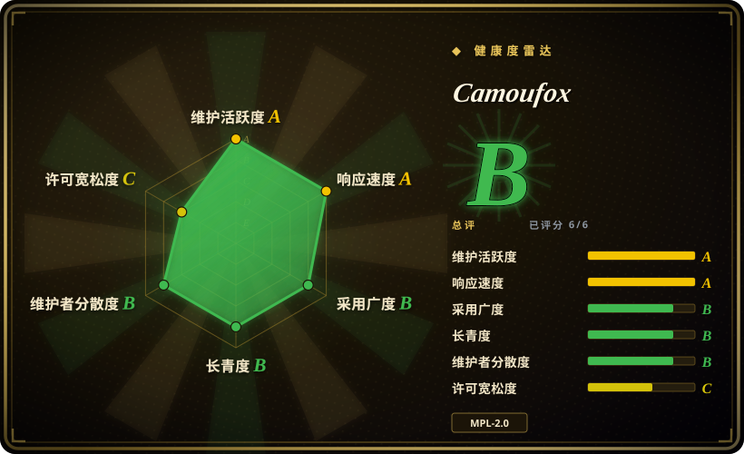
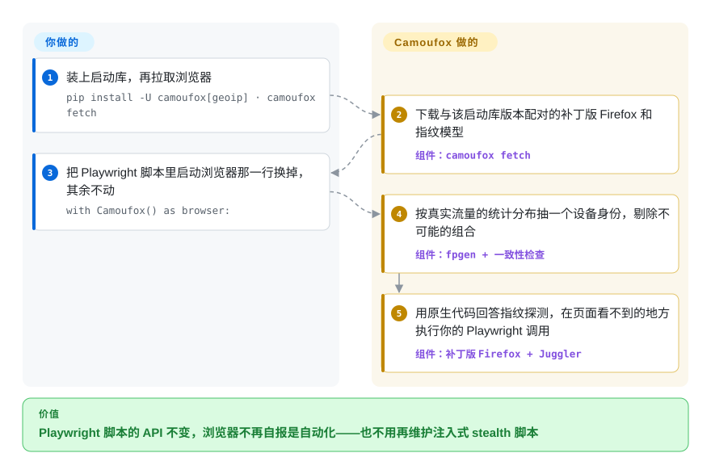

# Camoufox

你的 Playwright 爬虫在测试页上一切正常，一到真实目标站就被“请验证你是人类”的页面挡住，因为站点看得出浏览器是被自动化工具操控的。Camoufox 是一个重新编译的 Firefox，它在浏览器引擎自己的代码里改掉“我是谁”的回答，于是你原有的 Playwright 脚本驱动的是一台看起来像普通访客的机器。

## 何时使用

你用 Python 或 Node 维护一条基于 Playwright 的抓取或监控流水线。它跑了几个月，然后目标站在自己前面加了一道机器人墙：`page.goto()` 现在停在 `Just a moment...`，或者页面照常加载，数据却悄悄变空。你试过那种用注入的 JavaScript 改写 `navigator.webdriver` 的“stealth”插件，结果也被识破——检测脚本一问，被改过的属性就不再显示 `[native code]`。当**浏览器本身就是破绽**时，你会想到 Camoufox：它是 Firefox 的分支，对外报告的设备、屏幕、WebGL、字体、音频、WebRTC 地址、时区和语言区域都在 C++ 实现层里设定，Playwright 的控制代码则运行在页面脚本看不到的一份页面副本里。你的脚本只改一行——启动浏览器那一行——Playwright API 照旧。

相对邻近选项，决定性的取舍是：[Playwright](../playwright-family/playwright.zh.md) 稳定、有机构背书，但完全不隐藏自己；[nodriver](nodriver.zh.md) 和 Patchright 隐藏的是 *Chromium* 里的自动化痕迹，站点期待 Chrome 时该用它们；[Obscura](obscura.zh.md) 是轻得多的自足浏览器，带 stealth 模式，但用的是自研引擎而不是真正的 Firefox。你要一个完整、真实的浏览器引擎，并且指纹由引擎层控制，同时愿意为此付出 GB 级的下载、只能扮演 Firefox，以及一个自己在 README 里写明不适合稳定生产使用的项目——这时选 Camoufox。

## 怎么用起来

Camoufox 是要一起装的两样东西：一个打过补丁的 Firefox 二进制，和一个通过 Playwright 启动它的小型启动库（Python 的 `camoufox`，或 npm 包 `camoufox`）。启动时，启动库从 `fpgen` 里抽一个设备身份——操作系统、显卡、屏幕、字体、语音——`fpgen` 是一个统计模型，记录真实网络流量里各种设备出现的比例；抽出来的组合如果现实中不可能存在（比如 Windows 的 User-Agent 配苹果显卡）就会被剔除。启动库把这个身份交给浏览器，页面无论问什么，补丁都从原生代码里按这套值作答，而不是靠注入 JavaScript——注入的东西检测脚本找得到。Playwright 通过 Juggler 和 Firefox 对话——Juggler 是 Firefox 自己的自动化通道，和 Chrome DevTools Protocol 是两回事——Camoufox 改了 Juggler，让 Playwright 的辅助代码在一份隔离的页面副本上工作。可以把它想成一位戏服是缝在身上、而不是用别针别住的演员：观众找不到可以扯的线头。它替你做的：指纹本身、指纹内部的自洽、隐藏自动化层、可选的真人鼠标轨迹回放（`humanize=True`），以及按代理出口地址推算时区和语言区域。仍然归你的：代理及其 IP 信誉、请求频率和行为模式、每次升级后重新拉取浏览器，以及判断目标站的条款是否允许你这么做。另一个入口 `camoufox server` 把同一个浏览器暴露成 Playwright WebSocket 服务，供其他语言连接；一个服务就是一个浏览器，所以它的指纹不会在会话之间轮换。

<!-- flow-steps:begin (generated from flows/camoufox.json by tools/flow_card.py — do not edit) -->

流程文字版

1. **你**：装上启动库，再拉取浏览器 — `pip install -U camoufox[geoip] · camoufox fetch`
2. **Camoufox**：下载与该启动库版本配对的补丁版 Firefox 和指纹模型 — 组件：`camoufox fetch`
3. **你**：把 Playwright 脚本里启动浏览器那一行换掉，其余不动 — `with Camoufox() as browser:`
4. **Camoufox**：按真实流量的统计分布抽一个设备身份，剔除不可能的组合 — 组件：`fpgen + 一致性检查`
5. **Camoufox**：用原生代码回答指纹探测，在页面看不到的地方执行你的 Playwright 调用 — 组件：`补丁版 Firefox + Juggler`

**价值**：Playwright 脚本的 API 不变，浏览器不再自报是自动化——也不用再维护注入式 stealth 脚本

<!-- flow-steps:end -->

## 何时不用

- **站点根本不反爬。** 对自己的应用、内网或普通公开页面，隐身没有任何收益，代价却是一个落后于 Playwright 的定制浏览器。用 [Playwright](../playwright-family/playwright.zh.md)，它由 Microsoft 背书，覆盖 Chromium、Firefox 和 WebKit。
- **目标站期待的是 Chrome。** Camoufox 只能扮演 Firefox；README 写明它“does not fully support injecting Chromium fingerprints”，并且有些 Web 应用防火墙会检测 Firefox 的 JavaScript 引擎行为，“which is impossible to spoof”。要用代码驱动不被发现的 Chromium，用 [nodriver](nodriver.zh.md) 或 Patchright。
- **你需要一个能称为生产稳定的东西。** README 顶部挂着告示：“This project is under development. It may not be suitable for stable production use.” 每个浏览器版本都带 `beta` 标签；2025-03-15 到 2026-01-07 之间一个版本都没发，项目官网自己说这段时间检测表现“has gone down”。如果漏掉一周数据代价很高，就买带成功率承诺的托管解锁 API（不是仓库），或者在允许自动化的站点上继续用 [Playwright](../playwright-family/playwright.zh.md)。
- **你想让 agent 通过工具浏览，而不是自己写代码。** Camoufox 是要你写脚本去调的库。想要一个跑在补丁版 Firefox 上的 MCP 服务器，用 [invisible_playwright_mcp](../agent-browser-tools/invisible-playwright-mcp.zh.md)；`jo-inc/camofox-browser` 则把同一个引擎包成了给 agent 用的浏览器服务。
- **你只要 HTML，不需要浏览器。** 如果拦截发生在网络握手层而不是 JavaScript 检查层，每个会话起一个完整 Firefox 是最贵的解法；像 `D4Vinci/Scrapling` 这样的抓取框架，或者能模仿浏览器 TLS 握手的 HTTP 客户端便宜得多。页面要跑脚本但从不需要像素时，[Lightpanda](lightpanda.zh.md) 轻得多。
- **你必须跑在受限或很小的沙箱里。** 未关闭的 issue 报告了：在 AWS Lambda、Cloud Run 这类只读文件系统上挂起（#572）、在 gVisor 下崩溃（#740）、长时间任务内存增长（#245）、长会话中永久冻结（#804）。v156.0.1-beta.36 每个平台的压缩包约 1.3 GB。Serverless 或高密度集群用 [Obscura](obscura.zh.md) 或 [Lightpanda](lightpanda.zh.md)。
- **你依赖 Playwright tracing、CDP 或最新版 Playwright。** Firefox 走的是 Juggler，所以没有 Chrome DevTools Protocol；trace 的帧快照是个未关闭的 issue（#101）；两个启动库都把 Playwright 上限卡在 1.63 以下，因为它们引用了 Playwright 的私有 API。要调试级的工具面，用 [Playwright](../playwright-family/playwright.zh.md) 或 [Chrome DevTools MCP](../agent-browser-tools/chrome-devtools-mcp.zh.md)。
- **问题出在你的 IP 上。** Camoufox 隐藏的是浏览器，不是请求来自哪里；README 说它“is intended to be used with rotating proxies (preferably residential IPs)”，而代理要你自己找、自己付费。[proxy_pool](../../proxy-pool/proxy-pool.zh.md) 这类工具采集的免费代理，信誉通常达不到要求。
- **你需要从头到尾都是宽松许可。** 浏览器是 MPL-2.0（分发构建产物时，对其文件的改动必须公开），捆绑的鼠标轨迹数据是 LGPLv3-or-later，只有启动库是 MIT。如果要把改过的浏览器放进闭源产品里分发，[Obscura](obscura.zh.md)（Apache-2.0）在合规上更省事。
- **需要你出面辩护的恰恰是“绕过”这件事本身。** 绕过站点的机器人防护可能违反其服务条款；视司法辖区和数据类型，还可能触及法律，工具改变不了这一点。有官方 API 或授权数据集时，用它们。

## 横向对比

| 替代品 | 是否收录 | 我们的评价 | 取舍 |
|---|---|---|---|
| [Playwright](../playwright-family/playwright.zh.md) | ✅ | 只要站点容忍自动化，或者你需要三种引擎、tracing 和稳定的发布节奏，就选 Playwright；只有当“被检测”是任务失败的原因时才选 Camoufox。 | Microsoft 背书、工具面完整，但原版浏览器会被反爬服务标记；Camoufox 在隐身的 Firefox 上保留同一套 API，放弃的是稳定性承诺和最新版 Playwright。 |
| [nodriver](nodriver.zh.md) | ✅ | 目标站期待 Chrome、你也接受它自己的异步 Python API 时选 nodriver；想保留 Playwright 代码、且可以扮演 Firefox 时选 Camoufox。 | nodriver 不经 WebDriver、直接用 CDP 控制普通 Chromium（AGPL-3.0，仅 Chromium，反检测只是尽力而为）；Camoufox 重新编译浏览器来轮换整套设备身份，代价是每个构建约 1.3 GB。 |
| [Obscura](obscura.zh.md) | ✅ | 高密度、低成本的集群，约 70 MB 的二进制加一个 stealth 开关就够用时选 Obscura；站点检查深到只有真实完整的浏览器引擎才扛得住时选 Camoufox。 | Obscura 轻、Apache-2.0、说 CDP，但它年轻的自研引擎可能和任何真实浏览器都不一样；Camoufox 是货真价实的 Firefox 加引擎层伪装，重，而且只有 Firefox。 |
| [invisible_playwright_mcp](../agent-browser-tools/invisible-playwright-mcp.zh.md) | ✅ | 使用方是想要 MCP 工具的编码助手时选 invisible_playwright_mcp；由你自己的代码驱动浏览器、并且想要更老、装机量更大的引擎时选 Camoufox。 | 两者都在 C++ 层给 Firefox 打补丁；前者由一个种子推导指纹，没有 macOS 构建，Camoufox 从流量模型里抽指纹，提供 Linux、Windows、macOS 压缩包，但没有 MCP 接口。 |
| [Patchright](https://github.com/Kaliiiiiiiiii-Vinyzu/patchright) | 未收录 | 需要在不被发现的 *Chromium* 上使用 Playwright API、且安装体积要小时选 Patchright；跨大量会话轮换指纹比“是 Chrome”更重要时选 Camoufox。 | Patchright 改的是 Playwright 驱动而不是浏览器（Apache-2.0，约 4.8k stars），指纹交给它启动的真实 Chrome；Camoufox 改的是指纹本身。本批次未加入（not added in this tab batch）。 |

## 技术栈

- **浏览器：** Firefox 分支（2026-10 时基于 Firefox 156），由 Mozilla 源码加本仓库的 `patches/` 与 `additions/` 构建——C++ 和 JavaScript；构建系统源自 LibreWolf。
- **自动化通道：** 打过补丁的 Juggler（Playwright 的 Firefox 协议），Playwright 的 page-agent 代码被挪进隔离世界。
- **启动库：** Python 包 `camoufox`（Poetry，Python ≥3.10）和 npm 包 `camoufox`（TypeScript，Node ≥22.15）——TypeScript 版是移植而不是套一层 Python，目标是抽出逐位相同的身份。
- **身份：** `fpgen`（Scrapfly 出品的贝叶斯网络，建模真实流量的设备统计）加仓库内的一致性检查；捆绑 Windows、macOS、Linux 字体；用 GeoIP 查询让时区和语言区域与代理一致。
- **输入：** `cursory-js`，Cursory 的 vendored 移植——2,356 条真人鼠标移动录制，按各自原有的节奏回放。
- **附带：** 捆绑 uBlock Origin、Qt 管理界面（`camoufox gui`，PySide6）、Playwright WebSocket 服务模式、用于构建的 Dockerfile。

## 依赖

- **Python ≥3.10 加 `playwright<1.63`**，或 **Node ≥22.15 加 `playwright-core<1.63`**（peer dependency）。
- **浏览器下载：** `camoufox fetch` 从 GitHub releases 拉取与你的启动库版本配对的构建——v156.0.1-beta.36 每个平台压缩包约 1.3 GB（v152 的压缩包是 0.3–0.7 GB）。支持 Linux x86_64/arm64、macOS x86_64/arm64、Windows x86_64/i686。
- **指纹模型和 GeoIP 数据：** `fpgen` 模型（按 sha256 固定）；装了 `geoip` extra 时还有每周刷新的 GeoIP 数据库（README 自己的示例里约 116 MB）。
- **你自备的代理**——项目预期你用轮换的住宅 IP，本身不附带任何代理。
- **Linux 上的 Xvfb**——用 `headless="virtual"` 在服务器上跑有头浏览器时需要。
- **自己构建时：** 一台 Linux 主机（README 说 WSL 不行）或 Docker、Rust、Python ≥3.11，冷构建约 40 分钟。

## 运维难度

**上手低，长期维持中到高。** 上手是两条命令加改一行启动调用。难的是让它一直能用。每个启动库版本只和一个浏览器构建配对，所以每次升级都要重跑 `camoufox fetch`，容器镜像也要带着一个 GB 级的层重新构建。检测是一场军备竞赛，README 说得很直白——反爬厂商“test Camoufox over and over again to find even 1 unique inconsistency”——今天能过的站点明天就可能开始弹验证，而修复是以新的浏览器构建到来的，不是改个配置开关。周边系统也都归你：代理的采购与轮换、会话和 profile 的存储、重启内存不断上涨的浏览器，以及一个你自己抬不动的 Playwright 版本上限。到了集群规模，远程服务模式还需要你自己写轮换逻辑，因为一个服务只保有一个指纹。

## 健康度与可持续性

- **维护——现在非常活跃，但身后有一段真实的空窗。** 2026-09-28 到 2026-10-06 之间发了五个浏览器版本，2026 年 10 月初每天都有提交（GitHub API，2026-10-08）。但 2025-03-15 到 2026-01-07 没有任何发布，项目官网写道：“There has been a year gap in maintenance due to a personal situation.” 应把当前节奏看作恢复期，而不是长期记录。
- **治理与 bus factor——个人仓库加一个很小的核心。** 仓库属于用户账号 `daijro`，不是组织。最近十次提交全部来自一位共同维护者（`JWriter20`，个人主页写着“Camoufox core maintainer”）；过去 52 周里 GitHub 把大部分提交归到四个身份名下，其中一个是 AI 编码 agent 的提交账号。2025 年的空窗，就是单一所有者的路线图在所有者无法投入时的样子。`[推断]`
- **背后支持——赞助，主要来自代理和抓取厂商。** README 开头是大约二十个赞助位，几乎都在卖代理或抓取 API。这笔钱养活了项目，也意味着文档里反复建议购买住宅代理的，是一个由这些厂商付费的项目。
- **年龄与 Lindy——两岁，其中大约一半时间在活跃。** 创建于 2024-07-26。仓库挺过了一次长时间中断并且回来了，这更多说明有需求，而不是说明它耐久；浏览器分支一旦不再跟进上游 Firefox，衰败得很快。
- **采用度——确实有人在用。** 过去一个月 PyPI 下载约 80.6 万次（pypistats，2026-10-08），也有其他项目建在这个引擎之上。npm 这边是分裂的：由来已久的社区移植 `camoufox-js`（Apify）在截至 2026-10-04 的一个月里约 48.3 万次下载，而官方的 `camoufox` npm 包直到 2026-10-06 才与 Python 版对齐，同期约 1.4 万次。
- **读雷达图时要带着这些背景。** 治理轴的 B 统计的是十二个月内 30 位提交作者、前三位约占 75% 的提交；它衡量的是谁写了补丁，不是谁能发版，而且排名靠前的身份里有一个是 AI agent 的提交账号。长期性轴的 B 按创建至今 804 天计算，看不到 2025 年的空窗。许可轴的 C 来自 MPL-2.0 的文件级 copyleft，不是发生过改许可。
- **风险信号。** 自己声明不适合稳定生产；每个版本都是 beta；有效性是个移动靶，没有哪个版本号能保证；文档站落后于 README（仍在描述上一代指纹生成器）；许可混合（浏览器 MPL-2.0、轨迹数据 LGPLv3-or-later、启动库 MIT）；绕过机器人防护的法律风险由使用者承担。

## 存疑（未验证）

- [未验证] “Undetectable”和“invisible to anti-bot systems”是 README 的说法；本页没有跑任何检测测试——需要对 Cloudflare、DataDome 等目标做实测，而且结果因站点、因周而异。
- [未验证] “Runs faster than the original Mozilla Firefox, and uses less memory (200mb)”是 README 给的数字，此处未测量；未关闭的 issue #245 和 #762 分别报告了内存增长，以及特定条件下内容进程约 15 GB 的 OOM。
- [推断] bus factor 的判断依据是 GitHub 贡献者统计（截至 2026-10-08）和官网自己写的“year gap”；谁握有合并与发布权限无法核实，因为协作者列表需要 push 权限才能查看。
- [推断] “赞助影响代理建议”是从 README 赞助区看出的利益冲突提示，不构成该建议有错的证据——IP 信誉确实是一个真实的检测信号。
- [未验证] 平台压缩包为何从 0.3–0.7 GB（v152.0.4-beta.30）涨到约 1.3 GB（v156.0.1-beta.36）没有追查；体积数字本身来自 2026-10-08 的 GitHub release API。
- [未验证] Star、下载量和 issue 数（12.4k stars、PyPI 每月约 80.6 万次下载、68 个未关闭 issue）截至 2026-10-08，变化很快；下载量包含 CI 和镜像流量。
- [推断] 引用的未关闭 issue（#101、#245、#572、#740、#804）是在 2026-10-08 按标题和状态读的，没有复现；其中一些可能已在比报告者所用版本更新的构建里修复。
- [推断] 相对 nodriver、Obscura、Patchright 和 invisible_playwright_mcp 的定位基于各项目的文档，不是面对面的检测基准测试。
