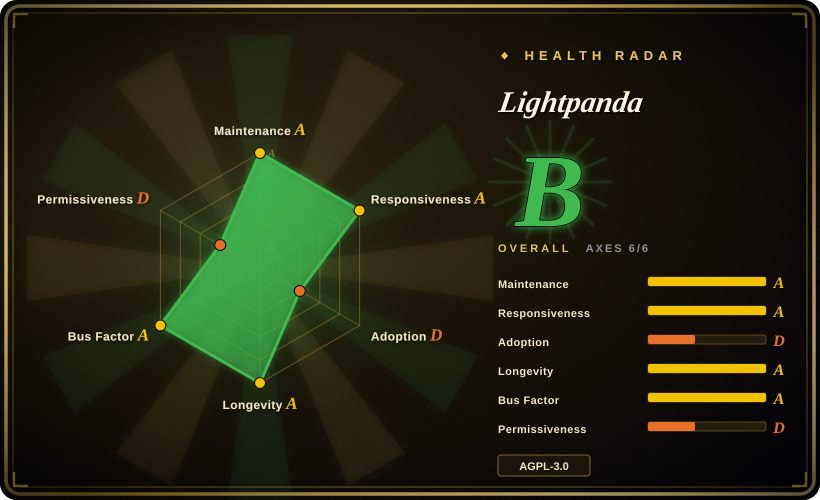
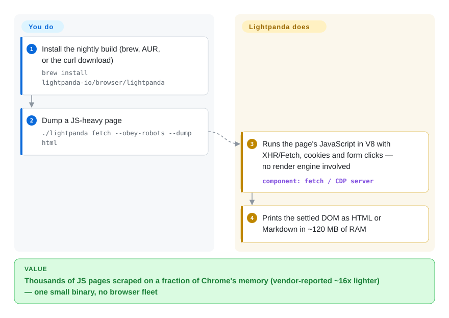

# Lightpanda

You need the content of thousands of JavaScript-rendered pages a day and a headless Chrome fleet — ~2 GB of RAM per 100 pages, its own benchmark says — torques your bill. Lightpanda is a browser written in Zig that runs real V8 JavaScript and a native DOM but ships no rendering engine at all, so page work is only parsing, scripting, and networking, and Puppeteer/Playwright scripts can attach to it over CDP unchanged.

## When to use

You're running a crawler, a data-extraction job, or an agent's browsing backend at scale, the pages are JS-heavy (XHR, SPAs, dynamic forms), and nothing in the pipeline ever looks at pixels — no screenshots, no visual assertions, no coordinate hit-testing. You reach for Lightpanda over real Chromium because it's the most battle-tested of the dedicated "agent headless browsers": the repo dates to 2023, it publishes daily Web Platform Tests results, ships nightly binaries and Docker images, and has ~35.6k stars behind a company selling a hosted version. Against the newer [Moli](moli.md) and [Obscura](obscura.md), the deciding tradeoff is its engine choice: no layout/paint means the leanest and fastest structure-only path (median 0.97 s/page and ~40 MiB in Moli's independent-ish crawl table, though run by a competitor), and you accept losing screenshots and real geometry forever, not just behind a flag.

It also has surfaces the others lack: a native `agent` mode (LLM-driven browsing that records replayable, token-free PandaScript), an MCP server with per-session browsing contexts, WebDriver BiDi alongside CDP, an ad blocker, and `robots.txt` obeyance behind a flag.

## Q&A

- **A browser "written from scratch" — isn't that absurd?** The headline means "not a Chromium fork", not "no dependencies": Lightpanda's own status list credits `v8`, `libcurl`, and `html5ever`. What is genuinely hand-written in Zig is the DOM, the JS API surface, and the CDP server — and what's genuinely absent is the entire rendering engine. Judged that way, a 2023 repo with three years of weekly commits is the least absurd browser claim in this niche; the newer entrants selling the same story are <6 months old.

## How it works

The pipeline is deliberately incomplete on purpose: HTML is parsed with html5ever into a native DOM, JavaScript runs in embedded V8 (with XHR/Fetch, cookies, forms, clicks, iframes), and HTTP goes through libcurl — but there is no style cascade into boxes, no layout, no paint. So `lightpanda fetch --dump html|markdown` gives you the settled DOM as text, and `lightpanda serve` exposes a CDP WebSocket (optionally WebDriver BiDi on the same or a second protocol flag) that puppeteer-core or Playwright's `connectOverCDP` attach to, leaving your existing scripts mostly untouched. You are responsible for the normal scraping hygiene (user agent, proxies, robots respectability, target-site permission); it just does the browser part in ~120 MB instead of ~2 GB. Beyond raw driving, `lightpanda agent` wraps an LLM of your choice (Anthropic/OpenAI/Gemini/Vertex/Mistral/OpenRouter/Ollama…) around the browser in-process, and `/save` emits a deterministic JavaScript recording you can replay with `lightpanda run` with no model at runtime.

<!-- flow-steps:begin (generated from flows/lightpanda.json by tools/flow_card.py — do not edit) -->

Text version of the flow

1. **You**: Install the nightly build (brew, AUR, or the curl download) — `brew install lightpanda-io/browser/lightpanda`
2. **You**: Dump a JS-heavy page — `./lightpanda fetch --obey-robots --dump html`
3. **Lightpanda**: Runs the page's JavaScript in V8 with XHR/Fetch, cookies and form clicks — no render engine involved — component: `fetch / CDP server`
4. **Lightpanda**: Prints the settled DOM as HTML or Markdown in ~120 MB of RAM

**Value**: Thousands of JS pages scraped on a fraction of Chrome's memory (vendor-reported ~16x lighter) — one small binary, no browser fleet

<!-- flow-steps:end -->

## When NOT to use

- **Any step needs geometry or visuals** — screenshots, bounding boxes, coordinate clicks, print/PDF fidelity. There is no rendering engine by design; use [Moli](moli.md) (opt-in layout) or [Obscura](obscura.md) (always-on native rendering).
- **AGPL-3.0 is incompatible with how you ship.** Embedding or serving Lightpanda inside a proprietary network product triggers strong network copyleft (or its commercial license, terms unverified); use Apache-2.0 Puppeteer/Playwright against Chromium, or the MIT/Apache [Moli](moli.md).
- **You need stealth.** Anti-detection is not Lightpanda's pitch; fingerprint-level bot walls will still block it. Use [Obscura](obscura.md)'s stealth builds (and weigh their ToS risk).
- **You're on Windows natively or musl-based distros.** Release binaries are glibc Linux + macOS; Windows means WSL2, Alpine means building from source with a pinned Zig 0.15.2 toolchain.
- **Default-on usage telemetry is unacceptable** without review — it sends usage data unless `LIGHTPANDA_DISABLE_TELEMETRY=true`; disable it explicitly in every image and CI runner.

## Comparison

| Alternative | In index | Our verdict | Tradeoff |
|---|---|---|---|
| [Moli](moli.md) | ✅ | Choose Lightpanda for a structure-only fleet with a 3-year maintenance record and public daily WPT; choose Moli when the same binary must sometimes produce real layout, screenshots, or PDF. | Lightpanda's ceiling is a deliberate feature (no engine → leanest); Moli pays opt-in memory for visual capability but is <2 months old with self-run benchmarks. |
| [Obscura](obscura.md) | ✅ | Choose Obscura when stealth (fingerprint randomization, tracker blocking) and always-on rendering are the job; choose Lightpanda for pure extraction with the longer track record. | Obscura carries rendering and stealth weight plus a younger, opaque-governance repo; Lightpanda is leaner on non-stealth structure work. |
| [Puppeteer](puppeteer.md) (real Chrome) | ✅ | Choose Puppeteer/Chromium when page-compatibility must approach 100% (login walls, canvas, exotic APIs) and memory is someone else's problem; Lightpanda wins the fleet bill, loses the long tail. | The daily WPT publication is the honest signal: Lightpanda's web-platform coverage is materially below Chrome's, and vendor-vs-vendor benchmarks (Moli scores it 44% useful pages; Obscura claims 85 ms page loads) disagree in everyone's favor. |
| [Playwright](../playwright-family/playwright.md) | ✅ | Choose Playwright for cross-browser test stacks; it also *drives* Lightpanda over CDP, so the pair is complement, not competition. | Playwright is the client; Lightpanda is an engine target — but Playwright's expectation of Chromium behaviors exposes Lightpanda's gaps, so pin your client API surface. |
| [browser-use](../agent-browser-tools/browser-use.md) | ✅ | Choose browser-use when you want a Python agent framework with vision on top of a real browser; choose Lightpanda when the agent's browsing layer should be cheap text/DOM at machine scale. | browser-use brings the agent loop and screenshots (needs a rendering browser); Lightpanda brings the cheap runtime and its own optional agent mode. |

## Tech stack

- **Zig 0.15.2** core, with Rust (`html5ever`) and C++ (`v8`, `libcurl`) components embedded; V8 snapshots optionally compiled into the binary.
- **Own native DOM**, JS APIs, XHR/Fetch, cookies, storage surface — no Blink/WebKit/Chromium fork.
- **Protocols:** CDP over WebSocket, WebDriver BiDi (`--protocol webdriver`), MCP server (stdio and HTTP with session isolation).
- **Outputs:** `fetch --dump html|markdown` (plus png/pdf variants with caveats — see ledger); agent sessions emit PandaScript (plain JS with native primitives).
- Web Platform Tests are run continuously and published daily at the vendor's perf site.

## Dependencies

- One static binary (or their Docker image); no browser install, no Node/Python runtime required for the fetch/serve path (automation clients do need their own runtime).
- glibc on Linux (musl/Alpine unsupported prebuilt), macOS x86_64/aarch64, Windows only via WSL2.
- For agent mode: an LLM API key or local endpoint (Ollama/llama.cpp) — you bring the model.
- Usage telemetry on by default; opt out via `LIGHTPANDA_DISABLE_TELEMETRY=true`.

## Ops difficulty

**Low.** Nightly binaries, Docker images, Homebrew/AUR packages, a single `serve` process with `--host/--port`, proxy and header knobs. The recurring friction is engine reality: sites behave differently than under Chromium, Zig-version pinning for source builds, WSL/glibc platform walls, and client-library expectations (Puppeteer/Playwright APIs that touch unimplemented CDP domains). Treat upgrades like engine upgrades — regression-test your target corpus, which the vendor's own WPT dashboard helps with.

## Health & viability

- **Maintenance:** active — v0.4.1 (2026-09-15), ~monthly tagged releases plus nightlies, daily WPT publication; pushed 2026-09-27.
- **Governance / backing:** organization-owned (lightpanda-io), the company behind a hosted Lightpanda Cloud; contributors are employees/affiliates with a CLA gate — commercial alignment, not a foundation, but a 3-year public track record.
- **Age / Lindy:** created 2023-02 — the oldest of the dedicated agent headless browsers and still accelerating; that's real viability credit the 2026 cohort cannot yet claim.
- **Adoption:** ~35.6k stars, an official demo/benchmark corpus, integrations documented for Puppeteer/Playwright/MCP clients.
- **Risk flags:** AGPL-3.0 with an unverified commercial-license tier, default-on telemetry, Windows excluded (WSL only), and its engine gaps concentrate exactly on the compat-heavy pages (auth walls, anti-bot) that matter most in production scraping.

## Caveats (unverified)

- [未验证] `--dump png`/`--dump pdf` are advertised for "text-only rendering"; no layout/paint engine exists, so what those outputs actually contain was not checked.
- [未验证] The 16x-memory/9x-speed benchmark is vendor-run (933 pages, one AWS m5.large); the index only treats it as an envelope.
- [未验证] Lightpanda Cloud's commercial license terms and any open-core feature boundary were not read.
- [推断] "Contributors are employees/affiliates" is inferred from org structure, CLA, and the company website, not from contributor agreements.
- [未验证] Cross-vendor benchmark conflicts: Moli's crawl table scores Lightpanda 44.3% useful pages while Lightpanda's own demos show high success on its corpus; neither was reproduced here.
- [未验证] Puppeteer/Playwright script compatibility "mostly unchanged" is the vendor's framing; per-domain CDP coverage was not verified.
