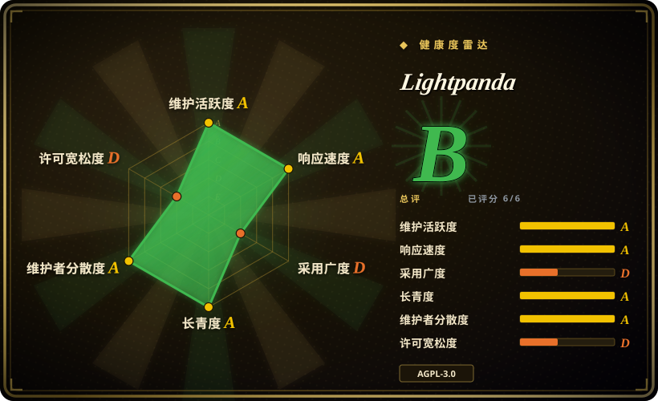
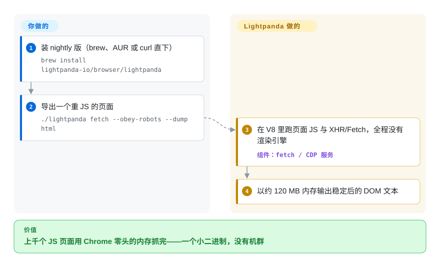

# Lightpanda

每天要取几千个 JS 渲染页面的内容，而无头 Chrome 机群——按它自家基准，每 100 页约 2 GB 内存——把你的账单拧断了。Lightpanda 是用 Zig 写的浏览器：跑真实的 V8 JavaScript 和原生 DOM，但根本不装渲染引擎，页面工作只剩解析、执行脚本和网络请求，而且 Puppeteer/Playwright 脚本可以通过 CDP 原样接上来。

## 何时使用

你在跑爬虫、数据提取或 agent 的浏览后端，规模到每天数千页，页面重 JS（XHR、SPA、动态表单），而管线里没有任何一步会看像素——不截图、不做视觉断言、不按坐标命中测试。相比真实 Chromium 选 Lightpanda，是因为它是「专为 agent 设计的无头浏览器」里最久经沙场的：仓库始于 2023 年，每天公开 Web Platform Tests 结果，nightly 二进制和 Docker 镜像齐备，背后是一家卖托管版的公司、约 35.6k star。和更年轻的 [Moli](moli.zh.md)、[Obscura](obscura.zh.md) 相比，决定性差异是引擎取向：没有布局/绘制，意味着结构提取这条路径最瘦最快（在竞品 Moli 跑的爬取对照表里中位 0.97 秒/页、约 40 MiB），而你接受截图与真实几何永远缺席——不是藏在开关后面，是没有。

它还有别人没有的入口：原生 `agent` 模式（LLM 驱动浏览，录制成免 token、可重放的 PandaScript）、带独立浏览会话的 MCP 服务器、与 CDP 并存的 WebDriver BiDi、广告拦截器，以及开关控制的 `robots.txt` 遵从。

## 快问快答

- **一个「从零写」的浏览器，不离谱吗？** 标题里的「从零」意思是「不是 Chromium 分叉」，不是「没有依赖」：它自己的状态清单列明 `v8`、`libcurl`、`html5ever`。真正手写的是 Zig 的 DOM、JS API 面和 CDP 服务器；真正缺失的是整个渲染引擎。这么判的话，2023 年建库、三年周更不断，是这个生态位里最不离谱的「从零」叙事——讲同一故事的后浪们都不到 6 个月大。

## 怎么用起来

这条管线是故意「残缺」的：HTML 用 html5ever 流式解析成原生 DOM，JavaScript 跑在内嵌的 V8 里（带 XHR/Fetch、cookie、表单、点击、iframe），HTTP 走 libcurl——但样式不会落到盒模型，没有布局、没有绘制。所以 `lightpanda fetch --dump html|markdown` 给你的是稳定后的 DOM 文本；`lightpanda serve` 暴露一个 CDP WebSocket（同一进程可用 `--protocol webdriver` 再开 WebDriver BiDi），puppeteer-core 或 Playwright 的 `connectOverCDP` 连上后，既有脚本大多不用改。抓取卫生（UA、代理、robots、目标站授权）仍然是你的责任，它只是把「浏览器」那部分从约 2 GB 压到约 120 MB。在裸驱动之上，`lightpanda agent` 把可选的 LLM（Anthropic/OpenAI/Gemini/Vertex/Mistral/OpenRouter/Ollama 等）包在进程内，`/save` 导出一份确定性 JS 录制，之后用 `lightpanda run` 免模型重放。

<!-- flow-steps:begin (generated from flows/lightpanda.json by tools/flow_card.py — do not edit) -->

流程文字版

1. **你**：装 nightly 版（brew、AUR 或 curl 直下） — `brew install lightpanda-io/browser/lightpanda`
2. **你**：导出一个重 JS 的页面 — `./lightpanda fetch --obey-robots --dump html`
3. **Lightpanda**：在 V8 里跑页面 JS 与 XHR/Fetch，全程没有渲染引擎 — 组件：`fetch / CDP 服务`
4. **Lightpanda**：以约 120 MB 内存输出稳定后的 DOM 文本

**价值**：上千个 JS 页面用 Chrome 零头的内存抓完——一个小二进制，没有机群

<!-- flow-steps:end -->

## 何时不用

- **流程里有任何一步需要几何或视觉**——截图、盒模型、坐标点击、打印/PDF 保真。按设计就没有渲染引擎；改用 [Moli](moli.zh.md)（开关式按需布局）或 [Obscura](obscura.zh.md)（常开原生渲染）。
- **AGPL-3.0 和你的发布方式冲突。** 把 Lightpanda 嵌入或通过网络提供专有产品会触发强网络著佐权（或转向其商业许可，条款未核实）；改用 Apache-2.0 的 Puppeteer/Playwright 驱动 Chromium，或 MIT/Apache 双许可的 [Moli](moli.zh.md)。
- **你需要伪装。** 反检测不是 Lightpanda 的卖点，指纹级机器人墙照样拦你。要 stealth 用 [Obscura](obscura.zh.md) 的 stealth 构建（并自担其 ToS 风险）。
- **你在原生 Windows 或 musl 发行版上。** 发布二进制只覆盖 glibc Linux 与 macOS；Windows 要走 WSL2，Alpine 只能用锁定的 Zig 0.15.2 工具链从源码编译。
- **默认开启的使用遥测未经评审不能接受**——它会发送使用数据，除非设 `LIGHTPANDA_DISABLE_TELEMETRY=true`；在每个镜像和 CI runner 里显式关掉。

## 横向对比

| 替代品 | 是否收录 | 我们的评价 | 取舍 |
|---|---|---|---|
| [Moli](moli.zh.md) | ✅ | 结构机群要三年维护履历和每日公开的 WPT 结果时选 Lightpanda；同一个二进制还得偶尔出真实布局、截图或 PDF 时选 Moli。 | Lightpanda 的上限是刻意的特性（无引擎→最瘦）；Moli 用按需内存换视觉能力，但仓库不到 2 个月、基准全自测。 |
| [Obscura](obscura.zh.md) | ✅ | 反检测（指纹随机化、跟踪拦截）加常开渲染就是工作本身时选 Obscura；纯提取、要更长履历的选 Lightpanda。 | Obscura 背着渲染与 stealth 的重量、治理更不透明且更年轻；非 stealth 的结构工作上 Lightpanda 更轻。 |
| [Puppeteer](puppeteer.zh.md)（真实 Chrome） | ✅ | 页面兼容必须逼近 100%（登录墙、canvas、奇葩 API）、内存是别人的问题时，选 Puppeteer 对真实 Chromium；Lightpanda 赢在机群账单，输在长尾。 | 每日公开的 WPT 才是诚实信号：Lightpanda 的 web 平台覆盖实质低于 Chrome，而厂商互测（Moli 给它 44% 有用页；Obscura 自称 85 ms 加载）各说各话。 |
| [Playwright](../playwright-family/playwright.zh.md) | ✅ | 要跨浏览器测试栈选 Playwright；它还能通过 CDP *驱动* Lightpanda，两者是互补不是竞争。 | Playwright 是客户端，Lightpanda 是引擎目标——但 Playwright 对 Chromium 行为的期待会暴露 Lightpanda 的缺口，客户端 API 面要钉死。 |
| [browser-use](../agent-browser-tools/browser-use.zh.md) | ✅ | 要一个带视觉、跑在真浏览器之上的 Python agent 框架时选 browser-use；agent 的浏览层要机器规模级的廉价文本/DOM 时选 Lightpanda。 | browser-use 带来 agent 循环和截图（需要会渲染的浏览器）；Lightpanda 带来廉价运行时和它自己的可选 agent 模式。 |

## 技术栈

- **Zig 0.15.2** 内核，内嵌 Rust（`html5ever`）与 C++（`v8`、`libcurl`）组件；V8 快照可选编译进二进制。
- **自有原生 DOM**、JS API、XHR/Fetch、cookie、存储面——不是 Blink/WebKit/Chromium 分叉。
- **协议：** WebSocket 上的 CDP、WebDriver BiDi（`--protocol webdriver`）、MCP 服务器（stdio 与带会话隔离的 HTTP）。
- **输出：** `fetch --dump html|markdown`（另有 png/pdf 变体，见存疑账本）；agent 会话导出 PandaScript（带原生原语的普通 JS）。
- Web Platform Tests 持续运行，每天发布到厂商 perf 站点。

## 依赖

- 一个静态二进制（或官方 Docker 镜像）；fetch/serve 路径不装浏览器、不需要 Node/Python 运行时（自动化客户端仍要自己的运行时）。
- Linux 需 glibc（预编译不支持 musl/Alpine），macOS x86_64/aarch64，Windows 仅经 WSL2。
- agent 模式需要一个 LLM API key 或本地端点（Ollama/llama.cpp）——模型自备。
- 使用遥测默认开启；用 `LIGHTPANDA_DISABLE_TELEMETRY=true` 关闭。

## 运维难度

**低。** nightly 二进制、Docker 镜像、Homebrew/AUR 包，`serve` 单进程加 `--host/--port`、代理与 header 开关。反复出现的摩擦来自引擎现实：站点行为与 Chromium 下有差异、源码构建要锁 Zig 版本、WSL/glibc 平台墙、以及客户端库期待（碰到未实现 CDP 域的 Puppeteer/Playwright API）。把升级当引擎升级对待——回归测试你的目标语料，厂商的 WPT 看板对此有帮助。

## 健康度与可持续性

- **维护：** 活跃——v0.4.1（2026-09-15），约每月一个正式版本外加 nightly，WPT 每日发布；2026-09-27 仍在推代码。
- **治理/背书：** 组织所有（lightpanda-io），背后是卖 Lightpanda Cloud 的公司；贡献者为公司员工/关联者（推断，见存疑）并以 CLA 把关——商业对齐而非基金会，但有三年公开履历。
- **年限/Lindy：** 创建于 2023-02——专用 agent 无头浏览器里最年长且仍在加速；这是 2026 年那批新锐还拿不到的真实可持续性加分。
- **采用：** 约 35.6k star，官方 demo/基准语料，Puppeteer/Playwright/MCP 客户端均有成文集成。
- **风险信号：** AGPL-3.0 且商业许可层未核实、遥测默认开、Windows 排除在外（仅 WSL），而它的引擎缺口恰好集中在生产抓取最要命的兼容重页（登录墙、反机器人）上。

## 存疑（未验证）

- [未验证] `--dump png`/`--dump pdf` 号称产出「text-only rendering」；在没有布局/绘制引擎的前提下这些输出实际是什么，未核对。
- [未验证] 16 倍内存/9 倍速基准出自厂商自测（933 页、单台 AWS m5.large），本索引只当能力包络看。
- [未验证] Lightpanda Cloud 的商业许可条款与是否存在 open-core 功能边界，未读。
- [推断] 「贡献者为公司员工/关联者」依据组织形态、CLA 与公司网站推断，未见贡献者协议本身。
- [未验证] 厂商互测互相打架：Moli 的爬取表给 Lightpanda 44.3% 有用页，Lightpanda 自家 demo 语料成功率则高得多；两边都未复现。
- [未验证] Puppeteer/Playwright 脚本「大多不用改」是厂商表述，逐 CDP 域覆盖未核。
