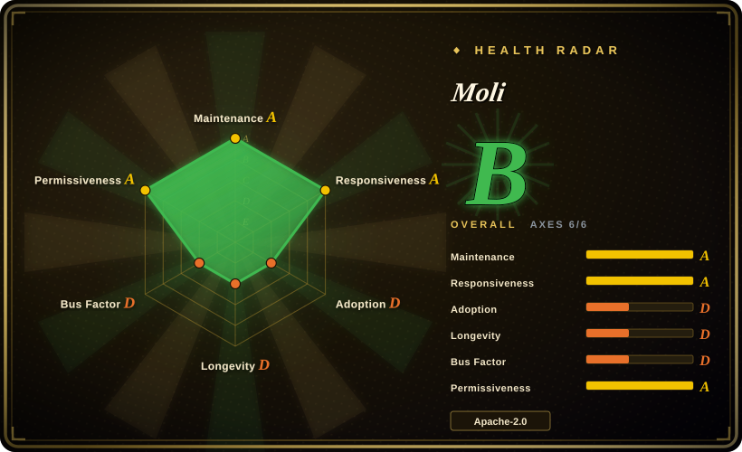
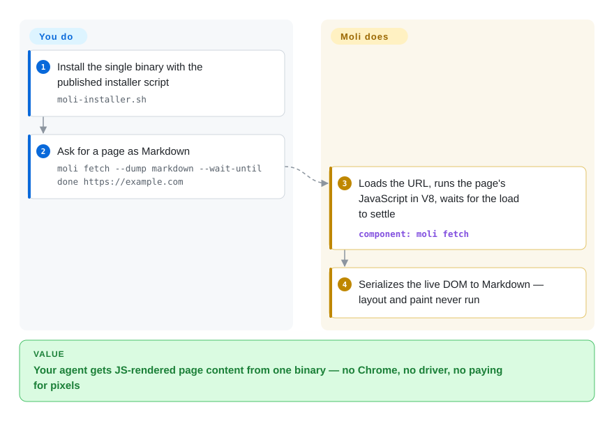

# Moli

Running a headless Chrome per agent task burns hundreds of MB and a whole process tree, and most of that bill pays for pixels nobody will look at. Moli is a single Rust binary with a complete DOM/JavaScript/CSS runtime that only computes layout and paints when you explicitly ask (`--layout`), so structure-first work — fetching, extraction, DOM automation — runs near ~100 MB in one process.

## When to use

You're building an agent loop, crawl, or retrieval pipeline that touches hundreds to thousands of live pages, and fleet cost is dominated by browser weight: ~11 processes and ~700 MB per headless Chrome instance. You reach for Moli when the workload is structure-first — load a JS-rendered page, dump Markdown or a semantic tree, query the DOM, run scripts, keep cookies and IndexedDB — while occasionally (not continuously) you still need real geometry: a box query, a coordinate click, a screenshot, a PDF. Against [Lightpanda](lightpanda.md) and [Obscura](obscura.md), the deciding tradeoff is that Moli keeps a full software layout/paint stack in the same binary behind an opt-in flag, and serves CDP, WebDriver Classic, and WebDriver BiDi from one endpoint.

Against driving real Chrome through [Puppeteer](puppeteer.md) or [Playwright](../playwright-family/playwright.md), Moli buys roughly an order of magnitude less CPU and memory (author-reported ~15% CPU / ~13% peak memory per task) at the price of compatibility coverage — its own benchmark puts task success at ~82% against Chrome's ~99.8%. Pick it when scale cost decides your budget and unsupported operations failing with explicit errors is acceptable.

## Q&A

- **Is this really a browser "built from scratch"? One lead contributor in a few weeks sounds absurd.** Only the glue is from scratch: V8 executes the JavaScript, html5ever parses HTML, Servo/Stylo computes CSS, Taffy + Parley do box and text layout, Vello rasterizes on CPU — Moli wrote the orchestration kernel, the DOM/style integration, the three protocol servers, and the on-demand rendering policy on top. That is the same lineage Lightpanda took, so the "from scratch" framing is marketing for "assembly instead of a Chromium fork". The remaining absurdity is real, though: ~1,160 of ~1,200 commits in the recent window come from one contributor, and every performance number is self-run — read this page's Health section as a hype-flag inventory, not a miracle story.

## How it works

Install one binary and you get two surfaces. For one-shot extraction you run `moli fetch`, which loads the URL, runs the page's JavaScript in V8, waits however you asked (a selector, a network response, a settled load), and prints HTML, Markdown, JSON, or a compact semantic text tree to stdout. For automation you run `moli serve`, and one endpoint speaks CDP, WebDriver Classic, and WebDriver BiDi — Playwright attaches with `chromium.connectOverCDP("http://127.0.0.1:9222")` and existing Puppeteer-style scripts mostly keep working. The cost model behind both: the DOM and its computed styles are the only retained state — layout is not a continuously maintained tree; by default (mock layout) geometry is faked deterministically and no real measuring happens at all. The first genuine geometry request builds a working layout tree, freezes it into an immutable snapshot, and discards everything else; a screenshot rebuilds the tree, paints one fresh CPU frame, and throws the paint state away. You opt into real rendering with `--layout`, and optional image/font/media fetching with `--resource` or per-family flags.

<!-- flow-steps:begin (generated from flows/moli.json by tools/flow_card.py — do not edit) -->

Text version of the flow

1. **You**: Install the single binary with the published installer script — `moli-installer.sh`
2. **You**: Ask for a page as Markdown — `moli fetch --dump markdown --wait-until done https://example.com`
3. **Moli**: Loads the URL, runs the page's JavaScript in V8, waits for the load to settle — component: `moli fetch`
4. **Moli**: Serializes the live DOM to Markdown — layout and paint never run

**Value**: Your agent gets JS-rendered page content from one binary — no Chrome, no driver, no paying for pixels

<!-- flow-steps:end -->

## When NOT to use

- **You cannot afford to lose tasks to compatibility gaps.** Login walls, exotic SPAs, long-tail Web APIs are where a non-Chromium engine dies; the project's own benchmark reports ~82% task success vs Chrome's ~99.8% `[未验证 — author-run]`. Use real Chromium through [Playwright](../playwright-family/playwright.md) or [Puppeteer](puppeteer.md) when correctness outweighs cost.
- **You need pixel fidelity** — visual regression baselines, print-perfect PDFs, Canvas/WebGL, or media playback. Moli explicitly disclaims Chrome parity and high-fidelity rendering; use real headless Chrome via Puppeteer.
- **You never need rendering at all and want the leanest fetcher.** In Moli's own crawl table, Lightpanda is faster and lighter (median 0.97 s / 40 MiB vs 1.43 s / 73 MiB); use [Lightpanda](lightpanda.md) when DOM+JS extraction is 100% of the job.
- **You need built-in anti-detection.** The README claims none `[推断 — absence of evidence]`; use [Obscura](obscura.md) (stealth build) or the nodriver family for Chromium.
- **You're betting a compliance boundary on maintenance longevity.** The repo was created 2026-08-10; there is no track record, no third-party audit, and the docs surface is README + three skills. If the Lindy prior matters more than the footprint win, stay on Chromium-based stacks.

## Comparison

| Alternative | In index | Our verdict | Tradeoff |
|---|---|---|---|
| [Lightpanda](lightpanda.md) | ✅ | Choose Lightpanda when the job is pure JS+DOM extraction and no operation needs real geometry; choose Moli when the same binary must occasionally screenshot, hit-test, or export PDF. | Lightpanda has no layout/paint engine, so visual output is out; Moli keeps a full render stack behind an opt-in flag and pays a bit more memory for it. |
| [Obscura](obscura.md) | ✅ | Choose Obscura when stealth (fingerprint randomization, tracker blocking) is a first-class requirement; choose Moli when protocol breadth (CDP + WebDriver Classic + BiDi) and the frozen-on-demand layout model matter more. | Obscura ships always-on rendering plus stealth variants but is CDP-first; Moli is structure-first with no anti-detection story. Both self-report their benchmarks. |
| [Puppeteer](puppeteer.md) (real Chrome) | ✅ | Choose Puppeteer against real Chromium when task success must approach 100% and per-instance memory is not your bottleneck; choose Moli when the fleet bill is the bottleneck. | Chrome's compatibility is the benchmark everyone loses to; Moli trades ~18 points of it for ~7x less memory (author-reported). |
| [Playwright](../playwright-family/playwright.md) | ✅ | Choose Playwright for the full test stack (trace, fixtures, cross-browser); Moli is a target it can drive over CDP, not a replacement for its runner. | Different layer: Playwright is the client/framework, Moli is the engine under it; you can combine them. |
| [PhantomJS](phantomjs.md) | ✅ | Treat PhantomJS as an archived pattern source only; Moli is its maintained modern descendant in spirit — a standalone scriptable headless browser — for any new work. | PhantomJS has been dead since 2018 and predates V8-grade JS and the agent workload; Moli exists precisely because that niche was re-invented around AI agents. |

## Tech stack

- **Rust workspace** of ~90 crates (`moli-core`, `moli-dom`, `moli-layout`, `moli-paint`, `moli-protocol-*`, …) with vendored dependencies, per the repo tree (2026-09-27).
- **V8** via `rusty_v8` for JavaScript; **html5ever** for streaming HTML parsing; **Servo/Stylo** for selectors, cascade, computed style.
- **Taffy + Parley** for box and text layout; **AnyRender/Vello CPU, usvg** for software raster; **libcurl** for transport.
- Protocol servers for **CDP, WebDriver Classic, WebDriver BiDi** share one kernel and scheduler; ships agent **skills** (`moli-webfetch`, `moli-websearch`, `moli-cdp-server`).

## Dependencies

- One prebuilt binary; no Chrome/Firefox install, no chromedriver/geckodriver, no Node.js runtime required (Linux, macOS, Windows).
- For the automation surface you need a client (Playwright/Puppeteer/Selenium) that speaks CDP or WebDriver to `moli serve` — any existing one works.
- Optional persistence is opt-in per workload: `--profile-dir`, `--http-cache-dir`, `--cookie-file`.

## Ops difficulty

**Low to medium.** Deploy is a single binary or installer script, and `moli serve` is one process with proxy/profile/resource-policy flags. The real burden is youth: point releases arrive every 1–2 days (v1.1.7→v1.1.11 across 2026-09-16→09-26), the compatibility envelope is still moving, unsupported paths fail at runtime with explicit errors, and there is no third-party reproduction of its claims to lean on. Budget for pinning versions and regression-testing your target sites yourself.

## Health & viability

- **Maintenance (2026-09):** extremely active — v1.1.11 released 2026-09-26, pushes same day; a release every 1–2 days over the last month.
- **Governance / bus factor:** org-owned (Lexmount), but the contributors API shows 1,158 of ~1,200 recent-window commits from a single account (`ldm0`) — effectively bus factor 1 `[未验证 — identity/employment not confirmed]`.
- **Backing:** Lexmount sells a managed cloud browser (homepage is `browser.lexmount.com`); the OSS binary is its acquisition funnel, so roadmap alignment is commercial, not foundation-backed.
- **Age / Lindy:** created 2026-08-10 — under two months old with 2.5k stars; this is a hype curve, no viability credit either way yet.
- **Risk flags:** all benchmarks self-run on the vendor's own Lexbench repo; docs beyond translated READMEs and skills not verified; no third-party security or compliance review; version churn outpaces any documented upgrade policy.

## Caveats (unverified)

- [未验证] Mixed-crawl, agent-workload, and Lexbench numbers are author-run (lexmount org repos) and were not reproduced here.
- [未验证] The claim that one full WPT selection run passed 1.612 million tests has no independent publication checked.
- [推断] Default mock layout means `getBoundingClientRect`-style geometry is deterministic fake values rather than real boxes — inferred from the README's `LayoutPolicy::Mock` description, not tested.
- [推断] "No anti-detection" is an absence-of-evidence reading of the README, not a stated limitation.
- [未验证] The `moli-web-bot-auth` crate suggests some bot-authentication (e.g. signed requests) support; its extent was not researched.
- [未验证] Installer scripts (`curl | sh`) and telemetry/security posture were not audited; the dual Apache-2.0/MIT licensing is per README and LICENSE files, with some third-party components separately licensed.
- [未验证] Playwright/Puppeteer "mostly keeps working" compatibility against Moli's CDP surface is inferred from the README example; per-API coverage was not checked.
