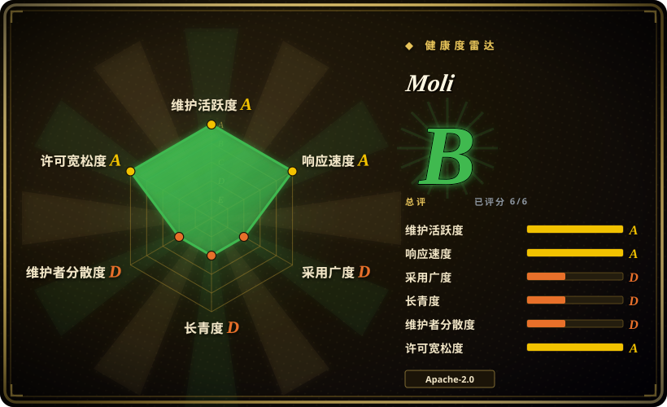
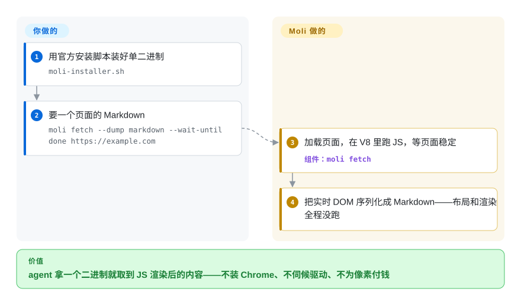

# Moli

给 agent 每个任务起一个无头 Chrome，动辄几百 MB 内存加一整个进程树，而这笔开销大多花在了没人看的像素上。Moli 是一个 Rust 写的单二进制：完整的 DOM/JavaScript/CSS 运行时都在，但只有你显式要求（`--layout`）时才计算布局、才真正绘制像素，所以抓取、提取、DOM 自动化这类「结构优先」的活儿，单进程约百 MB 就能跑。

## 何时使用

你在做 agent 循环、爬虫或检索管线，一天要碰成百上千个真实网页，而机群成本的大头是浏览器的体重：一个无头 Chrome 实例约 11 个进程、约 700 MB。当工作负载是结构优先的——加载 JS 渲染的页面、导出 Markdown 或语义树、查询 DOM、执行脚本、维护 cookie 与 IndexedDB——只是偶尔（而非持续）需要真实几何：量一个盒模型、按坐标点一下、截一张图、导一份 PDF——你就该想到 Moli。和 [Lightpanda](lightpanda.zh.md)、[Obscura](obscura.zh.md) 相比，决定性的差异是 Moli 把完整的软件布局/绘制栈收进同一个二进制、用一个开关按需触发，并且一个端点同时提供 CDP、WebDriver Classic 和 WebDriver BiDi。

和用 [Puppeteer](puppeteer.zh.md) 或 [Playwright](../playwright-family/playwright.zh.md) 驱动真实 Chrome 相比，Moli 换来大约一个数量级的 CPU 与内存节省（项目自报每任务约 Chrome 的 15% CPU、13% 峰值内存），代价是兼容性覆盖——它自己的基准测得任务通过率约 82%，Chrome 约 99.8%。当规模成本才是预算的决定项、且能接受不支持的操作明确报错时，选它。

## 快问快答

- **这真是「从零写」的浏览器？一个主力贡献者几周做完，听着太离谱。** 只有胶水层是从零写的：V8 执行 JavaScript、html5ever 解析 HTML、Servo/Stylo 算 CSS、Taffy + Parley 做盒模型与文字布局、Vello 做 CPU 光栅化——Moli 自己写的是把这些编排起来的内核、DOM/样式集成、三个协议服务器和按需渲染策略。这条路线 Lightpanda 早就走过，所以「从零」是对「组装而非 Chromium 分叉」的营销话术。不过离谱的部分也是真的：近期窗口约 1,200 次提交里 1,160 次出自同一个人，所有性能数字都是自测——请把本页健康度一节读成风险信号清单，而不是奇迹故事。

## 怎么用起来

装一个二进制，你得到两个入口。一次性提取就运行 `moli fetch`：它加载 URL、在 V8 里执行页面 JS、按你指定的方式等待（选择器、某个网络响应、加载稳定），然后把 HTML、Markdown、JSON 或紧凑的语义文本树打到标准输出。做自动化就运行 `moli serve`：一个端点同时说 CDP、WebDriver Classic 和 WebDriver BiDi，Playwright 用 `chromium.connectOverCDP("http://127.0.0.1:9222")` 连上，既有的 Puppeteer 风格脚本大多能直接跑。背后的成本模型：DOM 和它的计算样式是唯一持续保留的状态——布局不是一棵一直维护的树；默认（mock layout）几何值是用确定性的假数据顶替的，根本不发生真实测量。第一次真正的几何请求会构建工作布局树、冻结成一份不可变快照，其余全部丢弃；截图则重建树、在 CPU 上现绘一帧，然后把绘制状态扔掉。真实渲染用 `--layout` 打开，图片/字体/媒体等可选资源用 `--resource` 或按类开关打开。

<!-- flow-steps:begin (generated from flows/moli.json by tools/flow_card.py — do not edit) -->

流程文字版

1. **你**：用官方安装脚本装好单二进制 — `moli-installer.sh`
2. **你**：要一个页面的 Markdown — `moli fetch --dump markdown --wait-until done https://example.com`
3. **Moli**：加载页面，在 V8 里跑 JS，等页面稳定 — 组件：`moli fetch`
4. **Moli**：把实时 DOM 序列化成 Markdown——布局和渲染全程没跑

**价值**：agent 拿一个二进制就取到 JS 渲染后的内容——不装 Chrome、不伺候驱动、不为像素付钱

<!-- flow-steps:end -->

## 何时不用

- **你承受不了任务被兼容性缺口吃掉。** 登录墙、奇葩 SPA、长尾 Web API 正是非 Chromium 引擎阵亡的地方；项目自报基准里任务通过率约 82%，Chrome 约 99.8%（`[未验证]`——作者自测）。正确性重于成本时，用 [Playwright](../playwright-family/playwright.zh.md) 或 [Puppeteer](puppeteer.zh.md) 驱动真实 Chromium。
- **你需要像素级保真**——视觉回归基线、打印级 PDF、Canvas/WebGL 或媒体播放。Moli 明确不承诺与 Chrome 对齐，也不做高保真渲染；改用 Puppeteer 驱动真实无头 Chrome。
- **你完全不需要渲染、只要最瘦的抓取器。** Moli 自己的爬取对照表里 Lightpanda 更快更轻（中位 0.97 秒/40 MiB 对 1.43 秒/73 MiB）；DOM+JS 提取就是全部工作时用 [Lightpanda](lightpanda.zh.md)。
- **你需要内置反检测。** README 没有任何此类承诺（`[推断]`——证据缺失的读法）；要伪装用 [Obscura](obscura.zh.md)（stealth 构建）或 Chromium 系的 nodriver。
- **你在把合规边界押到维护年限上。** 仓库创建于 2026-08-10，没有履历、没有第三方审计，文档面只有多语 README 加三个 skill。Lindy 先例比内存收益更重要时，留在 Chromium 系栈上。

## 横向对比

| 替代品 | 是否收录 | 我们的评价 | 取舍 |
|---|---|---|---|
| [Lightpanda](lightpanda.zh.md) | ✅ | 纯 JS+DOM 提取、没有任何操作需要真实几何时选 Lightpanda；同一个二进制还得偶尔截图、命中测试、导 PDF 时选 Moli。 | Lightpanda 没有布局/绘制引擎，视觉输出直接出局；Moli 把完整渲染栈收进同一个二进制、按需开关，为此多付一点内存。 |
| [Obscura](obscura.zh.md) | ✅ | 反检测（指纹随机化、跟踪拦截）是一等需求时选 Obscura；协议广度（CDP + WebDriver Classic + BiDi）与按需冻结布局的成本模型更重要时选 Moli。 | Obscura 常开渲染并带 stealth 变体，但协议面以 CDP 为主；Moli 结构优先、没有反检测叙事。双方基准都是自测。 |
| [Puppeteer](puppeteer.zh.md)（真实 Chrome） | ✅ | 任务通过率必须逼近 100%、单实例内存不是瓶颈时选 Puppeteer 对真实 Chromium；机群账单才是瓶颈时选 Moli。 | Chrome 的兼容性是所有人输给的基准；Moli 用约 18 个百分点换约 7 倍内存节省（作者自报）。 |
| [Playwright](../playwright-family/playwright.zh.md) | ✅ | 要完整测试栈（trace、fixture、跨浏览器）选 Playwright；Moli 是它能通过 CDP 驱动的目标，不是它的 runner 的替代品。 | 不同层：Playwright 是客户端/框架，Moli 是它底下的引擎；两者可以组合用。 |
| [PhantomJS](phantomjs.zh.md) | ✅ | PhantomJS 只当归档的设计参考；Moli 精神上是它被 AI agent 工作负载重新发明出来的现代后裔，新工作一律用后者。 | PhantomJS 2018 年就停了，缺 V8 级 JS 与现代协议；这个生态位正是为 agent 重做的。 |

## 技术栈

- **Rust workspace**，约 90 个 crate（`moli-core`、`moli-dom`、`moli-layout`、`moli-paint`、`moli-protocol-*` 等），依赖走 vendor（2026-09-27 看仓库树）。
- JavaScript 用 `rusty_v8` 挂 **V8**；流式 HTML 解析用 **html5ever**；选择器、层叠、计算样式用 **Servo/Stylo**。
- 盒模型与文字布局用 **Taffy + Parley**；软件光栅用 **AnyRender/Vello CPU、usvg**；网络传输用 **libcurl**。
- **CDP、WebDriver Classic、WebDriver BiDi** 三套协议服务器共享一个内核与调度器；随仓库发 agent **skill**（`moli-webfetch`、`moli-websearch`、`moli-cdp-server`）。

## 依赖

- 一个预编译二进制；不需要装 Chrome/Firefox，不需要 chromedriver/geckodriver，不需要 Node.js 运行时（支持 Linux、macOS、Windows）。
- 自动化入口需要一个说 CDP 或 WebDriver 的客户端（Playwright/Puppeteer/Selenium）连 `moli serve`——现成的都行。
- 持久化按负载 opt-in：`--profile-dir`、`--http-cache-dir`、`--cookie-file`。

## 运维难度

**低到中。** 部署是一个二进制或安装脚本，`moli serve` 是单进程，代理、profile、资源策略都有开关。真正的负担是年轻：点版本 1–2 天一个（v1.1.7→v1.1.11 覆盖 2026-09-16→09-26），兼容边界还在移动，不支持的路径在运行时显式报错，且没有任何第三方复现可以仰仗。要为锁定版本和自己回归测试目标站点留出预算。

## 健康度与可持续性

- **维护（2026-09）：** 极度活跃——v1.1.11 发布于 2026-09-26，当天还在推代码；最近一个月约 1–2 天一个 release。
- **治理/巴士因子：** 挂在 Lexmount 组织下，但 contributors API 显示近期窗口约 1,200 次提交里 1,158 次来自同一个账号（`ldm0`）——实际巴士因子为 1（`[未验证]`——身份与雇佣关系未确认）。
- **背书：** Lexmount 卖托管云浏览器（homepage 是 `browser.lexmount.com`），开源二进制是它的获客漏斗；路线图归属是商业公司，不是基金会。
- **年限/Lindy：** 创建于 2026-08-10，不到两个月、2.5k star；这是条热度曲线，可持续性两边都还没有加分。
- **风险信号：** 全部基准出自作者自己的 Lexbench 仓库；翻译 README 与 skill 之外的文档未核实；没有第三方安全或合规评审；版本 churn 快过任何成文的升级政策。

## 存疑（未验证）

- [未验证] 混合爬取、agent 负载与 Lexbench 数字均为作者自测（lexmount 组织名下仓库），本文未复现。
- [未验证] 「一轮完整 WPT 选择集通过 161.2 万个测试」的说法没有查到独立发布来源。
- [推断] 默认 mock layout 意味着 `getBoundingClientRect` 一类几何返回确定性假值而非真实盒模型——依据是 README 对 `LayoutPolicy::Mock` 的描述，未实测。
- [推断] 「没有反检测」是对 README 沉默处的证据缺失解读，不是项目自述的限制。
- [未验证] `moli-web-bot-auth` crate 暗示存在某种 bot 认证（如签名请求）支持，范围未调研。
- [未验证] 安装脚本（`curl | sh`）与遥测/安全姿态未审计；Apache-2.0/MIT 双许可依据 README 与 LICENSE 文件，部分第三方组件另有许可。
- [未验证] Playwright/Puppeteer「大多能直接跑」的兼容性推断自 README 示例，逐 API 覆盖未核对。
