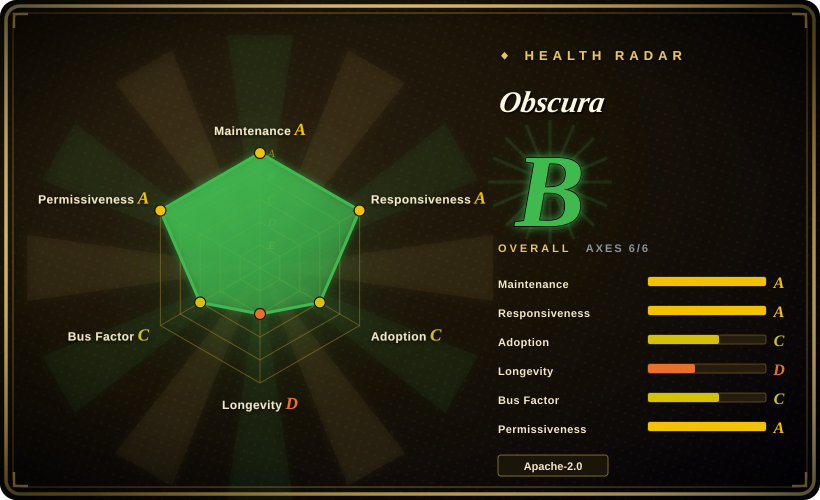
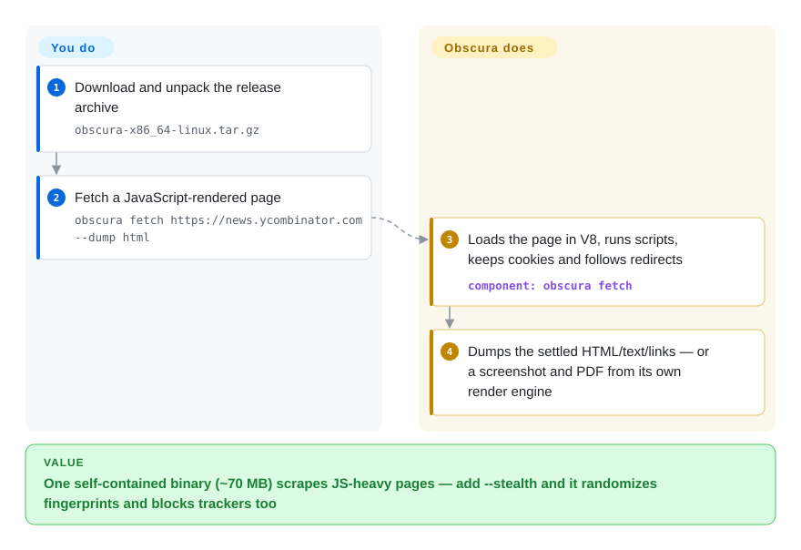

# Obscura

Your scraper gets blocked the moment it stops looking like a person, and running patched Chrome fleets for fingerprint evasion is a full-time job. Obscura is a ~70 MB Rust headless browser — V8 JavaScript, its own render engine, CDP — whose stealth builds randomize fingerprints, mask `navigator.webdriver`, and block ~3,500 tracker domains out of the box, for Puppeteer/Playwright scripts that connect instead of installing a browser.

## When to use

You're running scraping or agent-browsing workloads against sites that actively fingerprint visitors, and the bundle you need is "light runtime + looks human": Obscura's `--stealth` variants ship per-session fingerprint randomization (GPU, canvas, audio, battery), native-function masking, an `isTrusted` event story, and tracker blocking in one binary, and its always-on rendering engine covers block/inline/flex/grid/table layout, SVG, canvas, screenshots, screencasts, and raster PDFs — so the visual outputs your DOM-only alternatives ([Lightpanda](lightpanda.md)) cannot produce are produced by default, and the stealth layer the structure-first engines ([Moli](moli.md)) don't offer is there too.

Also choose it when Apache-2.0 matters (vs Lightpanda's AGPL), when parallel batch scraping from the CLI (`obscura scrape --concurrency 25`) is your shape, or when SSRF hygiene on your own infra matters — private-IP fetches are blocked by default and require an explicit `--allow-private-network`.

## Q&A

- **Another "Rust browser, 5.5 months, 28k stars" — same story as Moli?** Same shape, different details, and the details are what you should check before trusting either: the repo is user-owned (`h4ckf0r0day`) but its top committer is a different account (`SGavrl`, 862 of ~1,050 commits), the README's mid-page real estate is occupied by three paid proxy-provider sponsor blocks with discount codes, and its benchmark suite lives in a separate self-published repo. None of that disproves the product; it tells you the marketing surface is thick and the governance surface is thin.

## How it works

You unpack a release archive (no Chrome, no Node.js; the archive pairs `obscura` with `obscura-worker` for the parallel `scrape` command) and either run one-shot fetches — `obscura fetch <url> --dump html|text|links|assets|original`, `--eval`, `--screenshot`, `--wait-until networkidle0` — or start `obscura serve --port 9222` and point puppeteer-core / Playwright's `connectOverCDP` at it; a `--stealth` flag turns on fingerprint randomization and the 3,520-domain blocklist (stealth transports go through wreq/BoringSSL, which is why there are four build variants: render×stealth on/off). Inside, it is a real engine: streaming network via its own fetch layer, V8 JavaScript with cookies and redirect handling, DOM with form submission, and an independent CSS layout/paint implementation — you keep responsibility for what you're allowed to fetch, and for the long tail where its unimplemented CSS/Web APIs diverge from Chromium. There is also an MCP server for agent clients, and a hosted "Obscura Cloud" is on the waitlist while the engine stays Apache-2.0 with, per the README, no feature gating.

<!-- flow-steps:begin (generated from flows/obscura.json by tools/flow_card.py — do not edit) -->

Text version of the flow

1. **You**: Download and unpack the release archive — `obscura-x86_64-linux.tar.gz`
2. **You**: Fetch a JavaScript-rendered page — `obscura fetch https://news.ycombinator.com --dump html`
3. **Obscura**: Loads the page in V8, runs scripts, keeps cookies and follows redirects — component: `obscura fetch`
4. **Obscura**: Dumps the settled HTML/text/links — or a screenshot and PDF from its own render engine

**Value**: One self-contained binary (~70 MB) scrapes JS-heavy pages — add --stealth and it randomizes fingerprints and blocks trackers too

<!-- flow-steps:end -->

## When NOT to use

- **Compliance forbids anti-bot circumvention.** Fingerprint randomization and `webdriver` masking exist to defeat detection; using them against sites whose ToS prohibit it shifts legal risk onto you. If you only need permitted automation, use plain [Playwright](../playwright-family/playwright.md) or [Puppeteer](puppeteer.md) with real Chrome.
- **You need protocol breadth beyond CDP.** The documented surface is CDP (+MCP); WebDriver Classic/BiDi are not on the feature list — for three-protocol servers use [Moli](moli.md) or [Lightpanda](lightpanda.md) (CDP+BiDi).
- **You need guaranteed web-platform compatibility.** Its rendering is "an evolving independent engine" by its own words; long-tail CSS, media playback, and some Web APIs differ from Chromium. For success-rate-critical work, real Chrome wins, and unlike Moli, Obscura publishes no cross-engine task-success number to even argue from.
- **You need a governed vendor.** The repo is User-owned, the main committer is neither the named owner nor an org, and the README doubles as proxy-vendor advertising — if procurement needs a legal entity behind the SBOM, this isn't it yet.
- **You expected the browser alone.** Stealth without a proxy pool still gets IP-blocked; the project's own sponsor section tells you the intended pairing is residential/mobile proxies, which are paid third-party services.

## Comparison

| Alternative | In index | Our verdict | Tradeoff |
|---|---|---|---|
| [Moli](moli.md) | ✅ | Choose Obscura when stealth plus always-on rendering is the workload; choose Moli when you want structure-first economics with rendering as an opt-in exception and CDP+WebDriver on one endpoint. | Obscura renders everything by default and carries stealth/sponsor-saturated marketing; Moli is on-demand-render with a cleaner (if equally self-run) benchmark story. |
| [Lightpanda](lightpanda.md) | ✅ | Choose Lightpanda for the longest-lived, daily-WPT-verified structure-only extractor; choose Obscura when the same job also needs screenshots, PDFs, or anti-fingerprinting. | Lightpanda has no render engine and no stealth, but 3.5 years of record vs Obscura's 5.5 months; licenses differ too (AGPL vs Apache-2.0). |
| [nodriver](nodriver.md) | ✅ | Choose nodriver when the stealth layer should ride a real Chromium in Python; choose Obscura when you want the stealth inside a 70 MB self-contained engine instead of a patched-Chrome runtime. | nodriver inherits Chrome's compatibility (and its footprint/AGPL license); Obscura buys footprint at the price of an independent engine's long tail. |
| [Puppeteer](puppeteer.md) (real Chrome) | ✅ | Choose Puppeteer against real Chromium when blocking is handled upstream (proxies, approved access) and compatibility must approach 100%; Obscura is for when the browser itself must dodge fingerprinting. | Chrome is the reference every stealth engine is measured against — and the thing detection systems calibrate on. |
| [Playwright](../playwright-family/playwright.md) | ✅ | Choose Playwright as the test stack and client — it drives Obscura over CDP — not as an alternative to it. | Different layer: framework vs engine target; pin against the CDP domains Obscura actually implements. |

## Tech stack

- **Rust** workspace (~22 MB repo); V8 embedded (compiles from source on first build); own streaming DOM/network stack.
- **Rendering:** independent CSS layout and paint (block/inline/flex/grid/table/float/transform/SVG/canvas/animation), CDP screencast, raster PDF — no Chromium.
- **Stealth transport:** wreq + BoringSSL (needs CMake/Clang/libclang to build); non-stealth renders use rustls.
- **Interfaces:** CDP server (`serve`), CLI (`fetch`, `scrape` with workers), MCP server, Docker image (distroless, ~57 MB, uid 65532).

## Dependencies

- One binary archive per platform (Linux x86_64/aarch64 on glibc ≥ Ubuntu 22.04, macOS Intel/ARM, Windows zip); nothing to install beyond it.
- Source builds need Rust 1.75+; stealth builds additionally need CMake, Clang, and libclang dev libraries.
- Docker usage expects a loopback-published port and a mounted storage dir writable by uid 65532; an `OBSCURA_CDP_TOKEN` guards the CDP endpoint.
- Real anti-blocking at scale implies external proxies (paid services; the README sponsors three).

## Ops difficulty

**Medium.** Deployment is trivial (single binary, distroless image, env-var knobs, private-network SSRF default-off), but operationally this is a young independent engine in an adversarial lane: fingerprint arms races decay claims quickly, stealth builds have a heavier toolchain, release cadence is ~biweekly v0.2.x with no long-term support story, and its benchmark/compatibility evidence is all self-published. Budget version pinning, corpus regression tests, and a fallback to real Chromium for pages it loses.

## Health & viability

- **Maintenance:** very active — v0.2.3 (2026-09-20), ~monthly-to-biweekly releases since v0.2.0 (2026-08-08); pushed 2026-09-27.
- **Governance / bus factor:** User-owned repo (`h4ckf0r0day`, 33 commits) with a dominant unrelated committer (`SGavrl`, 862); no foundation, unclear legal owner of the roadmap; "Obscura Cloud" is pre-launch (waitlist).
- **Age / Lindy:** created 2026-04-13 — 5.5 months, 28k stars; a hype curve, no viability credit yet either way.
- **Adoption:** Docker Hub image, Nix package, docs site, Puppeteer/Playwright/MCP guides; claims to have seeded Cloudflare's Kitesurf prototype (per its own README linking a Cloudflare blog post — not independently confirmed).
- **Risk flags:** README carries paid proxy-provider sponsor advertising; anti-detection positioning invites ToS/legal exposure; contributor structure (owner ≠ main author) is unexplained; all performance/stealth claims self-run.

## Caveats (unverified)

- [未验证] 30 MB memory, 85 ms page loads, and instant startup are vendor-reported; no independent measurement checked.
- [未验证] "Obscura inspired Cloudflare Kitesurf's first prototype" links to a Cloudflare blog post that was not independently read here.
- [未验证] Who controls the project (`h4ckf0r0day` vs top committer `SGavrl`) and any company behind it; "employees" was not claimed because it wasn't verifiable.
- [未验证] The 3,520-domain blocklist contents, and whether "no feature gating, ever" survives the Cloud launch.
- [推断] CDP-only protocol surface is inferred from the README's CDP API table and docs list (no WebDriver section), not from a confirmed absence.
- [未验证] Stealth effectiveness against current fingerprinting/bot systems was not and cannot be benchmarked here; such claims decay quickly.
- [未验证] The separate `obscura-benchmark` repo (WPT, obstacle course, vs-Chrome) was not audited for methodology.
