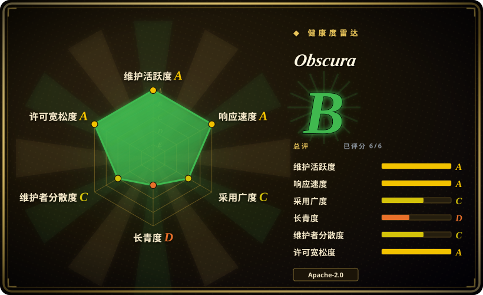
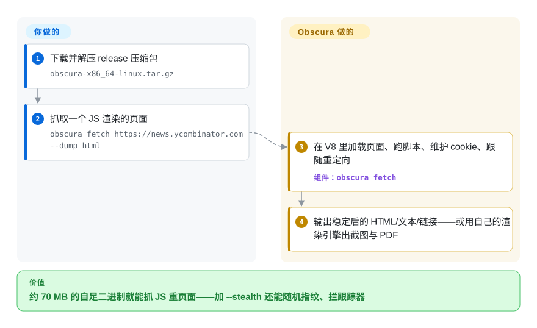

# Obscura

爬虫一不像人就被封，而为躲指纹去运维一支魔改 Chrome 机群又是一份全职工作。Obscura 是一个约 70 MB 的 Rust 无头浏览器——V8 JavaScript、自研渲染引擎、CDP——它的 stealth 构建开箱就随机化指纹、藏起 `navigator.webdriver`、拦截约 3,500 个跟踪域名，Puppeteer/Playwright 脚本连上即用，不必再装浏览器。

## 何时使用

你在对主动做访客指纹识别的站点跑抓取或 agent 浏览负载，需要的组合是「轻量运行时 + 长得像人」：Obscura 的 `--stealth` 变体随包发每会话指纹随机化（GPU、canvas、audio、电池）、原生函数掩蔽、`isTrusted` 事件伪装和跟踪拦截，而其常开渲染引擎覆盖 block/inline/flex/grid/table 布局、SVG、canvas、截图、录屏与光栅 PDF——于是纯结构系替代品 [Lightpanda](lightpanda.zh.md) 做不出的视觉产物它默认就有，结构优先系 [Moli](moli.zh.md) 不提供的那层反检测它也有。

同样在这些信号下选它：Apache-2.0 是你所在意的（对比 Lightpanda 的 AGPL）；你的形态是 CLI 并行批抓（`obscura scrape --concurrency 25`）；或你在自己基础设施上在意 SSRF 卫生——对私网 IP 的请求默认被拦，要显式 `--allow-private-network` 才放行。

## 快问快答

- **又一个「Rust 浏览器，5 个半月，28k star」，和 Moli 一个剧本？** 形态相同，细节不同，而值得你信的恰是细节：仓库挂在个人账号（`h4ckf0r0day`）名下，头号提交者却是另一个账号（`SGavrl`，约 1,050 次提交里占 862 次）；README 中段被三家付费代理商的广告位和折扣码占据；基准套件在另一个自发仓库里。这些都不构成对产品本身的否定，但它们告诉你：营销面很厚，治理面很薄。

## 怎么用起来

解压一个 release 包（不依赖 Chrome 和 Node.js；包里 `obscura` 与 `obscura-worker` 成对，后者支撑并行的 `scrape` 命令），然后二选一：跑一次性抓取——`obscura fetch <url> --dump html|text|links|assets|original`、`--eval`、`--screenshot`、`--wait-until networkidle0`——或者起 `obscura serve --port 9222`，让 puppeteer-core / Playwright 的 `connectOverCDP` 连上来。运行时加 `--stealth` 就打开指纹随机化与 3,520 域拦截名单（stealth 传输走 wreq/BoringSSL，这就是存在 render×stealth 四种构建变体的原因）。往里看，它是一台真实引擎：自有网络层的流式请求、带 cookie 与重定向处理的 V8 JavaScript、能提交表单的 DOM，外加一套独立实现的 CSS 布局与绘制——你保留的责任是「允许抓什么」，以及那些它未实现的长尾 CSS/Web API 与 Chromium 不一致的部分。它也有面向 agent 客户端的 MCP 服务器；托管版「Obscura Cloud」在等名单，引擎按 README 承诺「永远不做功能门控」、保持 Apache-2.0。

<!-- flow-steps:begin (generated from flows/obscura.json by tools/flow_card.py — do not edit) -->

流程文字版

1. **你**：下载并解压 release 压缩包 — `obscura-x86_64-linux.tar.gz`
2. **你**：抓取一个 JS 渲染的页面 — `obscura fetch https://news.ycombinator.com --dump html`
3. **Obscura**：在 V8 里加载页面、跑脚本、维护 cookie、跟随重定向 — 组件：`obscura fetch`
4. **Obscura**：输出稳定后的 HTML/文本/链接——或用自己的渲染引擎出截图与 PDF

**价值**：约 70 MB 的自足二进制就能抓 JS 重页面——加 --stealth 还能随机指纹、拦跟踪器

<!-- flow-steps:end -->

## 何时不用

- **合规禁止绕反机器人。** 指纹随机化与 `webdriver` 掩蔽就是为躲检测而生，拿去对着禁止自动化的 ToS 用，法律风险归你。只需要获准的自动化时，用普通 [Playwright](../playwright-family/playwright.zh.md) 或 [Puppeteer](puppeteer.zh.md) 驱动真实 Chrome。
- **你需要 CDP 之外的协议面。** 成文接口就是 CDP（加 MCP）；WebDriver Classic/BiDi 不在特性清单里——三协议服务器用 [Moli](moli.zh.md) 或 [Lightpanda](lightpanda.zh.md)（CDP+BiDi）。
- **你需要有保证的 web 平台兼容性。** 按它自己的说法，渲染是「持续演进中的独立引擎」；长尾 CSS、媒体回放、部分 Web API 与 Chromium 不一致。通过率敏感的工作交给真实 Chrome——而且和 Moli 不同，Obscura 连一个可供辩驳的跨引擎任务通过率数字都没发布。
- **你需要一个有治理的供应商。** 仓库个人所有，主力提交者既非署名 owner 也非组织，README 兼任代理商广告位——采购要 SBOM 背后有法律实体，它现在不是。
- **你以为浏览器就是全部。** 没有代理池的 stealth 照样被封 IP；项目自己的赞助商段落已经说明预期搭配是住宅/移动代理——那是第三方付费服务。

## 横向对比

| 替代品 | 是否收录 | 我们的评价 | 取舍 |
|---|---|---|---|
| [Moli](moli.zh.md) | ✅ | stealth 加常开渲染就是工作本体时选 Obscura；要结构优先的经济性、渲染只作为显式例外、且一个端点上要 CDP+WebDriver 时选 Moli。 | Obscura 默认渲染一切并背着 stealth/广告饱和的营销面；Moli 按需渲染、基准叙事同样自测但更干净。 |
| [Lightpanda](lightpanda.zh.md) | ✅ | 要最年长、每日 WPT 验证的纯结构提取器选 Lightpanda；同一活儿还要截图、PDF 或反指纹时选 Obscura。 | Lightpanda 无渲染引擎、无 stealth，但有 3.5 年履历对 5.5 个月；许可也不同（AGPL 对 Apache-2.0）。 |
| [nodriver](nodriver.zh.md) | ✅ | 反检测层应该骑在真实 Chromium 上、且你是 Python 栈时选 nodriver；要 stealth 内建于 70 MB 自足引擎、而不是魔改 Chrome 运行时时，选 Obscura。 | nodriver 继承 Chrome 的兼容性（和它的体积/AGPL 许可）；Obscura 用独立引擎的长尾风险换体量。 |
| [Puppeteer](puppeteer.zh.md)（真实 Chrome） | ✅ | 封禁在更上游解决（代理、获准访问）、兼容性必须逼近 100% 时选 Puppeteer 对真实 Chromium；浏览器本身就得躲指纹时才是 Obscura 的地盘。 | Chrome 是所有 stealth 引擎对标的参照系——也是检测系统校准的靶子。 |
| [Playwright](../playwright-family/playwright.zh.md) | ✅ | Playwright 是测试栈与客户端——它通过 CDP 驱动 Obscura——不是 Obscura 的替代品。 | 不同层：框架对引擎目标；按 Obscura 实际实现的 CDP 域钉死用法。 |

## 技术栈

- **Rust** workspace（仓库约 22 MB）；内嵌 V8（源码构建时首次从源码编译）；自有流式 DOM/网络栈。
- **渲染：** 独立实现的 CSS 布局与绘制（block/inline/flex/grid/table/float/transform/SVG/canvas/动画）、CDP 录屏、光栅 PDF——没有 Chromium。
- **Stealth 传输：** wreq + BoringSSL（构建需 CMake/Clang/libclang）；非 stealth 渲染走 rustls。
- **接口：** CDP 服务器（`serve`）、CLI（`fetch`、带 worker 的 `scrape`）、MCP 服务器、Docker 镜像（distroless、约 57 MB、uid 65532）。

## 依赖

- 每平台一个二进制包（Linux x86_64/aarch64 需 glibc ≥ Ubuntu 22.04，macOS Intel/ARM，Windows zip 包）；除此之外无安装物。
- 源码构建需 Rust 1.75+；stealth 构建另需 CMake、Clang 与 libclang 开发库。
- Docker 用法要求端口发布到回环、挂载的存储目录对 uid 65532 可写；CDP 端点由 `OBSCURA_CDP_TOKEN` 守护。
- 规模化真不被封还需外部代理（第三方付费服务；README 上有三家赞助商）。

## 运维难度

**中。** 部署 trivial（单二进制、distroless 镜像、环境变量开关、私网默认拦截），但运维上这是一台对抗赛道的年轻独立引擎：指纹军备竞赛让声明迅速贬值，stealth 构建工具链更重，发布节奏是 v0.2.x 约双周、没有长期支持叙事，基准与兼容性证据全部自发。要为锁版本、语料回归测试、以及丢页时回落到真实 Chrome 留预算。

## 健康度与可持续性

- **维护：** 极活跃——v0.2.3（2026-09-20），自 v0.2.0（2026-08-08）起约双周到每月一版；2026-09-27 仍在推代码。
- **治理/巴士因子：** 个人账号所有（`h4ckf0r0day`，33 次提交），主力提交者是无关联的另一账号（`SGavrl`，862 次）；没有基金会，路线图的法定归属不明；「Obscura Cloud」未上线（等名单）。
- **年限/Lindy：** 创建于 2026-04-13——5.5 个月、28k star；热度曲线，可持续性两边都还没有加分。
- **采用：** Docker Hub 镜像、Nix 包、文档站、Puppeteer/Playwright/MCP 指南；自称孕育了 Cloudflare Kitesurf 的原型（引自其 README 链接的 Cloudflare 博客——未独立确认）。
- **风险信号：** README 载付费代理商广告；反检测定位自带 ToS/法律暴露；贡献者结构（owner ≠ 主力作者）无解释；性能与 stealth 声明全部自测。

## 存疑（未验证）

- [未验证] 30 MB 内存、85 ms 页面加载、秒级启动均为厂商自报；未查到独立测量。
- [未验证] 「Obscura 启发了 Cloudflare Kitesurf 首个原型」链接的 Cloudflare 博客本文未独立阅读。
- [未验证] 项目的实际控制方（`h4ckf0r0day` 对头号提交者 `SGavrl`）与其背后是否有公司；因不可验证，正文未采用「员工」说法。
- [未验证] 3,520 域拦截名单的内容，以及「永不做功能门控」能否挺过 Cloud 上线。
- [推断] 「协议面仅 CDP」是从 README 的 CDP API 表与文档清单（无 WebDriver 章节）推断的，不是确认的缺失。
- [未验证] stealth 对当前指纹/机器人系统的实际效果无法在此基准化；此类声明贬值极快。
- [未验证] 独立的 `obscura-benchmark` 仓库（WPT、障碍赛、对 Chrome）方法论未审计。
