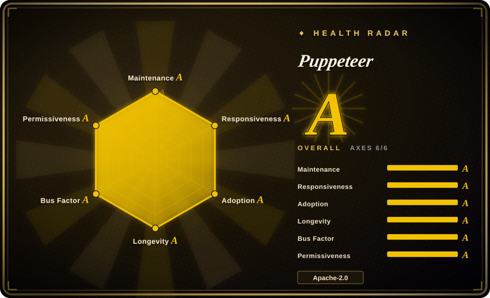
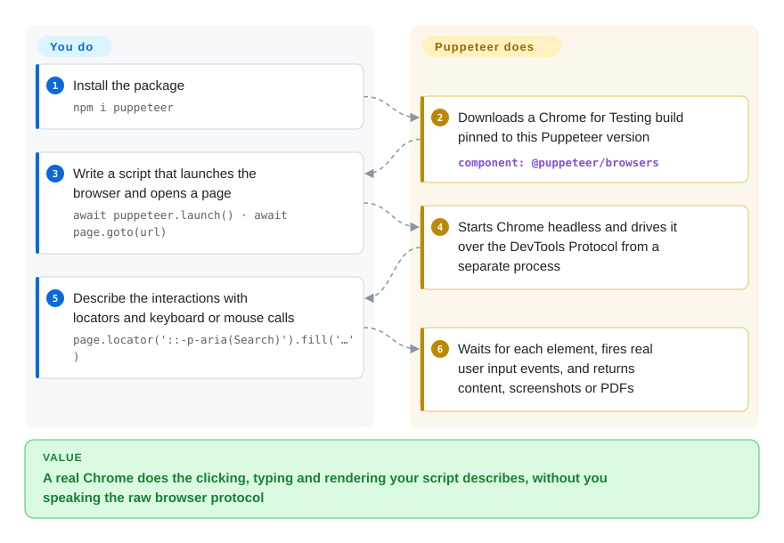

# Puppeteer

You need a script that opens a real Chrome, logs in, clicks through a page and saves a screenshot or PDF — and the browser's own remote-control protocol is a stream of low-level JSON messages nobody wants to write by hand. Puppeteer is the Chrome team's Node.js library that wraps that protocol into calls like `page.goto()` and `locator().click()`, and downloads a Chrome build that matches it.

## When to use

You are a Node.js or TypeScript developer and the job is Chrome-shaped: render an invoice page to PDF on the server, screenshot a dashboard every hour, pre-render a single-page app for crawlers, or script a login-and-download flow on a site with no API. Doing it by hand with `curl` fails because the content only exists after JavaScript runs — you get `

` and nothing else.

You reach for Puppeteer when Chrome (and optionally Firefox) is all you need and you want the library that the Chrome team itself maintains as the reference client for the DevTools Protocol: it ships a matched browser, keeps raw CDP available for Chrome-specific use cases the cross-browser standard does not cover, and is the engine under tools like Chrome DevTools MCP. You pick it over Playwright when you do not need WebKit/Safari or a built-in test runner and prefer a smaller, Chrome-first API; you pick it over Selenium when you write JavaScript and do not need a multi-language, multi-browser grid. The deciding tradeoff: Chrome-native depth and a lean library, in exchange for no WebKit, JavaScript only, and bringing your own test runner.

## How it works

Every Chromium browser can be driven remotely over the Chrome DevTools Protocol (CDP) — a websocket on which you send JSON commands like "navigate" or "dispatch mouse event". Puppeteer starts the browser (or connects to one already running), opens that socket from a separate Node.js process, and gives you a high-level API on top: pages, locators that wait for an element to be ready before acting, keyboard and mouse input that the page sees as real user events, screenshots, PDFs, network interception. For Firefox it speaks WebDriver BiDi, the newer cross-browser W3C standard, instead of CDP. What Puppeteer does for you: download a Chrome for Testing build pinned to your Puppeteer version during `npm i puppeteer`, launch it headless by default, and translate your calls into protocol messages. What you do: write the script, choose `puppeteer-core` instead if you manage the browser binary yourself, and pick a test runner (Jest, Mocha, Vitest) if you are testing — Puppeteer does not ship one.

<!-- flow-steps:begin (generated from flows/puppeteer.json by tools/flow_card.py — do not edit) -->

Text version of the flow

1. **You**: Install the package — `npm i puppeteer`
2. **Puppeteer**: Downloads a Chrome for Testing build pinned to this Puppeteer version — component: `@puppeteer/browsers`
3. **You**: Write a script that launches the browser and opens a page — `await puppeteer.launch() · await page.goto(url)`
4. **Puppeteer**: Starts Chrome headless and drives it over the DevTools Protocol from a separate process
5. **You**: Describe the interactions with locators and keyboard or mouse calls — `page.locator('::-p-aria(Search)').fill('…')`
6. **Puppeteer**: Waits for each element, fires real user input events, and returns content, screenshots or PDFs

**Value**: A real Chrome does the clicking, typing and rendering your script describes, without you speaking the raw browser protocol

<!-- flow-steps:end -->

## When NOT to use

- **You must test in Safari/WebKit or need one API across Chromium, Firefox and WebKit.** Use [Playwright](../playwright-family/playwright.md) instead, because Puppeteer supports Chrome and Firefox only.
- **You want an end-to-end test framework, not a browser library.** Use Playwright Test instead, because Puppeteer has no runner, fixtures, retries, parallel sharding, trace viewer or HTML report — you assemble them from Jest/Mocha plugins.
- **Your team writes Python, Java or C#.** Use [Selenium](selenium.md) or Playwright's language bindings instead, because Puppeteer is JavaScript/TypeScript only; the community Python port (pyppeteer) is not maintained by this project.
- **You need a browser grid across many machines and browser versions.** Use Selenium Grid instead, because orchestration at that scale is explicitly outside Puppeteer's scope per its FAQ.
- **You just want an AI coding agent to drive or debug Chrome.** Use [Chrome DevTools MCP](../agent-browser-tools/chrome-devtools-mcp.md) instead, because it packages Puppeteer as ready-made MCP tools rather than making you write the scripts.
- **You scrape at very high volume and never need pixels.** Point `puppeteer-core` at [Lightpanda](lightpanda.md) or a similar headless engine instead of full Chrome, because a Chrome per worker costs hundreds of MB of RAM; accept lower site compatibility in exchange.
- **You need to stay invisible to bot detection.** Puppeteer drives a stock automated Chrome that anti-bot services can fingerprint; look at [nodriver](nodriver.md) or [Camoufox](camoufox.md)-based stacks, and treat any stealth as best-effort.

## Comparison

| Alternative | In index | Our verdict | Tradeoff |
|---|---|---|---|
| [Playwright](../playwright-family/playwright.md) | ✅ | Choose Playwright when you need WebKit, a full test runner with tracing, or Python/Java/.NET bindings; choose Puppeteer for Chrome-first scripting in Node with the Chrome team's reference CDP client. | Broader browser and language coverage plus a test framework, at the cost of patched browser builds and a larger surface to upgrade. |
| [Selenium](selenium.md) | ✅ | Choose Selenium when you need many languages, real branded browsers through WebDriver and a grid; choose Puppeteer when a single Node service drives Chrome and speed of authoring matters more. | W3C standard and the widest ecosystem, but more moving parts (drivers, grid) and a lower-level API. |
| [Chrome DevTools MCP](../agent-browser-tools/chrome-devtools-mcp.md) | ✅ | Choose Chrome DevTools MCP when an AI agent, not your code, should drive and inspect Chrome; choose Puppeteer when you are writing the automation yourself. | Built on Puppeteer and ready for MCP clients, but you get its fixed tool set instead of a programmable API. |
| [nodriver](nodriver.md) | ✅ | Choose nodriver for Python-first async CDP control of Chrome without WebDriver; choose Puppeteer when you are in Node and want the vendor-maintained client. | Python and some anti-detection intent, but AGPL-3.0, Chromium-only and a much smaller maintainer base. |
| [Lightpanda](lightpanda.md) | ✅ | Choose Lightpanda behind `puppeteer-core` when you extract JS-rendered DOM at fleet scale and never need rendering; keep Puppeteer with real Chrome when page compatibility must be near-complete. | Far lighter per page, but an AGPL engine with materially lower web-platform coverage than Chrome. |

## Tech stack

- **TypeScript**, published to npm as `puppeteer` (bundles a browser download) and `puppeteer-core` (library only); monorepo also ships `@puppeteer/browsers` for downloading and managing browser builds.
- **Protocols:** Chrome DevTools Protocol (`devtools-protocol`) for Chrome, WebDriver BiDi (`chromium-bidi`, `webdriver-bidi-protocol`) for Firefox and optionally Chrome; `ws` for the websocket.
- **Browsers:** Chrome for Testing by default; Firefox supported since v23.

## Dependencies

- **Node.js ≥ 22.12** (follows the latest maintenance LTS); TypeScript 5.0+ if you use types.
- **A browser binary:** `npm i puppeteer` downloads a matching Chrome for Testing in its install script — package managers that block install scripts need `npx puppeteer browsers install`; with `puppeteer-core` you supply the browser yourself.
- **OS libraries for Chrome** on Linux (the Debian/RPM package lists the docs link to), plus `unzip`/`tar` to unpack browser archives; `xz`/`bzip2` for Firefox on Linux.
- **No external service** — everything runs locally.

## Ops difficulty

**Low for scripts, medium for production fleets.** Locally it is one `npm i` and it works. In Docker and CI the usual friction is the browser: missing system libraries, install scripts blocked by the package manager, sandbox flags, and the cache directory for the downloaded Chrome. Each Puppeteer release is tied to a specific browser version, so upgrading Puppeteer means upgrading Chrome together and re-testing. At scale, Chrome's memory footprint and zombie-process cleanup become the real work — budget for a browser pool or a hosted browser service.

## Health & viability

- **Maintenance (as of 2026-10-08):** very active — weekly commits and a release every week or two (v25.12.0 on 2026-09-23), managed with release-please across `puppeteer`, `puppeteer-core` and `@puppeteer/browsers`.
- **Governance & backing:** maintained by Google's Chrome Browser Automation team, who also use it to dogfood new CDP and WebDriver BiDi features; about two dozen active committers in the last year, with a core of Google engineers.
- **Age / Lindy:** about nine years old (created 2017-05) and still active — a strong Lindy prior for a JavaScript library; it survived the shift to WebDriver BiDi by adopting it rather than being displaced.
- **Adoption:** tens of millions of npm downloads a month and thousands of dependent repositories; it underpins other tools such as Chrome DevTools MCP.
- **Risk flags:** Apache-2.0, no relicense history; the main risk is breaking changes — the major version moves often (v25 by 2026), each tied to a browser bump and a rising minimum Node version.

## Caveats (unverified)

- [未验证] Memory per Chrome instance ("hundreds of MB") is a general figure; it was not measured for this page.
- [未验证] The note that pyppeteer is not maintained by this project is about ownership only; its current maintenance state was not checked.
- [推断] "Core of Google engineers" is inferred from the FAQ's statement that the Chrome Browser Automation team maintains it and from the top contributors list, not from a per-account affiliation check.
- [未验证] Download and dependent-repo figures come from the health scorer's registry lookups on 2026-10-08 and vary with which package (`puppeteer`, `puppeteer-core`, `@puppeteer/browsers`) is counted.
