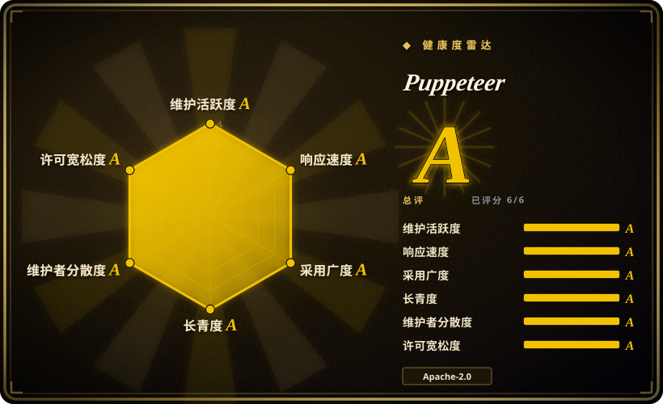
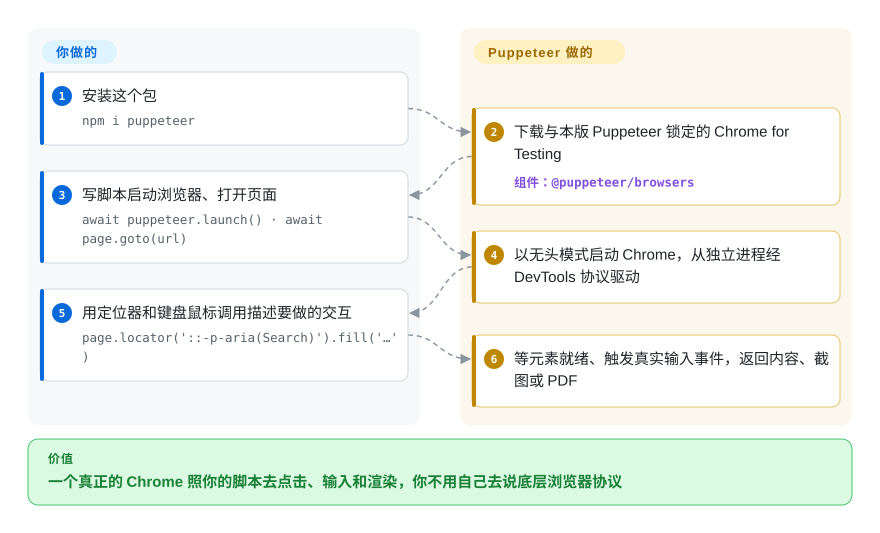

# Puppeteer

你要一段脚本去打开真正的 Chrome、登录、点几下页面、存一张截图或一份 PDF——而浏览器自带的远程控制协议是一串底层 JSON 消息，没人愿意手写。Puppeteer 是 Chrome 团队维护的 Node.js 库，把这套协议包装成 `page.goto()`、`locator().click()` 这样的调用，并顺手下载一个与之匹配的 Chrome。

## 何时使用

你是 Node.js 或 TypeScript 开发者，手上的活天生就和 Chrome 绑在一起：在服务端把发票页面渲染成 PDF、每小时给仪表盘截一张图、为爬虫预渲染单页应用，或者在一个没有 API 的网站上脚本化“登录再下载”。用 `curl` 直接抓不行，因为内容要等 JavaScript 跑完才出现——你拿到的只有 `

`。

当你只需要 Chrome（顶多再加 Firefox），并且想用 Chrome 团队亲自维护、作为 DevTools 协议参考客户端的那个库时，就该想到 Puppeteer：它自带匹配的浏览器，为跨浏览器标准覆盖不到的 Chrome 专属场景保留了原始 CDP 通道，也是 Chrome DevTools MCP 这类工具底下的引擎。你选它而不选 Playwright，是因为你不需要 WebKit/Safari 或内置测试运行器，更想要一个更小、以 Chrome 为先的 API；你选它而不选 Selenium，是因为你写的是 JavaScript，也不需要多语言、多浏览器的集群。真正的取舍是：拿到 Chrome 原生的深度和一个精简的库，代价是没有 WebKit、只能用 JavaScript、测试运行器要自己配。

## 怎么用起来

每个 Chromium 浏览器都能通过 Chrome DevTools Protocol（CDP）被远程驱动——那是一条 websocket，你往里发“导航”“派发鼠标事件”这类 JSON 指令。Puppeteer 负责启动浏览器（或连上一个已经在跑的），从独立的 Node.js 进程里打开这条连接，再在上面给你一层高级 API：页面、会先等元素就绪再动手的定位器（locator）、页面看来就是真人操作的键盘鼠标输入、截图、PDF、网络拦截。驱动 Firefox 时它说的是 WebDriver BiDi——更新的跨浏览器 W3C 标准——而不是 CDP。Puppeteer 替你做的：在 `npm i puppeteer` 时下载一个与当前 Puppeteer 版本锁定的 Chrome for Testing，默认以无头模式启动，再把你的调用翻译成协议消息。你要做的：写脚本；如果浏览器二进制由你自己管，就改装 `puppeteer-core`；如果是做测试，自己挑测试运行器（Jest、Mocha、Vitest）——Puppeteer 不带。

<!-- flow-steps:begin (generated from flows/puppeteer.json by tools/flow_card.py — do not edit) -->

流程文字版

1. **你**：安装这个包 — `npm i puppeteer`
2. **Puppeteer**：下载与本版 Puppeteer 锁定的 Chrome for Testing — 组件：`@puppeteer/browsers`
3. **你**：写脚本启动浏览器、打开页面 — `await puppeteer.launch() · await page.goto(url)`
4. **Puppeteer**：以无头模式启动 Chrome，从独立进程经 DevTools 协议驱动
5. **你**：用定位器和键盘鼠标调用描述要做的交互 — `page.locator('::-p-aria(Search)').fill('…')`
6. **Puppeteer**：等元素就绪、触发真实输入事件，返回内容、截图或 PDF

**价值**：一个真正的 Chrome 照你的脚本去点击、输入和渲染，你不用自己去说底层浏览器协议

<!-- flow-steps:end -->

## 何时不用

- **你必须在 Safari/WebKit 上测试，或要一套 API 同时覆盖 Chromium、Firefox 和 WebKit。** 改用 [Playwright](../playwright-family/playwright.zh.md)，因为 Puppeteer 只支持 Chrome 和 Firefox。
- **你要的是端到端测试框架，不是浏览器库。** 改用 Playwright Test，因为 Puppeteer 没有运行器、fixture、重试、并行分片、trace 查看器和 HTML 报告——得自己用 Jest/Mocha 插件拼。
- **你的团队写 Python、Java 或 C#。** 改用 [Selenium](selenium.zh.md) 或 Playwright 的对应语言绑定，因为 Puppeteer 只有 JavaScript/TypeScript；社区的 Python 移植版（pyppeteer）不由本项目维护。
- **你需要横跨多台机器、多个浏览器版本的浏览器集群。** 改用 Selenium Grid，因为按 Puppeteer 自己的 FAQ，这种规模的编排明确不在它的范围内。
- **你只是想让 AI 编码 agent 去驱动或调试 Chrome。** 改用 [Chrome DevTools MCP](../agent-browser-tools/chrome-devtools-mcp.zh.md)，因为它已经把 Puppeteer 包成现成的 MCP 工具，不用你写脚本。
- **你抓取量极大、从来不需要像素。** 用 `puppeteer-core` 连 [Lightpanda](lightpanda.zh.md) 这类无头引擎，而不是完整的 Chrome，因为每个 worker 一个 Chrome 要吃掉几百 MB 内存；代价是网站兼容性更低。
- **你需要躲过机器人检测。** Puppeteer 驱动的是一个普通的、处于自动化状态的 Chrome，反爬服务能识别出来；去看 [nodriver](nodriver.zh.md) 或基于 [Camoufox](camoufox.zh.md) 的方案，并把任何隐身效果都当成尽力而为。

## 横向对比

| 替代品 | 是否收录 | 我们的评价 | 取舍 |
|---|---|---|---|
| [Playwright](../playwright-family/playwright.zh.md) | ✅ | 需要 WebKit、带 trace 的完整测试运行器，或 Python/Java/.NET 绑定时选 Playwright；在 Node 里以 Chrome 为先写脚本、想用 Chrome 团队的参考 CDP 客户端时选 Puppeteer。 | 浏览器和语言覆盖更广，还自带测试框架，代价是打过补丁的浏览器构建和更大的升级面。 |
| [Selenium](selenium.zh.md) | ✅ | 需要多语言、通过 WebDriver 驱动真正的品牌浏览器、还要集群时选 Selenium；单个 Node 服务驱动 Chrome、写得快更重要时选 Puppeteer。 | W3C 标准、生态最广，但组件更多（驱动、Grid），API 也更底层。 |
| [Chrome DevTools MCP](../agent-browser-tools/chrome-devtools-mcp.zh.md) | ✅ | 由 AI agent 而不是你的代码来驱动和检查 Chrome 时选 Chrome DevTools MCP；自己写自动化时选 Puppeteer。 | 基于 Puppeteer、MCP 客户端拿来就能用，但你得到的是固定的工具集，而不是可编程 API。 |
| [nodriver](nodriver.zh.md) | ✅ | 想用 Python 异步、不经 WebDriver 直接走 CDP 控制 Chrome 时选 nodriver；在 Node 里、想用厂商维护的客户端时选 Puppeteer。 | 有 Python 和一定的反检测意图，但它是 AGPL-3.0、只支持 Chromium，维护者也少得多。 |
| [Lightpanda](lightpanda.zh.md) | ✅ | 要按集群规模抽取 JS 渲染后的 DOM、从不需要绘制时，在 `puppeteer-core` 背后接 Lightpanda；页面兼容性必须接近完整时，继续用 Puppeteer 配真正的 Chrome。 | 每页轻得多，但它是 AGPL 引擎，Web 平台覆盖明显低于 Chrome。 |

## 技术栈

- **TypeScript**，在 npm 上以 `puppeteer`（会附带下载浏览器）和 `puppeteer-core`（只有库）两个包发布；同一个 monorepo 还发布 `@puppeteer/browsers`，用来下载和管理浏览器构建。
- **协议：** Chrome 走 Chrome DevTools Protocol（`devtools-protocol`），Firefox（以及可选的 Chrome）走 WebDriver BiDi（`chromium-bidi`、`webdriver-bidi-protocol`）；websocket 用 `ws`。
- **浏览器：** 默认 Chrome for Testing；v23 起支持 Firefox。

## 依赖

- **Node.js ≥ 22.12**（跟随最新的维护期 LTS）；用类型的话需要 TypeScript 5.0+。
- **一个浏览器二进制：** `npm i puppeteer` 在安装脚本里下载匹配的 Chrome for Testing——包管理器拦截安装脚本时要手动跑 `npx puppeteer browsers install`；用 `puppeteer-core` 则由你自己提供浏览器。
- **Linux 上 Chrome 需要的系统库**（文档链接的 Debian/RPM 包清单），以及解压浏览器归档用的 `unzip`/`tar`；Linux 上的 Firefox 还要 `xz`/`bzip2`。
- **不依赖外部服务**——全部在本地运行。

## 运维难度

**写脚本低，生产集群中等。** 本地一条 `npm i` 就能跑。在 Docker 和 CI 里，常见的摩擦都在浏览器身上：缺系统库、包管理器拦了安装脚本、沙箱参数、下载下来的 Chrome 放在哪个缓存目录。每个 Puppeteer 版本都绑定一个浏览器版本，所以升级 Puppeteer 就是连 Chrome 一起升、再重新测一遍。规模上去之后，Chrome 的内存占用和僵尸进程清理才是真正的活——要为浏览器池或托管浏览器服务留出预算。

## 健康度与可持续性

- **维护活跃度（截至 2026-10-08）：** 非常活跃——每周都有提交，一到两周发一版（v25.12.0，2026-09-23），用 release-please 统一管理 `puppeteer`、`puppeteer-core` 和 `@puppeteer/browsers` 的发布。
- **治理与背书：** 由 Google 的 Chrome Browser Automation 团队维护，他们也用它来试用新的 CDP 和 WebDriver BiDi 功能；过去一年约二十多名活跃提交者，核心是 Google 工程师。
- **年龄 / Lindy：** 约九岁（2017-05 创建）且仍然活跃——对一个 JavaScript 库来说是很强的 Lindy 先验；转向 WebDriver BiDi 的浪潮里，它选择拥抱新标准而不是被取代。
- **采用广度：** 每月数千万次 npm 下载、数千个依赖仓库；Chrome DevTools MCP 等工具都架在它上面。
- **风险信号：** Apache-2.0，没有改许可证的历史；主要风险是破坏性变更——大版本号涨得很快（2026 年已到 v25），每次都绑着浏览器升级和更高的 Node 最低版本。

## 存疑（未验证）

- [未验证] 每个 Chrome 实例“几百 MB”内存是一般性数字，没有为本页实测。
- [未验证] “pyppeteer 不由本项目维护”只说明归属；它当前的维护状态没有核实。
- [推断] “核心是 Google 工程师”是从 FAQ 里“由 Chrome Browser Automation 团队维护”和贡献者名单推出来的，没有逐个核对账号归属。
- [未验证] 下载量和依赖仓库数取自健康度评分器 2026-10-08 的包仓库查询，统计的是哪个包（`puppeteer`、`puppeteer-core`、`@puppeteer/browsers`）会让数字差很多。
