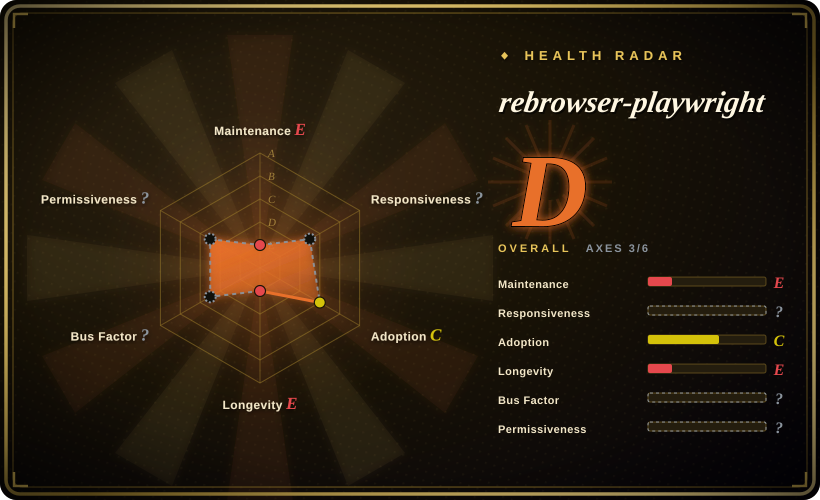
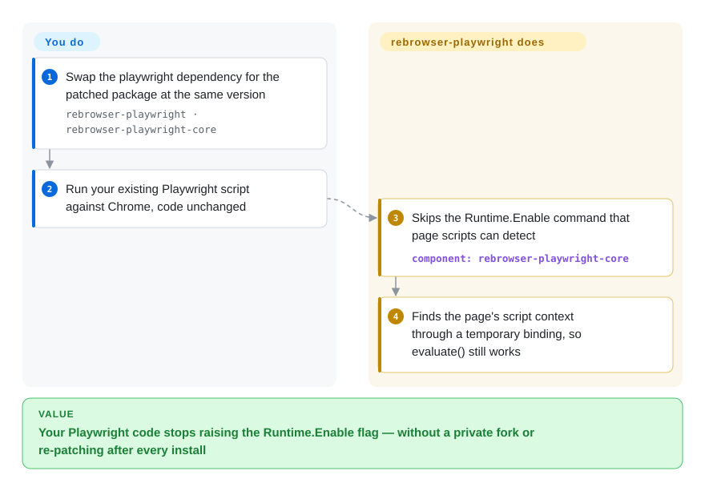

# rebrowser-playwright

Your Playwright script runs fine on your own pages, then a site behind Cloudflare or DataDome serves it a challenge that an ordinary Chrome window never sees — and one of the giveaways is a debugging command Playwright itself sends to the browser. rebrowser-playwright is stock Playwright republished under a different npm name with that behavior patched out, so you change a dependency line instead of your code; it has been frozen at Playwright 1.52.0 since 2025-05.

## When to use

You maintain a Node.js scraper or monitoring job already written against Playwright's API — a few thousand lines of `page.goto`, locators and `page.evaluate` — and a target you are permitted to automate has started answering with a challenge page. You run the vendor's detector page and the row that goes red is `Runtime.Enable`: Playwright turns on a Chrome DevTools Protocol (CDP — the debugging channel automation libraries use to drive Chrome) domain that a few lines of page JavaScript can observe. You do not want to rewrite the job for a different driver, and you do not want to carry a private fork of Playwright.

That is the case this package was built for: replace `playwright` with `rebrowser-playwright` at the same version, keep every import and every call, and the patched core stops sending that command. You pick it over nodriver or Obscura when keeping the Playwright API is the hard constraint, and over applying `rebrowser-patches` yourself when you would rather install a pre-patched package than re-run a patcher after every `npm install`. The deciding caveat sits on the other side: it only exists for Playwright 1.52.0, so it fits a codebase that can stay pinned there, not one that tracks upstream.

## How it works

The package is the published build of Microsoft's `playwright` with two things changed in this repository: the README, and a `package.json` whose `playwright-core` dependency is redirected to `rebrowser-playwright-core`. The real change lives in that sibling package — six files of Playwright's Chromium server code, about 180 added lines. Normally Playwright asks Chrome to enable its `Runtime` domain on every frame, which makes Chrome announce each execution context (the sandbox in which a page's JavaScript runs) so Playwright knows where to evaluate your code; page scripts can detect that the announcement stream is on. The patch never sends that command. Instead, when your code first needs to run something, it plants a temporary named hook in the page, calls it once, and reads the context identifier off the reply — like finding out which room someone is in by asking them to ring a bell, rather than switching on the building's intercom. Which trick it uses is set by an environment variable (`REBROWSER_PATCHES_RUNTIME_FIX_MODE`: `addBinding` by default, `alwaysIsolated` to run all your scripts in a separate world the page cannot see, `0` to switch the fix off). Everything else — your proxies, browser fingerprint, timing, and whether you are allowed to automate the site at all — stays yours.

<!-- flow-steps:begin (generated from flows/rebrowser-playwright.json by tools/flow_card.py — do not edit) -->

Text version of the flow

1. **You**: Swap the playwright dependency for the patched package at the same version — `rebrowser-playwright · rebrowser-playwright-core`
2. **You**: Run your existing Playwright script against Chrome, code unchanged
3. **rebrowser-playwright**: Skips the Runtime.Enable command that page scripts can detect — component: `rebrowser-playwright-core`
4. **rebrowser-playwright**: Finds the page's script context through a temporary binding, so evaluate() still works

**Value**: Your Playwright code stops raising the Runtime.Enable flag — without a private fork or re-patching after every install

<!-- flow-steps:end -->

## When NOT to use

- **You need a current Playwright or a current Chrome.** The newest published version is 1.52.0 (2025-05-09), built on upstream Playwright 1.52.0 from 2025-04-17 with Chromium 136; upstream shipped 1.64.0 on 2026-10-07. Every Playwright feature, bug correction and browser security update after 1.52 is missing. If you need a patched Playwright that follows upstream, use patchright (not indexed; v1.63.0 released 2026-09-08) instead.
- **You are testing your own application.** Nothing is trying to detect you, and the fix costs you a debugging tool: the patches README says `page.pause()` does not work while the fix is enabled. Use plain [Playwright](../playwright-family/playwright.md).
- **You expect it to get you past a block on its own.** It removes one signal. The patches README says outright that the fix "alone won't make your browser bulletproof" and that proxies, user agent and canvas/WebGL fingerprints are separate work; open reports on the issue tracker describe still being detected by Cloudflare Turnstile, hCaptcha and Google Search, and Playwright's own `__pwInitScripts` global still being present. If you want fingerprint randomization bundled in, look at [Obscura](obscura.md); if you can leave the Playwright API, [nodriver](nodriver.md) avoids Playwright's fingerprints altogether by speaking CDP directly.
- **You need Firefox or WebKit.** The patches apply to Chrome only. Use plain Playwright for cross-browser work; for a Firefox-based anti-detection browser, Camoufox is the usual name (a separate project, not compared on this page).
- **Your code is Python.** This repository is the Node.js package. The Python build is a different repository (`rebrowser/rebrowser-playwright-python`, also last published at 1.52.0 on 2025-05-09) and shares the same freeze; in Python, [nodriver](nodriver.md) is the maintained direct-CDP route.
- **Your policy forbids circumventing bot detection.** Hiding the automation signal from a site that prohibits automated access moves the legal and terms-of-service risk to you; the README's own disclaimer says the software "is not intended to bypass any security measures". Use the site's official API or plain Playwright on properties you control.
- **You must audit what you install.** The default branch holds only a README; each version is a branch whose commits are named `original` and `patched` (occasionally followed by a fix), containing built JavaScript rather than source. There is no CI, no test suite, no issue tracker on this repository and no LICENSE file on the default branch. If you need a reviewable diff, apply `rebrowser-patches` (not indexed) to a stock `playwright-core` yourself — the patch file is readable — or stay on stock Playwright.

## Comparison

| Alternative | In index | Our verdict | Tradeoff |
|---|---|---|---|
| [Playwright](../playwright-family/playwright.md) | ✅ | For testing your own product, cross-browser coverage, or anything that must track upstream releases, pick Playwright; pick this page's package only when a Chrome-only job pinned to 1.52 is being flagged for the `Runtime.Enable` signal. | Playwright gives you 18 months of newer releases, Microsoft's maintenance and working `page.pause()`; it makes no attempt to hide that it is automation. |
| patchright | not indexed | When you want a drop-in patched Playwright today, pick patchright, because it published v1.63.0 on 2026-09-08 while this package stopped at 1.52.0 in 2025-05. | patchright keeps pace with upstream and has roughly 17× the monthly npm downloads; it is a separate patch set with its own behavior differences to test. Not added in this tab batch. |
| rebrowser-patches | not indexed | When you need to see and control exactly what is changed, apply the patcher to your own installed `playwright-core`; pick this package when a pre-patched install that survives `npm install` matters more than reviewability. | The patcher gives you a readable diff and an `unpatch` command, but must be re-run after every reinstall and is tested against the same 1.52.0 ceiling. Not added in this tab batch. |
| [nodriver](nodriver.md) | ✅ | When the job is Python and you can rewrite it, pick nodriver, which drives Chrome over CDP without Playwright at all; pick this package when the existing Playwright code in Node.js is what you must keep. | nodriver removes the Playwright layer and its fingerprints, at the cost of a new API, AGPL-3.0, and no test runner. |
| [Obscura](obscura.md) | ✅ | When you want stealth to come from the browser rather than a patched driver, pick Obscura and connect to it over CDP; pick this package when you need real Chrome's rendering compatibility. | Obscura bundles fingerprint randomization and tracker blocking in one binary, but it is its own young engine and diverges from Chromium on long-tail pages. |

## Tech stack

- **Contents:** the built JavaScript distribution of the `playwright` npm package (test runner, CLI wrapper, type definitions) at 1.52.0 — not Playwright's TypeScript source.
- **This repository's own diff:** the `patched` commit on branch `1.52.0` changes `README.md` and `package.json` only (+35 / −4), renaming the package and pointing `playwright-core` at `npm:rebrowser-playwright-core@~1.52.0`.
- **Where the patch is:** `rebrowser/rebrowser-playwright-core`, whose `patched` commit modifies six files under `lib/server/` (`chromium/crConnection.js`, `crDevTools.js`, `crPage.js`, `crServiceWorker.js`, `frames.js`, `page.js`; +181 / −14).
- **Configuration:** process environment variables read at runtime — `REBROWSER_PATCHES_RUNTIME_FIX_MODE`, `REBROWSER_PATCHES_UTILITY_WORLD_NAME`, `REBROWSER_PATCHES_DEBUG`.

## Dependencies

- Node.js `>=18`.
- `rebrowser-playwright-core` at `~1.52.0`, installed automatically as the aliased `playwright-core`.
- A Chromium-family browser: the bundled Chromium 136 that Playwright 1.52 downloads, or an installed Chrome channel. Firefox and WebKit are not covered by the patches.
- Not included, and needed for the use case it targets: proxies, a consistent browser fingerprint, and your own verification against each target site.

## Ops difficulty

**Low to install, medium to keep working.** Adoption is a one-line dependency change with no service to run. The burden arrives later: you are pinned to a Playwright and Chromium from spring 2025, so each Chrome release widens the gap between the browser you present and the browsers real visitors use; detection vendors change their checks without notice, so a job that passes today needs a recurring check against the sites you depend on; and when it stops working there is no newer version to upgrade to — your move is to switch packages, not bump a number.

## Health & viability

- **Maintenance (2026-10):** stale. The last push to any branch was 2025-05-09, the same day 1.52.0 was published; six versions were published in total between 2024-09-28 and that date. Not archived, but nothing has moved for about 17 months while upstream Playwright went from 1.52 to 1.64. The health card's 740-day figure is larger because the scorer reads the default branch, which holds only the 2024-09-28 README commit.
- **Responsiveness:** issues are disabled here and redirected to `rebrowser/rebrowser-patches`, which has 37 open items. A community pull request porting the patches to Playwright 1.63.0 has been open since 2026-09-18 with no maintainer reply, and the newest maintainer comment among the latest 100 issue comments is dated 2025-05-09.
- **Governance and backing:** owned by the Rebrowser organization, a commercial cloud-browser and web-data vendor; every commit in this repository and all 27 in the patches repository come from one account, and the npm package has one maintainer. The organization itself is active — its dataset repositories were pushed on 2026-10-08 — so the vendor is alive while this package is not being worked on.
- **Age and Lindy:** created 2024-09-27; about seven months of activity followed by seventeen of silence. Age gives it no credit here — the Lindy prior rewards long-lived projects that are still active, and this one stopped.
- **Adoption:** 61 stars on this repository, 1,437 on the patches repository; the npm package still recorded 85,881 downloads in the last-month window the scorer read on 2026-10-08, against about 1.46M for patchright over the 30 days to 2026-10-04. Downloads of a frozen package show existing pins, not ongoing endorsement.
- **Risk flags:** anti-bot evasion is an arms race in which an unmaintained tool decays fastest; the vendor's README routes unsolved cases to its paid cloud; built artifacts without source, CI or tests; Apache-2.0 is declared in `package.json` and a `LICENSE` file exists on version branches, but GitHub detects no license because the default branch has none.

## Caveats (unverified)

- [未验证: no reproduction environment against live anti-bot services] The vendor's statement that all three fix modes are "currently undetectable by Cloudflare or DataDome" dates from the patches README last edited 2025-05; it was not re-tested, and several open issues from 2025-05 onward report the opposite.
- [未验证: detector page not run in this review] That rebrowser-playwright 1.52.0 passes every test on `rebrowser-bot-detector` is the project's stated goal, not a measured result here; an open issue reports the Python build failing some of those tests.
- [推断: based on commit dates and org activity, not a maintainer statement] The project looks deprioritized rather than formally abandoned — there is no deprecation notice on GitHub or npm.
- [推断: based on the `original`/`patched` commit pair and file list] The version branches are assumed to be the unmodified upstream npm tarball plus the patch; the `original` commit was not byte-compared against the `playwright@1.52.0` tarball.
- [未验证: issue reports not reproduced] The detection reports cited under "When NOT to use" (Turnstile loop, hCaptcha, Google Search, residual `__pwInitScripts`) are user reports on the issue tracker.
- [推断: general legal reasoning, not a legal review of any site] A site's terms of service or local law may prohibit automated access regardless of whether the automation is detectable; the README disclaimer does not change that.
