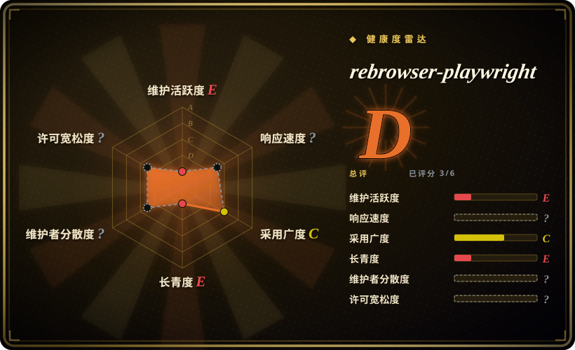
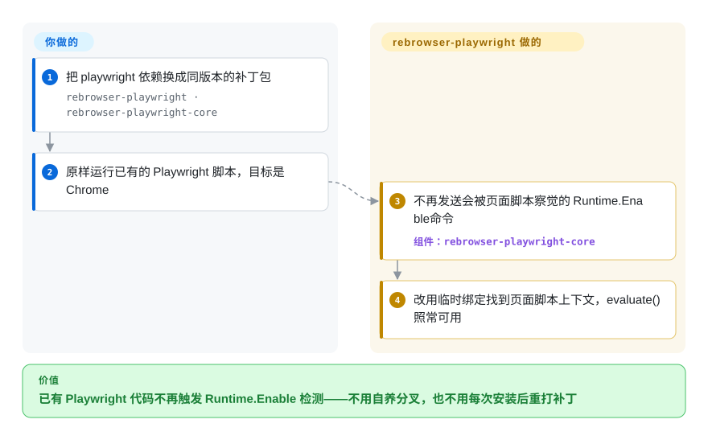

# rebrowser-playwright

你的 Playwright 脚本在自己的页面上跑得好好的，一碰到 Cloudflare 或 DataDome 保护的站点就被塞一个验证页，而普通 Chrome 窗口从来见不到它——暴露身份的线索之一，是 Playwright 自己发给浏览器的一条调试命令。rebrowser-playwright 就是把原版 Playwright 换个 npm 包名重新发布，并把这个行为打补丁去掉，你只改一行依赖、不改代码；它自 2025-05 起停在 Playwright 1.52.0。

## 何时使用

你维护着一个已经按 Playwright API 写好的 Node.js 抓取或监控任务——几千行 `page.goto`、定位器和 `page.evaluate`——而某个你有权自动化访问的目标站开始返回验证页。你打开厂商提供的检测页，变红的那一行是 `Runtime.Enable`：Playwright 会打开 Chrome DevTools Protocol（CDP，自动化库用来操控 Chrome 的调试通道）里的一个域，页面上几行 JavaScript 就能察觉到。你不想为了换驱动把任务重写一遍，也不想自己养一个 Playwright 私有分叉。

这个包就是为这种情况做的：把 `playwright` 换成同版本的 `rebrowser-playwright`，所有 import 和调用保持原样，打过补丁的 core 就不再发送那条命令。相比 nodriver 或 Obscura，选它的前提是“必须保留 Playwright API”；相比自己去应用 `rebrowser-patches`，选它是因为你宁愿装一个预先打好补丁的包，也不想每次 `npm install` 之后重跑一遍补丁脚本。决定性的限制在另一边：它只有 Playwright 1.52.0 这一档，适合能长期钉在这个版本的代码库，不适合要跟随上游的项目。

## 怎么用起来

这个包是微软 `playwright` 的已发布构建产物，本仓库只改了两处：README，以及 `package.json` 里把 `playwright-core` 依赖重定向到 `rebrowser-playwright-core`。真正的改动在那个姊妹包里——Playwright 的 Chromium 服务端代码中的六个文件，新增约 180 行。正常情况下，Playwright 会要求 Chrome 在每个 frame 上启用 `Runtime` 域，于是 Chrome 会通报每一个执行上下文（页面 JavaScript 运行所在的沙箱），Playwright 借此知道该把你的代码放到哪里执行；页面脚本能察觉这条通报流被打开了。补丁干脆不发这条命令，而是在你的代码第一次需要执行时，往页面里临时放一个具名钩子、调用一次，再从返回里读出上下文编号——好比想知道某人在哪个房间，不是打开整栋楼的广播，而是请他按一下门铃。具体用哪种手法由环境变量决定（`REBROWSER_PATCHES_RUNTIME_FIX_MODE`：默认 `addBinding`；`alwaysIsolated` 把你的脚本全部放进页面看不到的独立世界；`0` 关闭修复）。其余的事——代理、浏览器指纹、操作节奏，以及你到底有没有权限自动化这个站点——仍然归你自己负责。

<!-- flow-steps:begin (generated from flows/rebrowser-playwright.json by tools/flow_card.py — do not edit) -->

流程文字版

1. **你**：把 playwright 依赖换成同版本的补丁包 — `rebrowser-playwright · rebrowser-playwright-core`
2. **你**：原样运行已有的 Playwright 脚本，目标是 Chrome
3. **rebrowser-playwright**：不再发送会被页面脚本察觉的 Runtime.Enable 命令 — 组件：`rebrowser-playwright-core`
4. **rebrowser-playwright**：改用临时绑定找到页面脚本上下文，evaluate() 照常可用

**价值**：已有 Playwright 代码不再触发 Runtime.Enable 检测——不用自养分叉，也不用每次安装后重打补丁

<!-- flow-steps:end -->

## 何时不用

- **你需要当前版本的 Playwright 或 Chrome。** 最新发布版本是 1.52.0（2025-05-09），基于 2025-04-17 的上游 Playwright 1.52.0 和 Chromium 136；上游在 2026-10-07 已发布 1.64.0。1.52 之后的所有功能、缺陷修正和浏览器安全更新它都没有。如果你要一个跟随上游的补丁版 Playwright，改用 patchright（未收录；v1.63.0 发布于 2026-09-08）。
- **你在测试自己的应用。** 没有人要检测你，而这个修复还会让你少一件调试工具：补丁仓库的 README 写明，启用修复时 `page.pause()` 不能用。请用原版 [Playwright](../playwright-family/playwright.zh.md)。
- **你指望靠它单独解决被拦截的问题。** 它只去掉一个信号。补丁 README 直说这个修复“alone won't make your browser bulletproof”，代理、User-Agent、canvas 与 WebGL 指纹都是另外的工作；议题区里仍有未关闭的报告称被 Cloudflare Turnstile、hCaptcha 和 Google 搜索识别，以及 Playwright 自带的 `__pwInitScripts` 全局变量依然存在。想要自带指纹随机化的方案，看 [Obscura](obscura.zh.md)；能放弃 Playwright API 的话，[nodriver](nodriver.zh.md) 直接讲 CDP，从根上避开 Playwright 的特征。
- **你需要 Firefox 或 WebKit。** 补丁只对 Chrome 生效。跨浏览器工作用原版 Playwright；要基于 Firefox 的反检测浏览器，常被提到的是 Camoufox（另一个独立项目，本页不做对比）。
- **你的代码是 Python。** 本仓库是 Node.js 包。Python 构建在另一个仓库（`rebrowser/rebrowser-playwright-python`，同样在 2025-05-09 停在 1.52.0），一样处于冻结状态；Python 下仍在维护的直连 CDP 路线是 [nodriver](nodriver.zh.md)。
- **你的合规要求禁止规避机器人检测。** 对一个禁止自动化访问的站点隐藏自动化信号，法律和服务条款风险就转到了你身上；README 自己的免责声明也写着该软件“is not intended to bypass any security measures”。请用站点的官方 API，或只在自己掌控的站点上用原版 Playwright。
- **你必须审计装进来的东西。** 默认分支只有一个 README；每个版本是一个分支，提交名为 `original` 和 `patched`（个别版本后面还跟着一次修正），内容是构建后的 JavaScript 而不是源码。本仓库没有 CI、没有测试、没有开启议题区，默认分支上也没有 LICENSE 文件。如果你需要可审阅的 diff，就自己把 `rebrowser-patches`（未收录）应用到原版 `playwright-core` 上——补丁文件是可读的——或者留在原版 Playwright。

## 横向对比

| 替代品 | 是否收录 | 我们的评价 | 取舍 |
|---|---|---|---|
| [Playwright](../playwright-family/playwright.zh.md) | ✅ | 测试自家产品、需要跨浏览器覆盖、或必须跟随上游发布时，选 Playwright；只有当一个钉在 1.52 的纯 Chrome 任务正因为 `Runtime.Enable` 信号被识别时，才选本页的包。 | Playwright 多出 18 个月的新版本、微软的维护和可用的 `page.pause()`；但它完全不掩饰自己是自动化工具。 |
| patchright | 未收录 | 今天想要一个可直接替换的补丁版 Playwright，选 patchright，因为它在 2026-09-08 发布了 v1.63.0，而本页的包在 2025-05 停在了 1.52.0。 | patchright 跟得上上游，npm 月下载量约为本包的 17 倍；但它是另一套补丁，行为差异需要你自己测试。本批次标签页收录未添加。 |
| rebrowser-patches | 未收录 | 需要看清并控制到底改了什么时，把补丁脚本应用到自己安装的 `playwright-core` 上；如果“预先打好补丁、`npm install` 后不丢”比可审阅性更重要，选本页的包。 | 补丁脚本给你可读的 diff 和 `unpatch` 命令，但每次重装后都要重跑，而且测试上限同样是 1.52.0。本批次标签页收录未添加。 |
| [nodriver](nodriver.zh.md) | ✅ | 任务是 Python 且可以重写时，选 nodriver，它完全不经 Playwright、直接用 CDP 驱动 Chrome；必须保留现有 Node.js Playwright 代码时，选本页的包。 | nodriver 去掉了 Playwright 这一层及其特征，代价是换一套 API、AGPL-3.0 许可，并且没有测试运行器。 |
| [Obscura](obscura.zh.md) | ✅ | 希望隐身能力来自浏览器本身而不是打过补丁的驱动时，选 Obscura 并通过 CDP 连接它；需要真实 Chrome 的渲染兼容性时，选本页的包。 | Obscura 把指纹随机化和跟踪器拦截打包进一个二进制，但它是自研的年轻引擎，在长尾页面上与 Chromium 有差异。 |

## 技术栈

- **内容：** `playwright` npm 包 1.52.0 的构建后 JavaScript 分发物（测试运行器、CLI 包装、类型定义），不是 Playwright 的 TypeScript 源码。
- **本仓库自身的改动：** 分支 `1.52.0` 上的 `patched` 提交只改了 `README.md` 和 `package.json`（+35 / −4），改包名，并把 `playwright-core` 指向 `npm:rebrowser-playwright-core@~1.52.0`。
- **补丁所在位置：** `rebrowser/rebrowser-playwright-core`，它的 `patched` 提交修改了 `lib/server/` 下六个文件（`chromium/crConnection.js`、`crDevTools.js`、`crPage.js`、`crServiceWorker.js`、`frames.js`、`page.js`；+181 / −14）。
- **配置方式：** 运行时读取的进程环境变量——`REBROWSER_PATCHES_RUNTIME_FIX_MODE`、`REBROWSER_PATCHES_UTILITY_WORLD_NAME`、`REBROWSER_PATCHES_DEBUG`。

## 依赖

- Node.js `>=18`。
- `rebrowser-playwright-core`，版本 `~1.52.0`，作为别名后的 `playwright-core` 自动安装。
- 一个 Chromium 系浏览器：Playwright 1.52 下载的自带 Chromium 136，或本机已安装的 Chrome 渠道版本。Firefox 和 WebKit 不在补丁覆盖范围内。
- 不包含、但它面向的场景必需的东西：代理、前后一致的浏览器指纹，以及你自己针对每个目标站点做的验证。

## 运维难度

**安装低，持续可用中等。** 接入只是一行依赖改动，不需要运行任何服务。负担在后面：你被钉在 2025 年春天的 Playwright 和 Chromium 上，Chrome 每发一个新版本，你呈现的浏览器和真实访客用的浏览器之间的差距就拉大一点；检测厂商改规则不会通知你，所以今天能过的任务需要定期对你依赖的站点复查；等它失效时，没有更新的版本可升——你的出路是换一个包，而不是改一个版本号。

## 健康度与可持续性

- **维护（2026-10）：** 已停滞。任何分支上的最后一次推送都是 2025-05-09，也就是 1.52.0 发布当天；从 2024-09-28 到那天一共发布过六个版本。仓库未归档，但约 17 个月没有任何动静，同期上游 Playwright 从 1.52 走到了 1.64。健康度卡片上的 740 天更大，是因为评分脚本读的是默认分支，而默认分支只有 2024-09-28 那一个 README 提交。
- **响应：** 本仓库关闭了议题区，统一转到 `rebrowser/rebrowser-patches`，那里有 37 个未关闭条目。一个把补丁移植到 Playwright 1.63.0 的社区 PR 自 2026-09-18 起挂着，没有维护者回复；最近 100 条议题评论里，维护者最新的一条写于 2025-05-09。
- **治理与背书：** 归 Rebrowser 组织所有，这是一家做云浏览器和网页数据的商业厂商；本仓库的全部提交和补丁仓库的全部 27 个提交都出自同一个账号，npm 包也只有一个维护者。组织本身是活跃的——它的数据集仓库在 2026-10-08 还有推送——所以厂商还在，只是没人在做这个包。
- **年龄与 Lindy：** 创建于 2024-09-27；活跃约七个月，之后沉寂十七个月。年龄在这里不加分——Lindy 先验奖励的是长寿且仍活跃的项目，而它已经停了。
- **采用度：** 本仓库 61 星，补丁仓库 1,437 星；评分脚本在 2026-10-08 读到的近一个月窗口里，npm 包仍有 85,881 次下载；patchright 在截至 2026-10-04 的 30 天里约 146 万次。冻结包的下载量反映的是已有的版本锁定，不是持续的认可。
- **风险信号：** 反机器人对抗是一场军备竞赛，无人维护的工具衰减最快；厂商 README 把解决不了的情况引向自家付费云服务；只有构建产物，没有源码、CI 和测试；`package.json` 声明 Apache-2.0，版本分支上也有 `LICENSE` 文件，但默认分支没有，所以 GitHub 检测不到许可证。

## 存疑（未验证）

- [未验证：没有针对线上反机器人服务的复现环境] 厂商称三种修复模式“currently undetectable by Cloudflare or DataDome”，这句话出自最后编辑于 2025-05 的补丁 README；本次没有复测，而 2025-05 之后有多个未关闭议题报告了相反的结果。
- [未验证：本次审阅没有运行检测页] rebrowser-playwright 1.52.0 通过 `rebrowser-bot-detector` 全部测试，是项目声明的目标，不是这里测得的结果；有一个未关闭议题报告 Python 构建没有通过其中部分测试。
- [推断：依据提交日期和组织活动，不是维护者声明] 这个项目看起来是被降低了优先级，而不是正式废弃——GitHub 和 npm 上都没有弃用声明。
- [推断：依据 `original`/`patched` 提交对和文件列表] 这里假定版本分支是未改动的上游 npm 包内容加上补丁；没有把 `original` 提交与 `playwright@1.52.0` 的 tarball 逐字节比对。
- [未验证：议题报告未复现] “何时不用”里引用的检测报告（Turnstile 死循环、hCaptcha、Google 搜索、残留的 `__pwInitScripts`）是议题区里的用户报告。
- [推断：一般性法律推理，不是对任何站点的法律审查] 无论自动化是否能被检测到，站点的服务条款或当地法律都可能禁止自动化访问；README 的免责声明改变不了这一点。
