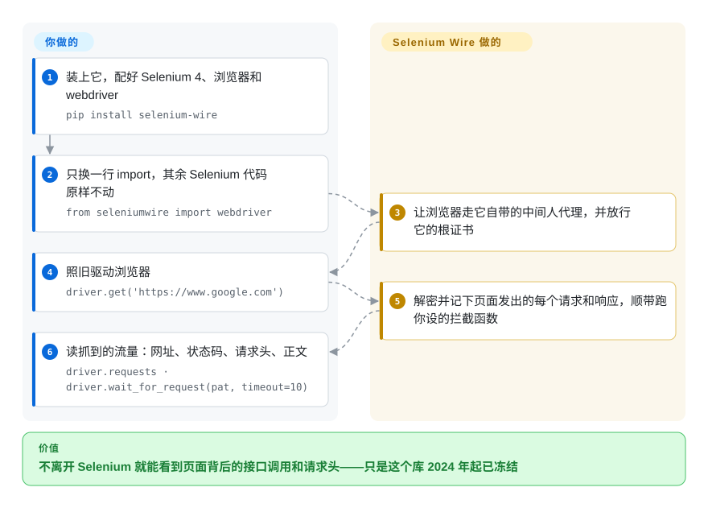

# Selenium Wire

扩展 Selenium 的 Python 绑定，让你能检视并修改浏览器底层的 HTTP/HTTPS 流量——做法是把浏览器路由穿过一个内置的 MITM 代理。**该项目已 archived 且明确不再维护。**

## 何时使用

你在维护一套基于 Selenium 的遗留 Python 抓取或测试代码，需要读取页面在后台拉取的*响应*——某个返回 JSON 的 API 调用、请求头里的 auth token、一串重定向——而不只是渲染出来的 DOM。原生 Selenium 只驱动浏览器，不给你看它的网络层。你换成 `from seleniumwire import webdriver`，原有 Selenium 代码全保留，于是每个请求/响应都被捕获：你可以读 `driver.requests`、对 header 和 body 做断言、动态改请求、拦截或 mock 响应、注入 basic-auth、导出 HAR。其底层会起一个自己的中间人代理，并用生成的 CA 证书来解密 HTTPS。

对一个*已有*、已经钉死在它上面的项目，这仍是个能用的模式。但任何新东西，请先看下一节——这个库已经冻结。

## 怎么用起来

原版 Selenium 能指挥浏览器干活，却看不到浏览器在网络上取了些什么。Selenium Wire 的办法是把自己插到中间：**你创建 driver 时，它启动一个自带的中间人代理——一个夹在浏览器和互联网之间的中转站，用它自己的根证书解开 HTTPS，把经过的流量全部记下来——再让浏览器走这个代理。** 你只换一行 import，其余照常写 Selenium；流量在背后被抓下来，以 `driver.requests` 的形式交给你（每条请求的网址、状态码、请求头、正文）。如果你不只想看、还想改，就给 `driver.request_interceptor` / `driver.response_interceptor` 赋一个函数，每个经过的请求或响应都会先过它——加个请求头、拦掉某个网址、返回一个假响应都行。仍然归你的事：浏览器和配套的 webdriver、OpenSSL、自签证书导致地址栏显示“不安全”，以及在上游不再修 bug 之后自己找出一组能跑的版本组合。

<!-- flow-steps:begin (generated from flows/selenium-wire.json by tools/flow_card.py — do not edit) -->

流程文字版

1. **你**：装上它，配好 Selenium 4、浏览器和 webdriver — `pip install selenium-wire`
2. **你**：只换一行 import，其余 Selenium 代码原样不动 — `from seleniumwire import webdriver`
3. **Selenium Wire**：让浏览器走它自带的中间人代理，并放行它的根证书
4. **你**：照旧驱动浏览器 — `driver.get('https://www.google.com')`
5. **Selenium Wire**：解密并记下页面发出的每个请求和响应，顺带跑你设的拦截函数
6. **你**：读抓到的流量：网址、状态码、请求头、正文 — `driver.requests · driver.wait_for_request(pat, timeout=10)`

**价值**：不离开 Selenium 就能看到页面背后的接口调用和请求头——只是这个库 2024 年起已冻结

<!-- flow-steps:end -->

## 何时不用

- **它已 archived 且废弃——别在它上面起新项目。** README 写得很直白：“Selenium Wire is no longer being maintained。”最后发布的 tag 是 5.1.0（2022-10）；仓库在最后一次提交（2024-01）后转为只读。171 个 open issue 永远不会被处理。
- **Selenium 4 已经原生给你网络访问能力。** Selenium 4.x 自带 Chrome DevTools Protocol 访问（`execute_cdp_cmd`、Network 域）和正在成形的 WebDriver BiDi 网络拦截——对 Chromium 系浏览器，无需内置 MITM 代理即可检视和修改请求/响应。这才是有人维护的路径。[推断——CDP/BiDi 提供网络拦截是已知能力；对本库具体场景的逐项 API 覆盖度未核验]
- **MITM 代理的摩擦与腐烂。** 它把所有流量灌进一个内置代理并安装生成的 CA 证书。这带来 TLS 握手开销、证书信任配置、HTTP/2 边角问题，以及在现代反爬/证书固定面前的崩坏——这些现在都不会再修。
- **依赖底线过时。** 钉在 `selenium>=4.0.0` / `pyOpenSSL>=22.0.0` 时代，classifier 封顶到 Python 3.10；跑在当前 Python/Selenium/OpenSSL 上可能要打补丁覆盖，且不受支持。
- **你需要通用的代理/MITM 工具。** 如果你真正需要超出 Selenium 会话的代理级捕获，请直接用有人维护的工具（mitmproxy），而不是一个冻结的封装。

## 横向对比

| 替代品 | 是否收录 | 我们的评价 | 取舍 |
|---|---|---|---|
| [Selenium](selenium.zh.md)（4.x 原生 CDP/BiDi） | ✅ | 想要有人维护的网络拦截能力，而不是冻结的 MITM wrapper 时，选 Selenium 4 原生 CDP/BiDi。 | 它封装的底座库；Selenium 4 现已提供原生 CDP/BiDi 网络拦截——是拿回 selenium-wire 大部分能力的有人维护方式，无需 MITM 代理。[推断] |
| [Playwright](../playwright-family/playwright.zh.md) | ✅ | 新项目需要内建请求/响应拦截和活跃维护时，选 Playwright。 | 现代、活跃维护的浏览器自动化，内建一等的请求/响应拦截（`page.route`、响应体）；最强的“新项目”替代。 |
| [mitmproxy](../../debugging-proxy/mitmproxy.zh.md) | ✅ | 需要超出单个 Selenium 浏览器会话的代理级捕获和脚本能力时，选 mitmproxy。 | 有人维护的独立 MITM 代理，带完整脚本 API；更重、不与 Selenium 耦合，但当你需要真正的代理级捕获时是对的工具。 |
| Browser MITM Proxy / BrowserMob Proxy | 未收录 | 只有必须维持旧式 Selenium HAR 代理流程时，才选这些工具。 | 给 Selenium 做 HAR 捕获的更老的代理方案（BrowserMob 是 Java）；思路类似，同样在老化。 |

## 技术栈

- **语言：** Python（`python_requires>=3.6`；README 宣称 3.7+，classifier 封顶到 3.10）。
- **Selenium 耦合：** 需要 `selenium>=4.0.0`；通过 drop-in 的 `webdriver` 导入加 `blinker` 信号集成。
- **内置 MITM 代理：** 自带 MITM 实现，运行时不依赖 mitmproxy，基于 `h2` / `hyperframe` / `wsproto`（HTTP/2 + websockets）、`pyOpenSSL` / `certifi` / `pyasn1`（TLS/证书）、`brotli` / `zstandard`（解压）、`pysocks`（SOCKS），Windows 上加 `pydivert`。[推断——setup.py 中 mitmproxy 仅出现在 dev/test extras]

## 依赖

- **运行时：** Python 3.7+、一个 Selenium 4 安装，以及真实浏览器 + 匹配的 driver（Chrome/Firefox/Edge 或 Remote WebDriver）。
- **CA 证书：** 为解密 HTTPS，它生成并使用自己的根 CA——某些流程可能需要你信任它。
- **无外部服务：** 代理在进程内运行；没有单独的数据存储或守护进程。

## 运维难度

**作为库属于低到中，但要交“冻结软件”的税。** 作为代码就是 `pip install selenium-wire` 加一次导入替换——没有基础设施。摩擦在于软件腐烂的运维：钉住一组这个无人维护的库还能忍受的 Python + Selenium + pyOpenSSL 组合、处理 CA 证书信任，并接受任何对新浏览器/TLS 行为的崩坏都得你自己在 fork 里打补丁。没有数据存储或服务要跑——负担纯粹是让一个死掉的依赖活着。

## 健康度与可持续性

- **响应速度**：Grade E。
- **维护（2026-06）。** 已 archived 且明确废弃——README 宣布不再维护；最后 tag 5.1.0（2022-10），仓库自约 2024-01 起只读。**已死。** 这对任何“是否维护”标准都是硬性停止。
- **治理 / bus factor。** bus factor 为 **1**：`wkeeling` 写了约 886 次提交，第二名贡献者只有 5 次，且该维护者已公开退出。watcher 数为 1 更印证了这点。单 User 项目，无组织延续性。
- **年龄 × Lindy。** 活跃约 6 年（2018→2024），约 2.0k star——历史上确实流行且被验证过。但一旦废弃，Lindy 反向起作用：在快速演进的 Selenium/CDP/TLS 环境中，一个无人维护的 MITM 封装会腐烂，所以这里的年龄不是安全信号。[推断]
- **采用度。** 当年用得确实广（PyPI 足迹可观），这也是为什么一个冻结的归档仍然重要——但采用是遗留，不是增长。
- **风险标记。** archived + 维护者退出 + 171 个未处理 issue + 老化的 TLS/MITM 内部 = 迁移风险。已有的 pin 可为遗留用途冻结；新工作应转向 Selenium 4 原生拦截或 Playwright。[推断]

## 存疑（未验证）

- [未验证] 确切的 archive 日期——只知道最后一次提交（2024-01-03），仓库是在那之后某时被 archive 的。
- [推断] 内置 MITM 代理是 selenium-wire 自己的实现、mitmproxy 仅用于 dev/test，是从其在 setup.py extras 中的位置推断，而非读代理源码得出。
- [推断] Selenium 4 CDP/BiDi 拦截相对 selenium-wire 的功能对等是推理出来的，未做基准测试。
- [未验证] 截至 2026-06 约 2.0k star；star 数对时间敏感，仅供参考。
