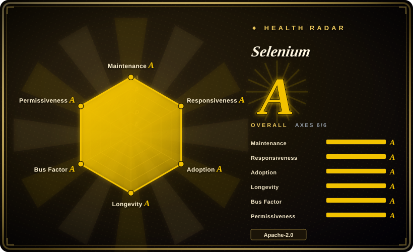
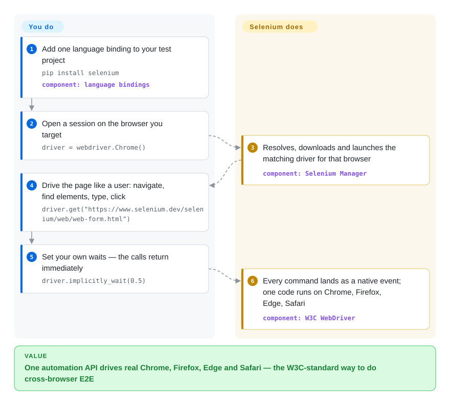

# Selenium

Your end-to-end suite passes in Chrome — and your customers open the app in Firefox, Edge and Safari too. Selenium is the long-standing umbrella project for exactly this: write one language-neutral WebDriver API and it drives *real* Chrome, Firefox, Edge and Safari through the W3C WebDriver protocol, with **Grid** to fan sessions across a machine pool and **Selenium IDE** for record-and-playback.

## When to use

You're a QA or SDET engineer at an enterprise that ships a web app its customers open in Chrome, Firefox, Edge, and Safari — and "works in Chrome" is not an acceptable definition of done. You need an end-to-end UI regression suite that drives the *same* test logic against every browser in that support matrix, runs in your CI on every merge, and fans out across a pool of machines so the full suite finishes in minutes rather than an hour. Your team already writes in Java (and a couple of services use Python), so you want one automation API that both can call without learning a new language-specific tool.

You reach for **Selenium WebDriver**. You write the test once against the WebDriver API, and the same code talks to ChromeDriver, GeckoDriver, EdgeDriver, or SafariDriver because they all implement the W3C WebDriver spec — real browsers, real rendering, the closest thing to a real user. For scale you stand up **Selenium Grid**: a hub/node (or distributed) topology that schedules your tests across many browser instances and OS combinations in parallel, including Dockerized nodes. For the non-coders on the team, **Selenium IDE** records a flow in the browser and exports it to one of the language bindings as a starting point. Because the WebDriver protocol is a W3C standard with a vast ecosystem (cloud grids like BrowserStack/Sauce Labs, every CI integration, mountains of Stack Overflow answers), Selenium is the safe, ubiquitous default when *cross-browser breadth* and *language choice* are the hard requirements.

## How it works

Selenium has two halves. On your side, a small language binding exposes one `WebDriver` API (Java, Python, JavaScript, C#, Ruby, plus Kotlin via the Java bindings — the docs show all six). On the browser side, each browser is driven by a driver executable (ChromeDriver, GeckoDriver, msedgedriver, SafariDriver) that implements the W3C WebDriver spec — a plain HTTP wire protocol in which every `click` or `send_keys` becomes a command the browser executes as a native user event. You never manage the drivers yourself any more: **Selenium Manager** detects the browser you target, resolves and downloads a matching driver, and starts it for the session. What Selenium does for you: one API against real rendering in every browser, plus **Grid** (standalone / hub-node / distributed roles, official Docker images) when you fan sessions out. What stays conspicuously yours: the waiting. WebDriver commands return immediately, so synchronizing code with page state — the docs themselves call it "one of the biggest challenges with Selenium" — is your discipline, or the suite goes flaky. Since v4 the bindings also speak **WebDriver BiDi**, the W3C bidirectional WebSocket protocol the project co-created with browser vendors, which streams network/console/JS events and is positioned as the cross-browser replacement for Chrome's DevTools Protocol (its implementation API is still marked internal in the docs).

<!-- flow-steps:begin (generated from flows/selenium.json by tools/flow_card.py — do not edit) -->

Text version of the flow

1. **You**: Add one language binding to your test project — `pip install selenium` — component: `language bindings`
2. **You**: Open a session on the browser you target — `driver = webdriver.Chrome()`
3. **Selenium**: Resolves, downloads and launches the matching driver for that browser — component: `Selenium Manager`
4. **You**: Drive the page like a user: navigate, find elements, type, click — `driver.get("https://www.selenium.dev/selenium/web/web-form.html")`
5. **You**: Set your own waits — the calls return immediately — `driver.implicitly_wait(0.5)`
6. **Selenium**: Every command lands as a native event; one code runs on Chrome, Firefox, Edge, Safari — component: `W3C WebDriver`

**Value**: One automation API drives real Chrome, Firefox, Edge and Safari — the W3C-standard way to do cross-browser E2E

<!-- flow-steps:end -->

## When NOT to use

- **You target one (Chromium) browser and want modern DX.** For a single-browser project, auto-waiting, network interception, and a nicer debugging story out of the box, Playwright or Cypress are simply more pleasant — Selenium feels lower-level and more verbose by comparison.
- **You expect tests to "just work" without waits.** Selenium does not auto-wait on elements/network the way Playwright/Cypress do; suites are notoriously **flaky** unless you discipline explicit/expected-condition waits everywhere. This is the single biggest day-to-day cost.
- **You want AI/agent-driven, natural-language automation.** Selenium is selector-and-code driven, not an LLM operating the page from intent. For NL/agent control use an in-page GUI agent like [page-agent](../agent-browser-tools/page-agent.md) or a CLI/daemon agent browser like [Agent Browser](../agent-browser-tools/agent-browser.md).
- **You want a lightweight CDP debugging/measuring tool.** BiDi now streams network/console/JS events cross-browser, but Selenium still gives you no performance traces or heap snapshots; for agent-driven Chrome DevTools depth, a CDP tool like [Chrome DevTools MCP](../agent-browser-tools/chrome-devtools-mcp.md) is far lighter than standing up WebDriver + Grid.
- **You don't want to run infra.** Grid at scale is real ops — a hub/distributor, nodes, browser+driver version matching, queueing, and node health to operate (or you pay a cloud grid).

## Comparison

| Alternative | In index | Our verdict | Tradeoff |
|---|---|---|---|
| [Playwright](../playwright-family/playwright.md) | ✅ | Pick Playwright when modern auto-waiting, tracing, and one-codebase Chromium/Firefox/WebKit automation matter more than the WebDriver standard. | Modern cross-browser (Chromium/Firefox/WebKit) automation with auto-wait, network interception, tracing, and ergonomic APIs; far better single-codebase DX, but a newer/narrower ecosystem and not the W3C-WebDriver standard Selenium anchors. |
| Cypress | 未收录 | Pick Cypress for developer-friendly in-browser E2E on web apps, especially when JS/TS-only is acceptable. | Developer-friendly in-browser E2E with time-travel debugging and auto-retry; excellent DX for web apps, but historically Chromium-centric, runs inside the browser's event loop (architectural limits on multi-tab/cross-origin), JS/TS only. |
| [Puppeteer](puppeteer.md) | ✅ | Pick Puppeteer for lower-level Chrome/CDP scripting in Node.js, not for portable cross-browser WebDriver coverage. | Lower-level Chrome/CDP automation library (Node.js); great for Chrome scripting/scraping, but single-engine and not a cross-browser, multi-language WebDriver framework. |
| [Agent Browser](../agent-browser-tools/agent-browser.md) | ✅ | Pick Agent Browser when the job is AI-agent page control via stable accessibility-tree refs. | Rust CLI/daemon that drives Chrome over CDP for AI agents with stable a11y-tree refs; an agent primitive, not a cross-browser test framework — different job. |
| [Chrome DevTools MCP](../agent-browser-tools/chrome-devtools-mcp.md) | ✅ | Pick Chrome DevTools MCP when you need agent-accessible Chrome traces, network, console, and heap diagnostics. | MCP server exposing Chrome DevTools (traces, network, heap) to agents; debugging/measuring depth on Chrome only, not portable cross-browser test automation. |

## Tech stack

- **Core protocol:** W3C WebDriver — a language- and browser-neutral wire protocol; Selenium provides both the client bindings and (historically) reference server pieces. Since v4, the bindings also support **WebDriver BiDi**, the W3C bidirectional protocol (WebSocket alongside WebDriver) for streaming network/console/JS events across browsers; the BiDi implementation API is documented as still internal.
- **Implementation languages:** the project itself spans Java, Python, Ruby, C#, JavaScript, plus Rust/C++ in the repo; the WebDriver client **bindings** target Java/Python/JS/C#/Ruby/Kotlin (Kotlin via the Java bindings; docs also list community ports).
- **Components:** Selenium WebDriver (the API), Selenium Grid (distributed/parallel execution — standalone, hub-node, or fully distributed roles), Selenium IDE (browser record-and-playback extension).
- **Browser drivers:** delegates to per-browser driver executables — ChromeDriver, GeckoDriver (Firefox), msedgedriver (Edge), SafariDriver — each implementing the WebDriver spec; Selenium Manager resolves/downloads matching drivers.
- **Current release:** v4.49.0 (2026-09-09); the official install docs pin 4.49.0 across Maven (`org.seleniumhq.selenium:selenium-java`), NuGet (`Selenium.WebDriver`), gem (`selenium-webdriver`) and npm (`selenium-webdriver`).

## Dependencies

- **A real browser + its WebDriver driver** for each target (Chrome+ChromeDriver, Firefox+GeckoDriver, Edge+msedgedriver, Safari+SafariDriver). Selenium Manager can auto-provision drivers.
- **A language runtime** for your chosen binding (JDK for Java, Python, Node.js, .NET, or Ruby) plus a test runner (JUnit/TestNG, pytest, Mocha, etc.).
- **Optional Selenium Grid** if you need distributed/parallel runs — its own process(es) to deploy (often via the official Docker images), or a hosted cloud grid (BrowserStack/Sauce Labs/LambdaTest).
- No datastore of its own; state is the browser session(s) it controls.

## Ops difficulty

**Medium.** A single local WebDriver test is easy: add the binding dependency, let Selenium Manager fetch the driver, run. Cost climbs with everything that makes Selenium valuable: keeping **browser and driver versions in lockstep** (a frequent breakage source on browser auto-updates), writing and maintaining explicit waits to fight flakiness, and — above all — **operating Grid** at scale: distributor/router/session-map roles, node pools, Docker/Kubernetes deployment, queue tuning, and health monitoring. Many teams sidestep the Grid ops burden by renting a cloud grid, trading infra for per-minute cost.

## Health & viability

- **Responsiveness**: Grade A — median first-response time 23.1 hours across 47 qualifying issues/PRs (scorer, 2026-10-10).
- **Maintenance (2026-09)** — pushed 2026-09-28 and not archived, shipping the v4.x line continuously (v4.45.0 in June → v4.49.0 on 2026-09-09, GitHub releases API); a project tracking evolving browser/WebDriver targets, i.e. **active**, not coasting.
- **Governance & bus factor** — lives under the **SeleniumHQ** org (`Organization`-owned) and is hosted by the **Software Freedom Conservancy** non-profit (docs site footer and contact address `selenium@sfconservancy.org`, 2026-09), a long-standing community/multi-contributor project rather than one person or a single vendor's product; the W3C-standard WebDriver protocol it anchors further de-risks any single-owner dependency.
- **Age & Lindy** — created 2013-01-14, so ~13.7 years old (2026-09) and still actively shipping: a textbook **strong-Lindy** bet — long-lived *and* still-active, with deep ecosystem inertia (cloud grids, CI integrations, years of Q&A) that makes it the safe default. The docs banner even headlines the joint Selenium + Appium 2026 conference — the community event layer is alive. [推断]
- **Adoption & ecosystem** — Selenium has one binding per language and no canonical package, so the scorer is pinned to the largest, the Python `selenium` package: 27,604,052 downloads in the last month and 62,210 dependent repos (2026-10-10), A on both. The npm `selenium-webdriver` binding alone has 622,782 dependent repos, so any single binding undercounts the whole ecosystem.
- **Risk flags** — Apache-2.0, no relicense/open-core history seen; the practical risk is **flakiness without disciplined waits** and **Grid ops burden**, not project viability.

## Caveats (unverified)

- [未验证] ~34.5k GitHub stars and v4.49.0 (released 2026-09-09) as of 2026-09-28 (gh API); star counts and version numbers are date-sensitive and drift — treat as indicative and re-verify against the repo.
- [未验证] The officially-maintained binding set is read from the current docs' language tabs (Java/Python/C#/Ruby/JS/Kotlin, Kotlin via Java bindings); which repo languages (Rust/C++) are shipped components vs internal still comes from repo framing and shifts release-to-release.
- [推断] "Flaky without explicit waits" and the DX gap vs Playwright/Cypress are widely-held community judgments and architectural inferences, not a measured benchmark in this page — though the official docs themselves call browser/code synchronization "one of the biggest challenges with Selenium".
- [推断] Selenium Grid role/topology details (standalone / hub-node / distributed) are summarized from the project's own docs framing; verify the current Grid architecture before designing a deployment.
- [未验证] Comparison substitutes (Playwright, Cypress, Puppeteer) reflect general positioning, not a head-to-head test run; relative tradeoffs are judgment.
- [推断] The BiDi "cross-browser replacement for CDP" framing is the docs' own positioning; per-browser BiDi maturity (especially Safari) was not tested.
