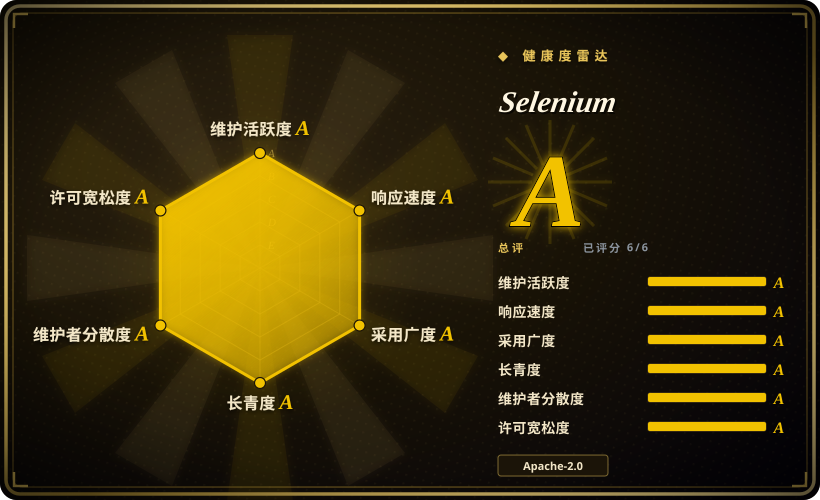
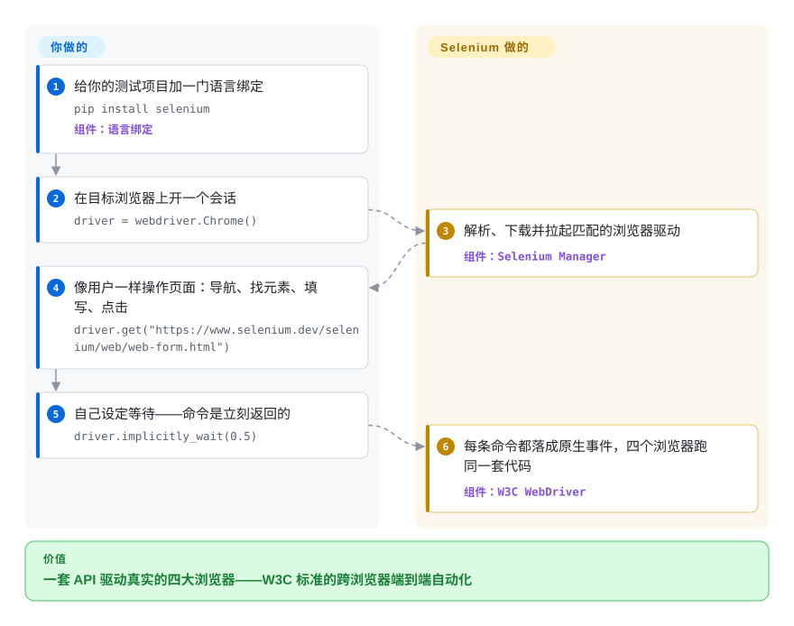

# Selenium

端到端测试在 Chrome 里全绿——可你的客户还会用 Firefox、Edge 和 Safari 打开应用。Selenium 就是为这件事存在多年的总项目：按一套语言中立的 WebDriver API 写一次，就能经 W3C WebDriver 协议驱动*真实*的四大浏览器，外加用 **Grid** 把会话铺到机器池、用 **Selenium IDE** 录制回放。

## 何时使用

你是某家企业的 QA 或 SDET 工程师，公司交付的 Web 应用，客户会用 Chrome、Firefox、Edge、Safari 各种浏览器打开——「在 Chrome 上能跑」根本不算「做完」。你需要一套端到端 UI 回归测试：用*同一份*测试逻辑驱动支持矩阵里的每一种浏览器，在 CI 里每次合并都跑，并且分散到一组机器上并行执行，让整套用例几分钟跑完而不是耗一个钟头。你的团队已经用 Java 写代码（有几个服务用 Python），所以你想要一套自动化 API，两边都能调，不必再各学一个语言专属工具。

于是你选 **Selenium WebDriver**。你照着 WebDriver API 把测试写一遍，同一份代码就能驱动 ChromeDriver、GeckoDriver、EdgeDriver 或 SafariDriver——因为它们都实现了 W3C WebDriver 规范：真实浏览器、真实渲染，最接近真实用户的那种。要扩规模就架起 **Selenium Grid**：一个 hub/node（或完全分布式）拓扑，把你的测试调度到许多浏览器实例和 OS 组合上并行跑，也支持 Docker 化的 node。给团队里不写代码的人，**Selenium IDE** 能在浏览器里录制一段流程，再导出成某个语言绑定作为起点。因为 WebDriver 协议是 W3C 标准、生态极广（BrowserStack/Sauce Labs 这类云 Grid、几乎所有 CI 集成、堆成山的 Stack Overflow 答案），当*跨浏览器广度*和*语言自由*是硬需求时，Selenium 就是那个稳妥、无处不在的默认选项。

## 怎么用起来

Selenium 分两半。你这一侧是一个小的语言绑定，对外暴露同一套 `WebDriver` API（Java、Python、JavaScript、C#、Ruby，Kotlin 走 Java 绑定——官方文档示例的标签页列了这六种）。浏览器那一侧，每个浏览器由一个驱动可执行文件（ChromeDriver、GeckoDriver、msedgedriver、SafariDriver）控制，它们实现 W3C WebDriver 规范——一套朴素的 HTTP 线协议，你的每次 `click` 或 `send_keys` 都变成让浏览器以原生用户事件执行的命令。驱动如今不用你自己管：**Selenium Manager** 探测你的目标浏览器，解析、下载并拉起匹配的驱动。它替你做的：一套 API 在每个浏览器里驱动真实渲染，扩规模时还有 **Grid**（standalone / hub-node / 完全分布式角色，官方 Docker 镜像）。而有一件事显著地留给你：等待。WebDriver 命令立刻返回，让代码与页面状态同步——官方文档自称这是「Selenium 最大的挑战之一」——全靠你的纪律，否则用例就抖。自 v4 起绑定还支持 **WebDriver BiDi**：Selenium 项目与浏览器厂商共同设计的 W3C 双向 WebSocket 协议，可流式获取网络/控制台/JS 事件，文档把它定位为 Chrome DevTools 协议的跨浏览器替代（其实现 API 仍标注为内部）。

<!-- flow-steps:begin (generated from flows/selenium.json by tools/flow_card.py — do not edit) -->

流程文字版

1. **你**：给你的测试项目加一门语言绑定 — `pip install selenium` — 组件：`语言绑定`
2. **你**：在目标浏览器上开一个会话 — `driver = webdriver.Chrome()`
3. **Selenium**：解析、下载并拉起匹配的浏览器驱动 — 组件：`Selenium Manager`
4. **你**：像用户一样操作页面：导航、找元素、填写、点击 — `driver.get("https://www.selenium.dev/selenium/web/web-form.html")`
5. **你**：自己设定等待——命令是立刻返回的 — `driver.implicitly_wait(0.5)`
6. **Selenium**：每条命令都落成原生事件，四个浏览器跑同一套代码 — 组件：`W3C WebDriver`

**价值**：一套 API 驱动真实的四大浏览器——W3C 标准的跨浏览器端到端自动化

<!-- flow-steps:end -->

## 何时不用

- **你只针对一种（Chromium）浏览器，又想要现代化的开发体验。** 对单浏览器项目、想要开箱即用的自动等待、网络拦截和更顺手的调试体验，Playwright 或 Cypress 就是更舒服；相比之下 Selenium 显得更底层、更啰嗦。
- **你指望测试不写等待就「能跑」。** Selenium 不像 Playwright/Cypress 那样对元素/网络自动等待；除非你处处用显式/期望条件等待去管住它，否则用例出了名地容易**抖动（flaky）**。这是日常里最大的一笔成本。
- **你想要 AI/agent 驱动的自然语言自动化。** Selenium 是选择器加代码驱动的，不是让 LLM 按意图操作页面。要 NL/agent 控制，请用页面内 GUI agent 如 [page-agent](../agent-browser-tools/page-agent.zh.md)，或 CLI/守护进程式的 agent browser 如 [Agent Browser](../agent-browser-tools/agent-browser.zh.md)。
- **你想要轻量的 CDP 调试/测量工具。** BiDi 现在已能跨浏览器流式获取网络/控制台/JS 事件，但 Selenium 仍然给不了性能 trace 和堆快照；要 agent 驱动的 Chrome DevTools 深度，像 [Chrome DevTools MCP](../agent-browser-tools/chrome-devtools-mcp.zh.md) 这类 CDP 工具，比架起 WebDriver + Grid 轻得多。
- **你不想运维基础设施。** 规模化的 Grid 是真正的运维活——一个 hub/distributor、一堆 node、浏览器与驱动的版本匹配、排队、node 健康检查都得管（或者你花钱买云 Grid）。

## 横向对比

| 替代品 | 是否收录 | 我们的评价 | 取舍 |
|---|---|---|---|
| [Playwright](../playwright-family/playwright.zh.md) | ✅ | 当现代自动等待、trace，以及一套代码覆盖 Chromium/Firefox/WebKit 比 WebDriver 标准更重要时，选 Playwright。 | 现代跨浏览器（Chromium/Firefox/WebKit）自动化，带自动等待、网络拦截、tracing 和顺手的 API；单一代码库的开发体验好得多，但生态更新更窄，也不是 Selenium 所锚定的 W3C WebDriver 标准。 |
| Cypress | 未收录 | 做 Web 应用、接受只用 JS/TS，且最看重开发者体验时，选 Cypress。 | 对开发者友好的浏览器内 E2E，带时间旅行调试和自动重试；Web 应用开发体验极佳，但历来偏 Chromium，运行在浏览器事件循环内（多标签/跨域有架构限制），且只支持 JS/TS。 |
| [Puppeteer](puppeteer.zh.md) | ✅ | 需要 Node.js 里的底层 Chrome/CDP 脚本能力，而不是可移植跨浏览器覆盖时，选 Puppeteer。 | 更底层的 Chrome/CDP 自动化库（Node.js）；做 Chrome 脚本/抓取很好，但单引擎，不是跨浏览器、多语言的 WebDriver 框架。 |
| [Agent Browser](../agent-browser-tools/agent-browser.zh.md) | ✅ | 任务是让 AI agent 通过稳定 a11y 树 ref 控制页面时，选 Agent Browser。 | Rust 写的 CLI/守护进程，通过 CDP 驱动 Chrome 给 AI agent 用，带稳定的 a11y 树 ref；是 agent 原语，不是跨浏览器测试框架——活儿不同。 |
| [Chrome DevTools MCP](../agent-browser-tools/chrome-devtools-mcp.zh.md) | ✅ | 需要把 Chrome trace、网络、控制台和堆诊断暴露给 agent 时，选 Chrome DevTools MCP。 | 把 Chrome DevTools（trace、网络、堆）通过 MCP 暴露给 agent 的服务器；调试/测量深度强但只在 Chrome 上，不是可移植的跨浏览器测试自动化。 |

## 技术栈

- **核心协议：** W3C WebDriver——一套语言与浏览器中立的线协议；Selenium 同时提供客户端绑定和（历史上的）服务端参考组件。自 v4 起，绑定还支持 **WebDriver BiDi**（与 WebDriver 并行的 WebSocket 双向 W3C 协议），跨浏览器流式获取网络/控制台/JS 事件；文档注明其 BiDi 实现 API 仍属内部。
- **实现语言：** 项目自身覆盖 Java、Python、Ruby、C#、JavaScript，仓库里还有 Rust/C++；WebDriver 客户端**绑定**面向 Java/Python/JS/C#/Ruby/Kotlin（Kotlin 走 Java 绑定；文档另列社区移植版）。
- **组件：** Selenium WebDriver（API）、Selenium Grid（分布式/并行执行——standalone、hub-node 或完全分布式角色）、Selenium IDE（浏览器录制回放扩展）。
- **浏览器驱动：** 委托给各浏览器的驱动可执行文件——ChromeDriver、GeckoDriver（Firefox）、msedgedriver（Edge）、SafariDriver——各自实现 WebDriver 规范；Selenium Manager 负责解析/下载匹配的驱动。
- **当前版本：** v4.49.0（2026-09-09）；官方安装文档在 Maven（`org.seleniumhq.selenium:selenium-java`）、NuGet（`Selenium.WebDriver`）、gem 与 npm（均 `selenium-webdriver`）里统一钉 4.49.0。

## 依赖

- **每个目标都要一个真实浏览器 + 对应的 WebDriver 驱动**（Chrome+ChromeDriver、Firefox+GeckoDriver、Edge+msedgedriver、Safari+SafariDriver）。Selenium Manager 可自动准备驱动。
- **你所选绑定的语言运行时**（Java 的 JDK、Python、Node.js、.NET 或 Ruby），外加一个测试运行器（JUnit/TestNG、pytest、Mocha 等）。
- **可选的 Selenium Grid**，若你需要分布式/并行运行——它是自己要部署的进程（常用官方 Docker 镜像），或者用托管云 Grid（BrowserStack/Sauce Labs/LambdaTest）。
- 它自身没有数据存储；状态就是它控制的那些浏览器会话。

## 运维难度

**中。** 单个本地 WebDriver 测试很容易：加上绑定依赖，让 Selenium Manager 取驱动，跑。成本随着让 Selenium 有价值的那些东西一起上升：让**浏览器与驱动版本保持一致**（浏览器自动更新时常见的故障源）、写并维护显式等待来对抗抖动，以及——最关键的——规模化地**运维 Grid**：distributor/router/session-map 角色、node 池、Docker/Kubernetes 部署、队列调优和健康监控。很多团队靠租用云 Grid 绕开 Grid 运维负担，用基础设施换按分钟计费的成本。

## 健康度与可持续性

- **响应速度**：Grade A——中位首次响应时间 23.1 小时，基于 47 个 qualifying issues/PRs（评分器，2026-10-10）。
- **维护（2026-09）** —— 2026-09-28 仍在推送、未归档，v4.x 线持续交付（6 月的 v4.45.0 → 2026-09-09 的 v4.49.0，GitHub releases API）；一个紧跟浏览器/WebDriver 目标演进、持续发版的项目，即**活跃**而非停滞滑行。
- **治理与 bus factor** —— 归属 **SeleniumHQ** 组织（`Organization` 所有），并由非营利组织 **Software Freedom Conservancy** 托管（文档站页脚与联系地址 `selenium@sfconservancy.org`，2026-09），是历史悠久的社区/多贡献者项目，而非某一个人或单一厂商的产品；它所锚定的 W3C 标准 WebDriver 协议进一步降低了任何单一所有者依赖的风险。
- **年龄与 Lindy** —— 创建于 2013-01-14，到 2026-09 约 13.7 岁且仍在积极发版：教科书式的**强 Lindy**下注——既长寿*又*仍活跃，叠加深厚的生态惯性（云 Grid、CI 集成、多年问答），使它成为稳妥默认项。文档站横幅还在推 Selenium 与 Appium 的 2026 联合大会——社区活动层是活的。`[推断]`
- **采用与生态** —— Selenium 每种语言一个绑定，没有哪个包能代表整体，所以评分器固定取最大的 Python 包 `selenium`：最近一个月下载 27,604,052 次，依赖仓库 62,210 个（2026-10-10），两项都是 A。光 npm 的 `selenium-webdriver` 一个绑定就有 622,782 个依赖仓库，所以只看任何一个绑定都会低估整个生态。
- **风险标记** —— Apache-2.0，未见 relicense / open-core 历史；实际风险在于**不写规范等待就抖动**和 **Grid 运维负担**，而非项目可持续性。

## 存疑（未验证）

- [未验证] 截至 2026-09-28 约 34.5k GitHub star，v4.49.0（2026-09-09 发布）（gh API）；star 数和版本号对时间敏感且会漂移——仅供参考，请对照仓库重核。
- [未验证] 官方维护的绑定集合是从当前文档的语言标签页读出的（Java/Python/C#/Ruby/JS/Kotlin，Kotlin 走 Java 绑定）；仓库里哪些语言（Rust/C++）是发行组件还是内部用途，仍来自仓库表述，随版本变动。
- [推断]「不写显式等待就抖动」以及相对 Playwright/Cypress 的开发体验差距，是社区广泛共识和架构推断，并非本页实测——尽管官方文档自己就把代码与页面状态同步称为「Selenium 最大的挑战之一」。
- [推断] Selenium Grid 的角色/拓扑细节（standalone / hub-node / 分布式）是从项目自己的文档表述归纳而来；设计部署前请核实当前的 Grid 架构。
- [未验证] 对比里的替代品（Playwright、Cypress、Puppeteer）反映的是大致定位，而非头对头实跑；相对取舍属判断。
- [推断] BiDi「跨浏览器替代 CDP」的说法是文档自己的定位；各浏览器（尤其 Safari）的 BiDi 成熟度未实测。
