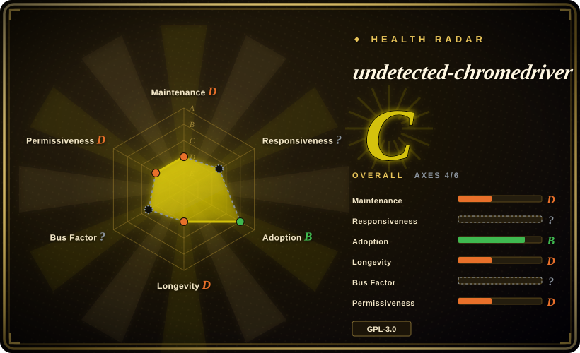
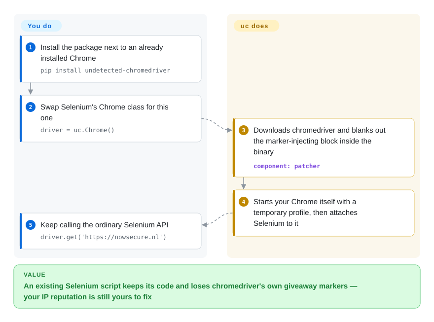

# undetected-chromedriver

Your Selenium script works on your own pages, but the target site answers every `driver.get()` with an endless "checking your browser" screen, because stock chromedriver leaves markers in the page that a bot wall looks for. undetected-chromedriver is a drop-in replacement for Selenium's `Chrome` class that edits those markers out of the chromedriver binary and starts Chrome itself — but its last PyPI release dates from February 2024.

## When to use

You maintain an existing Python Selenium codebase — page objects, `WebDriverWait` conditions, a few thousand lines of `find_element` calls — that automates a site you are permitted to automate, and the site has started serving it a challenge page instead of content. Stock Selenium returns a page whose title is `Just a moment...` on every visit while the same URL opens normally in the Chrome you click through by hand. Rewriting the suite on another automation model is not on the table this quarter. You change one import and one constructor (`import undetected_chromedriver as uc`, `uc.Chrome()`), and the rest of the Selenium code keeps running, because the class it returns is a subclass of Selenium's own Chrome driver.

That compatibility is the whole reason to pick it in 2026. Its author's newer [nodriver](nodriver.md) is the declared official successor and drops WebDriver entirely, which removes the driver binary that has to be patched in the first place, but costs you an async rewrite and an AGPL-3.0 license. SeleniumBase's UC Mode is built on this same library and is the actively released route to the same technique. Reach for undetected-chromedriver itself when you need the smallest possible diff against plain Selenium and accept that you are pinning a library that is no longer being released.

## How it works

Chromedriver — the small helper program Selenium uses to remote-control Chrome — injects a block of JavaScript into every page that defines variables whose names start with `cdc_`, and detection scripts look for exactly those. On each start the library's patcher downloads a chromedriver build from Google's Chrome for Testing servers, finds that injected block inside the binary, and overwrites it with a harmless same-length statement, so the variables never exist. It then launches your installed Chrome on its own, with a fresh temporary profile and a remote-debugging port — the local socket Chrome opens for outside control — and only afterwards attaches Selenium to that already-running browser, instead of letting chromedriver start Chrome with its usual automation switches. Think of it as filing the serial number off the remote control rather than disguising the car: the browser is the real Chrome on your machine, and only the controller's fingerprints are removed. What stays yours is everything the library does not touch: your IP address's reputation, how human your timing and clicks look, any CAPTCHA that still appears, keeping Chrome and the downloaded driver on matching versions (`version_main` pins a major version), and whether you are allowed to automate the site at all. Besides the Selenium API it adds a listener for raw DevTools events (`enable_cdp_events=True`, `add_cdp_listener`) and a few element helpers such as `click_safe()` and `find_elements_recursive()`.

<!-- flow-steps:begin (generated from flows/undetected-chromedriver.json by tools/flow_card.py — do not edit) -->

Text version of the flow

1. **You**: Install the package next to an already installed Chrome — `pip install undetected-chromedriver`
2. **You**: Swap Selenium's Chrome class for this one — `driver = uc.Chrome()`
3. **undetected-chromedriver**: Downloads chromedriver and blanks out the marker-injecting block inside the binary — component: `patcher`
4. **undetected-chromedriver**: Starts your Chrome itself with a temporary profile, then attaches Selenium to it
5. **You**: Keep calling the ordinary Selenium API — `driver.get('https://nowsecure.nl')`

**Value**: An existing Selenium script keeps its code and loses chromedriver's own giveaway markers — your IP reputation is still yours to fix

<!-- flow-steps:end -->

## When NOT to use

- **You are starting a new project.** The repository's last PyPI release is 3.5.5 from 2024-02-17, the issue tracker is switched off, and the author's own successor exists. For new Python code use [nodriver](nodriver.md) (direct DevTools control, no driver binary to patch); if you want to stay on Selenium, use SeleniumBase's UC Mode, which is built on this library and still ships releases.
- **You run Python 3.12 or newer and install from PyPI.** The published 3.5.5 `patcher.py` imports `distutils`, which the standard library removed in 3.12; the fix that swaps it for `packaging` was merged to `master` in 2025-07 and never released, so `pip install undetected-chromedriver` gives you the old code [推断]. Install from the Git `master` branch and pin the commit, or use [nodriver](nodriver.md), which has no such import.
- **Your blocks come from the IP address, not the browser.** The README says in bold that the package does not hide your IP and that runs from a datacenter will most likely not pass. A patched driver changes nothing there; that is a network problem solved with permitted egress, not with this library. If the block is on the TLS handshake of a plain HTTP client rather than on a browser, [curl_cffi](../../python-tooling/curl-cffi.md) is the lighter answer.
- **You need headless runs in CI or containers.** The constructor's own documentation says headless "lowers undetectability and [is] not fully supported", and the README calls headless officially unsupported. Use a virtual display with a headed browser, or a tool whose headless path is a maintained feature — [Playwright](../playwright-family/playwright.md) for permitted automation.
- **You need a browser sandbox.** `no_sandbox` defaults to `True`, so Chrome is started with `--no-sandbox` unless you turn it off, and the browser is pointed at untrusted pages. For anything that visits hostile content, run plain [Selenium](selenium.md) or [Playwright](../playwright-family/playwright.md) with the sandbox on, inside a container you are prepared to throw away.
- **You run many browsers in parallel or on ARM Linux.** By default every start deletes and re-downloads the driver into one shared per-user folder; concurrent processes race on that file unless you set `user_multi_procs=True`. The patcher only knows `win32`, `linux64` and Intel macOS driver builds. For a fleet, use [Selenium](selenium.md) Grid or [Playwright](../playwright-family/playwright.md) with their own driver management.
- **The target's terms forbid automation, or you need a guaranteed pass rate.** The package description itself says "No guarantees are given". Evading a site's bot controls can breach its terms of service or local law, and that exposure is yours, not the library's. When access is permitted, ask for an API or an allow-listed key and use plain [Selenium](selenium.md).
- **GPL-3.0 does not fit what you distribute.** Importing it into a product you ship pulls that product under GPL-3.0 terms. [Selenium](selenium.md) and [Playwright](../playwright-family/playwright.md) are Apache-2.0, and [curl_cffi](../../python-tooling/curl-cffi.md) is MIT.

## Comparison

Other anti-detection browser stacks are being added to this index in the same batch — Camoufox (a Firefox build with fingerprint spoofing), rebrowser-playwright (a patched Playwright), and Scrapling (a scraping framework with stealth fetchers). They attack the same wall from a different browser or a different client library; none of them keeps a Selenium codebase intact, which is the one thing this page's project is for.

| Alternative | In index | Our verdict | Tradeoff |
|---|---|---|---|
| [nodriver](nodriver.md) | ✅ | For new Python code that faces browser-level bot checks, pick nodriver; pick undetected-chromedriver only when an existing Selenium suite cannot be rewritten as async code. | nodriver removes the driver binary and still receives commits, but it is AGPL-3.0, alpha-labeled, and a different API; this project keeps every Selenium call and stays frozen at its 2024 release. |
| SeleniumBase | not indexed | When you want the same patched-driver technique with a maintainer still shipping releases, pick SeleniumBase UC Mode; pick this library when you want one small dependency and no test framework around it. | SeleniumBase is MIT and pushed code on 2026-10-08, but it brings a whole testing framework and its own driver API; not added in this tab batch. |
| [Selenium](selenium.md) | ✅ | When the site permits your automation or you control it, stay on plain Selenium; move to this library only after you have confirmed the block is on chromedriver's markers rather than on your IP or behaviour. | Plain Selenium is Apache-2.0, foundation-style governed and keeps the browser sandbox on; it makes no attempt to hide that it is automation. |
| [curl_cffi](../../python-tooling/curl-cffi.md) | ✅ | When the data sits behind a TLS-fingerprint check and needs no JavaScript, pick curl_cffi; pick a real browser stack like this one only when the page must execute scripts to produce the content. | curl_cffi costs megabytes and milliseconds per request instead of a Chrome process, but cannot run a JavaScript challenge. |
| [Playwright](../playwright-family/playwright.md) | ✅ | For a test suite or permitted automation you are writing fresh, pick Playwright; this library only earns its place when the code is already Selenium and the obstacle is detection. | Playwright gives auto-waiting, traces and three browser engines under Apache-2.0, with no anti-detection claim and no path for existing Selenium code. |

## Tech stack

- **Language:** Python; one package of eight modules, no compiled extension of its own.
- **Base class:** a subclass of Selenium 4's `selenium.webdriver.Chrome`, with `ChromeOptions` and `WebElement` subclasses.
- **Patcher:** fetches chromedriver over `urllib` from Chrome for Testing (Chrome 115+) or the legacy `chromedriver.storage.googleapis.com` bucket (114 and below), then rewrites bytes in the binary.
- **DevTools side channel:** a `websockets`-based reactor thread that delivers raw Chrome DevTools Protocol events to Python callbacks.
- **Packaging:** `setup.py` with setuptools; distributed on PyPI as `undetected-chromedriver`.

## Dependencies

- Python 3 with `selenium>=4.9.0`, `requests` and `websockets` (PyPI 3.5.5); `master` raises these to `selenium>=4.18.1`, `requests>=2.31.0`, `websockets>=12.0` and adds `packaging>=23.0`.
- A locally installed Chrome or another Chromium-based browser the library can find on `PATH` or that you point to with `browser_executable_path`.
- Outbound HTTPS at start-up to `googlechromelabs.github.io` and `storage.googleapis.com` to download chromedriver, unless you supply an already patched binary with `driver_executable_path`.
- A display for headed runs on Linux (for example Xvfb), since headless is not a supported mode.
- A writable per-user data folder (`~/.local/share/undetected_chromedriver` on Linux, the roaming AppData folder on Windows) where the patched driver is stored.

## Ops difficulty

**Low to start, medium to keep running.** One `pip install` and one changed constructor is the entire setup on a workstation. The running cost arrives later and from outside: every Chrome auto-update can put the browser and the downloaded driver on different major versions until you pin `version_main`; every detection-vendor change can silently turn a passing script into a blocked one with no upstream release to wait for; the driver download makes start-up depend on Google's servers; and parallel workers need `user_multi_procs=True` plus one warm-up run. Budget for pinning Chrome's version, pinning this library to a Git commit, a canary job that tells you when a target starts blocking, and an exit plan to nodriver or SeleniumBase.

## Health & viability

- **Maintenance (2026-10):** coasting. The last PyPI release is 3.5.5 (2024-02-17). `master` has had one merged change since — a Python 3.13 compatibility refactor merged on 2025-07-05 — and it was not published. The repository has no GitHub releases and no tags.
- **Governance / bus factor:** a personal account; `ultrafunkamsterdam` has 246 of the listed contributions and the next contributor has 10. The issue tracker is disabled, GitHub Discussions is the only channel, and the pull-request API returned 404 on 2026-10-08. The same author's attention has moved to nodriver, which that project's README calls the official successor.
- **Age / Lindy:** created 2019-12-22, so almost seven years old — but the Lindy prior needs age and continued activity together, and the activity half stopped in 2024. In an arms-race domain an unreleased library ages faster than ordinary software.
- **Adoption:** about 12.9k stars and 1.35k forks, and 1,972,753 PyPI downloads in the last month (pypistats, 2026-10-08). That is inertia from existing scripts and from projects that depend on it, not evidence that it still passes any given detection system.
- **Risk flags:** GPL-3.0; `--no-sandbox` on by default; binary patching of a third-party executable downloaded at run time; an anti-detection purpose that carries terms-of-service and legal exposure; the Docker image the README advertises was last updated on 2022-12-26.

## Caveats (unverified)

- [未验证] Whether 3.5.5 or `master` currently passes Cloudflare, DataDome, Imperva or any other named detection system — this needs live targets and clean IPs, was not tested here, and the README's "passes ALL" wording is the author's claim.
- [推断] That PyPI 3.5.5 fails on Python 3.12+ with a missing `distutils` module: the import was read in the 3.5.5 source and the standard library dropped the module in 3.12, but the install was not reproduced here; an environment that has `setuptools` installed may still provide a shim.
- [推断] That Apple-silicon Macs get the Intel (`mac-x64`) driver build and ARM Linux gets an unusable `linux64` build: read from the platform table in `patcher.py`, not run on those machines.
- [未验证] Why the issue tracker is off and the pull-request endpoint returns 404; the README only says limits were put on issues because of abuse. Discussion activity could not be listed in this session (the GraphQL query was blocked by the worktree guard).
- [未验证] Whether the `cdc_` marker block is still what current detection scripts check; detection methods are not published and change without notice.
- [推断] That most of the monthly PyPI downloads come from CI and transitive installs rather than new adoption; pypistats does not separate them.
- [推断] The constructor's docstring both sets `use_subprocess=True` as the default and says that value "comes with NO support when being detected"; which of the two reflects the author's current intent is unclear.
