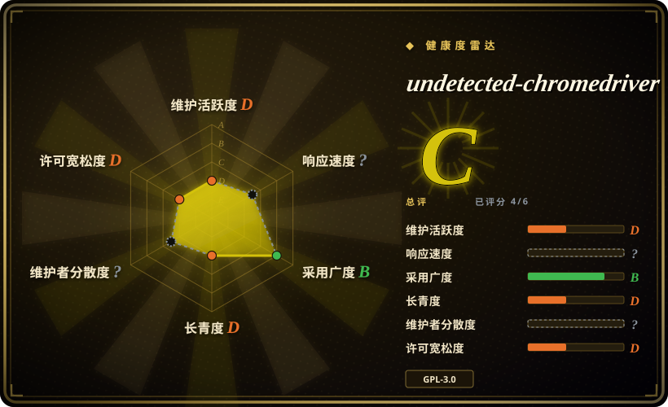
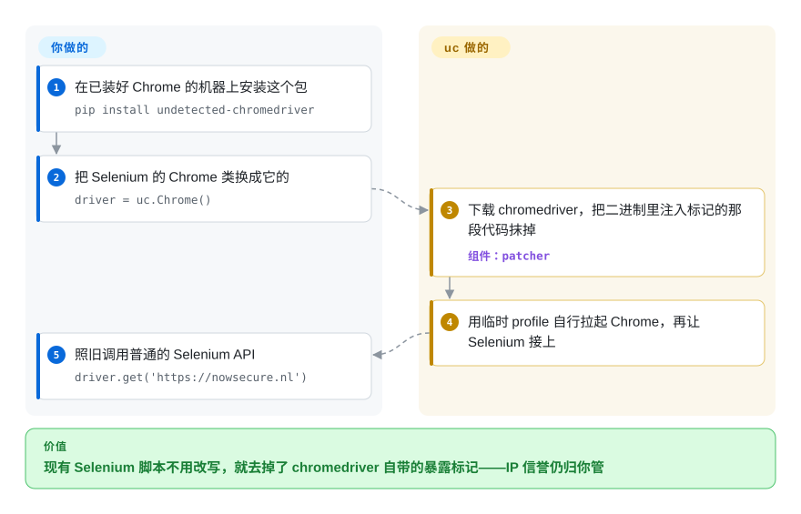

# undetected-chromedriver

你的 Selenium 脚本在自家页面上跑得好好的，一到目标站就每次 `driver.get()` 都卡在没完没了的“正在检查您的浏览器”，原因是原版 chromedriver 会在页面里留下反爬墙专门找的标记。undetected-chromedriver 是 Selenium `Chrome` 类的原位替换：它把这些标记从 chromedriver 二进制里抹掉，再自己拉起 Chrome——但它在 PyPI 上的最后一版停在 2024 年 2 月。

## 何时使用

你手里有一套现成的 Python Selenium 代码——页面对象、`WebDriverWait` 条件、几千行 `find_element`——用来自动化一个你有权自动化的站点，而这个站点开始给它返回验证页而不是内容：原版 Selenium 每次访问拿到的页面标题都是 `Just a moment...`，同一个地址你手点 Chrome 却能正常打开。这个季度把整套代码换一种自动化模型重写不现实。你只改一处 import 和一处构造（`import undetected_chromedriver as uc`、`uc.Chrome()`），其余 Selenium 代码原样继续跑，因为它返回的类就是 Selenium 自己 Chrome 驱动的子类。

到了 2026 年，选它的理由只剩这一条兼容性。同一作者更新的 [nodriver](nodriver.zh.md) 是他声明的官方继任者，干脆扔掉了 WebDriver，也就没有需要打补丁的驱动二进制，代价是你得改写成异步代码并接受 AGPL-3.0。SeleniumBase 的 UC Mode 建在这同一个库之上，是同一手法里仍在发版的那条路。只有当你要的是“相对原版 Selenium 改动最小”，并且接受自己钉住的是一个已经不再发版的库时，才直接用 undetected-chromedriver 本身。

## 怎么用起来

chromedriver 是 Selenium 用来遥控 Chrome 的那个小程序，它会往每个页面注入一段 JavaScript，定义出一批名字以 `cdc_` 开头的变量，检测脚本找的正是它们。这个库的 patcher 每次启动都从 Google 的 Chrome for Testing 服务器下载一份 chromedriver，在二进制里找到那段注入代码，用一条等长的无害语句覆盖掉，于是这些变量从头就不存在。接着它自己拉起你本机装的 Chrome，给它一个全新的临时 profile 和一个远程调试端口（Chrome 为外部控制开的本地端口），等浏览器跑起来之后才让 Selenium 接上去，而不是让 chromedriver 带着那套自动化启动参数去开 Chrome。可以把它理解成磨掉遥控器上的编号，而不是给车换伪装：浏览器就是你机器上那个真 Chrome，被抹掉的只是控制器留下的指纹。它不碰的部分全归你：出口 IP 的信誉、点击和节奏像不像人、仍然弹出来的验证码、让 Chrome 与下载到的驱动保持同一大版本（`version_main` 用来钉大版本），以及你到底有没有权自动化这个站点。除了 Selenium 的 API，它还多给了原始 DevTools 事件的监听（`enable_cdp_events=True`、`add_cdp_listener`）和几个元素辅助方法，比如 `click_safe()` 与 `find_elements_recursive()`。

<!-- flow-steps:begin (generated from flows/undetected-chromedriver.json by tools/flow_card.py — do not edit) -->

流程文字版

1. **你**：在已装好 Chrome 的机器上安装这个包 — `pip install undetected-chromedriver`
2. **你**：把 Selenium 的 Chrome 类换成它的 — `driver = uc.Chrome()`
3. **undetected-chromedriver**：下载 chromedriver，把二进制里注入标记的那段代码抹掉 — 组件：`patcher`
4. **undetected-chromedriver**：用临时 profile 自行拉起 Chrome，再让 Selenium 接上
5. **你**：照旧调用普通的 Selenium API — `driver.get('https://nowsecure.nl')`

**价值**：现有 Selenium 脚本不用改写，就去掉了 chromedriver 自带的暴露标记——IP 信誉仍归你管

<!-- flow-steps:end -->

## 何时不用

- **你在开新项目。** 仓库在 PyPI 上的最后一版是 2024-02-17 的 3.5.5，issue 区已关闭，作者自己的继任项目也已存在。新写的 Python 代码用 [nodriver](nodriver.zh.md)（直接走 DevTools，没有要打补丁的驱动）；想留在 Selenium 上，就用建在本库之上、仍在发版的 SeleniumBase UC Mode。
- **你用 Python 3.12 及以上，并且从 PyPI 安装。** 已发布的 3.5.5 里 `patcher.py` 导入了 `distutils`，而标准库在 3.12 删掉了它；把它换成 `packaging` 的修复在 2025-07 合进了 `master`，却从未发版，所以 `pip install undetected-chromedriver` 装到的还是旧代码 [推断]。改从 Git 的 `master` 分支安装并钉住 commit，或者用没有这个导入的 [nodriver](nodriver.zh.md)。
- **拦你的是 IP，不是浏览器。** README 用粗体写明：这个包不隐藏你的 IP，从机房跑大概率过不去。给驱动打补丁对此毫无作用，那是网络层的问题，要靠获准的出口解决。如果被拦的是普通 HTTP 客户端的 TLS 握手而不是浏览器，[curl_cffi](../../python-tooling/curl-cffi.zh.md) 是更轻的答案。
- **你要在 CI 或容器里跑无头模式。** 构造函数自己的文档写着 headless 会“降低不可检测性且未完整支持”，README 也说无头模式官方不支持。用虚拟显示器跑有头浏览器，或者换一个把无头当正式功能维护的工具——获准的自动化用 [Playwright](../playwright-family/playwright.zh.md)。
- **你需要浏览器沙箱。** `no_sandbox` 默认是 `True`，你不关它，Chrome 就带着 `--no-sandbox` 启动，而这个浏览器访问的正是不可信页面。凡是会碰到恶意内容的场景，用开着沙箱的原版 [Selenium](selenium.zh.md) 或 [Playwright](../playwright-family/playwright.zh.md)，并放进一个随时可以丢弃的容器。
- **你要并行开很多浏览器，或者跑在 ARM Linux 上。** 默认每次启动都会删掉并重新下载驱动，放进同一个用户级目录；并发进程会争抢这个文件，除非你设 `user_multi_procs=True`。patcher 只认 `win32`、`linux64` 和 Intel macOS 三种驱动构建。要跑机群，用自带驱动管理的 [Selenium](selenium.zh.md) Grid 或 [Playwright](../playwright-family/playwright.zh.md)。
- **目标站条款禁止自动化，或者你需要有保证的通过率。** 包描述自己写着“不提供任何保证”。绕过站点的反机器人措施可能违反其服务条款或当地法律，这份风险归你，不归这个库。在获准访问的前提下，去申请 API 或白名单密钥，用原版 [Selenium](selenium.zh.md)。
- **GPL-3.0 与你要分发的东西不相容。** 把它 import 进你要交付的产品，这个产品就落入 GPL-3.0 的条款。[Selenium](selenium.zh.md) 与 [Playwright](../playwright-family/playwright.zh.md) 是 Apache-2.0，[curl_cffi](../../python-tooling/curl-cffi.zh.md) 是 MIT。

## 横向对比

同一批还有几个反检测浏览器方案正在收录——Camoufox（带指纹伪装的 Firefox 构建）、rebrowser-playwright（打过补丁的 Playwright）、Scrapling（带隐身抓取器的爬虫框架）。它们从另一种浏览器或另一套客户端库去撞同一堵墙，但都保不住一套现成的 Selenium 代码，而这正是本页项目唯一的用处。

| 替代品 | 是否收录 | 我们的评价 | 取舍 |
|---|---|---|---|
| [nodriver](nodriver.zh.md) | ✅ | 新写的 Python 代码要面对浏览器层的反机器人检查，选 nodriver；只有现成的 Selenium 代码没法改写成异步时，才选 undetected-chromedriver。 | nodriver 去掉了驱动二进制、仍有提交，但它是 AGPL-3.0、标着 alpha、API 也不同；本项目保住每一个 Selenium 调用，却冻结在 2024 年那一版。 |
| SeleniumBase | 未收录 | 想要同一套“补丁驱动”手法、又要一个还在发版的维护者，选 SeleniumBase UC Mode；只想要一个小依赖、不要外面那层测试框架时，选本库。 | SeleniumBase 是 MIT，2026-10-08 仍在推代码，但它带来一整套测试框架和自己的驱动 API；本次标签批次未添加。 |
| [Selenium](selenium.zh.md) | ✅ | 站点允许你自动化、或者站点归你管时，留在原版 Selenium；确认被拦的是 chromedriver 的标记而不是你的 IP 或行为之后，再换本库。 | 原版 Selenium 是 Apache-2.0、治理成熟、沙箱默认开着；它完全不掩饰自己是自动化。 |
| [curl_cffi](../../python-tooling/curl-cffi.zh.md) | ✅ | 数据挡在 TLS 指纹检查后面、又不需要执行 JavaScript 时，选 curl_cffi；只有页面必须跑脚本才出内容时，才上本库这类真浏览器方案。 | curl_cffi 每个请求的开销是几兆内存和几毫秒，而不是一个 Chrome 进程，但它跑不了 JavaScript 质询。 |
| [Playwright](../playwright-family/playwright.zh.md) | ✅ | 从零写测试或获准的自动化，选 Playwright；只有代码已经是 Selenium、障碍又是检测时，本库才有位置。 | Playwright 给你自动等待、trace 和三种浏览器引擎，许可是 Apache-2.0，但不声称反检测，也接不住现成的 Selenium 代码。 |

## 技术栈

- **语言：** Python；一个包、八个模块，自身没有编译扩展。
- **基类：** Selenium 4 的 `selenium.webdriver.Chrome` 的子类，另有 `ChromeOptions` 与 `WebElement` 的子类。
- **Patcher：** 用 `urllib` 从 Chrome for Testing（Chrome 115 及以上）或旧的 `chromedriver.storage.googleapis.com` 存储桶（114 及以下）拉取 chromedriver，然后改写二进制里的字节。
- **DevTools 旁路：** 一个基于 `websockets` 的 reactor 线程，把原始 Chrome DevTools Protocol 事件送进 Python 回调。
- **打包：** `setup.py` 加 setuptools；在 PyPI 上的包名是 `undetected-chromedriver`。

## 依赖

- Python 3，以及 `selenium>=4.9.0`、`requests`、`websockets`（PyPI 3.5.5）；`master` 把它们提到 `selenium>=4.18.1`、`requests>=2.31.0`、`websockets>=12.0`，并新增 `packaging>=23.0`。
- 本机装好的 Chrome 或其他 Chromium 系浏览器，要么能在 `PATH` 上找到，要么用 `browser_executable_path` 指给它。
- 启动时要能出站访问 `googlechromelabs.github.io` 与 `storage.googleapis.com` 来下载 chromedriver，除非你用 `driver_executable_path` 提供一份已打好补丁的二进制。
- Linux 上跑有头模式需要显示器（例如 Xvfb），因为无头不是受支持的模式。
- 一个可写的用户级数据目录（Linux 上是 `~/.local/share/undetected_chromedriver`，Windows 上是 AppData 的 roaming 目录），补丁后的驱动存在那里。

## 运维难度

**上手低，长期跑中等。** 在一台工作机上，全部准备工作就是一次 `pip install` 加改一处构造。持续成本后面才来，而且来自外部：Chrome 每次自动更新，都可能让浏览器和下载到的驱动落在不同大版本上，直到你钉住 `version_main`；检测厂商每改一次规则，原本能过的脚本就可能悄悄变成被拦，而上游没有新版可等；下载驱动让启动依赖 Google 的服务器；并行 worker 要设 `user_multi_procs=True`，还得先预热跑一次。要留出的预算包括：钉 Chrome 版本、把本库钉到某个 Git commit、一个目标站开始拦你时能报警的金丝雀任务，以及迁到 nodriver 或 SeleniumBase 的退路。

## 健康度与可持续性

- **维护（2026-10）：** 惯性滑行。PyPI 最后一版是 3.5.5（2024-02-17）。此后 `master` 只合入过一次改动——2025-07-05 合并的 Python 3.13 兼容性重构——而且没有发布。仓库没有 GitHub release，也没有 tag。
- **治理/巴士因子：** 个人账号；贡献者列表里 `ultrafunkamsterdam` 占 246 次，第二名只有 10 次。issue 区已关闭，GitHub Discussions 是唯一渠道，2026-10-08 拉取请求 API 返回 404。同一作者的精力已转到 nodriver，后者的 README 称其为官方继任者。
- **年限/Lindy：** 创建于 2019-12-22，将近七年——但 Lindy 先验要“年限”和“仍在活跃”同时成立，而活跃这一半在 2024 年就停了。在军备竞赛型的领域里，不发版的库比普通软件老得更快。
- **采用：** 约 1.29 万 star、1,350 个 fork，最近一个月 PyPI 下载 1,972,753 次（pypistats，2026-10-08）。这是存量脚本和下游依赖带来的惯性，不能证明它今天还过得了任何一家检测系统。
- **风险信号：** GPL-3.0；默认带 `--no-sandbox`；运行时下载第三方可执行文件并改写其二进制；反检测这个用途本身带着服务条款与法律风险；README 宣传的 Docker 镜像最后更新于 2022-12-26。

## 存疑（未验证）

- [未验证] 3.5.5 或 `master` 目前能否通过 Cloudflare、DataDome、Imperva 或其他具名检测系统——这需要真实目标站和干净 IP，本文没有测试；README 里“通过全部”的说法是作者自己的声明。
- [推断] PyPI 3.5.5 在 Python 3.12 及以上会因缺少 `distutils` 模块而失败：导入语句是在 3.5.5 源码里读到的，标准库也确实在 3.12 删除了该模块，但本文没有实际复现安装；装了 `setuptools` 的环境可能仍有垫片可用。
- [推断] Apple 芯片的 Mac 拿到的是 Intel（`mac-x64`）驱动构建，ARM Linux 拿到的是用不了的 `linux64` 构建：依据是 `patcher.py` 里的平台表，没有在这些机器上运行过。
- [未验证] issue 区为什么关闭、拉取请求接口为什么返回 404；README 只说因为被滥用而要限制 issue。Discussions 的活跃度本次没能列出（GraphQL 查询被 worktree 护栏拦下）。
- [未验证] `cdc_` 这段标记是否仍是当前检测脚本检查的对象；检测方法不公开，且随时会变。
- [推断] 每月 PyPI 下载里多数来自 CI 和传递依赖安装，而不是新增采用；pypistats 不区分这两者。
- [推断] 构造函数的文档字符串一边把 `use_subprocess=True` 设为默认值，一边又说这个取值“被检测到时不提供任何支持”；哪一个代表作者现在的意图并不清楚。
