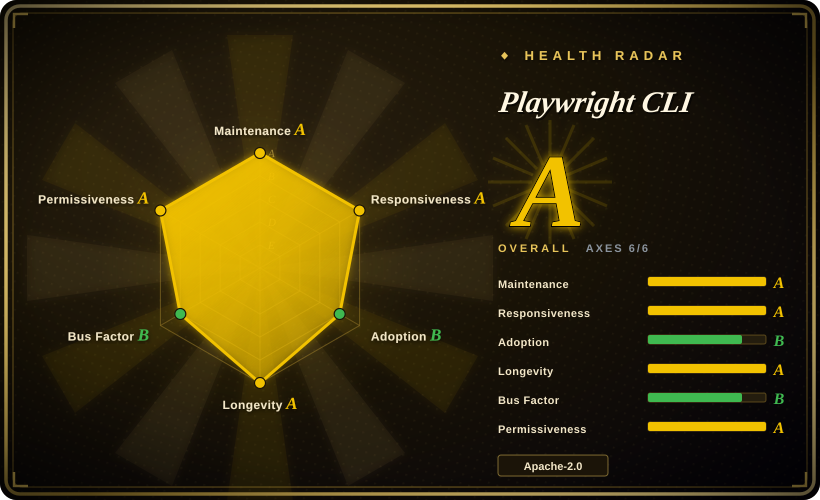

# Playwright CLI

Microsoft's token-efficient CLI + SKILLs path that lets a coding agent drive Playwright browsers through concise commands (`open`, `type`, `press`, `check`, `screenshot`) instead of loading MCP tool schemas and full accessibility trees into context.

## When to use

You're running a high-throughput coding agent (Claude Code, GitHub Copilot, or similar) whose real job is editing code, and it needs to *occasionally* drive a browser — reproduce a bug on a live page, walk a todo-app flow, grab a screenshot of what it just built — without surrendering half its context window to browser tooling. Microsoft's own positioning (stated in both repos' READMEs) is that coding agents favor CLI invocations over MCP because they skip the large tool schemas and verbose per-step accessibility trees. You `npm install -g @playwright/cli`, run `playwright-cli install --skills` so the agent learns the command surface, and the agent shells out: `open --headed`, `type`, `check e21`, `screenshot` — with interactive elements referenced by short `e`-refs.

Pick this over Playwright MCP when token efficiency and coding-agent ergonomics dominate; keep sessions (`-s=name`, `--persistent` profiles) when a flow must survive across calls. This is the path Microsoft itself steers coding agents toward as of 2026-09.

## When NOT to use

- **Stateful, introspective agent loops.** Exploratory automation, self-healing test authoring, and long autonomous workflows that re-reason over page structure every step are the cases Microsoft explicitly keeps on [Playwright MCP](playwright-mcp.md) — persistent browser context and rich introspection outweigh token cost there.
- **DevTools-grade debugging.** No performance traces, Core Web Vitals, network waterfalls, or source-mapped console here either — for "the page is slow / something leaks" use [Chrome DevTools MCP](../agent-browser-tools/chrome-devtools-mcp.md).
- **Your daily logged-in browser.** Sessions persist cookies/storage only within a run (or to disk with `--persistent`); it does not bridge into your everyday Chrome profile the way OpenCLI (see [OpenCLI](../agent-browser-tools/opencli.md)) or [Agent Browser](../agent-browser-tools/agent-browser.md)'s saved sessions do. If the task needs an account that's already logged in with 2FA, this is the wrong layer.
- **You need a stable contract today.** v0.1.x and a 2026 repositioning (the repo predates it as an older Playwright CLI) — flags, skill format, and session semantics can still move; pin the version in agent configs.
- **Non-CLI agents / MCP-only clients.** If your harness only speaks MCP and can't shell out, use [Playwright MCP](playwright-mcp.md) instead.

## Comparison

| Alternative | In index | Our verdict | Tradeoff |
|---|---|---|---|
| [Playwright MCP](playwright-mcp.md) | ✅ | Pick the MCP when the agent loop is browser-centric and stateful (exploration, self-healing tests); pick this CLI when the agent is code-centric and browser steps are occasional. | Same engine, same vendor: MCP buys persistent introspection at high token cost; the CLI buys minimal context footprint at the cost of thinner per-step page structure. |
| [Agent Browser](../agent-browser-tools/agent-browser.md) | ✅ | Pick Agent Browser when you want a persistent Rust daemon with snapshot refs and auto-saved login sessions across runs; pick Playwright CLI for Microsoft's maintenance weight and native SKILLs install. | Agent Browser is operationally richer (daemon, session restore) but a younger single-vendor tool; Playwright CLI rides the Playwright org's roadmap but session persistence is manual (`--persistent`). |
| [Chrome DevTools MCP](../agent-browser-tools/chrome-devtools-mcp.md) | ✅ | Pick Chrome DevTools MCP for diagnosing pages (traces, CWV, network); pick Playwright CLI for operating them cheaply from a coding agent. | Diagnostics vs. operation — complementary, not competing; many setups want both. |
| [OpenCLI](../agent-browser-tools/opencli.md) | ✅ | Pick OpenCLI when the target is a third-party site where you're already logged in (its extension bridges your daily Chrome); pick Playwright CLI for driving disposable browsers from a coding agent. | OpenCLI inherits your real sessions and site adapters but adds an extension+daemon attack surface; Playwright CLI stays in clean automation browsers it fully controls. |
| [browser-use](../agent-browser-tools/browser-use.md) | ✅ | Pick browser-use when you want a batteries-included Python agent loop with vision fallback; pick Playwright CLI when you already have a coding agent and just need cheap browser commands. | browser-use bundles its own LLM loop and vision path; Playwright CLI is BYO-agent, AX/DOM-based, and far lighter per step. |

## Tech stack

JavaScript on Node.js ≥ 18 over the Playwright engine (Chromium/Firefox/WebKit); distributed as `@playwright/cli` on npm; SKILLs installed via `playwright-cli install --skills` for Claude Code / GitHub Copilot-class agents; interactive elements referenced by short `e`-refs; sessions with in-memory or `--persistent` on-disk profiles.

## Dependencies

- Node.js ≥ 18; Playwright browser binaries (downloaded on first use).
- A CLI-capable coding agent (Claude Code, GitHub Copilot…) — no MCP server or daemon required.

## Ops difficulty

**Low.** Global npm install plus one skills-install step; no services. Watch the v0.1.x churn — pin the version in shared agent configs, and re-check session/flag semantics after upgrades.

## Health & viability

- **Maintenance (2026-09):** active — v0.1.20 released and pushed 2026-09-14; rapid cadence since the 2026 repositioning.
- **Governance / backing:** `Organization`-owned by Microsoft, 13 contributors; same org as Playwright proper — strong backing, minimal bus-factor risk.
- **Age & Lindy (2026-09):** the repo's tag history confirms the repositioning: the older Playwright CLI line ran to v0.180.0 (releases back to 2026-01-31 in the current feed), then the agent-CLI incarnation restarted versioning at v0.1.x in 2026. Its ~13.3k stars therefore partly inherit the old CLI's history — don't read them as validation of the new direction. The concept (CLI over MCP for coding agents) is young and unproven at scale.
- **Adoption:** npm package `@playwright/cli` live (v0.1.20); adoption telemetry not independently measured. [未验证]
- **Risk flags:** Apache-2.0, no license concerns. Strategic flag: the 2026 CLI-vs-MCP split is fresh — Microsoft could still reshuffle the two surfaces, and skills-format churn is likely while v0.1.x. [推断]

## Caveats (unverified)

- [未验证] Stars (~13.3k) / contributors (13) per GitHub API on 2026-09-16; the star count includes history from the repo's pre-2026 incarnation as a different Playwright CLI.
- [未验证] The token-efficiency advantage over MCP is Microsoft's own claim in both READMEs; no independent benchmark cited.
- [未验证] Skill compatibility with specific agents beyond Claude Code / GitHub Copilot is vendor-stated.
- Verified via tag history (2026-09-17): legacy tags run to v0.180.0 and the agent-CLI line restarts at v0.1.x — the repositioning is factual, not inferred.
- [推断] Session semantics (in-memory default, `--persistent` opt-in) may still change across v0.1.x releases.
