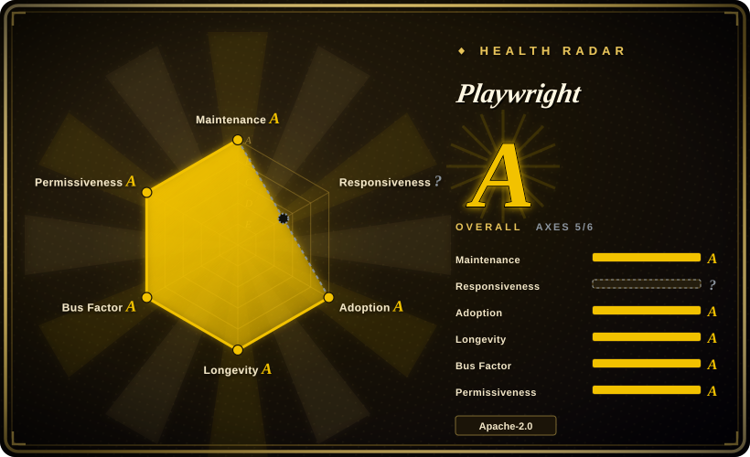
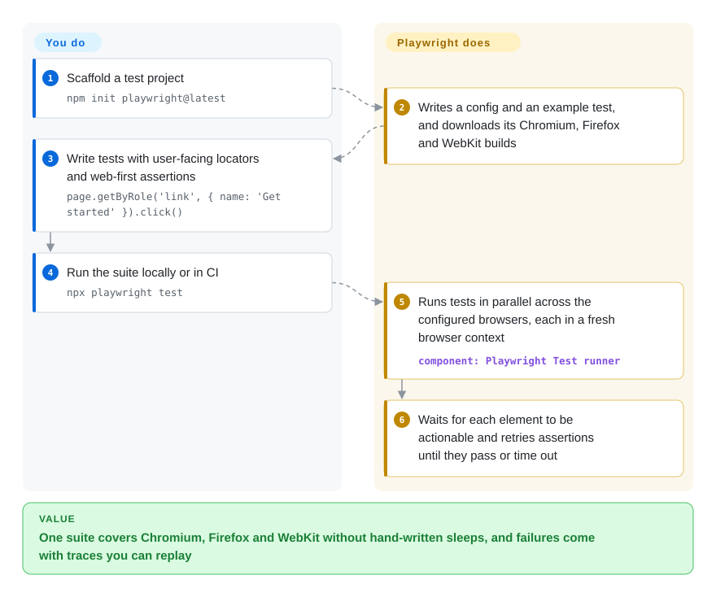

# Playwright

Browser tests fail at random — a click fires before the button is ready, a flow passes in Chrome and breaks in Safari — and a red CI run tells you nothing about why. Playwright drives Chromium, Firefox and WebKit through one API that waits for each element on its own, gives every test a clean browser profile, and can record a step-by-step trace so a failure can be replayed instead of guessed at.

## When to use

You are on a team shipping a web app, and the end-to-end suite has become the thing nobody trusts. It is full of `await sleep(2000)` to dodge timing races, it reruns until green, and last month a checkout bug that only happened in Safari reached production because CI only ran Chrome. When a test fails in CI, all you get is `Error: element not found` and no idea what the page looked like.

You reach for Playwright when you want one tool for all three browser engines plus a test runner that attacks flakiness directly: actions wait until the element is visible, enabled and stable; assertions retry until they pass or time out; each test gets a fresh browser context (an isolated, incognito-like profile that is cheap to create); and the trace viewer shows DOM snapshots, network and console for every step of a failed run. You pick it over Cypress when you need WebKit, multiple tabs or origins in one test, or free built-in parallelism; over Selenium when you value auto-waiting and isolation over driving the real branded browsers through a W3C standard; and over Puppeteer when you need WebKit, a test runner, or Python/Java/.NET bindings. The deciding tradeoff: you test against Playwright's own patched Firefox and WebKit builds, not the Firefox and Safari your users install.

## How it works

Playwright has two layers. The library launches browsers it downloaded itself — Chromium (Chrome for Testing by default, or your installed Chrome/Edge), plus Firefox and WebKit builds that Microsoft patches so they can be automated — and talks to them from a separate process: CDP for Chromium, and Playwright's own patched-in protocol for the other two. On top sits Playwright Test, a runner that spreads test files across parallel workers, gives each test its own browser context, retries failures, and captures traces, screenshots and videos according to your config. What it does for you: browser downloads, isolation, auto-waiting before every action, retrying assertions, parallelism and the debugging artifacts. What you do: write tests with user-facing locators (`getByRole`, `getByLabel`), declare which browsers and devices to run in `playwright.config.ts`, and re-run `npx playwright install` whenever you upgrade, because each Playwright release pins specific browser builds. The same engine also ships as a plain library for scripts (scraping, PDFs, screenshots), in Python, Java and .NET bindings, and behind the separate [Playwright CLI](playwright-cli.md) and [Playwright MCP](playwright-mcp.md) for AI agents.

<!-- flow-steps:begin (generated from flows/playwright.json by tools/flow_card.py — do not edit) -->

Text version of the flow

1. **You**: Scaffold a test project — `npm init playwright@latest`
2. **Playwright**: Writes a config and an example test, and downloads its Chromium, Firefox and WebKit builds
3. **You**: Write tests with user-facing locators and web-first assertions — `page.getByRole('link', { name: 'Get started' }).click()`
4. **You**: Run the suite locally or in CI — `npx playwright test`
5. **Playwright**: Runs tests in parallel across the configured browsers, each in a fresh browser context — component: `Playwright Test runner`
6. **Playwright**: Waits for each element to be actionable and retries assertions until they pass or time out

**Value**: One suite covers Chromium, Firefox and WebKit without hand-written sleeps, and failures come with traces you can replay

<!-- flow-steps:end -->

## When NOT to use

- **You must certify behavior on the branded Safari or Firefox your users run.** Use [Selenium](../browser-driver-frameworks/selenium.md) with safaridriver/geckodriver or a real-device cloud instead, because Playwright's docs state it does not work with branded Firefox or Safari — its WebKit and Firefox are patched builds, so a pass is strong evidence but not proof on Apple's Safari.
- **You only automate Chrome from Node and want the smallest dependency.** Use [Puppeteer](../browser-driver-frameworks/puppeteer.md) instead, because it is maintained by the Chrome team as the reference CDP client and avoids downloading three browser engines you will not use.
- **An AI agent, not your test code, should drive the browser.** Use [Playwright CLI](playwright-cli.md) or [Playwright MCP](playwright-mcp.md) instead, because they wrap this engine as agent tools (CLI+skills for coding agents, MCP for MCP clients); the library itself expects you to write the script.
- **Your team needs the test runner in Python, Java or .NET.** Use that language's binding plus its native runner (for Python, the `pytest-playwright` plugin) instead of Playwright Test, because the full-featured runner — config projects, fixtures, sharding, HTML reporter — is the Node/TypeScript package.
- **The tests must run on a long-lived grid with many browser versions at once.** Use Selenium Grid instead, because each Playwright release is tied to one set of browser builds; testing old browser versions means pinning old Playwright versions.
- **You need to avoid bot detection when scraping.** Use a stealth fork such as [Camoufox](../browser-driver-frameworks/camoufox.md) instead, because stock Playwright exposes automation signals by design; patched forks like [rebrowser-playwright](../browser-driver-frameworks/rebrowser-playwright.md) lag upstream releases.

## Comparison

| Alternative | In index | Our verdict | Tradeoff |
|---|---|---|---|
| [Puppeteer](../browser-driver-frameworks/puppeteer.md) | ✅ | Choose Puppeteer for Chrome-first scripting in Node with the Chrome team's reference client; choose Playwright when you need WebKit, a full test runner, or non-JavaScript bindings. | Leaner and closest to Chrome, but no WebKit, no runner, JavaScript only. |
| [Selenium](../browser-driver-frameworks/selenium.md) | ✅ | Choose Selenium when you must drive real branded browsers through the W3C WebDriver standard, across many languages and a grid; choose Playwright when flaky timing and test isolation are the main pain. | Widest browser/language/vendor-cloud coverage, but you build waiting and isolation discipline yourself. |
| Cypress | 未收录 | Choose Cypress when your team values its in-browser interactive runner and time-travel UI for single-origin front-end apps; choose Playwright when you need WebKit, multi-tab or multi-origin flows, and free parallel runs. | Very friendly authoring experience, but runs inside the browser with tighter architectural limits, and scaling parallel runs leans on its paid cloud. |
| WebdriverIO | 未收录 | Choose WebdriverIO when you want a Node test framework that can speak both WebDriver (real branded browsers, mobile via Appium) and DevTools protocols; choose Playwright for a single integrated stack with its own browsers and tracing. | Broader target reach (mobile, real browsers), but more configuration and plugins to assemble. |
| [Playwright MCP](playwright-mcp.md) | ✅ | Choose Playwright MCP when an MCP-capable AI agent should drive the browser through accessibility snapshots; choose the Playwright library when you are writing deterministic tests or scripts yourself. | Same engine, no code to write, but agent-driven runs are slower and non-deterministic compared to a checked-in test. |

## Tech stack

- **TypeScript** monorepo (`playwright-core`, `playwright`, `@playwright/test`), Apache-2.0.
- **Browser protocols:** CDP for Chromium; Playwright-maintained patches and protocol for Firefox and WebKit builds.
- **Browsers:** Chromium 156, Firefox 157 and WebKit 27.2 as of v1.64; Chrome for Testing by default for Chromium; branded Chrome/Edge supported via channels.
- **Language bindings** for Python, Java and .NET live in separate Microsoft repositories and wrap the same driver.

## Dependencies

- **Node.js ≥ 20** for `playwright-core` (other bindings bundle a Node runtime for the driver).
- **Browser binaries** downloaded with `npx playwright install`, re-run after every upgrade; on Linux also OS packages via `npx playwright install-deps`.
- **Disk and CI cache space** for up to three browser engines.
- **No external service** — tests and traces run and stay local unless you upload reports yourself.

## Ops difficulty

**Low to start, medium to keep green at scale.** `npm init playwright@latest` gives a working suite in minutes. The ongoing work is CI plumbing: caching or baking browsers into images (Microsoft publishes Docker images), installing Linux system dependencies, sharding large suites across machines, and storing traces and reports as artifacts. Upgrades are frequent (roughly monthly minor releases) and pull new browser builds, so occasional test breakage from browser behavior changes is part of the cost of staying current.

## Health & viability

- **Maintenance (as of 2026-10-08):** very active — weekly commits and roughly monthly minor releases (v1.64.0 on 2026-10-07), with browser builds refreshed each release.
- **Responsiveness:** not scored this round — the scorer found no usable issue-response window; the tracker is busy and triaged by Microsoft staff, but response time was not measured.
- **Governance & backing:** owned and staffed by Microsoft; about 90+ active committers in the last year with no single dominant author; the founding core came from the original Puppeteer team.
- **Age / Lindy:** about seven years old (created 2019-11) and still accelerating — a strong Lindy prior plus corporate backing.
- **Adoption:** hundreds of millions of npm downloads a month and thousands of dependent repositories; it is also the engine under many agent-browser tools in this index.
- **Risk flags:** Apache-2.0, no relicense history; the main risk is single-vendor control of the roadmap and the patched-browser model (Firefox/WebKit fidelity depends on Microsoft keeping the patches current).

## Caveats (unverified)

- [未验证] Cypress and WebdriverIO characteristics (architecture limits, paid parallelization, Appium reach) are from general knowledge, not re-read for this sync.
- [推断] "Founding core came from the original Puppeteer team" rests on several top Playwright contributors (e.g. `aslushnikov`) also appearing among Puppeteer's top contributors, not on a published history.
- [未验证] Whether the scaffold from `npm init playwright@latest` enables tracing by default was not checked; the README shows `trace: 'on-first-retry'` as a config example.
- [未验证] Download and dependent-repo counts come from the health scorer's registry lookups on 2026-10-08 and include CI installs.
