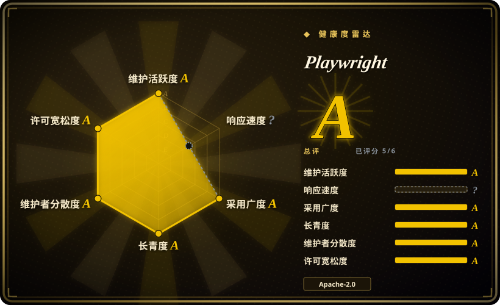
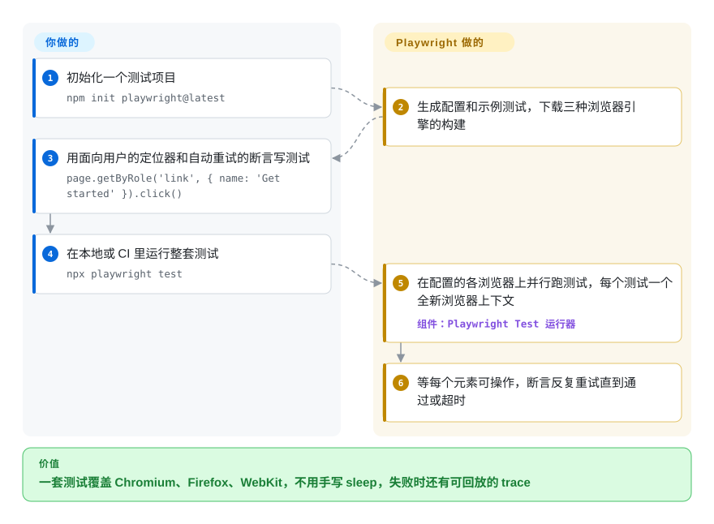

# Playwright

浏览器测试时好时坏——按钮还没就绪点击就发出去了，流程在 Chrome 里能过、到 Safari 就挂——CI 一片红，却说不出原因。Playwright 用同一套 API 驱动 Chromium、Firefox 和 WebKit，每个元素都自己等它就绪，每个测试都给一个干净的浏览器配置，还能把每一步录成 trace，失败时可以回放，而不是靠猜。

## 何时使用

你在一个交付 Web 应用的团队里，端到端测试已经成了没人信的东西：里面塞满了 `await sleep(2000)` 来躲时序竞争，挂了就重跑直到变绿；上个月有个只在 Safari 上出现的结账 bug 溜进了生产，因为 CI 只跑 Chrome。CI 里一个测试挂掉，你拿到的只有 `Error: element not found`，完全不知道当时页面长什么样。

当你想用一个工具覆盖三大浏览器引擎，再配一个正面解决“不稳定”的测试运行器时，就该想到 Playwright：动作会等元素可见、可用、不再移动才执行；断言会一直重试，直到通过或超时；每个测试拿到一个全新的浏览器上下文（browser context，一个隔离的、类似无痕窗口的配置，创建成本很低）；trace 查看器能逐步展示失败运行的 DOM 快照、网络请求和控制台输出。你选它而不选 Cypress，是因为你需要 WebKit、一个测试里跨多个标签页或多个域，或者免费的内置并行；选它而不选 Selenium，是因为你更看重自动等待和隔离，而不是通过 W3C 标准去驱动真正的品牌浏览器；选它而不选 Puppeteer，是因为你需要 WebKit、测试运行器，或者 Python/Java/.NET 绑定。真正的取舍是：你测的是 Playwright 自己打过补丁的 Firefox 和 WebKit 构建，而不是用户装的那个 Firefox 和 Safari。

## 怎么用起来

Playwright 分两层。底下是库：它启动自己下载的浏览器——Chromium（默认用 Chrome for Testing，也可以用你本机装的 Chrome/Edge），以及微软为了能被自动化而打过补丁的 Firefox 和 WebKit 构建——并从独立进程里和它们对话：Chromium 走 CDP，另外两个走 Playwright 自己补进去的协议。上面是 Playwright Test，一个测试运行器：把测试文件分给多个并行 worker，给每个测试一个独立的浏览器上下文，失败时重试，并按你的配置抓 trace、截图和录像。它替你做的：下载浏览器、隔离、每次动作前自动等待、断言重试、并行和各种调试产物。你要做的：用面向用户的定位器（`getByRole`、`getByLabel`）写测试，在 `playwright.config.ts` 里声明跑哪些浏览器和设备，并且每次升级后重跑 `npx playwright install`——因为每个 Playwright 版本都锁定了特定的浏览器构建。同一个引擎还以纯库的形式用于脚本（抓取、PDF、截图），有 Python、Java、.NET 绑定，也藏在给 AI agent 用的 [Playwright CLI](playwright-cli.zh.md) 和 [Playwright MCP](playwright-mcp.zh.md) 背后。

<!-- flow-steps:begin (generated from flows/playwright.json by tools/flow_card.py — do not edit) -->

流程文字版

1. **你**：初始化一个测试项目 — `npm init playwright@latest`
2. **Playwright**：生成配置和示例测试，下载三种浏览器引擎的构建
3. **你**：用面向用户的定位器和自动重试的断言写测试 — `page.getByRole('link', { name: 'Get started' }).click()`
4. **你**：在本地或 CI 里运行整套测试 — `npx playwright test`
5. **Playwright**：在配置的各浏览器上并行跑测试，每个测试一个全新浏览器上下文 — 组件：`Playwright Test 运行器`
6. **Playwright**：等每个元素可操作，断言反复重试直到通过或超时

**价值**：一套测试覆盖 Chromium、Firefox、WebKit，不用手写 sleep，失败时还有可回放的 trace

<!-- flow-steps:end -->

## 何时不用

- **你必须在用户真正使用的品牌 Safari 或 Firefox 上认证行为。** 改用 [Selenium](../browser-driver-frameworks/selenium.zh.md) 配 safaridriver/geckodriver，或真机云，因为 Playwright 文档写明它不支持品牌版 Firefox 和 Safari——它的 WebKit 和 Firefox 是打过补丁的构建，测过了是强证据，但不等于在苹果的 Safari 上验证过。
- **你只在 Node 里自动化 Chrome，想要最小的依赖。** 改用 [Puppeteer](../browser-driver-frameworks/puppeteer.zh.md)，因为它由 Chrome 团队作为参考 CDP 客户端维护，也不用下载三个你用不上的浏览器引擎。
- **该由 AI agent 而不是你的测试代码来开浏览器。** 改用 [Playwright CLI](playwright-cli.zh.md) 或 [Playwright MCP](playwright-mcp.zh.md)，因为它们把这个引擎包成了 agent 工具（CLI+skills 给编码 agent，MCP 给 MCP 客户端）；库本身是让你自己写脚本的。
- **你的团队要用 Python、Java 或 .NET 的测试运行器。** 改用对应语言的绑定加它原生的运行器（Python 用 `pytest-playwright` 插件），而不是 Playwright Test，因为功能完整的运行器——配置 project、fixture、分片、HTML 报告——是 Node/TypeScript 包。
- **测试要跑在一个长期存在、同时覆盖很多浏览器版本的集群上。** 改用 Selenium Grid，因为每个 Playwright 版本只绑定一组浏览器构建；要测旧版浏览器，就得锁旧版 Playwright。
- **你抓取时需要躲开机器人检测。** 改用 [Camoufox](../browser-driver-frameworks/camoufox.zh.md) 这类隐身分支，因为原版 Playwright 本来就会暴露自动化特征；[rebrowser-playwright](../browser-driver-frameworks/rebrowser-playwright.zh.md) 这类打补丁的分支则跟不上上游版本。

## 横向对比

| 替代品 | 是否收录 | 我们的评价 | 取舍 |
|---|---|---|---|
| [Puppeteer](../browser-driver-frameworks/puppeteer.zh.md) | ✅ | 在 Node 里以 Chrome 为先写脚本、想用 Chrome 团队的参考客户端时选 Puppeteer；需要 WebKit、完整测试运行器或非 JavaScript 绑定时选 Playwright。 | 更精简、离 Chrome 最近，但没有 WebKit、没有运行器、只能用 JavaScript。 |
| [Selenium](../browser-driver-frameworks/selenium.zh.md) | ✅ | 必须通过 W3C WebDriver 标准驱动真正的品牌浏览器、跨多种语言并上集群时选 Selenium；主要痛点是时序不稳和测试隔离时选 Playwright。 | 浏览器、语言和厂商云的覆盖最广，但等待和隔离的纪律要你自己搭。 |
| Cypress | 未收录 | 团队看重它在浏览器内的交互式运行器和“时光回溯”界面、应用是单域前端时选 Cypress；需要 WebKit、多标签页或跨域流程、以及免费并行时选 Playwright。 | 编写体验非常友好，但它跑在浏览器内部，架构限制更紧，扩大并行要靠它的付费云。 |
| WebdriverIO | 未收录 | 想要一个既能说 WebDriver（真品牌浏览器、经 Appium 上移动端）又能说 DevTools 协议的 Node 测试框架时选 WebdriverIO；想要自带浏览器和 trace 的一体化栈时选 Playwright。 | 能触达的目标更广（移动端、真浏览器），但要拼装的配置和插件更多。 |
| [Playwright MCP](playwright-mcp.zh.md) | ✅ | 让支持 MCP 的 AI agent 通过无障碍快照驱动浏览器时选 Playwright MCP；自己写确定性的测试或脚本时选 Playwright 库。 | 同一个引擎、不用写代码，但和提交进仓库的测试相比，agent 驱动的运行更慢、结果也不确定。 |

## 技术栈

- **TypeScript** monorepo（`playwright-core`、`playwright`、`@playwright/test`），Apache-2.0。
- **浏览器协议：** Chromium 走 CDP；Firefox 和 WebKit 构建用 Playwright 维护的补丁和协议。
- **浏览器：** v1.64 时为 Chromium 156、Firefox 157、WebKit 27.2；Chromium 默认用 Chrome for Testing；可通过 channel 使用品牌版 Chrome/Edge。
- **语言绑定：** Python、Java、.NET 绑定在微软的独立仓库里，包装的是同一个 driver。

## 依赖

- **Node.js ≥ 20**（`playwright-core` 的要求；其他语言绑定为 driver 自带一个 Node 运行时）。
- **浏览器二进制：** 用 `npx playwright install` 下载，每次升级后重跑；Linux 上还要用 `npx playwright install-deps` 装系统包。
- **磁盘和 CI 缓存空间：** 最多要放三个浏览器引擎。
- **不依赖外部服务：** 测试和 trace 都在本地运行、留在本地，除非你自己上传报告。

## 运维难度

**起步低，规模化后保持全绿中等。** `npm init playwright@latest` 几分钟就能得到一套能跑的测试。持续的活在 CI 管道上：缓存浏览器或把它们打进镜像（微软发布了 Docker 镜像）、装 Linux 系统依赖、把大套件分片到多台机器、把 trace 和报告存成构件。升级很频繁（大约每月一个次版本），每次都带来新的浏览器构建，所以偶尔因为浏览器行为变化导致测试失败，是保持最新版的代价之一。

## 健康度与可持续性

- **维护活跃度（截至 2026-10-08）：** 非常活跃——每周都有提交，大约每月一个次版本（v1.64.0，2026-10-07），每版都刷新浏览器构建。
- **响应速度：** 本轮没有评分——评分器没找到可用的 issue 响应窗口；issue 区很热闹，由微软员工分诊，但响应时间没有测到。
- **治理与背书：** 由微软拥有并配备人手；过去一年约 90 多名活跃提交者，没有哪个作者一家独大；创始核心来自最初的 Puppeteer 团队。
- **年龄 / Lindy：** 约七岁（2019-11 创建）且还在加速——很强的 Lindy 先验，加上大公司背书。
- **采用广度：** 每月数亿次 npm 下载、数千个依赖仓库；本索引里很多 agent 浏览器工具底下也是它。
- **风险信号：** Apache-2.0，没有改许可证的历史；主要风险是路线图由单一厂商掌控，以及打补丁浏览器这一模式（Firefox/WebKit 的保真度取决于微软持续跟进补丁）。

## 存疑（未验证）

- [未验证] 关于 Cypress 和 WebdriverIO 的特征（架构限制、付费并行、Appium 覆盖）来自一般认知，本次同步没有重读。
- [推断] “创始核心来自最初的 Puppeteer 团队”依据的是 Playwright 的几位头部贡献者（如 `aslushnikov`）也出现在 Puppeteer 的头部贡献者里，而不是公开的历史记载。
- [未验证] `npm init playwright@latest` 生成的脚手架是否默认开启 trace 没有核实；README 只把 `trace: 'on-first-retry'` 当配置示例给出。
- [未验证] 下载量和依赖仓库数取自健康度评分器 2026-10-08 的包仓库查询，包含 CI 安装。
