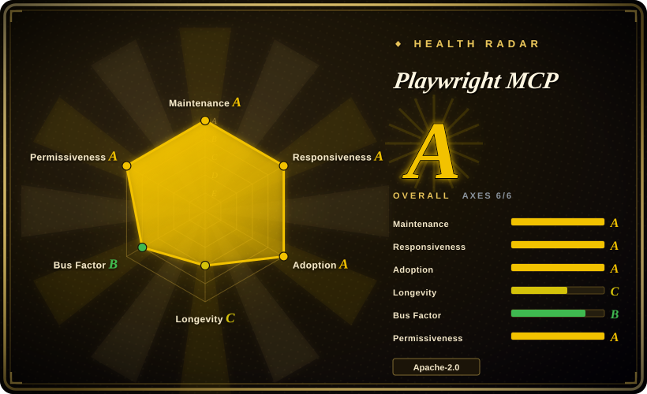

# Playwright MCP

Microsoft's official MCP server that lets an LLM agent drive a real browser through Playwright's accessibility-tree snapshots — deterministic, no screenshots or vision models needed.

## When to use

You're wiring an MCP-capable agent (Claude Code, VS Code Copilot, Cursor, Claude Desktop…) to a browser for an **iterative, stateful loop**: exploratory automation ("poke around this app and find the checkout bug"), self-healing test authoring, or a long autonomous workflow where the agent needs to keep reasoning over page structure across many steps. You add `@playwright/mcp` to the client's MCP config and the agent gets Playwright's full browser surface as typed tools — navigate, click, fill, evaluate, wait — with the page presented as a structured accessibility snapshot rather than pixels, so element targeting stays deterministic.

Pick it over a headless-script approach when you want Microsoft's maintained, spec-conformant MCP integration and Playwright's mature cross-browser engine underneath. The key 2026 caveat straight from Microsoft's own README: for **high-throughput coding agents** they now steer you to `playwright-cli` (CLI + SKILLs) instead, because MCP's large tool schemas and verbose accessibility trees burn context the coding agent needs for code. Choose this MCP when persistent browser state and rich introspection outweigh token cost; choose the CLI sibling when token efficiency dominates.

## When NOT to use

- **A coding agent where context budget is the bottleneck.** Microsoft's README itself recommends the CLI+SKILLs sibling (microsoft/playwright-cli, 未收录) for coding agents — MCP tool schemas plus per-step accessibility trees are materially more expensive in context. If your agent is primarily editing code and only occasionally touching the browser, use the CLI path or a CLI-first tool like [Agent Browser](agent-browser.md).
- **You need DevTools-grade diagnostics** — performance traces, Core Web Vitals, network waterfalls, source-mapped console errors. Playwright MCP exposes browser *automation*, not the DevTools protocol surface; for debugging a slow/leaky page use [Chrome DevTools MCP](chrome-devtools-mcp.md) instead.
- **You need your daily logged-in browser.** It launches Playwright-managed browser instances (persistent `--user-data-dir` profiles and `--cdp-endpoint` attach exist, but the default is an automation browser, not your everyday Chrome with its cookies, 2FA sessions and risk-control reputation). For agents that must operate your real logged-in session, OpenCLI (未收录) or [Agent Browser](agent-browser.md)'s session persistence are closer fits.
- **Pixel-level or canvas-heavy interaction.** The whole design is "no screenshots" — canvas apps, drag-by-pixel, and visual verification are out of scope; a vision-based agent (browser-use class) handles those.
- **Non-MCP harness.** It's an MCP server; if your agent doesn't speak MCP, there's nothing to call — use Playwright the [framework](playwright.md) directly or a CLI wrapper.

## Comparison

| Alternative | In index | Our verdict | Tradeoff |
|---|---|---|---|
| playwright-cli (未收录) | ❌ | Pick playwright-cli when the consumer is a coding agent and token efficiency matters — Microsoft's own README steers coding agents there; pick this MCP when persistent state and introspection loops matter more. | Same Playwright engine and same vendor; CLI+SKILLs minimizes context load, MCP maximizes session continuity and introspection depth. |
| [Chrome DevTools MCP](chrome-devtools-mcp.md) | ✅ | Pick Chrome DevTools MCP when the job is diagnosing a page (traces, CWV, network, console); pick Playwright MCP when the job is operating one (multi-step forms, flows, exploration). | DevTools MCP has the diagnostic surface but is Chromium-only and diagnostics-shaped; Playwright MCP is cross-browser automation-shaped with no perf tooling. |
| [Agent Browser](agent-browser.md) | ✅ | Pick Agent Browser when you want CLI-first control with snapshot refs, a persistent Rust daemon, and saved login sessions; pick Playwright MCP for the vendor-official MCP path with the widest client compatibility list. | Agent Browser is faster to shell out to and carries session persistence, but is one vendor's younger tool; Playwright MCP rides Microsoft's maintenance and the Playwright engine's maturity. |
| [browser-use](browser-use.md) | ✅ | Pick browser-use when you want a batteries-included Python agent loop with vision fallback; pick Playwright MCP when you already have an agent and just need a deterministic browser tool surface. | browser-use bundles its own LLM loop (heavier, vision-capable); Playwright MCP is BYO-agent with deterministic AX-tree targeting only. |
| [Playwright](playwright.md) (framework) | ✅ | Pick the Playwright framework when you're writing committed test code, not giving an agent live control; pick Playwright MCP when an agent needs to improvise against a live page. | The framework is the right artifact for CI suites; the MCP server trades committed-code reliability for agent flexibility at runtime. |

## Tech stack

TypeScript MCP server over the Playwright automation engine (Chromium, Firefox, WebKit); structured accessibility-tree snapshots as the LLM-facing representation; Node.js ≥ 18. Distributed as `@playwright/mcp` on npm.

## Dependencies

- An MCP-capable client (Claude Code, VS Code Copilot, Cursor, Claude Desktop, Goose…); no other runtime services.
- Node.js ≥ 18; browsers downloaded by Playwright on first run (or pointed at an existing Chrome via `--cdp-endpoint`).

## Ops difficulty

**Low.** One npx line in the client's MCP config; no daemon or service to operate. The operational notes are version churn (v0.0.x line — expect breaking changes between minors) and context cost (accessibility trees on large pages are token-heavy by design; scope snapshots with smaller pages/interactive-only modes where possible).

## Health & viability

- **Maintenance (2026-09):** very active — v0.0.81 published 2026-09-14, pushed the same day; ~18 months of continuous releases since creation (2025-03-21).
- **Governance / backing:** `Organization`-owned by **Microsoft**, 30 contributors — the strongest backing profile in the browser-agent category; roadmap rides Playwright's. Bus-factor risk minimal.
- **Age & Lindy (2026-09):** ~1.5 years old, still on a v0.0.x versioning line — Microsoft's commitment is clear but the API contract is explicitly unstable; pin versions in agent configs.
- **Adoption:** ~37k stars / 3.2k forks (2026-09-16), shipped install buttons for a dozen MCP clients; effectively the default "MCP browser" in the ecosystem. [推断]
- **Risk flags:** none on license (Apache-2.0, no relicense history). The strategic flag is Microsoft's own guidance: they are actively developing the CLI+SKILLs sibling and position MCP as the niche for stateful/introspective loops — long-term investment could drift toward the CLI. [推断]

## Caveats (unverified)

- [未验证] Stars (~37k) / forks (~3.2k) / contributors (30) per GitHub API on 2026-09-16; date-sensitive.
- [未验证] The MCP-vs-CLI token-efficiency framing is Microsoft's own README claim, not an independent measurement.
- [未验证] Client compatibility list (VS Code, Cursor, Claude Desktop, Goose, Grok, Junie…) is vendor-stated; individual client behavior not verified here.
- [推断] v0.0.x versioning implies breaking changes may ship without ceremony; treat upgrades as requiring config review.
- [推断] "Effectively the default MCP browser" is an inference from stars + vendor + client install buttons, not from usage telemetry.
