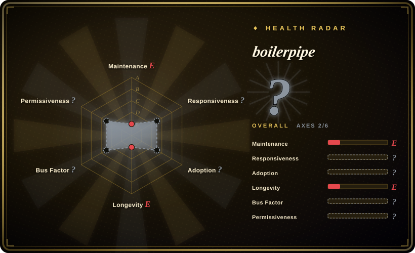
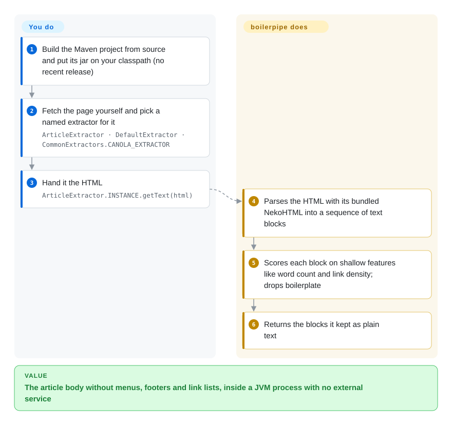

# boilerpipe

A Java library for boilerplate removal and full-text extraction from HTML — the classic, algorithm-driven approach (shallow text features, link density, tag ratios) that pulls the article out and drops navigation, ads, and surrounding clutter.

## When to use

You're on the JVM, building a search indexer, a corpus builder, or a text-mining pipeline, and you need to strip the article body out of raw HTML without dragging in a headless browser or a Python service. You reach for boilerpipe: it implements well-known extractors (e.g. `ArticleExtractor`, `DefaultExtractor`) from Kohlschütter et al's "Boilerplate Detection using Shallow Text Features" — you pass HTML and get back the cleaned main text. Because the algorithms are language-agnostic statistical heuristics (not site-specific rules), it generalizes across many pages, and its ideas are influential enough that later extractors (including dragnet) cite it as inspiration.

You'd realistically reach for it today only if you specifically need a **Java, dependency-light, classic-algorithm** extractor and are comfortable adopting an **unmaintained** library — vendoring it, building it yourself, and owning any fixes. For a new project, its main value is conceptual/algorithmic and JVM-native availability, not active support.

## How it works

boilerpipe treats a web page as a sequence of **text blocks** — runs of text between HTML tags — and decides block by block whether each one is article or *boilerplate* (the menus, footers, link lists and ad copy that repeat across a site). **The decision rules ship with the library as ready-made, named extractors (`ArticleExtractor`, `DefaultExtractor`, …); you only choose one and pass it the HTML.** Each rule looks at shallow features of a block rather than understanding the language: how many words it has, what share of its words sit inside links, how dense the text is compared to its neighbours — a long paragraph with few links is probably article, a short block that is mostly links is probably navigation. Like skimming a newspaper page by shape alone, it works without reading a word, which is why it is language-agnostic. The library parses, scores and returns plain text; you own getting the HTML (a convenience `getText(URL)` exists, but its own demo recommends a real crawler), getting the jar (build it from this repo's Maven source), and checking its accuracy on today's layouts.

<!-- flow-steps:begin (generated from flows/boilerpipe.json by tools/flow_card.py — do not edit) -->

Text version of the flow

1. **You**: Build the Maven project from source and put its jar on your classpath (no recent release)
2. **You**: Fetch the page yourself and pick a named extractor for it — `ArticleExtractor · DefaultExtractor · CommonExtractors.CANOLA_EXTRACTOR`
3. **You**: Hand it the HTML — `ArticleExtractor.INSTANCE.getText(html)`
4. **boilerpipe**: Parses the HTML with its bundled NekoHTML into a sequence of text blocks
5. **boilerpipe**: Scores each block on shallow features like word count and link density; drops boilerplate
6. **boilerpipe**: Returns the blocks it kept as plain text

**Value**: The article body without menus, footers and link lists, inside a JVM process with no external service

<!-- flow-steps:end -->

## When NOT to use

- **You want a maintained library.** This is the decisive filter: the repo is **effectively abandoned** — last pushed **2018-01**, described in its own README as a "work-in-progress transmit from Google Code," with no recent releases. Don't build a new long-lived pipeline on an unmaintained dependency without owning the fork. [推断]
- **You're not on the JVM.** It's Java; Python/JS pipelines should use [python-readability](python-readability.md), [Readability.js](readability-js.md), or trafilatura instead.
- **You need modern metadata, JSON-LD, or crawl support.** It extracts main text via classic heuristics; it is not a modern metadata/crawl framework.
- **You need current dependency hygiene / security patches.** An 8-year-stale Java library may carry outdated transitive deps (it relocates/vendors a NekoHTML) and won't receive security fixes.
- **You want best-in-class extraction accuracy on today's web.** The algorithms predate the modern web's layout patterns; newer extractors often do better on current pages. Benchmark before committing.

## Comparison

| Alternative | In index | Our verdict | Tradeoff |
|---|---|---|---|
| [dragnet](dragnet.md) | ✅ | Choose dragnet when you need a Python ML extractor that cites boilerpipe as inspiration. | Python ML extractor that cites boilerpipe as inspiration; trainable and comment-aware, but also low-activity with aging deps. |
| [python-readability](python-readability.md) | ✅ | Choose python-readability when you need a Python/lxml heuristic extractor without a JVM dependency. | lxml heuristic extractor (Python); lighter, still maintained-ish — but not JVM. |
| [Readability.js](readability-js.md) | ✅ | Choose Readability.js when you need Mozilla's JavaScript reader-view engine. | Mozilla's JS reader-view engine; actively maintained, but JavaScript and needs a DOM. |
| Apache Tika | 未收录 | Choose Apache Tika when you need a JVM content-detection/extraction framework across many formats. | JVM content-detection/extraction framework (many formats, not just HTML article extraction); actively maintained and far broader — heavier, different focus. |
| [trafilatura](trafilatura.md) | ✅ | Choose trafilatura when you need a modern maintained Python extractor with strong benchmarks and metadata. | Modern, maintained Python extractor with strong benchmarks and metadata; usually the better default now — different language. |

## Tech stack

- **Language:** Java (Maven multi-module: `boilerpipe-common`, `boilerpipe-demo`, etc.).
- **Approach:** statistical/heuristic boilerplate detection — shallow text features, link density, tag/text ratios — exposing named extractors (`ArticleExtractor`, `DefaultExtractor`, …).
- **HTML parsing:** uses a NekoHTML-based parser (the repo includes a relocated/vendored NekoHTML).
- **Build:** Maven (`pom.xml`).

## Dependencies

- **Runtime:** a JVM and the boilerpipe jars plus its HTML-parser dependency (NekoHTML-derived); no external services, no datastore.
- **Build:** Maven and a JDK to compile from source — and since there are no recent published artifacts, building yourself is the likely install path.
- **Input:** usually you supply the HTML (string, `Reader` or `InputSource`). There is also a `getText(URL)` convenience that downloads the page with a bare built-in fetcher — no retries, no crawling; its own demo says to fetch with a fault-tolerant crawler in real use.
- **Transitive risk:** being 8 years stale, its (vendored) parser and any transitive deps are old.

## Ops difficulty

**Low at runtime, but install/maintenance is the catch.** As a library it's stateless — call an extractor, get text — nothing to deploy or operate. The real cost is sourcing it: with no recent releases you'll likely build from the Maven source yourself, integrate an old jar, and accept that no upstream fixes are coming. The operational risk isn't running it; it's depending long-term on an unmaintained component with aged transitive dependencies you must monitor yourself.

## Health & viability

- **Responsiveness**: Cannot be scored — no_data.
- **Maintenance (2026-10).** Last commit on master **2015-08**, last push **2018-01** — **8–11 years stale**. Although the GitHub flag `archived` is **false**, the cadence and the README ("work-in-progress transmit from Google Code") make it **effectively abandoned**. No recent releases. [推断]
- **Governance / bus factor.** Essentially a single-author project (Christian Kohlschütter / `kohlschutter`) with a few historical contributors — minimal bus factor, and no active stewardship. [推断]
- **Age × Lindy (2026-06).** Created 2014-12 on GitHub (the algorithm/codebase is older, originally on Google Code) — but **age without activity fails Lindy**: long-lived in influence, but a long-*dormant* repo is a risk, not a safety signal. Use age × still-active; "still-active" is absent here. [推断]
- **Adoption & ecosystem.** ~1.1k stars and strong historical/academic influence (its algorithms shaped later extractors), but the ecosystem has moved on to maintained alternatives (Tika, trafilatura, readability ports). [未验证]
- **Risk flags.** Abandonment is the headline risk: no fixes, aged dependencies, and a "transmit from Google Code" provenance. Apache-2.0 per the LICENSE/NOTICE files. [推断]

## Caveats (unverified)

- [未验证] GitHub's API reports the license as `NOASSERTION`, but the repo's `LICENSE`/`NOTICE` state the **Apache License 2.0** (Copyright 2009, 2014 Christian Kohlschütter) — so the page records **Apache-2.0**; the NOASSERTION is an API artifact, not a different license.
- [未验证] ~1.1k stars as of 2026-06; last push 2018-01 — numbers are date-sensitive and the long gap is the dominant signal.
- [推断] "Effectively abandoned" is inferred from the 2018 push date plus the README's own "work-in-progress transmit from Google Code" framing — `archived` is false on GitHub, but activity is not.
- [推断] The NekoHTML-based parsing and vendored/relocated NekoHTML are inferred from the repo's directory layout (`nekohtml`, `nekohtml-relocated`), not from reading the build wiring in detail.
- [未验证] Comparative extraction accuracy on the modern web vs Tika/trafilatura reflects general positioning, not a measured benchmark; the available published artifacts and exact installable coordinates were not confirmed.
- [推断] The How it works mechanism (text blocks scored on shallow features such as word count, link density and neighbouring-block text density) is summarized from the Kohlschütter et al. paper the library implements, not from reading each extractor's decision rules in the source.
