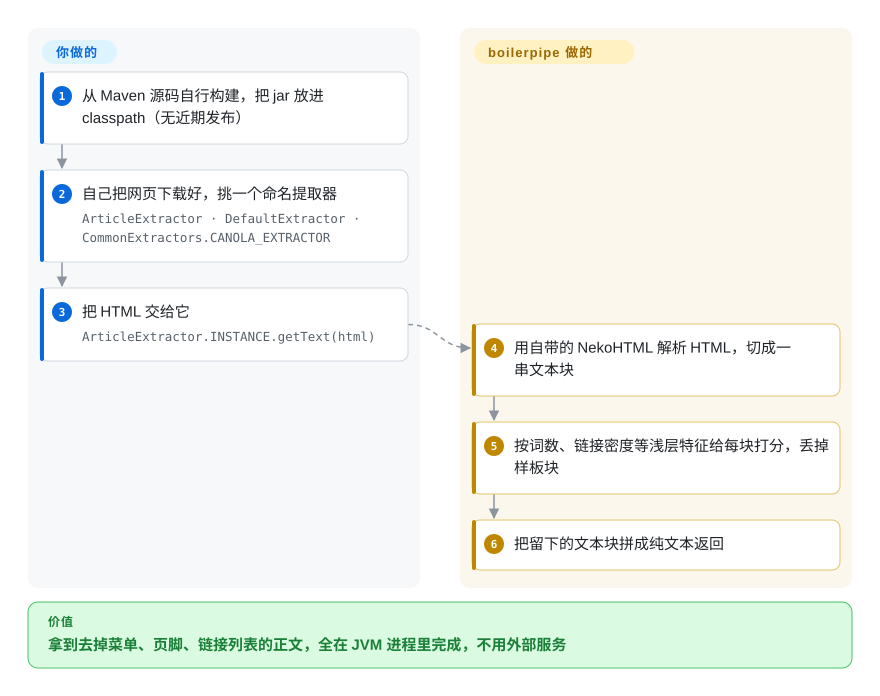

# boilerpipe

一个用于从 HTML 做样板移除和全文抽取的 Java 库——经典的、算法驱动的路子（浅层文本特征、链接密度、标签比率），把文章抽出来、丢掉导航、广告和周边杂物。

## 何时使用

你在 JVM 上，搭一个搜索索引器、语料构建器或文本挖掘管线，需要从原始 HTML 里剥出文章正文，又不想拖进一个 headless 浏览器或一个 Python 服务。于是你转向 boilerpipe：它实现了 Kohlschütter 等人“Boilerplate Detection using Shallow Text Features”里那些著名抽取器（如 `ArticleExtractor`、`DefaultExtractor`）——你传入 HTML，拿回清理过的正文。因为这些算法是与语言无关的统计启发式（而非站点专用规则），它能在许多页面间泛化，其思想影响力足够大，以至于后来的抽取器（包括 dragnet）都引它为灵感。

如今你现实中会选它，只在你明确需要一个 **Java、依赖轻、经典算法**的抽取器、且愿意接受一个**无维护**的库时——把它 vendoring 进来、自己构建、自己接管任何修复。对一个新项目，它的主要价值在于概念/算法层面和 JVM 原生可用，而非活跃支持。

## 怎么用起来

boilerpipe 把一个网页看成一串**文本块**——HTML 标签之间一段段连续的文字——然后逐块判断它是正文还是*样板*（全站重复出现的菜单、页脚、链接列表、广告语）。**判断规则随库附带，打包成几个现成的命名提取器（`ArticleExtractor`、`DefaultExtractor` 等）；你只需挑一个，把 HTML 递给它。** 每条规则看的是文本块的浅层特征，而不去理解语言：这块有多少个词、其中多大比例落在链接里、文字密度和前后相邻块比起来如何——又长又少链接的段落多半是正文，短而几乎全是链接的块多半是导航。就像只凭版面形状扫一眼报纸，一个字都不用读，所以它不挑语言。解析、打分、返回纯文本由库来做；归你的是：拿到 HTML（它有一个 `getText(URL)` 便捷方法，但它自己的 demo 建议用正经爬虫下载）、拿到 jar（从本仓库的 Maven 源码自己构建），以及确认它在今天的网页版式上准不准。

<!-- flow-steps:begin (generated from flows/boilerpipe.json by tools/flow_card.py — do not edit) -->

流程文字版

1. **你**：从 Maven 源码自行构建，把 jar 放进 classpath（无近期发布）
2. **你**：自己把网页下载好，挑一个命名提取器 — `ArticleExtractor · DefaultExtractor · CommonExtractors.CANOLA_EXTRACTOR`
3. **你**：把 HTML 交给它 — `ArticleExtractor.INSTANCE.getText(html)`
4. **boilerpipe**：用自带的 NekoHTML 解析 HTML，切成一串文本块
5. **boilerpipe**：按词数、链接密度等浅层特征给每块打分，丢掉样板块
6. **boilerpipe**：把留下的文本块拼成纯文本返回

**价值**：拿到去掉菜单、页脚、链接列表的正文，全在 JVM 进程里完成，不用外部服务

<!-- flow-steps:end -->

## 何时不用

- **你想要一个有维护的库。** 这是决定性筛子：该仓库**实际已废弃**——最后 push 于 **2018-01**，它自己的 README 称之为“work-in-progress transmit from Google Code”，没有近期发布。别在不接管 fork 的情况下，把新的长寿管线建在一个无维护依赖上。[推断]
- **你不在 JVM 上。** 它是 Java；Python/JS 管线应改用 [python-readability](python-readability.zh.md)、[Readability.js](readability-js.zh.md) 或 trafilatura。
- **你需要现代元数据、JSON-LD 或爬取支持。** 它用经典启发式抽正文；不是现代元数据/爬取框架。
- **你需要当前的依赖卫生/安全补丁。** 一个陈旧 8 年的 Java 库可能携带过时的传递依赖（它 relocate/vendor 了一份 NekoHTML），且不会收到安全修复。
- **你想要在今天的网页上有一流抽取精度。** 这些算法早于现代网页的布局模式；更新的抽取器在当下页面上常做得更好。投入前先做基准。

## 横向对比

| 替代品 | 是否收录 | 我们的评价 | 取舍 |
|---|---|---|---|
| [dragnet](dragnet.zh.md) | ✅ | 需要引 boilerpipe 为灵感的 Python ML 抽取器时，选 dragnet。 | 引 boilerpipe 为灵感的 Python ML 抽取器；可训练、识评论，但同样低活跃、依赖老化。 |
| [python-readability](python-readability.zh.md) | ✅ | 需要没有 JVM 依赖的 Python/lxml 启发式抽取器时，选 python-readability。 | lxml 启发式抽取器（Python）；更轻、仍算有维护——但非 JVM。 |
| [Readability.js](readability-js.zh.md) | ✅ | 需要 Mozilla 的 JavaScript reader-view 引擎时，选 Readability.js。 | Mozilla 的 JS reader-view 引擎；活跃维护，但是 JavaScript 且需要 DOM。 |
| Apache Tika | 未收录 | 需要覆盖多格式的 JVM 内容检测/抽取框架时，选 Apache Tika。 | JVM 内容检测/抽取框架（多种格式，不只 HTML 文章抽取）；活跃维护、宽广得多——更重、侧重不同。 |
| [trafilatura](trafilatura.zh.md) | ✅ | 需要现代、有维护、基准强且带元数据的 Python 抽取器时，选 trafilatura。 | 现代、有维护的 Python 抽取器，基准强、带元数据；如今通常是更好的默认——语言不同。 |

## 技术栈

- **语言：** Java（Maven 多模块：`boilerpipe-common`、`boilerpipe-demo` 等）。
- **方法：** 统计/启发式样板检测——浅层文本特征、链接密度、标签/文本比率——暴露具名抽取器（`ArticleExtractor`、`DefaultExtractor`……）。
- **HTML 解析：** 使用基于 NekoHTML 的解析器（仓库含一份 relocate/vendor 的 NekoHTML）。
- **构建：** Maven（`pom.xml`）。

## 依赖

- **运行时：** 一个 JVM 和 boilerpipe 的 jar，外加其 HTML 解析器依赖（NekoHTML 衍生）；无外部服务、无数据存储。
- **构建：** 从源码编译需 Maven 和 JDK——而因为没有近期发布制品，自己构建很可能是实际安装路径。
- **输入：** 通常由你提供 HTML（字符串、`Reader` 或 `InputSource`）。它也有一个 `getText(URL)` 便捷重载，用自带的简易下载器直接拉网页——不重试、不爬取；它自己的 demo 也写明实际使用时应先用容错的爬虫下载。
- **传递风险：** 陈旧 8 年，其（vendor 的）解析器和任何传递依赖都很旧。

## 运维难度

**运行时低，但安装/维护是坑。** 作为库它是无状态的——调一个抽取器、得文本——没什么要部署或运维。真正的成本在于把它弄到手：没有近期发布，你很可能要自己从 Maven 源码构建、集成一个旧 jar，并接受不会有上游修复。运维风险不在于跑它；而在于长期依赖一个无维护、传递依赖老化、需你自己盯着的组件。

## 健康度与可持续性

- **响应速度**：无法计算——no_data。
- **维护（2026-10）。** master 最后一次提交在 **2015-08**，最后 push 于 **2018-01**——**陈旧 8–11 年**。尽管 GitHub 的 `archived` 标记为 **false**，但其节奏和 README（“work-in-progress transmit from Google Code”）使它**实际已废弃**。无近期发布。[推断]
- **治理 / bus factor。** 本质是单作者项目（Christian Kohlschütter / `kohlschutter`），有少数历史贡献者——bus factor 极小，且无活跃管护。[推断]
- **年龄 × Lindy（2026-06）。** 在 GitHub 上 2014-12 创建（算法/代码库更老，原在 Google Code）——但**没有活跃的年龄不通过 Lindy**：在影响力上长寿，但一个长期*休眠*的仓库是风险而非安全信号。要用 年龄 × 仍活跃；这里“仍活跃”缺席。[推断]
- **采用度与生态。** 约 1.1k star 和很强的历史/学术影响力（其算法塑造了后来的抽取器），但生态已转向有维护的替代品（Tika、trafilatura、readability 移植）。[未验证]
- **风险标记。** 废弃是头号风险：无修复、依赖老化，以及“transmit from Google Code”的来历。依 LICENSE/NOTICE 文件为 Apache-2.0。[推断]

## 存疑（未验证）

- [未验证] GitHub API 把许可报为 `NOASSERTION`，但仓库的 `LICENSE`/`NOTICE` 写明 **Apache License 2.0**（版权 2009、2014 Christian Kohlschütter）——故本页记为 **Apache-2.0**；NOASSERTION 是 API 假象，并非另一种许可。
- [未验证] 截至 2026-06 约 1.1k star；最后 push 2018-01——数字对时间敏感，而这段长间隔是主导信号。
- [推断] “实际已废弃”由 2018 的 push 日期加上 README 自身“work-in-progress transmit from Google Code”的表述推断——GitHub 上 `archived` 为 false，但活动不是。
- [推断] 基于 NekoHTML 的解析和 vendor/relocate 的 NekoHTML，由仓库目录布局（`nekohtml`、`nekohtml-relocated`）推断，而非详读构建接线。
- [未验证] 在现代网页上与 Tika/trafilatura 的相对抽取精度反映总体定位，而非实测基准；可用的已发布制品和确切可安装坐标未确认。
- [推断] 怎么用起来一节的机制（按词数、链接密度、相邻块文字密度等浅层特征给文本块打分）是依据本库所实现的 Kohlschütter 等人论文概括的，没有逐个读源码里各提取器的判定规则。
