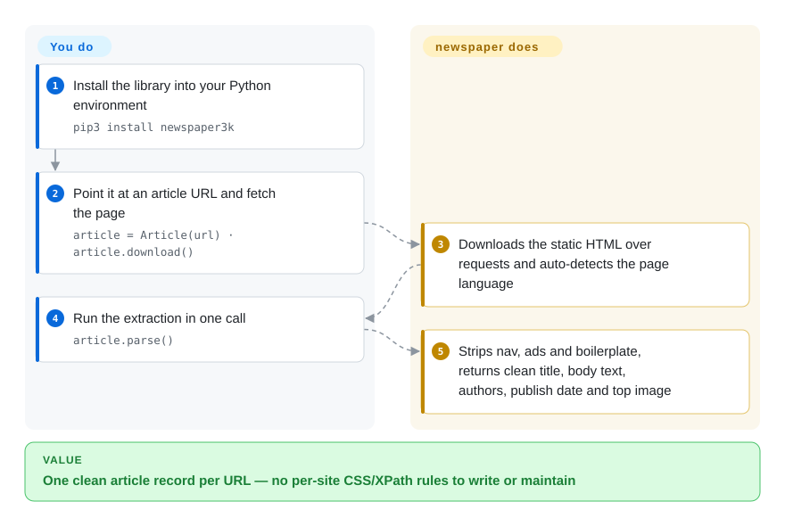

# newspaper

You have thousands of news article URLs and only want the stories. This Python library downloads each page for you and returns clean body text, title, authors, publish date and top image — boilerplate stripped, no per-site scraping rules to write.

## When to use

You're a data engineer building a media-monitoring pipeline, and you have a list of thousands of news article URLs — press releases, newspaper stories, blog posts. You don't care about the nav bars, ad rails, comment widgets, or cookie banners; you want the *body text*, the headline, who wrote it, when, and the lead image, in a clean dict per URL. Writing a bespoke CSS/XPath extractor per outlet would be hundreds of brittle rules, so instead you point `newspaper` at each URL: `Article(url).download()`, `.parse()`, and read `.text`, `.title`, `.authors`, `.publish_date`, `.top_image`. Call `.nlp()` and you also get `.keywords` and a naive `.summary`. For one outlet you can build a `Source` to discover and batch its article URLs.

It shines when the input is *article-shaped* and you want one general extractor instead of N site-specific ones — the classic "give me the readable text behind this news link, at scale" job, where a roughly-right heuristic across many domains beats hand-tuning each.

## How it works

newspaper is an in-process Python library, not a service: you hand it a URL and one call handles fetch-plus-extract. `Article(url).download()` fetches **static HTML** over `requests` — JavaScript is never executed — then `.parse()` runs a pipeline of lxml/XPath heuristics (the code descends from python-goose, a port of the Goose extractor): it scores the DOM's blocks, keeps what looks like article body, and drops nav bars, ads, and sidebars; `.title`, `.authors`, `.publish_date`, and `.top_image` come from the same pass, reading `<meta>` tags first and falling back to heuristics. An optional `.nlp()` step (NLTK-based keywords + an extractive summary) adds `.keywords` and `.summary` after you download the NLTK corpora once (`download_corpora.py`). For a whole outlet, `newspaper.build('http://cnn.com')` discovers article URLs from the front page and `news_pool` downloads them on threads. What stays yours: retries, proxy rotation, rate limiting, detecting empty extractions, and storing results — the library handles one URL at a time.

<!-- flow-steps:begin (generated from flows/newspaper.json by tools/flow_card.py — do not edit) -->

Text version of the flow

1. **You**: Install the library into your Python environment — `pip3 install newspaper3k`
2. **You**: Point it at an article URL and fetch the page — `article = Article(url) · article.download()`
3. **newspaper**: Downloads the static HTML over requests and auto-detects the page language
4. **You**: Run the extraction in one call — `article.parse()`
5. **newspaper**: Strips nav, ads and boilerplate, returns clean title, body text, authors, publish date and top image

**Value**: One clean article record per URL — no per-site CSS/XPath rules to write or maintain

<!-- flow-steps:end -->

## When NOT to use

- **⚠ Abandonment flag (verified 2026-09): you're installing the original `newspaper3k`.** The last commit to the library package (`newspaper/` on master) is 2020-06-22; PyPI has shipped nothing since 0.2.8 (2018-09) and the GitHub Releases are stuck at 0.0.9/0.1.x from 2014. The repo's 2026 "activity" is README churn — commits titled "add swiftproxy", "add Novada proxy", "adjust github ad ordering", "remove webshare" (GitHub commit log, 2026-03→2026-09) — i.e. the repo is monetizing its name with affiliate proxy ads, not developing the library. For new work use the maintained fork **newspaper4k** (`AndyTheFactory/newspaper4k`, PyPI 0.9.6 released 2026-07-19, MIT, ~1.1k stars) — same API lineage.
- **The page isn't article-shaped.** It targets news/article layouts. On SPAs that render via JS, paywalled or login-walled pages, listing/search/home pages, product pages, or forums, it returns empty or garbage `.text` — it parses static HTML, it is not a headless browser.
- **You need high or guaranteed extraction accuracy.** Heuristic boilerplate removal varies a lot by site; expect missed paragraphs, wrong authors, or null dates on a meaningful fraction. Benchmark on *your* sources before trusting it.
- **You're on a modern Python (3.11+).** The published 0.2.8 metadata declares no `requires_python` bound, so pip happily installs it on 3.12/3.13 — but its pins (`tinysegmenter==0.3`, 2018-vintage `nltk`/`lxml`) predate those interpreters [推断：未在 3.11+ 实测导入与运行]. The practical path to this API on modern Python is newspaper4k, which targets current versions.
- **You need a crawler/scheduler.** It downloads and parses URLs you hand it; it is not a distributed crawler, queue, or scheduler. For large-scale crawling with retries/politeness/pipelines, use Scrapy (`未收录`, but the standard fit).
- **You need arbitrary structured scraping.** For extracting tables, prices, or fields from non-article pages, a selector/extraction framework (Scrapy + parsel) or a generic readability extractor fits better than an article-text heuristic.

## Comparison

| Alternative | In index | Our verdict | Tradeoff |
|---|---|---|---|
| [trafilatura](trafilatura.md) | ✅ | When you want "just the article text" as a maintained default today, pick trafilatura over newspaper3k: it is actively released, ships its own benchmarks, and adds metadata plus site-crawl helpers — while newspaper3k's code has been frozen since 2020. | Actively-maintained focused main-text + metadata extractor; no built-in multithreaded source crawling or NLP keywords/summary layer like newspaper's. |
| [python-readability](python-readability.md) (PyPI `readability-lxml`) | ✅ | When you only need main-content HTML + title inside a Python pipeline and can fetch the page yourself, pick readability-lxml — it shipped v0.9 (2026-08) with maintainer-run extraction benchmarks, where newspaper3k shipped nothing. | Smaller surface: you bring the HTML (no fetch/`build()`/`news_pool`), no NLP keywords/summary; in the same arc90/Goose heuristic family. |
| [boilerpipe](boilerpipe.md) | ✅ | When your pipeline is JVM-based and you want the classic boilerplate-removal algorithms, pick boilerpipe; pick newspaper when you want Python with metadata (author/date/image) included. | Java boilerplate-removal algorithms with Python wrappers; historically influential, but JVM dependency and the repo is aged. |
| Scrapy + custom | 未收录 | When you need queueing, retries, and pipelines across thousands of URLs, pick Scrapy plus your own extraction rules; newspaper's `news_pool` is a thread helper, not a crawler framework. | Full crawling framework — you write extraction rules but get concurrency, retries, and pipelines; the right tool when you need a *crawler*, not a one-URL extractor. |
| Goose3 | 未收录 | When you want the same "text + metadata + top image" job in a maintained Python lineage, benchmark Goose3 against newspaper4k — same niche, different heuristics. | Python port of the Goose article extractor; same niche as newspaper, direct peer to benchmark against. |
| newspaper4k (`AndyTheFactory/newspaper4k`) | 未收录 | When you want *this* API — `Article(url).download().parse()` — but alive, pick the fork: 0.9.6 released 2026-07-19 on PyPI, MIT, maintained, with its own docs. | The actively-maintained fork of this very project; same API lineage, Python 3.8+ support and fixes — the recommended successor (fork parity itself untested, see Caveats). |

## Tech stack

- **Language:** Python 3 (the published 0.2.8 package declares no `requires_python` bound — PyPI metadata 2026-09).
- **Parsing:** `lxml` + `cssselect` (+ `beautifulsoup4`) for the XPath/CSS heuristics extracting title/body/authors/date; code lineage from python-goose (Goose port).
- **Fetching:** `requests` for HTTP downloads (static HTML only — no JS execution).
- **Discovery:** `feedfinder2` / `feedparser` / `tldextract` power `newspaper.build()` (finding a source's article URLs from its front page/feeds).
- **Imaging/NLP:** `Pillow` for top-image handling; `nltk` (>=3.2) for the `.nlp()` keywords/summary step.
- **Multilingual tokenizing:** `jieba3k` (Chinese), `tinysegmenter` (Thai, pinned `==0.3`), plus stopword/POS data — this is the "works in 10+ languages" machinery.
- **Concurrency:** a built-in `news_pool` thread pool for batch downloads (README example), not a scheduler.

## Dependencies

- **Runtime:** Python 3 plus the 0.2.8 published dependency set: `requests`, `lxml`, `beautifulsoup4`, `cssselect`, `tldextract`, `feedparser`, `feedfinder2`, `nltk`, `Pillow`, `PyYAML`, `python-dateutil`, `jieba3k`, `tinysegmenter==0.3` (PyPI `requires_dist`, 2026-09-28). System build deps for `lxml` (`libxml2`/`libxslt`) and Pillow (`libjpeg`/`libpng`) per the README's Ubuntu/OSX install notes.
- **NLP data:** the `.nlp()` path needs the NLTK corpora downloaded once (`download_corpora.py` in the repo root, per README); without it, `.text`/metadata still work but keyword/summary fails.
- **No services:** no database, server, or browser required — it's an in-process library you call per URL.

## Ops difficulty

**Low.** It's a `pip install` library with no infrastructure — no server, datastore, or browser to run. The real operational cost is *quality and robustness at scale*: pages that error or time out, sites that block scrapers, empty extractions you must detect and skip, and the one-time NLTK corpus download for the NLP features. You own concurrency, rate-limiting, and retry logic (the library does one URL at a time). Given the abandonment flag above, the practical operational choice is running the maintained fork (newspaper4k) instead of the frozen original.

## Health & viability

- **Maintenance (verified 2026-09).** Dead as a library: last commit touching the `newspaper/` package is 2020-06-22 (GitHub commits API filtered on the path), last PyPI release 0.2.8 in 2018-09, GitHub Releases stuck at 0.0.9 (2014). The repo's recent pushes (through 2026-09) are README proxy-ad churn only — treat any "pushed recently" signal from GitHub as noise, not development. The health radar's maintenance axis grades commits by timestamp, so it overstates this; the narrative here is the corrected reading.
- **Governance / bus factor.** Single maintainer (`codelucas`, Lucas Ou-Yang); the radar's 12-month window shows one committer with 100% of commits — bus factor 1, and the maintainer's visible attention is on repo monetization. The healthier lineage is the community fork **newspaper4k** (`AndyTheFactory`): MIT, release 0.9.6 on 2026-07-19, pushed 2026-08-24, ~1.1k stars (GitHub/PyPI APIs, 2026-09-28) — verified alive.
- **Age & Lindy verdict.** Created 2013-11 (~12.8 years) — the *concept* is durable and battle-tested, but Lindy needs **age × still-active**, and the original is not active. The age signal transfers to newspaper4k, which keeps the lineage alive. [推断]
- **Adoption.** ~15.2k stars (GitHub API 2026-09-28) and 526,510 PyPI downloads/month for `newspaper3k` (health scorer, 2026-09) — a huge legacy install base still pulling an 8-year-old package; mindshare for *new* work is splitting toward newspaper4k and trafilatura [推断：迁移比例未测量].
- **Risk flags.** Frozen 2018-vintage pins (old `nltk`, `lxml`, `tinysegmenter==0.3`) on modern Python; no dependency/security fixes since 2020; the monetized README suggests incentives now favor traffic, not maintenance [推断：依据 commit 记录与 README 广告链接]. License is permissive (MIT, confirmed by GitHub API 2026-09); no relicense history.

## Caveats (unverified)

- [未验证] Compatibility of the published 0.2.8 package on Python 3.11+ was not tested; the inference of breakage risk rests on its 2018-era pins and the missing `requires_python` bound, not on an import/run experiment.
- [未验证] newspaper4k's API parity with newspaper3k (drop-in replacement claims) comes from its own README; no side-by-side extraction test was run.
- [推断] The 2026 README commits are affiliate monetization: commit titles add/remove named proxy vendors and the README links carry `?ref=`/`utm_source=github` tracking parameters; the maintainer's motive was inferred, not stated.
- [未验证] "Much of the install base migrating to the fork/trafilatura" is directional judgment; download-share numbers were not compared.
- [未验证] Extraction-accuracy claims are inherently site-dependent; "accuracy varies" is a general property of heuristic extractors, not a measured number for any specific source.
- [未验证] The master `requirements.txt` lists `pythainlp`, which is absent from the published 0.2.8 metadata — the repo HEAD and the installable package have drifted; pin facts here are to the PyPI release.
- [推断] Created 2013-11 (~12.8 years) is stated as a Lindy/age signal for the concept; the durability inference applies to the article-extraction idea and the live fork, not to the stale original.
