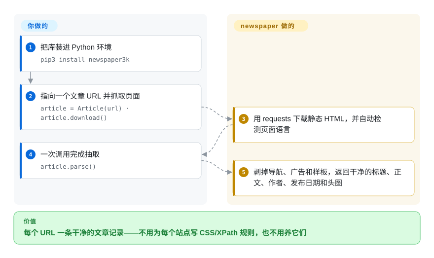

# newspaper

手里几千个新闻文章 URL，要的只是报道本身。这个 Python 库替你把每个页面下载下来，吐出干净的正文、标题、作者、发布日期和头图——样板内容剥掉，不用为每个站点手写抓取规则。

## 何时使用

你是数据工程师，在搭一条媒体监测流水线，手里有几千个新闻文章 URL——新闻稿、报纸报道、博客文章。你不在乎导航栏、广告位、评论组件或 cookie 横幅，你要的是*正文*、标题、谁写的、什么时候发的、头图，每个 URL 一个干净的 dict。给每家媒体写一套定制 CSS/XPath 提取器会是上百条脆弱规则，所以你改用 `newspaper`：对每个 URL 执行 `Article(url).download()`、`.parse()`，然后读 `.text`、`.title`、`.authors`、`.publish_date`、`.top_image`。再调 `.nlp()`，还能拿到 `.keywords` 和一个朴素的 `.summary`。对单一媒体，你可以建一个 `Source` 来发现并批量取它的文章 URL。

当输入是*文章形态*、而你想要一个通用提取器而非 N 个站点专用提取器时，它最出彩——这就是经典的「把这条新闻链接背后的可读正文给我，规模化地给」的活：在很多域名上「大致正确」的启发式，胜过逐站手调。

## 怎么用起来

newspaper 是一个进程内的 Python 库，不是服务：你交给它 URL，一次调用完成「抓取＋解析」。`Article(url).download()` 用 `requests` 抓取**静态 HTML**——从不执行 JavaScript——随后 `.parse()` 跑一串 lxml/XPath 启发式（代码承自 python-goose，即 Goose 提取器的移植）：给 DOM 里的块逐个打分，留下像正文的部分，剥掉导航栏、广告和侧边栏；`.title`、`.authors`、`.publish_date`、`.top_image` 在同一次解析里产出，优先读 `<meta>` 标签、启发式兜底。可选的 `.nlp()` 步骤（基于 NLTK 的关键词＋抽取式摘要）在你一次性下载语料（仓库根目录的 `download_corpora.py`）后给出 `.keywords` 和 `.summary`。面对整个媒体站点，`newspaper.build('http://cnn.com')` 能从头版发现文章 URL，`news_pool` 再开线程批量下载。仍然归你管的：重试、代理轮换、限速、空提取的检测与存储——库一次只处理一个 URL。

<!-- flow-steps:begin (generated from flows/newspaper.json by tools/flow_card.py — do not edit) -->

流程文字版

1. **你**：把库装进 Python 环境 — `pip3 install newspaper3k`
2. **你**：指向一个文章 URL 并抓取页面 — `article = Article(url) · article.download()`
3. **newspaper**：用 requests 下载静态 HTML，并自动检测页面语言
4. **你**：一次调用完成抽取 — `article.parse()`
5. **newspaper**：剥掉导航、广告和样板，返回干净的标题、正文、作者、发布日期和头图

**价值**：每个 URL 一条干净的文章记录——不用为每个站点写 CSS/XPath 规则，也不用养它们

<!-- flow-steps:end -->

## 何时不用

- **⚠ 废弃标记（2026-09 核实）：你要装的是原版 `newspaper3k`。** 库包（master 上的 `newspaper/` 目录）最后一次提交是 2020-06-22；PyPI 自 2018-09 的 0.2.8 之后没有发布，GitHub Releases 停在 2014 年的 0.0.9/0.1.x。仓库 2026 年的「活跃」全是 README 广告位换血——提交标题是「add swiftproxy」「add Novada proxy」「adjust github ad ordering」「remove webshare」（GitHub 提交记录，2026-03→2026-09）——即这个仓库在靠联盟代理广告变现它的名气，而不是开发这个库。新项目请用维护中的社区分叉 **newspaper4k**（`AndyTheFactory/newspaper4k`，PyPI 0.9.6，发布于 2026-07-19，MIT，约 1.1k star）——同一套 API 血统。
- **页面不是文章形态。** 它针对新闻/文章版式。在靠 JS 渲染的 SPA、付费墙或登录墙页面、列表/搜索/首页、产品页或论坛上，它返回空或乱码 `.text`——它解析的是静态 HTML，不是无头浏览器。
- **你需要高或有保证的提取准确率。** 启发式的样板剥离因站点差异很大；预期在相当一部分页面上漏段落、作者识别错、日期为空。在*你自己的*来源上先做基准测试再信它。
- **你在现代 Python（3.11+）上。** 已发布的 0.2.8 元数据没有声明 `requires_python` 上界，pip 会在 3.12/3.13 上照常安装——但它的依赖钉版（`tinysegmenter==0.3`、2018 年代的 `nltk`/`lxml`）早于这些解释器 [推断：未在 3.11+ 实测导入与运行]。在这套 API 上用现代 Python 的现实路径是钉当前版本的 newspaper4k。
- **你需要爬虫/调度器。** 它只下载并解析你交给它的 URL；它不是分布式爬虫、队列或调度器。要做带重试/礼貌/管线的大规模爬取，请用 Scrapy（未收录，但那是正解）。
- **你需要任意结构化抓取。** 要从非文章页面提取表格、价格或字段，选择器/提取框架（Scrapy + parsel）或通用 readability 提取器比文章正文启发式更合适。

## 横向对比

| 替代品 | 是否收录 | 我们的评价 | 取舍 |
|---|---|---|---|
| [trafilatura](trafilatura.zh.md) | ✅ | 今天要「只要正文」且要有人在维护的默认选项，选 trafilatura 而非 newspaper3k：它持续发版、自带基准，还多元数据和站点爬取辅助——而 newspaper3k 的代码冻结在 2020 年。 | 活跃维护的专注正文＋元数据提取器；没有 newspaper 那套内置多线程源爬取和 NLP 关键词/摘要层。 |
| [python-readability](python-readability.zh.md)（PyPI 名 `readability-lxml`） | ✅ | 只需要「正文 HTML＋标题」、能在 Python 管线里自己抓页面时，选 readability-lxml——它在 2026-08 发布了 0.9 并附维护者自跑的抽取基准，而 newspaper3k 什么都没发。 | 面更小：HTML 要你自己供（无抓取/`build()`/`news_pool`），无 NLP 关键词/摘要；同属 arc90/Goose 启发式血统。 |
| [boilerpipe](boilerpipe.zh.md) | ✅ | 管线在 JVM 上、要经典的样板移除算法时选 boilerpipe；要 Python 且连元数据（作者/日期/图）一起拿时选本页项目。 | Java 样板移除算法（带 Python 封装）；历史上有影响力，但有 JVM 依赖且仓库偏老。 |
| Scrapy + 定制 | 未收录 | 需要跨几千个 URL 的队列、重试和管线时，选 Scrapy 加自写提取规则；newspaper 的 `news_pool` 只是线程助手，不是爬虫框架。 | 完整爬取框架——你自己写提取规则，但能拿到并发、重试、管线；当你需要的是*爬虫*而非单 URL 提取器时的正解。 |
| Goose3 | 未收录 | 想要同一生态位（正文＋元数据＋头图）里另一套维护中的 Python 血统时，拿 Goose3 和 newspaper4k 一起做基准；启发式不同。 | Goose 文章提取器的 Python 移植；和 newspaper 同一生态位，可直接对比的同类。 |
| newspaper4k（`AndyTheFactory/newspaper4k`） | 未收录 | 想要*这套* API——`Article(url).download().parse()`——但是活的，选这个分叉：2026-07-19 发布 0.9.6，MIT，在维护，有自己的文档。 | 正是本项目维护中的分叉；同一 API 血统，支持 Python 3.8+ 并持续修 bug——推荐的继任者（API 等价性未实测，见存疑账本）。 |

## 技术栈

- **语言：** Python 3（已发布的 0.2.8 包未声明 `requires_python` 边界——PyPI 元数据，2026-09）。
- **解析：** `lxml` + `cssselect`（外加 `beautifulsoup4`）做标题/正文/作者/日期的 XPath/CSS 启发式提取；代码血统承自 python-goose（Goose 提取器的移植）。
- **抓取：** `requests` 做 HTTP 下载（仅静态 HTML——不执行 JS）。
- **URL 发现：** `feedfinder2` / `feedparser` / `tldextract` 支撑 `newspaper.build()`（从头版/RSS 发现一个媒体站的文章 URL）。
- **图像/NLP：** `Pillow` 处理头图；`nltk`（>=3.2）支撑 `.nlp()` 关键词/摘要。
- **多语言分词：** `jieba3k`（中文）、`tinysegmenter`（泰文，钉死 `==0.3`），外加停用词/词性数据——这就是「支持 10+ 语言」的机器。
- **并发：** 内置 `news_pool` 线程池用于批量下载（README 示例），不是调度器。

## 依赖

- **运行时：** Python 3，外加 0.2.8 发布元数据的依赖集：`requests`、`lxml`、`beautifulsoup4`、`cssselect`、`tldextract`、`feedparser`、`feedfinder2`、`nltk`、`Pillow`、`PyYAML`、`python-dateutil`、`jieba3k`、`tinysegmenter==0.3`（PyPI `requires_dist`，2026-09-28）。`lxml` 需要系统库 `libxml2`/`libxslt`，Pillow 需要 `libjpeg`/`libpng`（按 README 的 Ubuntu/OSX 安装说明）。
- **NLP 数据：** `.nlp()` 路径需要先一次性下载 NLTK 语料（仓库根目录的 `download_corpora.py`，README 说明）；没有它，`.text`/元数据仍可用，但关键词/摘要会失败。
- **无服务：** 不需要数据库、服务器或浏览器——它是一个进程内的库，按 URL 逐个调用。

## 运维难度

**低。** 它是一个 `pip install` 的库，没有基础设施——没有服务器、数据存储或浏览器要跑。真正的运维成本在于*规模化下的质量与健壮性*：会报错或超时的页面、会封爬虫的站点、需要你检测并跳过的空提取，以及 NLP 功能那一次性的语料下载。并发、限速、重试逻辑由你自己负责（库一次只处理一个 URL）。鉴于上面的废弃标记，现实运维的选择是跑维护中的分叉（newspaper4k），而不是跑冻结的原版。

## 健康度与可持续性

- **维护（2026-09 核实）。** 作为库已死：`newspaper/` 包目录最后一次提交是 2020-06-22（GitHub commits API 按路径过滤），PyPI 最后发布 0.2.8 在 2018-09，GitHub Releases 停在 0.0.9（2014）。仓库到 2026-09 的推送全是 README 代理广告换血——把 GitHub 的「最近有 push」当噪音而非开发。健康度雷达的维护轴按提交时间戳打分，会高估这里；本段的叙述是修正后的读法。
- **治理 / bus factor。** 单一维护者（`codelucas`，Lucas Ou-Yang）；雷达的 12 个月窗口里只有 1 名提交者且占 100%——bus factor 为 1，而且维护者可见的注意力在仓库变现上。更健康的血脉是社区分叉 **newspaper4k**（`AndyTheFactory`）：MIT，2026-07-19 发布 0.9.6，2026-08-24 有推送，约 1.1k star（GitHub/PyPI API，2026-09-28）——已核实活着。
- **年龄与 Lindy 判断。** 2013-11 创建（约 12.8 年）——这个*概念*久经验证、足够耐用；但 Lindy 要的是 **年龄 × 仍活跃**，而原版已不再活跃。年龄信号转移到了延续血脉的 newspaper4k 身上。[推断]
- **采用度。** 约 15.2k star（GitHub API，2026-09-28），`newspaper3k` 的 PyPI 月下载 526,510 次（健康度打分器，2026-09）——庞大的存量装机还在拉一个 8 年前的包；*新*工作的注意力在向 newspaper4k 和 trafilatura 分流 [推断：迁移比例未测量]。
- **风险标记。** 冻结在 2018 年代的依赖钉版（旧 `nltk`、`lxml`、`tinysegmenter==0.3`）配现代 Python；2020 年后无任何依赖/安全修复；README 的广告变现暗示现在的激励偏向流量而非维护 [推断：依据提交记录与 README 带 ref 参数的广告链接]。许可宽松（MIT，GitHub API 2026-09 确认）；无 relicense 历史。

## 存疑（未验证）

- [未验证] 已发布 0.2.8 包在 Python 3.11+ 上的兼容性未实测；「有破坏风险」的推断基于其 2018 年代钉版与缺失的 `requires_python` 边界，而非导入/运行实验。
- [未验证] newspaper4k 对 newspaper3k 的 API 等价（可平替的说法）来自其自身 README；未做并排提取测试。
- [推断] 2026 年的 README 提交是联盟变现：提交标题在增删具名代理商，README 链接带 `?ref=`/`utm_source=github` 追踪参数；维护者动机是推断，未被其本人陈述。
- [未验证] 「装机量大批流向分叉/trafilatura」是方向性判断；未对比下载份额数字。
- [未验证] 提取准确率本质上因站点而异；「准确率参差」是启发式提取器的普遍性质，而非对任一具体来源的实测数字。
- [未验证] master 的 `requirements.txt` 列有 `pythainlp`，而 0.2.8 发布元数据中没有——仓库 HEAD 与可安装包已经漂移；本页依赖事实钉的是 PyPI 发布版。
- [推断] 2013-11 创建（约 12.8 年）作为 Lindy/年龄信号给出；该耐用性推断适用于文章提取这个想法和仍在活跃的分叉，而非停滞的原版。
