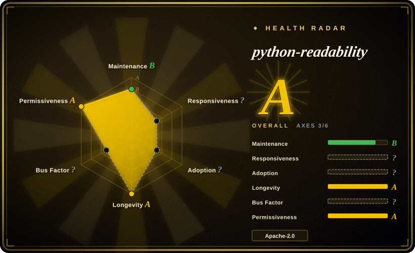
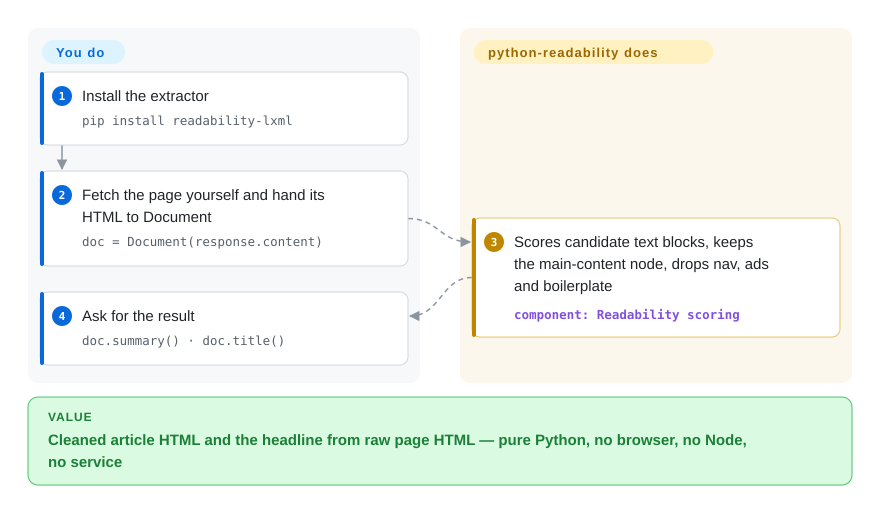

# python-readability

You fetched an article page and got the whole thing back — menus, ads, comment widgets and all. This pure-Python, lxml-based port of arc90's Readability pulls out just the cleaned main body (`summary()`) and the title (`title()`).

## When to use

You're writing a Python scraping or content pipeline — feeding an LLM, building a search index, or archiving articles — and `requests.get(url).content` gives you a full page when you want the article. You don't want to spin up a headless browser or a Node DOM just to extract text. You reach for python-readability: `pip install readability-lxml`, then `Document(html).summary()` for the cleaned article HTML and `Document(html).title()` for the title. It's pure Python on lxml, so it's fast and slots straight into a `requests`/`httpx` flow with no browser, no Node, and no service. It descends from the same arc90 Readability lineage as the JS version, so its heuristics are familiar and reasonably robust on real-world pages, with options like `positive_keywords`/`negative_keywords` and `keep_all_images` to tune behavior.

You also reach for it when you specifically want the *Python, lxml* implementation — e.g. you already depend on lxml/cssselect, you want CJK-aware extraction (0.8.4 "Better CJK support", and 0.9 further fixed CJK title-length handling — changelog, 2026-09), or you need a small, embeddable extractor rather than a heavier ML model. It's the pragmatic default when your stack is Python and the input HTML is already fetched.

## How it works

Everything lives behind one class: `Document(html)`, then `.summary()` for the cleaned article HTML and `.title()` for the headline. It never touches the network — you fetch the page yourself (requests/httpx/your crawler) and hand it the bytes or string; and because it doesn't run JavaScript, a JS-rendered page must be rendered by you first. Under the hood it is the arc90 Readability algorithm — the 2010 bookmarklet whose every "reader view" descendant inherits — ported onto lxml: it parses the document, scores candidate containers by word count, comma density, and class/id keywords, keeps the highest-scoring node, and if the result looks too thin it retries after a ruthless prune of unlikely-candidate nodes (sidebars, share widgets). The 0.9 release (2026-08) was a quality-driven overhaul: converting misused `
`s into paragraphs now preserves inline links and formatting, hidden (`display:none`/`visibility:hidden`/`<noscript>`) junk is stripped *before* scoring, CJK title truncation is fixed, and the repo gained a 181-page fixture benchmark that the maintainer ran against ten engines — self-reported, and worth knowing it exists before you re-benchmark for yourself. What stays yours: fetching, and rendering untrusted output through a real sanitizer — the README is explicit that this library is not a security boundary.

<!-- flow-steps:begin (generated from flows/python-readability.json by tools/flow_card.py — do not edit) -->

Text version of the flow

1. **You**: Install the extractor — `pip install readability-lxml`
2. **You**: Fetch the page yourself and hand its HTML to Document — `doc = Document(response.content)`
3. **python-readability**: Scores candidate text blocks, keeps the main-content node, drops nav, ads and boilerplate — component: `Readability scoring`
4. **You**: Ask for the result — `doc.summary() · doc.title()`

**Value**: Cleaned article HTML and the headline from raw page HTML — pure Python, no browser, no Node, no service

<!-- flow-steps:end -->

## When NOT to use

- **Your pages are JS-rendered.** It parses static HTML; it does not run JavaScript or fetch URLs. For SPAs you must render first (Playwright/headless) and pass the resulting HTML.
- **Accuracy is everything and you can't take the vendor's word for it.** The 0.9 changelog cites an F1 of 0.975 on a 181-page comparison of ten engines — but it is the maintainer's own corpus and the maintainer's own run, and 130 of the pages are pulled from Mozilla Readability's fixture suite. If extraction quality is load-bearing, run your own A/B against [trafilatura](trafilatura.md) and [Readability.js](readability-js.md) before pinning.
- **You need metadata breadth or crawling.** It returns the body + title (+ authors since 0.8.2) — no publish dates, no site-level crawling, no feeds/sitemaps tooling. For the widest metadata and crawl surface in Python, trafilatura is the fitter; for "fetch and extract in one call", see [newspaper](newspaper.md) (abandoned upstream — use its fork).
- **Your risk model needs a release cadence.** This is one maintainer working in bursts: 0.8.4.1 (2025-05) → 0.9 (2026-08), preceded by years where tags sat far behind the code. The 0.9 quality pass is a strong signal of life, not a maintenance contract — if you need predictable fix turnarounds, weigh trafilatura's cadence instead.
- **You treat its output as sanitized.** `summary()` strips scripts and common active content, but the README states outright it is *not* a security boundary; rendering untrusted HTML through it still needs a dedicated allowlist sanitizer (bleach, DOMPurify — both `未收录`) plus a CSP.
- **You need structured field extraction.** It returns the article body + title, not arbitrary structured data (prices, tables, product specs) — that's a different scraping job.
- **You're not in Python.** For JS use [Readability.js](readability-js.md); ports differ in heuristics and output.

## Comparison

| Alternative | In index | Our verdict | Tradeoff |
|---|---|---|---|
| [Readability.js](readability-js.md) | ✅ | When your pipeline can host JavaScript and you want the engine Firefox Reader View actually ships, pick Readability.js; pick this page when extraction must run inside a Python process with no DOM runtime. | Mozilla's JS engine, ~11.5k stars and npm pulls of ~12M/month (scorer, 2026-09); needs a DOM (jsdom in Node), different heuristics and output fields. |
| [dragnet](dragnet.md) | ✅ | When you want an ML-model approach and can accept its aging deps and dormancy, dragnet is the historical alternative; pick this page for a maintained, dependency-light heuristic extractor. | ML-based extraction (Python); can win on some page shapes but is heavier and far less maintained. |
| [boilerpipe](boilerpipe.md) | ✅ | When your stack is JVM and you want the classic document-clustering algorithms, pick boilerpipe; for Python lxml pipelines, this page wins on integration simplicity. | Java boilerplate-removal algorithms; classic ideas but the repo is effectively abandoned (see its page). |
| [trafilatura](trafilatura.md) | ✅ | When you need publish dates, feeds/sitemaps, CLI crawling and an independently maintained Python extractor, pick trafilatura; when you want the minimal arc90-body-plus-title surface, pick this page — its 0.9 shows raw main-text extraction competitive on the maintainer's own 181-page benchmark. | Trafilatura: broader scope, steady cadence, its own public benchmark suite; heavier API surface than a one-class port. |
| [newspaper](newspaper.md) | ✅ | When you want fetch-plus-extract (and NLP summaries) in one library, newspaper's API shape is the classic — but its code froze in 2020, so pin its maintained fork newspaper4k or pick this page and fetch yourself. | Built-in fetching, source crawling, NLP extras; abandoned upstream — see that page's abandonment flag. |
| goose3 | 未收录 | When you want the Goose lineage (text + metadata + top image with built-in fetching) rather than the arc90 lineage, benchmark goose3 beside newspaper4k — different heuristics, same fetch-and-extract niche as those, not this body-only port. | Python port of the Goose article extractor; broader output fields than readability-lxml, heuristics from a different family. |

## Tech stack

- **Language:** Python. (GitHub's language stats report "HTML" — the repo embeds a ~40 MB benchmark fixture corpus of saved pages; the actual code is Python: ~110 KB per the languages API, 2026-09.)
- **Core deps (0.9 published metadata, PyPI 2026-09-28):** `lxml[html-clean]>=5.4,<7`; `lxml-html-clean>=0.4.2,<0.5` only on Python <3.11; `chardet>=5.2,<6` (encoding detection); `cssselect>=1.3,<1.4` (Python 3.8 pins `>=1.2,<1.3`).
- **API:** `from readability import Document` → `Document(html).summary()` (cleaned article HTML) and `.title()`; options include `positive_keywords`, `negative_keywords`, `keep_all_images`, and explicit `encoding`.
- **CLI (new in 0.9):** `python -m readability -u https://example.com` accepts a URL or a local HTML file; `make benchmark` runs the repo's extraction benchmark.
- **Distribution:** published on PyPI as `readability-lxml` — 0.9 uploaded 2026-08-27; conda-forge also carries it [未验证：conda-forge current version].

## Dependencies

- **Runtime:** Python `>=3.8.2,<3.15` and the four pip deps above — no system services. lxml carries native (libxml2) bindings, so wheels matter on some platforms.
- **No fetching:** it does not retrieve URLs; you bring the HTML (via `requests`/`httpx`/your crawler) — the CLI's `-u URL` is the one convenience path that fetches.
- **No DOM/Node/browser:** unlike the JS port, no DOM runtime is needed.
- **Install:** `pip install readability-lxml` or `conda install -c conda-forge readability-lxml`.

## Ops difficulty

**Low.** It's a small library, not a service — nothing to deploy or run. The only practical considerations are installing lxml (native dependency; usually a prebuilt wheel, occasionally a build), supplying fetched HTML yourself, and validating extraction quality on your target sites. At scale it's CPU-bound parsing with no external state — trivially parallelizable across workers.

## Health & viability

- **Maintenance (verified 2026-09).** No longer coasting: 0.9 shipped on GitHub 2026-08-26 and PyPI 2026-08-27, after a visible work sprint 2026-08-22→27 (extraction fixes, test corpora, benchmark, docs — commit log). The cadence pattern remains single-maintainer bursts — 0.8.4.1's tagged commit is 2025-05-03, and tags historically lagged the code — so read this as "alive, bursty", not "fast-moving". Not archived; last pushed 2026-08-27.
- **Governance / bus factor.** Owner type is **User** (`buriy`) — an individual-maintainer project; community PRs do land (a merged PR from January 2026 precedes the 0.9 sprint), but continuity depends largely on one person. The radar can't grade governance on this repo (fork lineage); treat bus factor as a real flag.
- **Age × Lindy (2026-09).** Created 2011-05 — ~15 years old with a release in the last month ⇒ the strongest form of the Lindy signal: age **and** still-active. It has outlived most peers, including its own upstream arc90 product.
- **Adoption & ecosystem.** ~2.9k stars (2,893, GitHub API 2026-09-28); PyPI package `readability-lxml` is a long-standing default in many Python scraping stacks [推断：依据教程/依赖广度，未逐一核实生产采用].
- **Risk flags.** Single-maintainer burst cadence is the main one. Secondary: the quality story now rests on the maintainer's own benchmark (corpus + run both self-published) — useful, not neutral evidence. License Apache-2.0, confirmed by GitHub API 2026-09; no relicense history.

## Caveats (unverified)

- [未验证] The 0.9 benchmark numbers (F1 0.975, "ranks second overall", "first on the 51 non-Mozilla pages") are the maintainer's own published run on the maintainer's own 181-page corpus (130 pages sourced from Mozilla Readability's fixtures, as the README discloses); no third-party reproduction exists in this research.
- [未验证] conda-forge's current `readability-lxml` build/version was not checked; the PyPI facts are.
- [推断] "Bursty cadence" characterizes the tag history (0.8.4.1 2025-05 → 0.9 2026-08, earlier multi-year gaps per the tag list); future cadence is not guaranteed either way.
- [推断] Single-maintainer bus factor is inferred from `owner.type == User` plus commit authorship; contributor breadth/succession plan was not verified.
- [推断] lxml's native (libxml2) build/wheel consideration is general lxml knowledge, not verified against this repo's current packaging.
- [未验证] Comparative accuracy vs trafilatura/newspaper3k beyond the self-published benchmark reflects general positioning, not a measured independent comparison.
