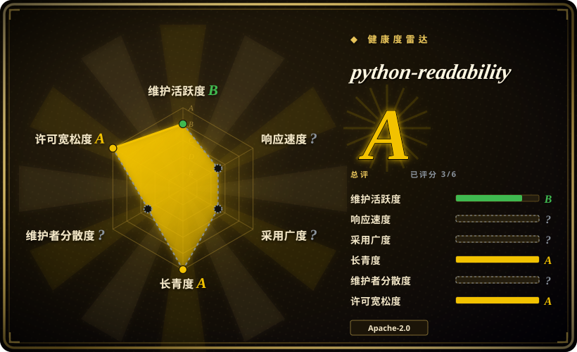
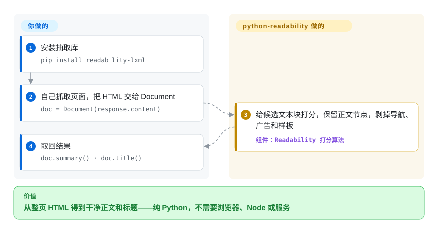

# python-readability

抓一篇文章却拿回整个页面——菜单、广告、评论组件全在。这个纯 Python、基于 lxml 的 arc90 Readability 移植，只把清理过的正文（`summary()`）和标题（`title()`）挑出来还你。

## 何时使用

你在写一条 Python 抓取或内容管线——喂 LLM、建搜索索引，或归档文章——而 `requests.get(url).content` 给你的是整张页面，可你要的是文章。你不想仅仅为了抽文本就起一个 headless 浏览器或 Node DOM。于是你转向 python-readability：`pip install readability-lxml`，然后用 `Document(html).summary()` 拿清理过的文章 HTML、`Document(html).title()` 拿标题。它是纯 Python 跑在 lxml 上，所以快，且能直接嵌进 `requests`/`httpx` 流程——无浏览器、无 Node、无服务。它血统上承自和 JS 版同一套 arc90 Readability，所以启发式熟悉、在真实页面上相当稳健，还带 `positive_keywords`/`negative_keywords` 和 `keep_all_images` 等选项可调。

当你明确就想要 *Python、lxml* 那个实现时，你也会选它——比如你本就依赖 lxml/cssselect、想要 CJK 友好的抽取（0.8.4「Better CJK support」，0.9 又修了 CJK 标题截断——changelog，2026-09），或需要一个小巧可嵌入的抽取器而非更重的 ML 模型。当你的栈是 Python、且输入 HTML 已经抓好时，它是务实的默认选择。

## 怎么用起来

一切都藏在一个类后面：`Document(html)`，然后 `.summary()` 拿清理过的正文 HTML、`.title()` 拿标题。它从不碰网络——页面你自己抓（requests/httpx/你的爬虫），把字节或字符串递进来；它也不执行 JavaScript，JS 渲染的页面得你先渲染好。底层是 arc90 Readability 算法——2010 年那个书签脚本，各家「阅读模式」的共同祖先——移植到 lxml 上：解析文档，按词数、逗号密度、class/id 里的关键词给候选容器打分，留最高分节点；结果太薄时，先做一轮无情修剪（剥掉侧栏、分享组件这类不像候选的节点）再重试。0.9 版（2026-08）是一次质量驱动的翻修：把误用的 `
` 转成段落时现在会保留内联链接和格式，隐藏内容（`display:none`/`visibility:hidden`/`<noscript>`）在打分前就被剥掉，CJK 标题截断修好了，仓库还添了一套 181 页基准——维护者拿它对比了十个引擎，属自跑自评，在你自己重测之前值得知道它的存在。仍归你管的：抓取，以及把不可信输出过一遍真正的净化器——README 明说这个库不是安全边界。

<!-- flow-steps:begin (generated from flows/python-readability.json by tools/flow_card.py — do not edit) -->

流程文字版

1. **你**：安装抽取库 — `pip install readability-lxml`
2. **你**：自己抓取页面，把 HTML 交给 Document — `doc = Document(response.content)`
3. **python-readability**：给候选文本块打分，保留正文节点，剥掉导航、广告和样板 — 组件：`Readability 打分算法`
4. **你**：取回结果 — `doc.summary() · doc.title()`

**价值**：从整页 HTML 得到干净正文和标题——纯 Python，不需要浏览器、Node 或服务

<!-- flow-steps:end -->

## 何时不用

- **你的页面是 JS 渲染的。** 它解析静态 HTML；不跑 JavaScript、也不抓 URL。对 SPA 你必须先渲染（Playwright/headless）再把得到的 HTML 传进来。
- **精度攸关、又不能尽信卖家之言。** 0.9 的 changelog 引用了在 181 页、十个引擎对比上的 F1 0.975——但语料和运行都出自维护者本人，且 181 页里有 130 页取自 Mozilla Readability 的 fixture（README 自己披露了这点）。若抽取质量是承重墙，先拿 [trafilatura](trafilatura.zh.md) 和 [Readability.js](readability-js.zh.md) 在你的语料上做 A/B 再钉版。
- **你需要元数据广度或爬取能力。** 它返回正文＋标题（0.8.2 起加作者），没有发布日期、站点级爬取、feeds/sitemaps 工具链。Python 里要最宽的元数据和爬取面，trafilatura 更称职；要「抓取＋提取一步到位」，见 [newspaper](newspaper.zh.md)（上游已废弃——用它的分叉）。
- **你的风险模型需要发布节奏。** 这是单维护者、爆发式推进：0.8.4.1（2025-05）→ 0.9（2026-08），此前多年 tag 落后于代码。0.9 的质量翻修是「活着」的强信号，不是维护合同——需要可预期的修复周期时，去比 trafilatura 的节奏。
- **你把它的输出当消毒结果用。** `summary()` 会剥掉 script 和常见活性内容，但 README 直说它*不是*安全边界；渲染不可信 HTML 仍需专用白名单净化器（bleach、DOMPurify，均 `未收录`）加 CSP。
- **你需要结构化字段抽取。** 它返回正文 + 标题，而非任意结构化数据（价格、表格、产品规格）——那是另一类抓取活。
- **你不在 Python。** JS 场景用 [Readability.js](readability-js.zh.md)；移植版在启发式和输出上有别。

## 横向对比

| 替代品 | 是否收录 | 我们的评价 | 取舍 |
|---|---|---|---|
| [Readability.js](readability-js.zh.md) | ✅ | 管线能容纳 JavaScript、要 Firefox 阅读模式真正出厂的那台引擎时，选 Readability.js；要在 Python 进程里做抽取、不想引入 DOM 运行时，选本页。 | Mozilla 的 JS 引擎，约 11.5k star、npm 月下载约 1200 万（打分器，2026-09）；需要 DOM（Node 里是 jsdom），启发式与输出字段有别。 |
| [dragnet](dragnet.zh.md) | ✅ | 想用 ML 模型路线、且能接受它老化的依赖与停滞时，dragnet 是历史上的替代项；要有人维护、依赖轻的启发式抽取器，选本页。 | 基于 ML 的抽取（Python）；某些页面形态可胜出，但更重、维护少得多。 |
| [boilerpipe](boilerpipe.zh.md) | ✅ | 栈在 JVM 上、要经典的文档聚类样板移除算法时选 boilerpipe；Python 的 lxml 管线里，本页在集成简单性上胜出。 | Java 样板移除算法；思想经典但仓库实际已废弃（见其页面）。 |
| [trafilatura](trafilatura.zh.md) | ✅ | 要发布日期、feeds/sitemaps、CLI 爬取和一位独立维护者的 Python 抽取器时选 trafilatura；只要 arc90「正文＋标题」这一小块面时选本页——0.9 显示它在维护者自跑的 181 页基准上裸文本抽取很有竞争力。 | Trafilatura：范围更广、节奏稳定、有公开基准套件；API 面比单类移植版重。 |
| [newspaper](newspaper.zh.md) | ✅ | 想要一个库同时做「抓取＋提取」（外加 NLP 摘要）时，newspaper 的 API 形态是经典——但它的代码 2020 年就冻结了，所以要么钉其分叉 newspaper4k，要么选本页自己抓。 | 自带抓取、站点发现、NLP 附加项；上游已废弃——见该页的废弃标记。 |
| goose3 | 未收录 | 想要 Goose 血统（正文＋元数据＋头图、自带抓取）而非 arc90 血统时，把 goose3 和 newspaper4k 一起摆上基准——启发式不同，生态位同那些，而非本页的纯正文移植。 | Goose 文章提取器的 Python 移植；输出字段比 readability-lxml 宽，启发式来自另一个家族。 |

## 技术栈

- **语言：** Python。（GitHub 语言统计显示 HTML——仓库内嵌了约 40 MB 的基准 fixture 语料即存好的网页；实际代码是 Python：languages API 显示约 110 KB，2026-09。）
- **核心依赖（0.9 发布元数据，PyPI 2026-09-28）：** `lxml[html-clean]>=5.4,<7`；Python 低于 3.11 时另需 `lxml-html-clean>=0.4.2,<0.5`；`chardet>=5.2,<6`（编码检测）；`cssselect>=1.3,<1.4`（Python 3.8 钉 `>=1.2,<1.3`）。
- **API：** `from readability import Document` → `Document(html).summary()`（清理过的文章 HTML）和 `.title()`；选项含 `positive_keywords`、`negative_keywords`、`keep_all_images`，以及显式 `encoding`。
- **CLI（0.9 新增）：** `python -m readability -u https://example.com`，接受 URL 或本地 HTML 文件；`make benchmark` 跑仓库的抽取基准。
- **分发：** 以 `readability-lxml` 发布于 PyPI——0.9 于 2026-08-27 上传；conda-forge 也有 [未验证：conda-forge 当前版本]。

## 依赖

- **运行时：** Python `>=3.8.2,<3.15` 加上述四个 pip 依赖——无系统服务。lxml 带原生（libxml2）绑定，某些平台上 wheel 很关键。
- **不抓取：** 它不取 URL；HTML 由你提供（通过 `requests`/`httpx`/你的爬虫）——CLI 的 `-u URL` 是唯一自带抓取便车。
- **无 DOM/Node/浏览器：** 与 JS 移植版不同，不需要 DOM 运行时。
- **安装：** `pip install readability-lxml` 或 `conda install -c conda-forge readability-lxml`。

## 运维难度

**低。** 它是一个小库，不是服务——没什么要部署或跑。唯一的实际考量是安装 lxml（原生依赖；通常是预编译 wheel，偶尔要构建）、自己提供抓好的 HTML，以及在目标站点上验证抽取质量。规模化时它是 CPU 受限的解析、无外部状态——可轻松跨 worker 并行。

## 健康度与可持续性

- **维护（2026-09 核实）。** 不再吃老本：0.9 于 2026-08-26 发 GitHub Release、2026-08-27 传 PyPI，此前有可见的工作冲刺 2026-08-22→27（抽取修复、测试语料、基准、文档——提交记录）。节奏形态仍是单维护者的爆发式——0.8.4.1 的 tag 提交在 2025-05-03，历史上 tag 长期落后于代码——所以读作「活着、爆发式」，而非「快速迭代」。未归档；最后 push 2026-08-27。
- **治理 / bus factor。** owner 类型是 **User**（`buriy`）——个人维护者项目；社区 PR 确有落地（2026 年 1 月合入的 PR 在 0.9 冲刺之前），但延续性很大程度系于一人。雷达对 fork 血统的仓库不给治理打分；把 bus factor 当真实标记看待。
- **年龄 × Lindy（2026-09）。** 2011-05 创建——约 15 年且上个月刚发版 ⇒ Lindy 信号的最强形态：年龄**和**仍活跃同时成立。它熬过了多数同侪，连其上游 arc90 的产品本体都早已不在。
- **采用度与生态。** 约 2.9k star（2,893，GitHub API 2026-09-28）；PyPI 包 `readability-lxml` 长期是许多 Python 抓取栈的默认选项 [推断：依据教程/依赖广度，未逐一核实生产采用]。
- **风险标记。** 单维护者的爆发式节奏是主风险。次级：质量叙事如今挂靠在维护者自跑的基准上（语料与运行均自发布）——有用，但不是中立证据。许可 Apache-2.0，GitHub API 2026-09 确认；无 relicense 历史。

## 存疑（未验证）

- [未验证] 0.9 的基准数字（F1 0.975、「总榜第二」、「非 Mozilla 的 51 页第一」）是维护者在自己 181 页语料上的自发布运行（130 页取自 Mozilla Readability fixture，README 已披露）；本轮调研中无第三方复现。
- [未验证] conda-forge 当前 `readability-lxml` 构建/版本未核实；已核实的是 PyPI 事实。
- [推断] 「爆发式节奏」刻画的是 tag 历史（0.8.4.1 2025-05 → 0.9 2026-08，更早年份有多年空档的 tag 列表）；未来节奏两个方向都不保证。
- [推断] 单维护者 bus factor 由 `owner.type == User` 加提交作者分布推断；贡献者广度/接班计划未核实。
- [推断] lxml 的原生（libxml2）构建/wheel 考量是 lxml 通识，未对本仓库当前打包核实。
- [未验证] 除自发布基准外，与 trafilatura/newspaper3k 的相对精度反映总体定位，而非实测的独立对比。
