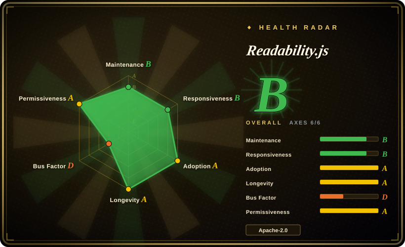
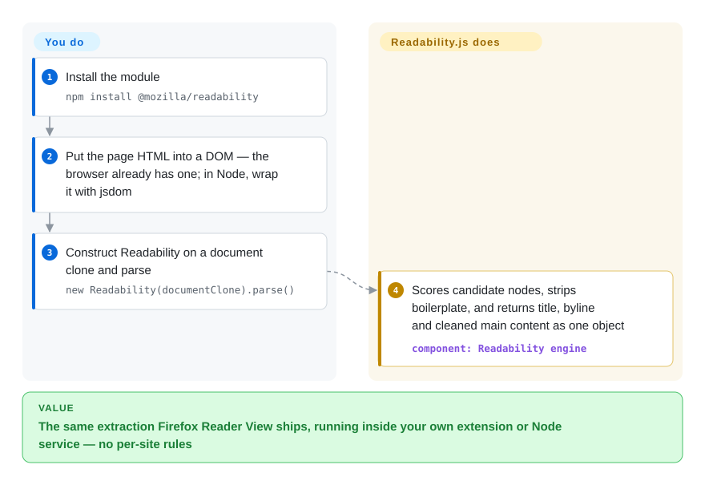

# Readability.js

You fetch a news page and 90% of the HTML is chrome — nav bars, cookie banners, ad slots. Hand the DOM to this library, the same engine Firefox Reader View ships, and it returns just the title, byline and cleaned main content, boilerplate stripped.

## When to use

You're building a read-it-later app, an RSS/newsletter pipeline, or an LLM ingestion step, and you keep getting whole web pages when you only want the article. The raw HTML is 90% chrome — nav bars, cookie banners, sidebars, comment widgets, ad slots — and you need just the title, author, and the body text a human would actually read. You reach for Readability.js: you parse the page into a DOM (in the browser you already have `document`; in Node you wrap the HTML with JSDOM or linkedom), construct `new Readability(documentClone).parse()`, and get back a structured object — `title`, `content` (cleaned HTML), `textContent`, `excerpt`, `byline`, `siteName`, `lang`, `publishedTime`. It's the same battle-tested heuristic engine Firefox ships in Reader View, so it handles the messy real web reasonably well without you writing per-site scrapers.

You also reach for it when you want a cheap pre-check: `isProbablyReaderable(document)` quickly guesses whether a page is even article-like, so a time-sensitive pipeline can skip pages that aren't worth parsing. Because it's a single, dependency-light JS module operating on a DOM you supply, it drops into both browser extensions and Node services with the same API.

## How it works

The library takes a DOM you hand it — it does not fetch URLs or run JavaScript — and `parse()` returns a plain object: `title`, `content` (cleaned HTML), `textContent`, `length`, `excerpt`, `byline`, `dir`, `siteName`, `lang`, and `publishedTime`. Internally it walks the document and scores every candidate container (text length, comma count, class/id keywords, minus a link-density penalty), promotes the winner's best parent, then runs a "shadiness" pass that strips nav, share widgets, ads, and comment blocks; what survives gets serialized back to HTML. `parse()` mutates the DOM it was given, so pass it a `document.cloneNode(true)` if you keep using the page. `isProbablyReaderable(document)` is a deliberately cheap pre-filter that guesses article-likeness — false positives and false negatives are stated in the docs, by design. One caveat that shapes upgrades: the project's own changelog says the per-document extraction *result* is not treated as a stable API across minor versions. What stays yours: fetch/render before it, a DOM implementation in Node (jsdom or linkedom), and sanitizing untrusted output (the README recommends DOMPurify + CSP — it explicitly is not Readability's job).

<!-- flow-steps:begin (generated from flows/readability-js.json by tools/flow_card.py — do not edit) -->

Text version of the flow

1. **You**: Install the module — `npm install @mozilla/readability`
2. **You**: Put the page HTML into a DOM — the browser already has one; in Node, wrap it with jsdom
3. **You**: Construct Readability on a document clone and parse — `new Readability(documentClone).parse()`
4. **Readability.js**: Scores candidate nodes, strips boilerplate, and returns title, byline and cleaned main content as one object — component: `Readability engine`

**Value**: The same extraction Firefox Reader View ships, running inside your own extension or Node service — no per-site rules

<!-- flow-steps:end -->

## When NOT to use

- **You need to fetch and render the page, not just parse it.** Readability.js takes a DOM; it does **not** fetch URLs or run JavaScript. For JS-heavy SPAs you must render first (a headless browser / Playwright) and feed it the resulting DOM — the library won't do that for you.
- **You're in Node and don't want a DOM dependency.** Core parsing needs a DOM; in Node that means JSDOM (heavy) or linkedom — a real dependency and cost the browser case avoids.
- **You will render its output without sanitizing it.** The README is blunt: `parse()` output is not a security boundary — for untrusted HTML they recommend DOMPurify (with a CSP), and Firefox itself does both. DOMPurify is `未收录`; wiring it in is your job, not the library's.
- **You need structured field extraction beyond "the article."** It returns main content + a few metadata fields, not arbitrary structured data (price, product specs, tables) — that's a scraping/extraction job, not a reader-view job.
- **You need guaranteed precision on every site.** It's heuristic; `isProbablyReaderable` explicitly admits false positives/negatives, and content extraction can miss or over-trim on unusual layouts. Verify on your target sites.
- **You need a Python/Java pipeline.** This is JavaScript; for the same arc90 lineage in Python see [python-readability](python-readability.md) (ships v0.9, 2026-08), and mind that ports differ in heuristics and output.

## Comparison

| Alternative | In index | Our verdict | Tradeoff |
|---|---|---|---|
| [python-readability](python-readability.md) | ✅ | When your pipeline is Python and you can supply raw HTML, pick python-readability — its v0.9 (2026-08) shipped a maintainer-run 181-page benchmark where this engine took first overall; when you're in a browser/Node stack or need Reader View parity, pick this page. | The lxml port: no DOM runtime, no jsdom cost; heuristics and output fields differ from this engine (this one returns byline/excerpt/lang/publishedTime, it returns body+title). |
| [dragnet](dragnet.md) | ✅ | When you want an ML-model approach in Python and can accept aging deps, dragnet is the historical alternative; when you want the battle-tested heuristic engine, pick this page. | ML-based content extraction (Python); can outperform on some page shapes but heavier and far less maintained. |
| [boilerpipe](boilerpipe.md) | ✅ | When your stack is JVM and you want the classic document-clustering algorithms, pick boilerpipe; for JS/browser/Node surfaces this page wins on lineage and deployment simplicity. | Java boilerplate-removal algorithms; classic ideas but the repo is effectively abandoned (see its page). |
| [trafilatura](trafilatura.md) | ✅ | When you need publish dates, feeds/sitemaps and crawling helpers in Python, pick trafilatura; when the extraction must run where the page already lives — a browser extension, a Node service — pick this page. | Python extraction library with its own public benchmark suite and steady cadence; different language, broader scope, no in-browser execution. |
| Mercury / Postlight Parser | 未收录 | When you want a Node parser that *also fetches* pages (Readability needs a fetch/render stage in front), Mercury was the popular answer — but its maintenance state was not verified in this pass, so check the repo before pinning. | Node article parser including page fetch; historically popular, verification owed. |

## Tech stack

- **Language:** JavaScript (ES2015+; works in browsers and Node ≥ 14 per `package.json` `engines`, npm registry metadata 2026-09-28).
- **Core:** a self-contained heuristic scoring engine (`Readability.js`) plus a lightweight `JSDOMParser` shipped in the repo; the public surface is `new Readability(doc, options).parse()` and `isProbablyReaderable(doc, options)`.
- **Options (README, verified 2026-09):** `debug`, `maxElemsToParse` (default 0, no limit), `nbTopCandidates` (5), `charThreshold` (500), `keepClasses`/`classesToPreserve`, `disableJSONLD`, a configurable `serializer`, `allowedVideoRegex`, `linkDensityModifier`; `isProbablyReaderable` takes `minContentLength` (140), `minScore` (20), `visibilityChecker`.
- **Metadata:** prefers Schema.org JSON-LD fields when present (disable via `disableJSONLD`); since 0.6.0 also uses Parsely tags as a fallback metadata source (CHANGELOG).
- **Versioning caveat:** the project's changelog states that, for semver purposes, the parse *output for a given input document* is **not** a stable API — minor releases may change extraction results.

## Dependencies

- **Runtime:** a DOM `document`. In the **browser** that's built in — effectively **zero runtime dependencies**. In **Node** you must supply a DOM implementation yourself (JSDOM or linkedom); these are *your* dependencies, not bundled by Readability.
- **Node engine:** `engines.node >=14.0.0` — confirmed against the published npm package metadata (2026-09-28).
- **Install:** `npm install @mozilla/readability` (npm latest: **0.6.0**, published 2025-03-03), or load `Readability.js` directly in a web page.
- **No services:** no network, no datastore — it operates purely on the DOM you give it.

## Ops difficulty

**Low.** It's a library, not a service — nothing to deploy or operate. In the browser it's a script with no dependencies. The only real operational considerations are the Node case: you must run a DOM (JSDOM is heavy and can be a memory/CPU cost at scale), and if your inputs are JS-rendered pages you need a separate fetch/render stage in front of it. Beyond that, "ops" is just keeping the npm dependency current and validating extraction quality on the sites you care about.

## Health & viability

- **Maintenance (verified 2026-09).** Mature-slow, slower than the 2026-06 snapshot suggested: npm/GitHub's newest release is still **0.6.0 (2025-03-03)**; the last *functional* commit is 2025-09-29 ("Improve paragraph wrapping and DOM implementation"); everything in 2026 was housekeeping — full Apache-2.0 license text + NOTICE file and dependabot bumps (2026-07-09), last push 2026-08-04 (GitHub commit/branches APIs, 2026-09-28). Unarchived. There are unreleased improvements sitting on `main` beyond 0.6.0.
- **Governance / backing.** Owned by **Mozilla** and shipped inside Firefox Reader View — a strong institutional backer with a real product dependency, which matters more than raw commit cadence for longevity. That said, the radar's 12-month window counts ~1 active committer (governance D): the bus factor inside the repo is low even though the owning institution is not.
- **Age × Lindy (2026-09).** Created 2015-02 — ~11.6 years and **still receiving fixes** ⇒ strong Lindy: long-proven, widely embedded, not abandoned.
- **Adoption & ecosystem.** ~11.5k stars (11,468, GitHub API 2026-09-28), 12,235,122 npm downloads/month and 1,293 dependent repos (health scorer, 2026-09); embedded in Firefox and countless reader/scraper/LLM-ingestion pipelines. ~316 open issues reflect a large, heuristic surface (per-site extraction edge cases), not abandonment.
- **Risk flags.** Apache-2.0 — GitHub API now reports it directly (the old `NOASSERTION` reading cleared after the full license text landed 2026-07-09); no relicense history. The real caveats are behavioral, not legal: heuristic (site-dependent) accuracy, output object not stability-guaranteed across minor versions, and release cadence measured in years.

## Caveats (unverified)

- [推断] Extraction accuracy and `isProbablyReaderable` reliability are heuristic and site-dependent; "verify on your sites" is general guidance, not a measured failure rate.
- [未验证] The Mercury/Postlight Parser maintenance state in the Comparison row was not checked this pass.
- [推断] "Unreleased improvements on main" is inferred from post-0.6.0 functional commits (e.g. 2025-09-29) vs the 2025-03 npm release; no published changelog entry marks them as unreleased beyond the empty `[Unreleased]` heading.
- [未验证] Firefox ships "this" engine in Reader View continuously; the exact Firefox release/version coupling was not verified — the claim rests on the README's own description and Mozilla ownership of the repo.
